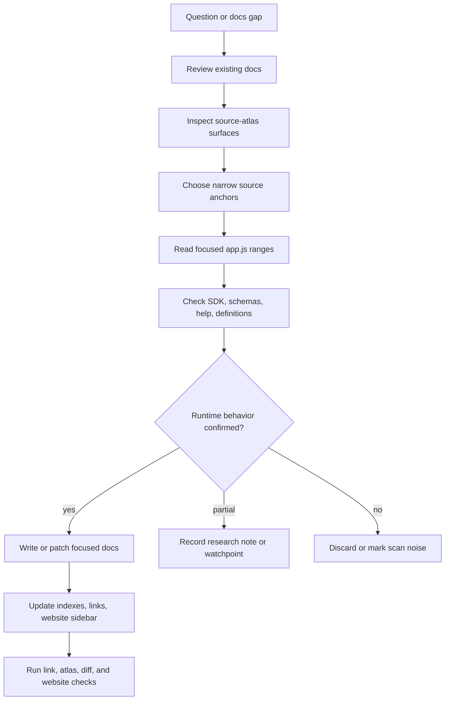

# Reverse-engineering workflow

This document records the practical workflow used to analyze the extracted Copilot CLI bundle in this repository and turn the findings into source-anchored internals documentation.

The short version: treat `copilot-cli-pkg/app.js` as a bundled production artifact, build a searchable atlas of its surfaces, follow narrow evidence trails through the minified code, confirm behavior with adjacent package files, and write focused documentation that separates confirmed runtime behavior from research leads.

## Goals

The analysis process serves four goals:

1. **Recover runtime structure** from a large bundled/minified `app.js` without pretending it is clean source.
2. **Map user-visible behavior to implementation anchors** such as commands, events, feature gates, env vars, schemas, and minified symbols.
3. **Publish stable internals documentation** using semantic names while preserving bundle-specific lookup handles.
4. **Keep research notes separate from confirmed behavior** so future package updates can be triaged safely.

## Primary source material

The workflow uses several source layers, each with a different trust level.

| Source | Role | Trust model |
|---|---|---|
| `copilot-cli-pkg/app.js` | Main runtime bundle. | Highest value for runtime behavior, but minified and hard to read directly. |
| `copilot-cli-pkg/package.json` | Package identity and version context. | Useful for anchoring the analyzed artifact. |
| `copilot-cli-pkg/definitions/*.agent.yaml` | Built-in agent definitions. | Source of packaged agent prompts and metadata loaded by `app.js`. |
| `copilot-cli-pkg/builtin-skills/**/SKILL.md` | Built-in skill instructions. | Packaged prompt material, not inline JavaScript. |
| `copilot-cli-pkg/copilot-sdk/**` and `schemas/**` | SDK and session/event contracts. | Confirms external API and event schema surfaces. |
| `help/*.txt` | Captured CLI help text. | User-facing behavior and command/flag names. |
| `source-atlas/` | Generated symbol/string/event index. | Triage layer only; atlas hits are leads, not proof. |
| `docs/` | Current internals wiki. | Starting point for gap analysis and duplication checks. |

## Core principles

- **Start from existing docs.** Before adding a page, check `docs/README.md`, `docs/SUMMARY.md`, the relevant section README, and nearby pages.
- **Search narrowly.** Broad reads of `app.js` are noisy. Prefer exact strings, event names, feature keys, commands, env vars, schemas, and known minified aliases.
- **Use semantic aliases for explanation.** Documentation should say `Runtime tool assembly`, `PermissionService`, or `McpHost` when those names explain behavior, while keeping the actual minified/search anchor nearby.
- **Do not overclaim.** A string literal or schema shape is not enough to prove behavior; follow the call path until runtime wiring is clear.
- **Keep line numbers approximate.** Bundle lines shift across package versions, so docs should say “approximately” and include searchable names.
- **Separate research from runtime docs.** Raw atlas findings, constants-first leads, and binary-only notes belong in `docs/99-research-atlas/` until source-confirmed.
- **Avoid project-process terminology in internals docs.** Public docs should describe Copilot CLI internals, not planning-stage labels.

## Workflow overview



## Step 1: classify the task

Every reverse-engineering request is first classified into one of two modes.

| Mode | Use when | Output |
|---|---|---|
| Full analysis | A subsystem has not been documented yet, or the user asks for a broad runtime map. | A reconstructed call path and new or expanded internals docs. |
| Incremental analysis | A package update or `source-atlas/` diff needs triage. | A focused change map and minimal affected-doc updates. |

This repository’s larger documentation pass used full analysis for broad subsystems such as tool assembly, sessions, MCP, permissions, hosted-agent environment, prompt sources, and task orchestration. It also used constants-first discovery when hosted-agent env vars and feature gates were easier to find from generated indexes than from raw source reads.

## Step 2: build or inspect the source atlas

The source atlas is generated by `scripts/index-app-js.mjs`. It extracts triage surfaces from `copilot-cli-pkg/app.js`, including:

- function and class declarations;
- declaration blocks;
- env vars;
- feature keys;
- event strings;
- JSON-RPC methods;
- slash commands;
- tool names;
- known semantic anchors and doc references.

The atlas is useful because it turns a minified bundle into a searchable map. It does not prove behavior by itself. For example, an env var in `source-atlas/surface-index.json` only becomes documentation-worthy after tracing how `app.js` reads it and how that value affects runtime options, tools, telemetry, hosted jobs, or sessions.

Typical validation after atlas-related edits:

```sh
node --check scripts/index-app-js.mjs
node scripts/index-app-js.mjs
```

## Step 3: choose narrow anchors

Instead of opening the whole bundle, pick a small set of anchors that should converge on the target subsystem.

Useful anchors include:

| Anchor type | Examples |
|---|---|
| Event names | `session.tools_updated`, `permission.requested`, `session.mcp_servers_loaded`, `session.task_complete`. |
| Commands and flags | `/mcp`, `/sandbox`, `/research`, `--allow-url`, `--additional-mcp-config`, `--autopilot`. |
| Env vars | `COPILOT_AGENT_*`, `COPILOT_PROVIDER_*`, `COPILOT_OFFLINE`, `COPILOT_HOME`. |
| Tool names | `task`, shell tools, validation tools, MCP-derived tools. |
| Protocol/API names | JSON-RPC session methods, ACP methods, MCP methods, SDK extension methods. |
| Minified aliases | Search handles discovered from atlas output or nearby source reads. |

The goal is to form a small hypothesis such as “this option affects tool visibility” or “this event is emitted after MCP startup,” then prove or reject it by following the call path.

## Step 4: trace behavior through focused source reads

Focused source reads usually follow this pattern:

1. Search for an exact anchor string in `app.js`.
2. Read the surrounding declaration or function block.
3. Identify inputs, outputs, callbacks, event emission, and error handling.
4. Jump outward to callers or inward to helper functions.
5. Cross-check adjacent package files when the runtime delegates to schemas, YAML definitions, SDK files, help text, or workers.
6. Record both the semantic interpretation and the exact search handles.

For minified code, the important unit is often not a clean function name but a stable cluster:

- an event string;
- a schema field;
- a command name;
- a helper alias;
- a nearby source line range;
- a downstream call or emitted event.

## Step 5: reconstruct the subsystem boundary

After source reads confirm behavior, the next step is to decide where that behavior belongs in the wiki.

The current canonical sections are organized by reader question:

| Section | Question answered |
|---|---|
| `docs/00-start-here/` | What is this bundle and how should I start reading it? |
| `docs/01-runtime-lifecycle/` | How does the CLI start, route modes, and manage runtime shells/UI/protocols? |
| `docs/02-context-model-loop/` | What does the model see and how are prompts, memory, attachments, providers, retries, and quota handled? |
| `docs/03-tools-integrations-security/` | Which capabilities become tools, and what approves, denies, filters, redacts, or sandboxes them? |
| `docs/04-sessions-persistence-remote/` | How are sessions, events, replay, SessionFs, indexes, repository context, and remote control represented? |
| `docs/05-hosted-agent-ops/` | Which hosted-agent environment, diagnostics, telemetry, debug, and feature-gate contracts exist? |
| `docs/06-agents-automation/` | How are subagents, custom agents, fleet, autopilot, and scheduled prompts orchestrated? |
| `docs/99-research-atlas/` | Which generated leads, binary notes, and future watchpoints support further analysis? |

This sectioning intentionally does not mirror bundle layout. It mirrors the runtime boundaries a reader needs to understand.

## Step 6: write source-anchored docs

Each substantial implementation page should include:

- a short scope statement explaining the boundary the page owns;
- a source-anchor table with semantic alias, minified/search anchor, approximate location, and role;
- a reconstructed call path or architecture diagram;
- key data structures, commands, event names, env vars, and feature gates;
- user-visible behavior and operational implications;
- failure modes, cleanup paths, and caveats;
- related docs and handoff points.

Documentation should avoid dumping raw minified source. The useful artifact is the reconstructed behavior plus enough anchors for another reader to verify it.

## Step 7: update navigation and avoid duplicates

After adding, moving, or renaming pages, update the navigation layer:

- nearest section `README.md`;
- `docs/SUMMARY.md`;
- `docs/README.md` when the top-level map changes;
- `website/astro.config.mjs` sidebar when a page should be reachable from the website navigation;
- `scripts/index-app-js.mjs` known anchors or doc references when atlas output should point at the renamed page;
- `source-atlas/` after regenerating the atlas.

The documentation pass also used simple audits to catch problems:

- stale old filenames after renames;
- duplicate H1 titles;
- pages missing a scope/reader-contract section;
- pages listed in `docs/SUMMARY.md` but missing from website sidebar;
- website routes with no source Markdown page;
- generated site pages with duplicate rendered titles.

## Step 8: validate changes

Validation is part of the reverse-engineering workflow, not a separate publishing step.

Common checks:

```sh
node --check scripts/index-app-js.mjs
node scripts/index-app-js.mjs
git diff --check
cd website
npm run build
```

Additional repository-specific checks used during this work:

- Markdown relative-link checks for `docs/**/*.md`.
- Source-only stale-name scans after file renames.
- `get_errors` diagnostics for changed scripts, docs, and website config.
- Website route coverage checks comparing Markdown pages, `docs/SUMMARY.md`, and `website/astro.config.mjs` sidebar links.
- Generated HTML checks for one page-level `<h1>` after the custom Starlight loader derives titles from Markdown.

## What worked well

The most effective techniques were:

1. **Constants-first discovery** for hosted-agent env vars, feature gates, event names, and operation toggles.
2. **Event-driven tracing** for sessions, tools, permissions, MCP, and task completion.
3. **Command/flag tracing** for TUI, prompt mode, MCP management, sandboxing, scheduled prompts, and permissions.
4. **Adjacent-file confirmation** for agent YAML, built-in skills, SDK extension contracts, schemas, and help output.
5. **Reader-boundary writing** so broad systems are split by runtime responsibility rather than by minified function clusters.
6. **Regeneration plus source scans** after renames to prevent stale atlas references and broken navigation.

## Common pitfalls

| Pitfall | Avoidance strategy |
|---|---|
| Treating an atlas hit as proof. | Always trace the runtime call path in `app.js` or adjacent package files. |
| Over-reading minified names. | Use minified aliases as search handles, not as design names. |
| Creating duplicate docs. | Start from current docs and extend the closest page when scope already exists. |
| Mixing research notes into runtime chapters. | Keep weak or binary-only findings in `docs/99-research-atlas/`. |
| Letting project-management language leak into internals docs. | Use “canonical sections,” “reader path,” “internals scope,” and “source-anchored docs.” |
| Physical reorganization without content rewrite. | Pair renames/moves with scope statements, handoff links, and reader contracts. |
| Website title duplication. | Derive Starlight titles from Markdown H1, then strip the matching H1 from rendered body. |
| Accidentally editing extracted package artifacts. | Restrict bulk replacements to docs/scripts/site files and inspect `git status` before finishing. |

## Repeatable checklist

Use this checklist for the next analysis pass:

- [ ] State the question or subsystem clearly.
- [ ] Check existing docs before reading source.
- [ ] Decide full analysis vs incremental atlas-diff analysis.
- [ ] Identify exact strings, events, env vars, commands, schemas, or aliases to search.
- [ ] Read focused `app.js` ranges and adjacent package files until behavior is confirmed.
- [ ] Record semantic aliases and minified/search anchors.
- [ ] Choose the correct docs section by runtime boundary.
- [ ] Patch or create focused documentation.
- [ ] Update section indexes, summary, website sidebar, and atlas references if needed.
- [ ] Run link checks, script checks, `git diff --check`, diagnostics, and website build.
- [ ] Report what was confirmed, what remains a research lead, and which files changed.

## Related files

- [`docs/README.md`](docs/README.md) — canonical wiki entry point.
- [`docs/SUMMARY.md`](docs/SUMMARY.md) — full table of contents.
- [`docs/99-research-atlas/app-js-source-atlas.md`](docs/99-research-atlas/app-js-source-atlas.md) — atlas methodology and generated index overview.
- [`source-atlas/README.md`](source-atlas/README.md) — generated atlas summary.
- [`scripts/index-app-js.mjs`](scripts/index-app-js.mjs) — atlas generator.
- [`website/`](website/) — Starlight site used to validate and browse the docs.