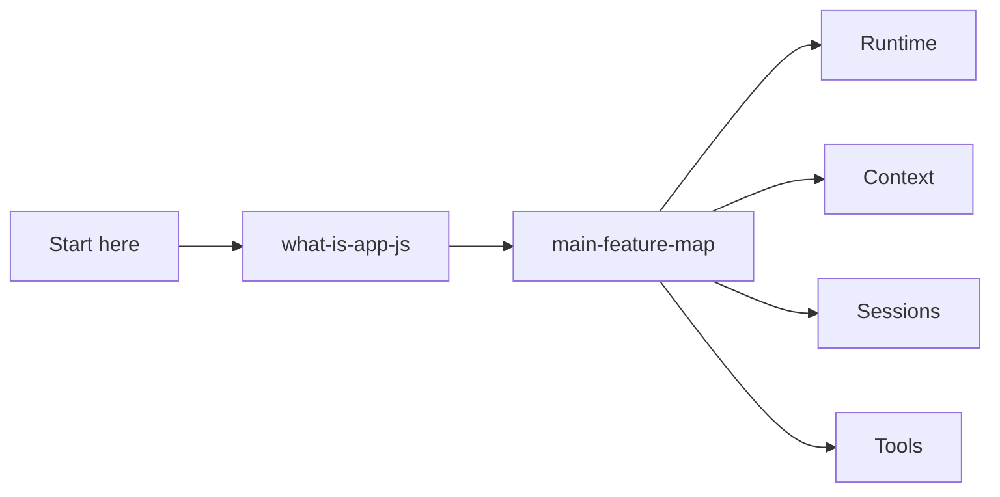

# Overview

Start here: what the extracted bundle is, how to read the docs, and the high-level feature map.

## How this volume fits

## Pages

| Page | Why read it | File |
|---|---|---|
| [`app.js` overview](./what-is-app-js.md) | Bundle identity, responsibilities, and caveats. | `what-is-app-js.md` |
| [Main feature map for `app.js`](./main-feature-map.md) | High-level map of feature areas and runtime ownership. | `main-feature-map.md` |

## Reading guidance

- Read these first before jumping into internals.
- Use the feature map to choose the correct volume.

## Back to wiki home

- [Wiki home](../README.md)
- [Full table of contents](../SUMMARY.md)
