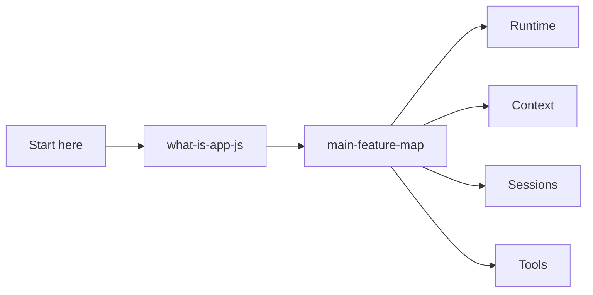

# Overview

Start here: what the extracted bundle is, how to read the docs, and the high-level feature map.

## Semantic alias and minified anchor mapping

This is a section index, not a direct `app.js` implementation analysis. Topic pages linked below carry the concrete bundle mappings.

| Semantic alias | Minified anchor | Scope |
|---|---|---|
| Overview section index | N/A — navigation page | Links the bundle overview and feature map. |
| Overview topic pages | See linked page-level mappings | Concrete `app.js` anchors are documented in the child pages. |

## How this section fits

## Pages

| Page | Why read it | File |
|---|---|---|
| [`app.js` overview](./what-is-app-js.md) | Bundle identity, responsibilities, and caveats. | `what-is-app-js.md` |
| [Main feature map for Copilot CLI](./main-feature-map.md) | High-level map of feature areas, runtime ownership, and the context-engineering versus harness-engineering split. | `main-feature-map.md` |

## Reading guidance

- Read these first before jumping into internals.
- Use the feature map to choose the correct section.

## Back to wiki home

- [Wiki home](../README.md)
- [Full table of contents](../SUMMARY.md)
