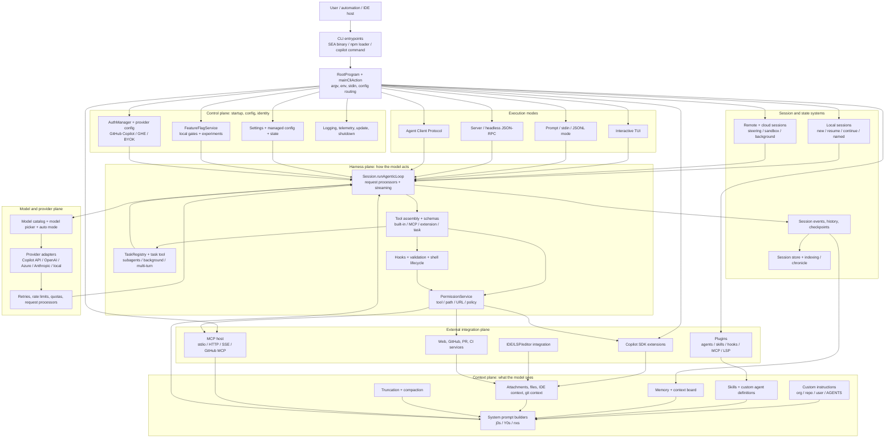
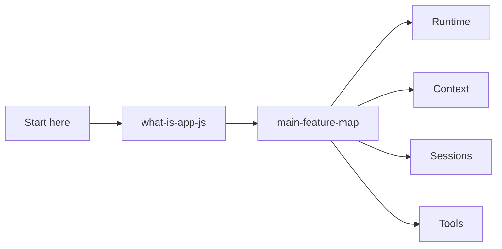

# Overview

Start here: what the extracted bundle is, how to read the docs, and the high-level feature map.

## All-systems component map

This is a navigation-level component diagram for the whole reverse-engineered CLI runtime. It intentionally uses semantic component names instead of minified aliases; the linked child pages carry the concrete `app.js` anchors and call paths.

### Component groups and where to go next

| Component group | What it covers | Deep-dive entry points |
|---|---|---|
| Entry and control plane | Binary/npm loader, root command, configuration, feature gates, authentication, updates, telemetry, shutdown. | [`what-is-app-js.md`](./what-is-app-js.md), [`loader-bootstrap.md`](../01-runtime-and-ui/loader-bootstrap.md), [`cli-runtime-workflows.md`](../01-runtime-and-ui/cli-runtime-workflows.md), [`feature-gates.md`](../08-operations-and-research/feature-gates.md) |
| Execution modes | Interactive TUI, prompt/stdin mode, server/headless mode, and ACP mode. | [`cli-runtime-workflows.md`](../01-runtime-and-ui/cli-runtime-workflows.md), [`tui-and-slash-commands.md`](../01-runtime-and-ui/tui-and-slash-commands.md), [`embedded-server-acp-protocol.md`](../01-runtime-and-ui/embedded-server-acp-protocol.md) |
| Session and state systems | Local/resume/continue sessions, remote/cloud sessions, events, checkpoints, session store, indexing. | [`sessions-remote-cloud.md`](../03-sessions-and-remote/sessions-remote-cloud.md), [`session-support-implementation.md`](../03-sessions-and-remote/session-support-implementation.md), [`checkpoints-undo-rewind.md`](../02-context-and-input/checkpoints-undo-rewind.md), [`session-store-sqlite-indexing.md`](../03-sessions-and-remote/session-store-sqlite-indexing.md) |
| Context plane | Prompt assembly, prompt sources, custom instructions, skills, custom agents, memory, attachments, compaction. | [`prompt-sources.md`](../02-context-and-input/prompt-sources.md), [`app-js-prompt-catalog.md`](../02-context-and-input/app-js-prompt-catalog.md), [`custom-agents-and-skills-packaging.md`](../02-context-and-input/custom-agents-and-skills-packaging.md), [`memory-and-context-board.md`](../02-context-and-input/memory-and-context-board.md), [`conversation-compaction.md`](../02-context-and-input/conversation-compaction.md) |
| Harness plane | Agent loop, request processors, tools, permissions, subagents, background tasks, hooks, shell execution, validation. | [`runtime-tool-assembly-and-filtering.md`](../04-tools-and-integrations/runtime-tool-assembly-and-filtering.md), [`built-in-tool-execution-pipeline.md`](../04-tools-and-integrations/built-in-tool-execution-pipeline.md), [`permission-system-design.md`](../05-security-and-policy/permission-system-design.md), [`agent-task-orchestration.md`](../07-agents-and-automation/agent-task-orchestration.md), [`shell-command-execution-lifecycle.md`](../04-tools-and-integrations/shell-command-execution-lifecycle.md), [`hooks-lifecycle-automation.md`](../05-security-and-policy/hooks-lifecycle-automation.md) |
| External integrations | MCP, plugins, Copilot SDK extensions, IDE/LSP/editor integration, GitHub/web/PR/CI services. | [`mcp-support-implementation.md`](../04-tools-and-integrations/mcp-support-implementation.md), [`plugin-extension-architecture.md`](../04-tools-and-integrations/plugin-extension-architecture.md), [`ide-lsp-editor-integration.md`](../04-tools-and-integrations/ide-lsp-editor-integration.md), [`web-search-url-fetching.md`](../04-tools-and-integrations/web-search-url-fetching.md) |
| Model and provider plane | Model selection, provider routing, auth/provider configuration, retries, rate limits, quotas, reliability. | [`models-providers-auth.md`](../06-models-and-reliability/models-providers-auth.md), [`model-api-routing.md`](../06-models-and-reliability/model-api-routing.md), [`resilience-rate-limits-concurrency.md`](../06-models-and-reliability/resilience-rate-limits-concurrency.md), [`usage-quota-billing-metrics.md`](../06-models-and-reliability/usage-quota-billing-metrics.md) |

## Semantic alias and minified anchor mapping

This is a section index, not a direct `app.js` implementation analysis. Topic pages linked below carry the concrete bundle mappings.

| Semantic alias | Minified anchor | Scope |
|---|---|---|
| Overview section index | N/A — navigation page | Links the bundle overview and feature map. |
| Overview topic pages | See linked page-level mappings | Concrete `app.js` anchors are documented in the child pages. |

## How this section fits

## Pages

| Page | Why read it | File |
|---|---|---|
| [`app.js` overview](./what-is-app-js.md) | Bundle identity, responsibilities, and caveats. | `what-is-app-js.md` |
| [Main feature map for Copilot CLI](./main-feature-map.md) | High-level map of feature areas, runtime ownership, and the context-engineering versus harness-engineering split. | `main-feature-map.md` |

## Reading guidance

- Read these first before jumping into internals.
- Use the feature map to choose the correct section.

## Back to wiki home

- [Wiki home](../README.md)
- [Full table of contents](../SUMMARY.md)
