# Main feature map for Copilot CLI

This document continues the static analysis of the extracted `@github/copilot` CLI bundle. Its goal is to answer a product/runtime question: **what major capabilities are implemented by `app.js`, and how do those capabilities connect?**

`app.js` is a bundled and minified production artifact. The document therefore uses semantic aliases such as `RootProgram`, `InteractiveTuiFlow`, `runPromptMode(...)`, `TaskRegistry`, and `LiveFeatureFlagService`. Minified names are kept only as search anchors for the analyzed `@github/copilot` bundle and may shift across releases.

## Executive summary

`app.js` is not a thin prompt wrapper. It is the main Copilot CLI agent runtime. It parses the command line, loads settings and feature gates, initializes authentication and model/provider state, manages sessions, assembles tools, applies permissions, loads MCP servers and plugins, orchestrates subagents and background tasks, routes execution into TUI/prompt/server modes, and handles observability, updates, and shutdown.

It also owns most prompt assembly rules. The bundle contains many static prompt templates, but the final model-visible prompt is assembled from runtime inputs such as user messages, custom instructions, skills, custom agents, MCP prompts/resources, hooks, memories, tools, session state, and provider-specific request formatting. See [`prompt-sources.md`](../02-context-and-input/prompt-sources.md) for the dedicated prompt-source taxonomy and [`memory-and-context-board.md`](../02-context-and-input/memory-and-context-board.md) for memory and dynamic-context behavior.

Two useful lenses for the bundle are **context engineering** and **harness engineering**. These are not literal product/source terms in `app.js`; they are reverse-engineering labels for two interacting implementation layers:

- **Context engineering** decides what the model can see, remember, and fit into the context window.
- **Harness engineering** decides how the model is embedded in a usable agent runtime: modes, turns, tools, permissions, retries, events, and integration boundaries.

```mermaid
flowchart TB
    App["app.js bundled runtime"] --> CLI["CLI command surface"]
    App --> Modes["Runtime modes"]
    App --> Sessions["Sessions and state"]
    App --> AgentRuntime["Agent and tool runtime"]
    App --> Integrations["MCP / plugins / extensions / IDE"]
    App --> Safety["Permissions / policy / trust"]
    App --> Models["Auth / models / providers"]
    App --> Prompts["Prompt sources / assembly"]
    App --> Gates["Feature gates / experiments"]
    App --> Ops["Telemetry / logging / update / shutdown"]

    CLI --> Commands["login / mcp / plugin / init / update / completion / help"]

    Modes --> TUI["Interactive terminal UI"]
    Modes --> Prompt["Non-interactive prompt mode"]
    Modes --> Server["JSON-RPC or headless server"]
    Modes --> ACP["ACP server"]

    Sessions --> Local["local resume / continue / named sessions"]
    Sessions --> Remote["remote / cloud / background sessions"]
    Sessions --> Store["session store and indexing"]

    AgentRuntime --> Tools["built-in, MCP, and extension tools"]
    AgentRuntime --> Tasks["task tool and subagents"]
    AgentRuntime --> Slash["slash-command orchestration"]

    Prompts --> Static["embedded templates"]
    Prompts --> External["instructions / skills / agents / MCP"]
    Prompts --> Provider["provider request mapping"]
```

## Context engineering versus harness engineering

The analyzed CLI is not only a collection of prompts. It also contains the execution harness that repeatedly builds model requests, exposes tools, enforces approvals, handles errors, and projects events to UIs or hosts.

| Lens | Question it answers | Main mechanisms in this bundle | Primary docs |
|---|---|---|---|
| Context engineering | What should be model-visible for this turn, and how should it be shaped? | System prompt builders, instruction discovery, skills and custom-agent prompts, attachments, MCP prompts/resources, git/IDE/session metadata, memory/context board, compaction, request-time prompt trimming, provider request mapping. | [`prompt-sources.md`](../02-context-and-input/prompt-sources.md), [`app-js-prompt-catalog.md`](../02-context-and-input/app-js-prompt-catalog.md), [`custom-agents-and-skills-packaging.md`](../02-context-and-input/custom-agents-and-skills-packaging.md), [`memory-and-context-board.md`](../02-context-and-input/memory-and-context-board.md), [`conversation-compaction.md`](../02-context-and-input/conversation-compaction.md) |
| Harness engineering | How is the model run as an agent instead of a raw completion call? | Root mode routing, session/event state, `runAgenticLoop(...)`, request processors, tool assembly, permission service, MCP/plugin/extension integration, `TaskRegistry`, subagents, streaming, retries, quota checks, shutdown/telemetry. | [`cli-runtime-workflows.md`](../01-runtime-and-ui/cli-runtime-workflows.md), [`built-in-tool-execution-pipeline.md`](../04-tools-and-integrations/built-in-tool-execution-pipeline.md), [`permission-system-design.md`](../05-security-and-policy/permission-system-design.md), [`agent-task-orchestration.md`](../07-agents-and-automation/agent-task-orchestration.md), [`resilience-rate-limits-concurrency.md`](../06-models-and-reliability/resilience-rate-limits-concurrency.md) |

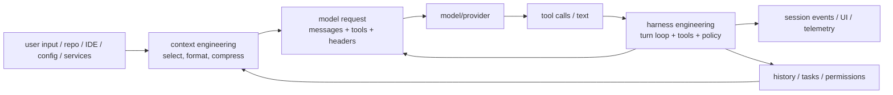

Several components deliberately straddle the boundary:

- **Tools** are context because their schemas and instructions are shown to the model, but harness because execution is mediated by permissions, hooks, streaming, and telemetry.
- **Skills** are context when their `SKILL.md` bodies are injected through `<skill-context>`, but harness when the model-visible `skill` tool loads them and applies `allowed-tools` approval rules.
- **Compaction and `BasicTruncator`** are context engineering outcomes, but they are implemented as request processors inside the harness.
- **Custom agents** are context when they replace or augment system prompts, but harness when `TaskRegistry` schedules them and tracks lifecycle state.

This distinction is useful when reading the rest of the wiki: if a question is about **what the model sees**, start in Context and input; if it is about **how the model is allowed to act**, start in Runtime/UI, Tools, Security, or Agents.

## Source anchors

| Area | Semantic alias | Minified anchor | Approx. line | Role |
|---|---|---:|---:|---|
| Root CLI | `RootProgram` | `mke` | 8298 | Builds the `copilot` root command, global options, help topics, and subcommands. |
| Main action | `mainCliAction(...)` | root `.action(...)` | 8298 | Initializes config, auth, gates, sessions, and routes to the selected runtime mode. |
| Interactive UI | `InteractiveTuiFlow` | `j$o(...)`, `jQa(...)` | 7000-7445 | Runs the terminal UI, dialogs, slash commands, permissions, and background session UI. |
| Prompt mode | `runPromptMode(...)` | `u1t(...)`, `U4a(...)` | 7420 | Handles `-p` and stdin execution, streaming, JSONL, export/share, and autopilot continuation. |
| Embedded server | `EmbeddedServer` | `p1t` | 7441 | Hosts foreground sessions for TUI, JSON-RPC, and extension integration. |
| Feature gates | `LiveFeatureFlagService`, `StaticFeatureFlagService` | `Pfe`, `ILt` | 239 | Resolves local gates, environment/settings overrides, and remote experiment values. |
| Task orchestration | `TaskRegistry`, `createTaskTool(...)` | `B3`, `I6n(...)` | 3367, 3735 | Tracks subagents, background agents, multi-turn agents, and MCP task records. |
| Tool assembly | `assembleRuntimeTools(...)`, `assembleSubagentTools(...)` | `HCr(...)`, `Gjs(...)` | 5734 | Injects file, shell, MCP, skill, SQL, and task tools into a session or subagent. |
| Prompt assembly | `buildSystemPrompt(...)`, `createGeneralPurposeSystemPrompt(...)`, prompt-source loaders | `X3e(...)`, `Wmt(...)`, `q4(...)`, `I9(...)` | 499, 525, 3824, 4031 | Combines static templates with custom instructions, skills, tools, memory, hooks, MCP, and provider request formatting. |
| Agentic loop harness | `Session.runAgenticLoop(...)`, `getCompletionWithTools(...)` | method name preserved, completion loop | 3439, 4481 | Builds each turn, applies request processors, streams model output, dispatches tool calls, and handles retries/errors. |
| Request processors | `preRequest`, `postRequest`, `onRequestError`, `ImmediatePromptProcessor`, `BasicTruncator`, `CompactionProcessor` | `Qyr`, `M3`, `ECe`, `zJ`, `_Ce` | 3062, 3092, 3439, 4471, 4483 | Last-mile context shaping and reliability hooks around provider requests. |
| MCP host | `McpHost` and transport layer | `p8e`, `T6o(...)` | 4138, 7320 | Connects MCP servers, loads tools, and handles task support, elicitation, and sampling. |
| Plugins | `pluginCommand`, plugin loaders | `z6o(...)` and loaders | 2789, 8298 | Manages plugins and loads plugin-provided agents, skills, hooks, MCP, and LSP servers. |
| Permissions | `PermissionService` | `Kge(...)` usage | 7420, 8298 | Applies tool, path, URL, hook, and MCP approval rules. |
| Auth | `AuthManager` | `EX` usage | 7420, 8298 | Resolves GitHub/GHE login state, tokens, provider configuration, and model catalog access. |
| Init | `runInitCommand()` | `g$o()` | 7420 | Analyzes a repository with a restricted tool set and writes `.github/copilot-instructions.md`. |
| Shutdown | `ShutdownService` | `eke` | 7420 | Runs signal handling, disposables, log/telemetry flushing, and force-exit timeout logic. |

## Major feature matrix

| Feature area | Entry point or trigger | Main capabilities | Key conditions or gates |
|---|---|---|---|
| CLI product shell | `copilot`, root options, subcommands | Global options, help topics, completions, login, MCP, plugin, init, update, and version commands. | Built by `RootProgram`. |
| Interactive TUI | Default TTY execution or `-i` | Message stream, dialogs, slash commands, permission prompts, model picker, plan/autopilot/shell modes. | TTY, folder trust, GitHub auth or BYOK provider. |
| Non-interactive prompt mode | `-p`, piped stdin, non-TTY | Scriptable execution, streaming, JSONL, silent mode, attachments, session export/share, autopilot continuation. | Permission prompts usually require prior allow rules. |
| Server/headless mode | `--server`, `--headless`, `--stdio`, `--port` | JSON-RPC service that exposes session/runtime capabilities to external hosts. | Hidden options; uses a static feature service path. |
| ACP mode | `--acp` | Starts the Agent Client Protocol server. | Dynamic import of the ACP implementation. |
| Local sessions | `--resume`, `--continue`, `--name` | Create, save, resume, continue, resolve by session/task/name/prefix, pick, rename, delete, and fork sessions. | Session store and local workspace state. |
| Remote and cloud sessions | `--remote`, `--connect`, `--cloud` | Remote steering, cloud sandbox sessions, background session switching, remote start/resume. | `REMOTE_KICKSTART`, `CLI_CLOUD_SESSIONS`, authentication. |
| Local command sandboxing | `/sandbox enable`, `settings.sandbox.enabled` | Routes eligible local shell sessions through the bundled MXC sandbox spawn path and filesystem policy construction. | `SANDBOX`, shell type, platform support. |
| Tool system | Model tool calls | File view/edit/create, grep/glob, shell, SQL/session store, web/GitHub/MCP, ask-user, plan approval. | Tool filters, permissions, content exclusion, offline mode. |
| Prompt sources and assembly | System prompt builders, slash commands, task/custom-agent executors | Static templates, package YAML prompts, custom instructions, skills, hooks, MCP prompts/resources, memory, session context, and provider mapping. | Feature gates, loaded integrations, repository/user config, selected model/provider. |
| Memory and context board | Memory API prompt cache, `store_memory`, `vote_memory`, `context_board`, `/subconscious run`, sidekick agents | Service-backed memory prompt context, local JSONL memory, memory permissions, dynamic context board persistence, `rem-agent` consolidation, and inbox retrieval. | Agentic memory flags, local memory flag, `COPILOT_SUBCONSCIOUS`, `GITHUB_CONTEXT_SIDEKICK_AGENT`, repository/user scope. |
| Agent orchestration | `task` tool and slash commands | Built-in/custom subagents, sync/background/multi-turn modes, research/review/rem-agent flows, MCP tasks. | `MULTI_TURN_AGENTS`, `MCP_TASKS`, `COPILOT_SUBCONSCIOUS`. |
| Fleet mode | `/fleet`, `session.fleet.start`, `autopilot_fleet` | Prompt-driven parallel subagent orchestration using SQL `todos`/`todo_deps` and the existing `task`/`TaskRegistry` stack. | Depends on task tools, SQL coordination, subagent concurrency limits, and model/account capacity. |
| MCP | `copilot mcp`, config files, plugin MCP | Stdio/HTTP/SSE servers, GitHub MCP, tool filtering, task streams, elicitation, sampling. | MCP policy, enterprise allowlists, MCP feature gates. |
| Plugins and extensions | `copilot plugin`, plugin dirs, extension host | Skills, agents, hooks, MCP/LSP servers, Copilot SDK extension tools. | `EXTENSIONS`, folder trust, plugin enablement. |
| Models and providers | `--model`, model picker, BYOK env vars | Copilot model catalog, reasoning effort, auto mode, OpenAI/Azure/Anthropic provider paths, and provider API routing. | Auth/provider config, plan tier, model availability. |
| Resilience and recovery | Model calls, session queue, task registry | Retry/backoff, rate-limit auto-mode switching, queue pauses, WebSocket fallback, quota/context classification, cancellation, and subagent concurrency limits. | Upstream headers, feature gates, account limits, provider behavior, abort signals. |
| Safety and policy | CLI flags, settings, org policy | Allow/deny rules for tools/paths/URLs, folder trust, secret redaction, content exclusion, offline mode. | Deny rules override allow rules; org policy can block third-party MCP. |
| Observability and operations | Logs, OTel env, update/version paths | Telemetry, debug logs, OpenTelemetry traces/metrics, auto-update, crash/shutdown cleanup. | CI/offline mode changes update and telemetry behavior. |

## Startup to runtime flow

The root action is the central dispatcher. It turns argv, environment, settings, and stdin state into a runtime context, then sends control to the selected mode.

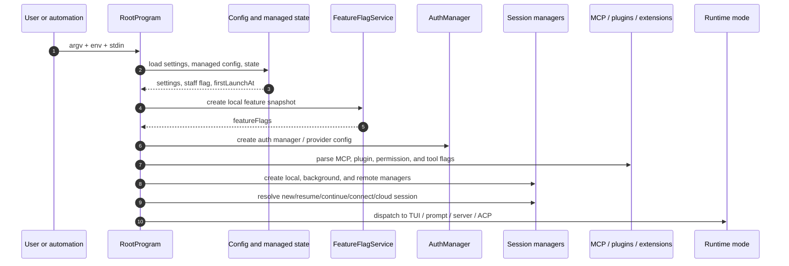

Important ordering details:

- A feature snapshot is created early because it controls which CLI, UI, and runtime capabilities appear.
- Authentication supports both GitHub Copilot token paths and BYOK/local provider paths.
- MCP, plugins, extensions, custom agents, and permissions are normalized before the session/tool runtime is assembled.
- Prompt, TUI, server, and ACP modes share much of the same session/tool/model/permission structure, but differ in how much user interaction they can perform.

## Runtime mode router

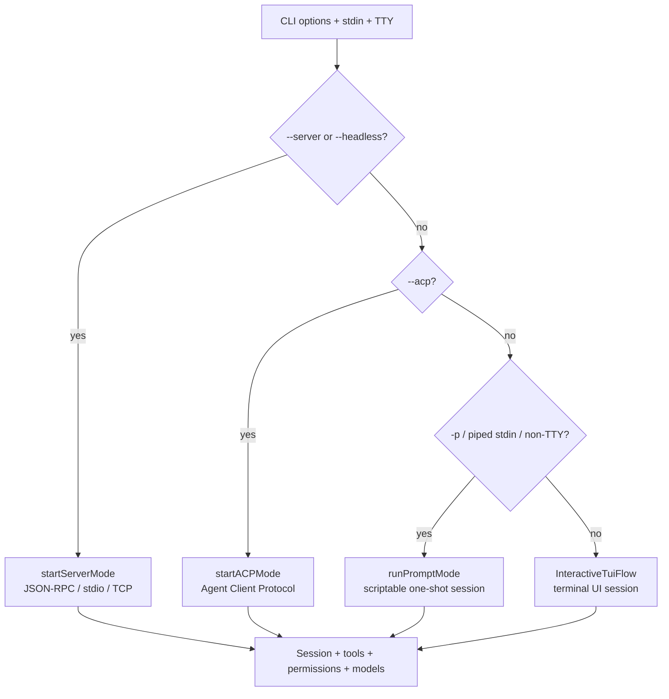

Mode differences:

- **TUI** is the human-in-the-loop path. It can show permission, login, model, MCP, plugin, session, diff, skill, and voice dialogs.
- **Prompt mode** is the scripting/CI path. It supports JSONL, silent output, session export, sharing, and autonomous continuation.
- **Server/headless mode** turns the CLI runtime into a JSON-RPC service for external hosts.
- **ACP mode** is the dedicated Agent Client Protocol entry point.

## CLI command surface

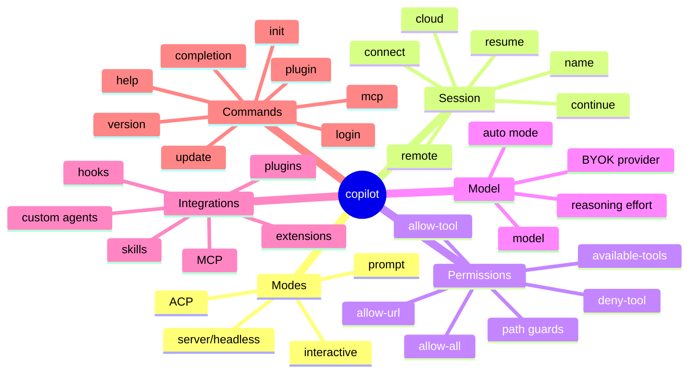

Key subcommands:

| Subcommand | Role |
|---|---|
| `login` | Runs the GitHub/GHE OAuth device flow and stores the token in keychain or fallback config. |
| `mcp` | Manages MCP servers with `list`, `get`, `add`, and `remove`; supports local stdio and remote HTTP/SSE. |
| `plugin` | Manages marketplaces and plugins; plugins can provide skills, agents, hooks, MCP servers, and LSP servers. |
| `init` | Analyzes the repository with a restricted tool set and writes `.github/copilot-instructions.md`. |
| `completion` | Generates bash, zsh, and fish shell completion scripts. |
| `update` / `version` | Checks, downloads, and reports CLI version/channel state. |
| `help` | Prints help topics such as commands, config, environment, logging, monitoring, permissions, and providers. |

## Session and state system

Sessions are the state container for prompts, tool calls, permissions, agent tasks, history, and remote steering.

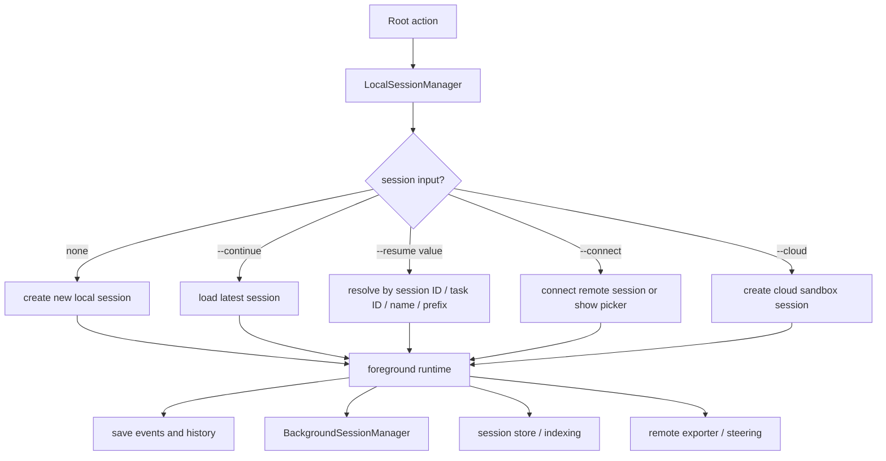

Observed state capabilities:

- Local sessions can be created, saved, resumed, continued, and resolved by session ID, task ID, name, or prefix.
- A session picker appears when a resume query matches multiple sessions.
- Interactive TUI can keep and switch between background sessions.
- Remote steering allows GitHub web/mobile clients to control a foreground session.
- Cloud sessions create and connect to a remote sandbox. This is separate from local `/sandbox` command sandboxing, which changes shell process spawning inside a local session.
- Git snapshot/rewind support can create a snapshot for user messages and later roll back.
- Session indexing/chronicle support powers cross-session history queries, standups, tips, reindexing, and instruction improvement flows.

## Tools, permissions, and agent orchestration

`assembleRuntimeTools(...)` is the capability injection point. `PermissionService` is the execution boundary. `TaskRegistry` is the core registry for asynchronous and delegated work.

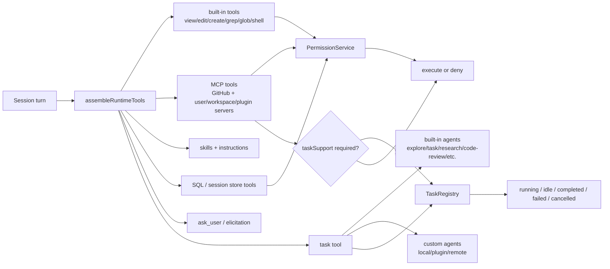

Important orchestration behavior:

- The `task` tool is the model-visible router for subagents.
- Built-in agents include `explore`, `task`, `general-purpose`, `rubber-duck`, `code-review`, `research`, and `rem-agent`.
- Custom agents can come from user files, project files, plugins, or remote APIs, and can declare tools, skills, MCP servers, and model preferences.
- Background mode uses `TaskRegistry` to track asynchronous results.
- Multi-turn agents can enter an `idle` state and wait for follow-up messages.
- MCP tools with `taskSupport: "required"` are bridged into the same registry as background `mcp-task` records.
- Slash commands such as `/research`, `/review`, and `/subconscious run` act as orchestration macros around the main agent and the `task` tool.

## Permission and safety pipeline

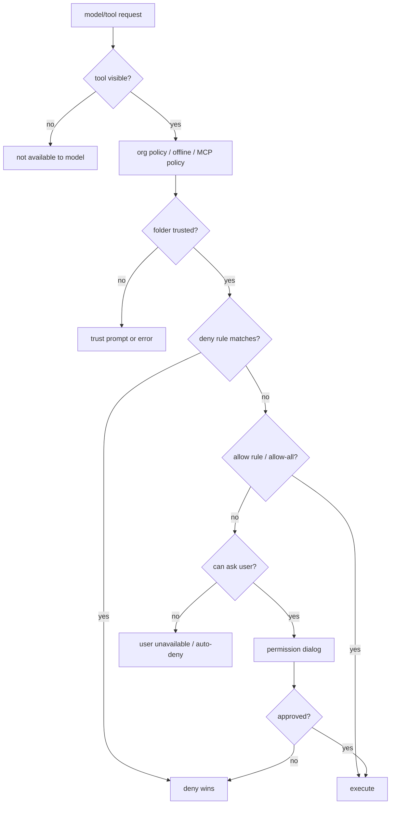

Safety boundaries include:

- Tool filters such as `--available-tools` and `--excluded-tools` determine what the model can see.
- Tool permissions such as `--allow-tool`, `--deny-tool`, and `--allow-all-tools` control approval behavior.
- Path guards include the working directory, extra `--add-dir` roots, temporary directories, and `--allow-all-paths`.
- URL guards include `--allow-url`, `--deny-url`, and allowed/denied URL settings.
- MCP policy covers third-party MCP, enterprise allowlists, GitHub MCP readonly helpers, and server/tool filters.
- Secret environment redaction via `--secret-env-vars` keeps selected variables out of shell/MCP environments and output.
- Content exclusion policies constrain what repository content may be accessed.
- Offline mode disables online paths such as GitHub auth, telemetry, web tools, GitHub MCP, and auto-update.
- Local command sandboxing is a separate shell-spawn layer controlled by `/sandbox` and `settings.sandbox.enabled`; see [`sandboxing.md`](../05-security-and-policy/sandboxing.md).

For the full permission architecture, including rule parsing, deny/allow precedence, path and URL managers, hooks, prompt/RPC flow, approval scopes, and allow-all toggles, see [`permission-system-design.md`](../05-security-and-policy/permission-system-design.md). For sandbox-specific shell enforcement, see [`sandboxing.md`](../05-security-and-policy/sandboxing.md).

## MCP, plugins, extensions, and IDE integration

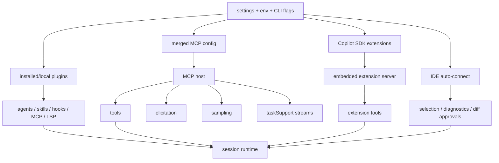

Integration sources:

- MCP configuration can come from user `~/.copilot/mcp-config.json`, workspace `.mcp.json`, plugin-provided MCP servers, built-in GitHub MCP, and `--additional-mcp-config`.
- Plugins can be installed from marketplaces, GitHub repositories, repository subdirectories, direct git URLs, or local plugin directories.
- Extensions are loaded through the embedded server in interactive TUI mode; prompt mode also has an environment/gate-protected extension loading path.
- IDE integration contributes workspace selection, diagnostics, diff approval, and similar environment context.

## How feature gates influence the main features

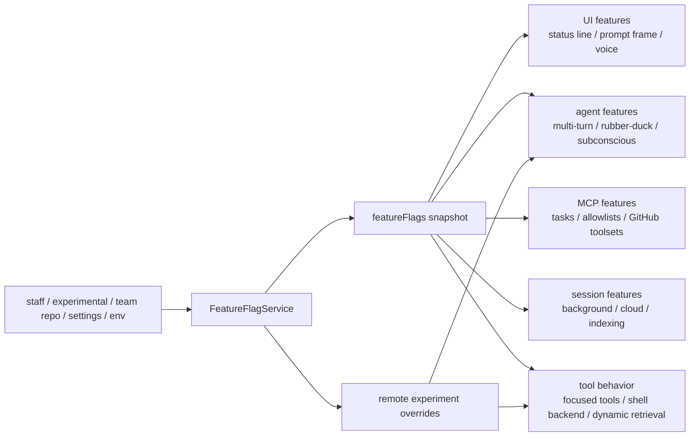

Representative gates:

| Gate | Effect |
|---|---|
| `BACKGROUND_SESSIONS` | Enables multiple background sessions, session switching, and parts of fork/remote workflows. |
| `MULTI_TURN_AGENTS` | Enables subagent idle/follow-up behavior and multi-turn agent lifecycle. |
| `MCP_TASKS` | Maps MCP tools with `taskSupport: "required"` into the background task bridge. |
| `EXTENSIONS` | Enables Copilot SDK extension loading and extension tools. |
| `COPILOT_SUBCONSCIOUS` | Enables `rem-agent`, dynamic context board behavior, and detached shutdown memory agent. |
| `REMOTE_KICKSTART` | Enables remote start session and remote background delegation paths. |
| `CLI_CLOUD_SESSIONS` | Enables `--cloud` cloud sandbox sessions. |
| `SANDBOX` | Exposes the local `/sandbox` command that toggles shell-process sandboxing. |
| `SESSION_INDEXING`, `CLOUD_SESSION_STORE` | Affect session history indexing, chronicle, and cloud/local session store behavior. |
| `VOICE` | Enables voice runtime, recording UI, and voice model picker paths. |
| `STATUS_LINE`, `PROMPT_FRAME`, `CELL_RENDERER`, `NATIVE_CURSOR` | Affect terminal UI rendering details. |

## Relationship to the other documents

```mermaid
flowchart TD
  Main["main-feature-map.md"] --> Overview["what-is-app-js.md\nwhat app.js owns"]
    Main --> Runtime["cli-runtime-workflows.md\nroot action and mode dispatch"]
    Main --> TUI["tui-and-slash-commands.md\ninteractive UI and slash commands"]
    Main --> Sessions["sessions-remote-cloud.md\nlocal/remote/cloud sessions"]
    Main --> Integrations["integrations-permissions-config.md\nMCP/plugins/permissions"]
    Main --> Permissions["permission-system-design.md\npermission service and approval flow"]
    Main --> Sandbox["sandboxing.md\nlocal command sandboxing"]
    Main --> Models["models-providers-auth.md\nauth/providers/model selection"]
    Main --> Agents["agent-task-orchestration.md\ntask tool and subagents"]
    Main --> Memory["memory-and-context-board.md\nmemories, context board, rem-agent"]
    Main --> Fleet["fleet-mode.md\n/fleet and parallel subagents"]
    Main --> Gates["feature-gates.md\nrollouts and overrides"]
    Main --> Bootstrap["loader-bootstrap.md\nSEA/npm loader chain"]
    Main --> Ops["observability-update-shutdown.md\nlogs/update/shutdown"]
```

Read this document first if you want the feature map. Then follow the links above for deeper implementation notes.

## Takeaways

The main capabilities in `app.js` can be summarized as: **CLI, modes, sessions, tools, permissions, integrations, agents, and experiments**.

More concretely:

1. `RootProgram` is the entry point for command and option parsing.
2. `mainCliAction(...)` is the central dispatcher for config, auth, gates, and session initialization.
3. `InteractiveTuiFlow` and `runPromptMode(...)` are the two most important user execution paths.
4. `Session` is the state container for history, tools, permissions, remote/cloud/background workflows, and model turns.
5. `assembleRuntimeTools(...)` determines which capabilities the model can see, including memory and context sidekick tools when gates allow them.
6. `PermissionService` decides whether requested tools can actually run.
7. `TaskRegistry` and the `task` tool orchestrate subagents, background work, multi-turn agents, and MCP tasks.
8. `FeatureFlagService` decides which advanced capabilities are active in the current environment.

In short, `app.js` is best understood as an in-terminal agent runtime and integration platform, not as a single-purpose CLI command implementation.