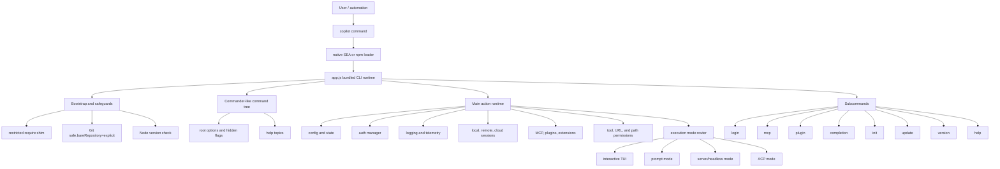
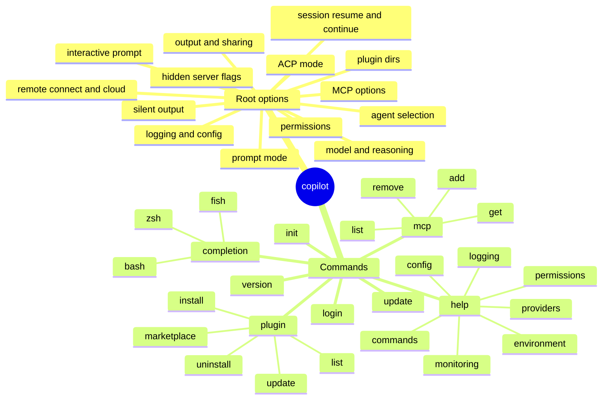
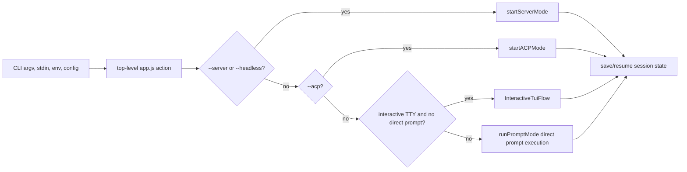

# `app.js` overview

`app.js` is the bundled main implementation of the GitHub Copilot CLI package extracted from the binary distribution.

Analyzed artifact:

`copilot-cli-pkg/app.js`

Observed package metadata:

- Package: `@github/copilot`
- Version: `1.0.48`
- Package type: ESM (`"type": "module"`)
- CLI bin: `npm-loader.js`
- Build commit in package metadata: `eb38dfb`

Observed bundle shape:

- Size: about 11.9 MB (`11,865,712` bytes)
- Lines: `8,684`
- esbuild-style CommonJS module wrappers: about `1,140`
- Lazy init wrappers: about `503`

## What `app.js` does

At a high level, `app.js` is the runtime brain of the Copilot CLI. It:

1. prepares a constrained module-loading environment;
2. hardens selected Git behavior;
3. builds the `copilot` command-line interface;
4. loads/migrates user configuration and state;
5. initializes feature flags, auth, telemetry, logging, error handling, update notifications, and shutdown cleanup;
6. resolves model/provider settings, including GitHub Copilot routing and custom provider/BYOK mode;
7. loads MCP/plugin/configuration sources and permission policies;
8. creates or resumes local/remote/cloud sessions;
9. dispatches to one of several runtime modes:
   - interactive terminal UI;
   - non-interactive prompt execution;
   - JSON-RPC/server/headless mode;
   - Agent Client Protocol mode;
10. exposes subcommands such as `login`, `mcp`, `plugin`, `completion`, `init`, `update`, `version`, and `help`.

## High-level component view

## Main internal anchors

Because the file is bundled/minified, the documentation uses semantic aliases as the primary names and keeps generated symbols only as version-specific lookup anchors near the CLI/runtime section:

| Semantic alias | Minified anchor | Observed role |
| --- | --- | --- |
| `RootProgram` | `mke` | Root Commander-like `copilot` program object. |
| `buildLoginCommand()` | `m9o()` | Builds the `login` subcommand. |
| `buildMcpCommand()` | `b9o()` | Builds the `mcp` subcommand group. |
| `buildPluginCommand()` | `z6o()` | Builds the `plugin` subcommand group. |
| `buildCompletionCommand({ getProgram })` | `l9o({ getProgram })` | Builds the `completion` subcommand. |
| `runInitCommand()` | `g$o()` | Implements `copilot init`. |
| `InteractiveTuiFlow` | `j$o(...)` | Launches the interactive terminal UI workflow. |
| `runPromptMode(...)` | `u1t(...)` | Runs non-interactive/direct prompt mode. |
| `runDeviceLoginFlow(...)` | `p9o(...)` | Performs login/device-flow authentication. |
| `ShutdownService` | `eke` | Shutdown/disposal service. |
| `loadPromptModeExtensions(...)` | `Q4a(...)` | Loads prompt-mode extensions when enabled. |
| `EmbeddedServer` | `p1t` | Embedded server used by interactive UI plus server integration. |
| `parseLogLevel(...)` | `H8a(...)` | Maps log-level strings to numeric log levels. |
| `fatalExit(...)` | `op(...)` | Fatal-error path: writes an error and exits. |

The minified anchors are useful for this version only. Future builds may rename or rearrange them.

## Root command tree

The CLI uses a Commander-like API through a bundled constructor plus `.name()`, `.option()`, `.addCommand()`, `.action()`, and `.parseAsync()` calls. The root command is named `copilot`.

## Runtime modes at a glance

## Why the important code is near the end

Most of the beginning and middle of `app.js` consists of bundled dependencies and generated module wrappers. The high-value CLI logic appears near the tail of the file, where the root command, help topics, options, subcommands, and top-level `.action(async t => { ... })` are built.
