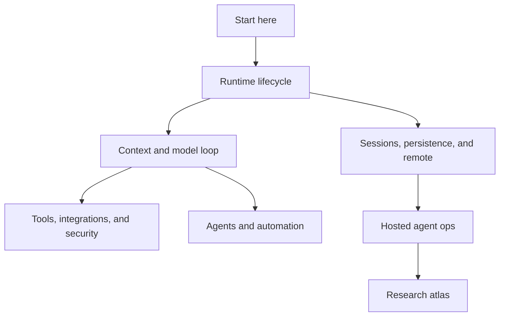

# Start here

This is the MVP entry point for the `copilot-cli-pkg/app.js` reverse-engineering wiki. It keeps the first reading path short: identify the artifact, learn how to read minified anchors, then follow the runtime loops that matter for a coding agent.

## Semantic alias and minified anchor mapping

This is a navigation page, not a direct `app.js` implementation analysis. Follow the linked implementation pages for concrete bundle anchors.

| Semantic alias | Minified anchor | Scope |
|---|---|---|
| MVP start page | N/A — navigation page | Orients readers to the shortest useful path through the wiki. |
| Bundle overview | See linked topic pages | Explains what `app.js` contains and how to interpret minified symbols. |

## Read first

| Step | Page | Why it matters |
|---:|---|---|
| 1 | [`app.js` overview](what-is-app-js.md) | Defines the extracted artifact, package boundaries, and caveats. |
| 2 | [Main feature map](main-feature-map.md) | Gives the system map before diving into individual subsystems. |
| 3 | [CLI runtime workflows](../01-runtime-lifecycle/cli-runtime-workflows.md) | Shows how argv, stdin, TTY, server/headless, and session state route into runtime modes. |
| 4 | [End-to-end session lifecycle](../04-sessions-persistence-remote/session-lifecycle-end-to-end.md) | Connects startup, replay, tool refresh, UI projection, persistence, remote export, and shutdown. |

## MVP map

## When to use implementation pages

The MVP sections are curated routes. Detailed implementation pages remain source-anchored inside those routes; use them when you need exact minified aliases, event names, environment variables, or call-path details.

## Back to wiki home

- [Wiki home](../README.md)
- [Full table of contents](../SUMMARY.md)
