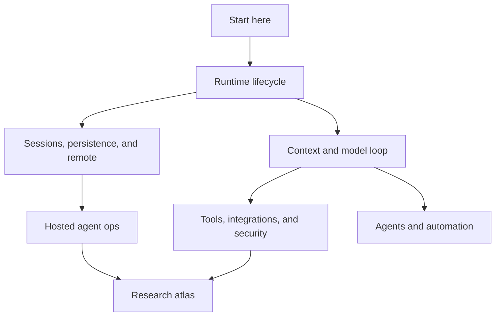

# Start here

Start here when you need the fastest coherent mental model of `copilot-cli-pkg/app.js`. This chapter answers three questions before sending readers into deep source-anchored pages:

1. What is the extracted bundle?
2. What major runtime capabilities does it contain?
3. Which path should I follow for a specific investigation?

`app.js` is a bundled and minified production artifact, so this wiki uses stable semantic aliases in prose and keeps minified names only as searchable anchors.

## Source-anchor policy

This page is an orientation document, not a direct implementation trace. Concrete anchors live in the linked pages.

| Semantic alias | Minified anchor | Scope |
|---|---|---|
| MVP start page | N/A — navigation page | Establishes the first reading path and the wiki's conceptual map. |
| Bundle identity | See [`what-is-app-js.md`](what-is-app-js.md) | Explains artifact boundaries, package layout, and caveats. |
| Runtime capability map | See [`main-feature-map.md`](main-feature-map.md) | Maps the major systems implemented by the bundle. |

## First reading path

| Step | Read | Why |
|---:|---|---|
| 1 | [`app.js` overview](what-is-app-js.md) | Defines what the artifact is and what it is not. |
| 2 | [Main feature map](main-feature-map.md) | Shows how CLI modes, sessions, tools, models, agents, policy, and ops connect. |
| 3 | [CLI runtime workflows](../01-runtime-lifecycle/cli-runtime-workflows.md) | Explains how argv/stdin/TTY/options route into TUI, prompt, server/headless, or ACP mode. |
| 4 | [End-to-end session lifecycle](../04-sessions-persistence-remote/session-lifecycle-end-to-end.md) | Shows the durable path through replay, tools, UI projection, persistence, remote export, and shutdown. |

## Choose your route

| Question | Go to |
|---|---|
| How does the binary/package start and select a mode? | [Runtime lifecycle](../01-runtime-lifecycle/README.md) |
| What does the model see, and how is the request shaped? | [Context and model loop](../02-context-model-loop/README.md) |
| Which tools are exposed, executed, filtered, or permissioned? | [Tools, integrations, and security](../03-tools-integrations-security/README.md) |
| Where do session events, state files, indexes, and remote control live? | [Sessions, persistence, and remote](../04-sessions-persistence-remote/README.md) |
| Which env vars and operational contracts define hosted jobs? | [Hosted agent ops](../05-hosted-agent-ops/README.md) |
| How are subagents, custom agents, fleet, and scheduled prompts run? | [Agents and automation](../06-agents-automation/README.md) |
| How do I triage a raw constant, event, or minified symbol? | [Research atlas](../99-research-atlas/README.md) |

## MVP map

## Reading strategy

- Use section README pages as narrative guides.
- Use implementation pages when you need source anchors, event names, env vars, call paths, or edge cases.
- Use the generated atlas only as a discovery layer; every behavioral claim should point back to a focused page or source anchor.

## Navigation

- [Wiki home](../README.md)
- [Full table of contents](../SUMMARY.md)
