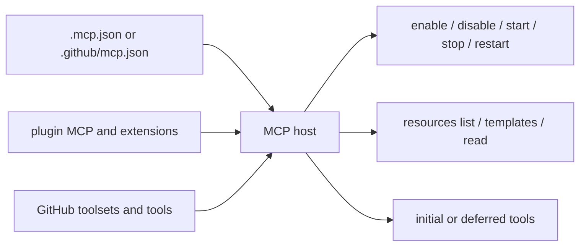

# Copilot CLI 1.0.71 package delta

This page records the confirmed documentation-relevant changes between the repository's previous `@github/copilot` `1.0.54` baseline and the freshly extracted `1.0.71` package.

The release span is large enough that raw symbol movement is not useful by itself. Findings below were triaged from the package changelog and regenerated source atlas, then checked against current `app.js`, SDK declarations, schemas, packaged agent definitions, or adjacent runtime files.

## Artifact identity

| Artifact | Previous baseline | Current package |
|---|---:|---:|
| Package version | `1.0.54` | `1.0.71` |
| Build commit | `d1896a6` | `3286dc4` |
| `app.js` bytes | `12,548,132` | `9,089,681` |
| `app.js` lines | `9,088` | `6,017` |
| `app.js` SHA-256 | `997d2c9e...` | `1466298c...` |
| Native `runtime.node` | `11,704,960` bytes | `77,405,448` bytes |

The smaller JavaScript bundle and much larger native runtime are not cosmetic. Shell management, sandbox policy, configuration loading, model/runtime helpers, and other surfaces now call broad native `S.*` APIs. Some older JavaScript implementation paths are therefore historical rather than merely relocated line anchors.

## Source anchors

| Area | Current anchor | Approx. location | Confirmed change |
|---|---|---:|---|
| Wire API map | `session.canvas.listOpen`, `session.mcp.resources.*`, live MCP methods | `app.js` ~167 | Larger session/SDK surface. |
| Native shell manager | `Qpe`, `shellManagerCreate`, `shellManagerRestoreDetached` | `app.js` ~206-213 | Process lifecycle and task state cross the native boundary. |
| Built-in agent policy | `includedBuiltinAgents`, `excludedBuiltinAgents`, `ox(...)` | `app.js` ~324, 374 | Task/subagent catalogs can restrict built-ins. |
| Current model metadata | `claude-sonnet-5`, `claude-opus-4.8`, `gpt-5.6-*` | `app.js` ~618-620 | New catalog families and reasoning metadata. |
| Slash-command surface | `/move`, `/worktree`, `/refine`, `/plugins`, `/settings` | `app.js` ~2064 | Expanded TUI workflows. |
| Settings registry | `commandHistoryMaxSize`, scoped model/settings targets | `app.js` ~2212-2237 | New persistence and validation surfaces. |
| Voice command | `voice-models`, `voice-devices`, `voiceActivation` | `app.js` ~2438 | Persistent microphone selection. |
| Worktree handlers | `uFt(...)`, `gitMoveWorktreeChangesAsync` | `app.js` ~2451-2473 | `/worktree` and `/move` now have distinct semantics. |
| GitHub MCP selections | `githubMcpToolsets`, `githubMcpTools`, `Swn(...)` | `app.js` ~2644, 3642 | Tool/toolset selection persists in settings. |
| Durable canvases | `session.canvas.recorded`, `.removed`, `durableOpenCanvases` | `app.js` ~2651, 2742 | Open canvases survive replay and restart. |
| Scoped settings UI | Repo and Repo (local) targets | `app.js` ~3627 | Repository and git-ignored local settings are distinct. |
| Voice endpoint/server | `Axn(...)`, `Txn(...)`, `kxn(...)`, `Fxn(...)` | `app.js` ~4402-4404 | TUI connects to or spawns a reusable voice server. |
| Root sandbox flags | `--sandbox`, `--no-sandbox` | `app.js` ~5899 | One-run sandbox overrides are public CLI options. |
| Canvas SDK | `createCanvas`, `CanvasOptions`, `CanvasAction` | `copilot-sdk/canvas.d.ts` | Experimental per-canvas handler API. |
| API schema | `server`, `session`, `clientSession`, `clientGlobal` | `schemas/api.schema.json` | `275` unique experimental RPC methods. |
| Session events | `SessionEvent` definitions | `schemas/session-events.schema.json` | `110` event types, `60` ephemeral-only. |

## Headline additions

### Commands and TUI workflows

| Feature | Introduced or materially changed | Runtime behavior |
|---|---:|---|
| `/worktree` and `/move` | `1.0.61`, split in `1.0.71` | `/worktree` leaves current changes behind; `/move` carries them into the new worktree. |
| `/refine` | `1.0.70` | Rewrites rough prompt text into a clearer prompt. |
| `/plugins` dashboard | `1.0.69` | Full-screen installed-plugin management alongside singular `/plugin` commands. |
| `/voice devices` | `1.0.71` | Chooses and persists a microphone by stable name/occurrence identity. |
| `/diagnose` | `1.0.64` | Turns the current session-log tail into an agent investigation prompt. |
| `/skill` and `copilot skill` | `1.0.65` | Lists, adds, or removes skills from files, URLs, or directories. |
| `/app` | `1.0.62` | Opens the GitHub app or browser fallback. |
| `/branch` and `/loop` | `1.0.64` | Aliases for `/fork` and `/every`. |
| Case-insensitive slash commands | `1.0.71` | `/SESSION` and autocomplete behave like lowercase forms. |
| Persistent session sidebar | `1.0.71` | Sidebar membership survives restart; sessions can be hidden or closed independently. |
| Prompt pinning and timestamps | `1.0.70-1.0.71` | Settings control pinned submitted prompts and timeline timestamps. |

### Settings and repository policy

The settings system now exposes user, Repo, and Repo (local) targets. A trusted repository can place shared defaults in `.github/copilot/settings.json`; local checkout overrides live in git-ignored `settings.local.json`.

New or newly persistent keys include:

- `commandHistoryMaxSize` for Ctrl+R and up/down history, default `50`;
- `pinnedPrompts` and timeline display controls;
- `githubMcpToolsets`, `githubMcpTools`, and `enableAllGithubMcpTools`;
- `stayInAutopilot`, default `false`;
- `subagents.maxConcurrency` and `subagents.maxDepth` where the account permits configuration;
- `dynamicRetrieval` for embedding-based skill retrieval;
- `beepOnSchedule`;
- `voice.selectedDevice`.

Invalid registered values now produce a startup warning naming the offending setting instead of silently discarding the full file.

### MCP, plugins, and extensions

Confirmed additions include:

- automatic workspace MCP loading from `.github/mcp.json`;
- `deferTools: "auto" | "never"` at MCP server boundaries;
- live SDK methods to reload configuration and start, restart, or stop servers;
- paginated `session.mcp.resources.list`, `listTemplates`, and `read` methods;
- registry browsing/installation in the MCP UI;
- mid-turn MCP enable/disable and OAuth recovery;
- persisted GitHub MCP tool and toolset selection;
- plugin marketplace list/add/remove/browse/update commands;
- exact plugin source pinning with `sha`;
- plugin-packaged SDK extensions and MCP servers.

### Agents and automation

The task/subagent system gained several controls:

- `includedBuiltinAgents` and `excludedBuiltinAgents` filter the catalog before advertisement and execution;
- `/subagents`/`/agents` can configure model, reasoning effort, and context tier;
- usage-based billing users can configure concurrency and nesting depth; the default maximum depth is now `4`;
- custom agents can declare reasoning effort;
- `/autopilot <objective>` and `/goal` keep continuation aligned to a named objective;
- `stayInAutopilot` controls whether successful completion returns to interactive mode;
- `/every` and `/after` accept natural-language schedules and can execute slash commands;
- Rubber Duck can use a complementary model and is configurable from the subagent UI.

Plan mode now hard-blocks built-in workspace-mutating tools. This is an execution check, not only prompt wording; MCP and external tools remain governed by their own policy paths.

### Models and providers

The package contains support or metadata for GPT-5.6, Claude Sonnet 5, Claude Opus 4.8/Fast, Claude Fable 5, Kimi K2.7 Code, and Gemini 3.5 Flash. Actual visibility still depends on account catalog, policy, rollout, and provider capability.

Custom OpenAI-compatible Responses providers can select `COPILOT_PROVIDER_TRANSPORT=http|websockets`. Persistent WebSocket responses are separately feature-controlled.

### Canvas and SDK lifecycle

Canvas support evolved from a transient renderer bridge into a session lifecycle:

1. SDK extensions declare canvases with experimental `createCanvas(...)` handlers.
2. `session.canvas.recorded` persists instance identity, title, input, and provider/canvas IDs.
3. `session.canvas.removed` deletes durable identity.
4. `session.canvas.listOpen` returns replayed open instances.
5. Ephemeral open/closed/unavailable events describe current renderer state without persisting stale URLs.

Plugins can distribute session-scoped extensions and canvases, while SDK clients can configure session memory during create/resume.

### Sandbox and safety boundaries

The sandbox is broader than the old shell-only path:

- root `--sandbox` and `--no-sandbox` override the saved setting for one run;
- shell, MCP, and LSP process managers receive effective sandbox updates;
- `web_fetch` follows sandbox network policy;
- built-in edits can request an explicit bypass when `allowBypass` permits it;
- LSP reads and rename edits are checked against sandbox filesystem policy;
- bypassed commands and warnings are labeled in the TUI.

Permission approval still happens before execution. A sandbox limits an approved operation; it does not approve it.

## Architectural migrations

### Shell execution

Release `1.0.62` replaced the old dual PTY/process design with lightweight process spawning. The active shell config now exposes execute/read/stop/list tools; `write_bash` and `write_powershell` survive only in compatibility/event rendering strings.

JavaScript retains orchestration and task projection, while native `shellManager*` calls own execution planning, detached restoration, state, and completion notification identity.

### Voice runtime

The current package adds `voice-server.js` and `voice-engine.worker.js`, while removing the previous `voice-mic.worker.js` and `voice-foundry.worker.js` files. The TUI resolves a local socket or named pipe, reuses a healthy version-scoped server, or spawns a detached CLI child in voice-server mode.

### Native runtime boundary

The `runtime.node` expansion coincides with many `app.js` paths becoming adapters over native APIs: shell manager, sandbox policy, settings/config loading, model resolution, prompt helpers, session storage, and other services. These calls are observable, but the implementation behind them cannot be reconstructed from `app.js` alone.

## Documentation map

| Change area | Updated page |
|---|---|
| TUI commands and sidebar | [Interactive TUI and slash-command workflows](../01-runtime-lifecycle/tui-and-slash-commands.md) |
| Voice server/device selection | [Voice mode and Foundry Local](../01-runtime-lifecycle/voice-mode-foundry-local.md), [Voice runtime server](../01-runtime-lifecycle/voice-runtime-workers-and-transcription.md) |
| Models/provider transport | [Models, providers, and authentication](../02-context-model-loop/models-providers-auth.md) |
| Shell migration | [Shell command execution events](../03-tools-integrations-security/shell-command-execution-events.md) |
| Sandbox expansion | [Sandbox implementation](../03-tools-integrations-security/sandboxing.md) |
| Scoped settings | [Settings and configuration persistence](../03-tools-integrations-security/settings-config-persistence.md) |
| MCP/resources | [MCP host, transports, and tools](../03-tools-integrations-security/mcp-host-transport-and-tools.md) |
| Plugin marketplace/extensions | [Plugins, extensions, and capabilities](../03-tools-integrations-security/plugins-extensions-and-capabilities.md) |
| Canvas durability/SDK | [MCP Apps and canvas bridge](../03-tools-integrations-security/mcp-apps-and-canvas-bridge.md) |
| Worktrees | [Git, repository, PR, and ref context](../04-sessions-persistence-remote/git-repository-context.md) |
| SDK/schema growth | [API and session event schema contracts](../04-sessions-persistence-remote/api-and-session-event-schemas.md) |
| Agent policy | [Built-in agents](../06-agents-automation/built-in-agents.md) |
| Autopilot/plan policy | [Autopilot and no-ask-user](../06-agents-automation/autopilot-and-no-ask-user.md) |
| Scheduled commands | [Scheduled prompts and command queue](../06-agents-automation/scheduled-prompts-and-command-queue.md) |

## Residual gaps

- Native `runtime.node` behavior is only documentable at its JavaScript call boundary without separate binary analysis.
- The package changelog is product-facing evidence, not proof of runtime lifecycle by itself; UI-only changes were not expanded into dedicated internals pages.
- All `275` current schema RPC methods are marked experimental, so SDK clients should remain version-coupled.
- Minified aliases and approximate lines will move again; the regenerated `source-atlas/` is the current discovery baseline.
