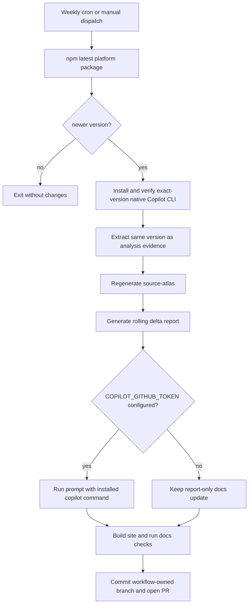

# Weekly documentation update automation

This page documents the scheduled workflow that checks npm for a newer Copilot CLI, refreshes the extracted package and source atlas, updates the rolling delta report, optionally updates hand-written docs with Copilot CLI, validates the website, and opens a pull request.

## Automation files

| File | Role |
|---|---|
| `.github/workflows/update-copilot-cli-docs.yml` | Weekly/manual GitHub Actions entry point, native CLI installer, and pull-request publisher. |
| `scripts/update-copilot-cli-docs.mjs` | Deterministic version check, package extraction, atlas regeneration, and report generation. |
| `scripts/check-docs.mjs` | Markdown-link, navigation, generated-route, H1, and atlas-count validation. |
| `.github/prompts/weekly-copilot-cli-docs.md` | Optional non-interactive Copilot prompt for source-confirmed prose updates. |
| `latest-package-update.md` | Rolling machine-generated package and named-surface delta. |

## Workflow



The schedule runs once per week at an off-peak minute. `workflow_dispatch` supports a forced refresh when maintainers need to regenerate evidence for the current version.

## Deterministic core

The workflow first runs the updater in `--check-only` mode, installs and verifies the resolved native CLI, then passes that exact version back to the updater for evidence generation. The updater also supports standalone local use by resolving npm's `latest` dist-tag itself. It compares the target with `copilot-cli-pkg/package.json` and refuses accidental downgrades. On an update it:

1. records the current atlas and surface index in memory;
2. calls `scripts/extract-copilot-cli-pkg.mjs --version <resolved-version>`;
3. validates the new `app.js` syntax and exact embedded package version;
4. runs `scripts/index-app-js.mjs`;
5. computes added/removed named surfaces and package files;
6. writes `latest-package-update.md`;
7. refreshes current-version metadata and the source-atlas inventory table.

This part requires no model token and is the authoritative automation path. If the optional agent is unavailable, the pull request still contains the package, atlas, and report needed for manual review.

## Native CLI and optional documentation agent

For every detected package update, the workflow installs the exact resolved version with `npm install --global @github/copilot@<version>`, uses an isolated runner cache, disables auto-update, and verifies `copilot --no-auto-update --version`. The installed `copilot` command runs the documentation prompt with the same cache/update controls; the extracted `copilot-cli-pkg/` tree is never executed and remains analysis evidence only.

Set a repository Actions secret named `COPILOT_GITHUB_TOKEN` to enable the hand-written documentation pass. The token must belong to an account that can authenticate Copilot CLI and should be scoped and rotated according to repository policy.

The workflow passes the token only to the installed native CLI invocation so it can make model requests. The npm installation step does not receive the token. The prompt forbids web/GitHub research, executing the extracted bundle, package edits, commits, and atlas regeneration; it asks the agent to confirm behavior in local extracted sources and update only maintained documentation/site files.

Without this secret, the step records that the agent was skipped and continues with the deterministic report-only pull request.

## GitHub permissions

The workflow declares only:

- `contents: write`, to push its workflow-owned branch;
- `pull-requests: write`, to open the update pull request.

Repository settings must allow GitHub Actions to create pull requests. In **Settings -> Actions -> General -> Workflow permissions**, enable the option that permits Actions to create and approve pull requests.

Pull requests created with the repository `GITHUB_TOKEN` may not trigger separate pull-request workflows. This updater therefore runs package checks, the full Astro build, and `scripts/check-docs.mjs` before opening the pull request. A human merge to `main` still triggers the normal website deployment workflow.

## Pull-request behavior

The workflow first checks for an existing open branch whose name starts with `automation/copilot-cli-`. If one exists, it does not create a duplicate weekly PR. Otherwise it creates a version/run-specific branch, stages package/atlas/docs/site/help changes, commits them, pushes the branch, and opens a PR.

The generated PR body records:

- previous and current package versions;
- whether the optional documentation agent ran;
- the rolling report path;
- validations performed;
- the native/generated SDK trailing-whitespace caveat when applicable.

## Local use

Check without changing files:

```sh
node scripts/update-copilot-cli-docs.mjs --check-only
```

Force extraction and report regeneration:

```sh
node scripts/update-copilot-cli-docs.mjs --force
```

Refresh only deterministic version and atlas prose from the current package:

```sh
node scripts/update-copilot-cli-docs.mjs --refresh-metadata-only
```

Validate after building the site:

```sh
cd website
npm ci
npm run build
cd ..
node scripts/check-docs.mjs
```

Trigger manually with GitHub CLI:

```sh
gh workflow run update-copilot-cli-docs.yml
```

Use the forced input only when intentionally refreshing the same version:

```sh
gh workflow run update-copilot-cli-docs.yml -f force=true
```

## Failure modes

| Failure | Outcome |
|---|---|
| npm is unavailable or returns an invalid version | Workflow fails before modifying the repository. |
| Extracted package version differs from the resolved version | Workflow fails and opens no PR. |
| Optional agent fails midway | Workflow fails; no partially validated PR is opened. |
| Site build, link, route, H1, or atlas-count validation fails | Workflow fails and opens no PR. |
| An automated update PR is already open | Workflow exits after validation without creating a duplicate. |
| Pull-request creation is disabled in repository settings | The final publish step fails with setup guidance in this page. |

## Review expectations

The update PR is not self-approving. Reviewers should verify that:

- changelog and atlas leads were confirmed against runtime or adjacent package contracts;
- removed JavaScript paths were marked historical instead of silently retained as current;
- native-boundary behavior is not overclaimed beyond observable adapters;
- navigation and page titles remain coherent;
- unrelated extracted churn is not hand-edited.
