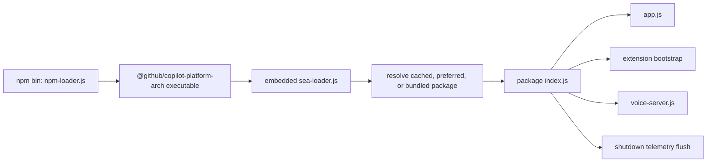
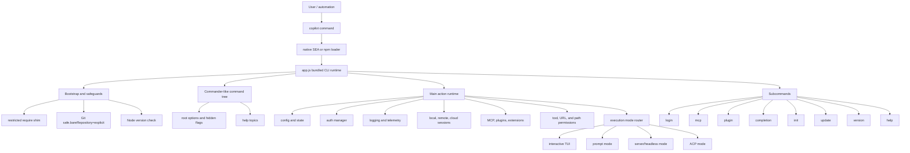
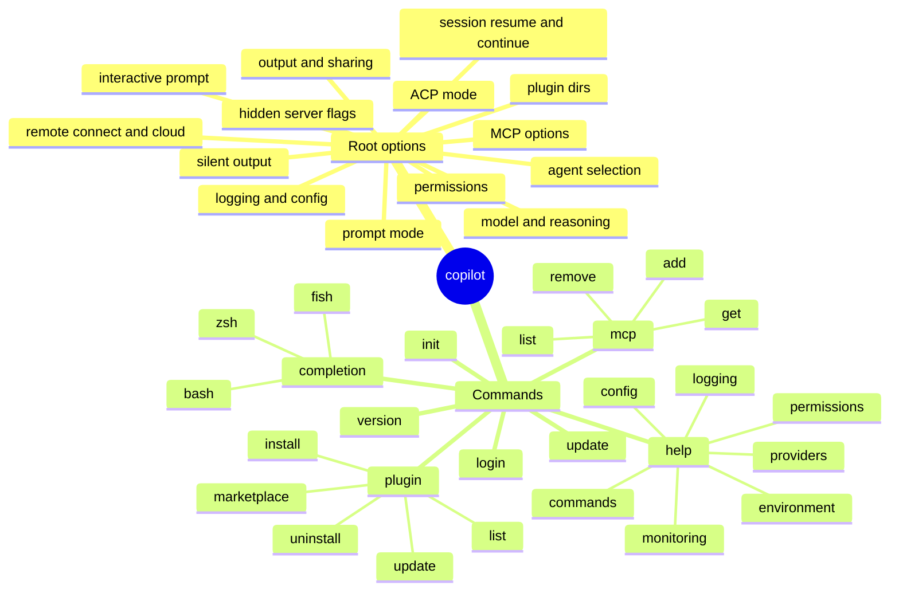
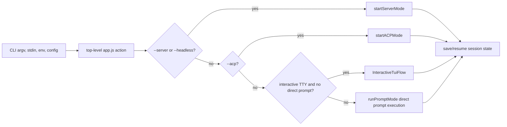

# app.js overview

`app.js` is the bundled main implementation of the GitHub Copilot CLI package extracted from the binary distribution.

Analyzed artifact:

`copilot-cli-pkg/app.js`

Observed package metadata:

- Package: `@github/copilot`
- Version, build commit: see [`copilot-cli-pkg/package.json`](../../copilot-cli-pkg/package.json) for the exact value of whichever bundle is currently checked in.
- Package type: ESM (`"type": "module"`)
- CLI bin: `npm-loader.js`

Observed bundle shape (approximate, will drift release-to-release):

- Size: `9,089,681` bytes
- Logical lines: `6,017` in the generated source atlas (`wc -l` reports `6,016` newline terminators)
- Function declarations found by the atlas: `7,473`
- Classes found by the atlas: `612`
- Declaration blocks found by the atlas: `22,656`

This is the artifact-identity page for [Start here](README.md). Read it before the [main feature map](main-feature-map.md) when you need package boundaries, high-level responsibilities, and caveats about bundled/minified source. It intentionally stays broad; detailed runtime flow begins in [Runtime lifecycle](../01-runtime-lifecycle/README.md), and subsystem-specific source anchors live in the later internals chapters.

## How the process reaches app.js

`app.js` is normally imported by a launcher rather than executed as the package's direct bin file. The checked-in package exposes two converging launch paths:

1. [`npm-loader.js`](../../copilot-cli-pkg/npm-loader.js) selects the optional package for the current platform, architecture, and Linux libc family, then spawns its native executable with inherited stdio.
2. The native single-executable application runs [`sea-loader.js`](../../copilot-cli-pkg/sea-loader.js), which resolves a preferred/cache package when configured, otherwise extracts or selects the bundled package, and imports its `index.js`.
3. [`index.js`](../../copilot-cli-pkg/index.js) handles special extension-fork, voice-server, and shutdown-flush modes. For the normal CLI path it may capture early interactive keystrokes, resolves `app.js`, and imports it as ESM.

See [Loader and bootstrap workflows](../01-runtime-lifecycle/loader-bootstrap.md) for cache selection, extraction, version preference, early typeahead, and failure handling.

## Artifact boundary

Calling `app.js` the runtime brain does not mean every implementation is JavaScript inside that file. It orchestrates adjacent packaged components, including:

- `prebuilds/<platform-arch>/runtime.node`, which owns native-backed process, protocol, persistence, policy, LSP, and tool operations;
- `napi-oop-runtime/`, which can route native calls through an out-of-process runtime;
- packaged `ripgrep` and `tgrep` executables for repository search;
- Tree-sitter runtimes, grammars, and highlight queries;
- voice server, installer, and engine workers;
- schemas, built-in agent definitions, skills, preloads, SDK files, and webview assets.

The bundle is therefore the main orchestration artifact, not a self-contained implementation of every subsystem. Direct behavioral claims about native or binary-owned work require evidence from the corresponding binding surface, binary strings/exports, or observed process protocol rather than `app.js` alone.

## What app.js does

At a high level, `app.js` is the runtime brain of the Copilot CLI. It:

1. prepares a constrained module-loading environment;
2. hardens selected Git behavior;
3. builds the `copilot` command-line interface;
4. loads/migrates user configuration and state;
5. initializes feature flags, auth, telemetry, logging, error handling, update notifications, and shutdown cleanup;
6. resolves model/provider settings, including GitHub Copilot routing and custom provider/BYOK mode;
7. loads MCP/plugin/configuration sources and permission policies;
8. creates or resumes local/remote/cloud sessions;
9. dispatches to one of several runtime modes:
   - interactive terminal UI;
   - non-interactive prompt execution;
   - JSON-RPC/server/headless mode;
   - Agent Client Protocol mode;
10. exposes subcommands such as `login`, `mcp`, `plugin`, `completion`, `init`, `update`, `version`, and `help`.

## High-level component view

## Main internal anchors

Because the file is bundled/minified, the documentation uses semantic aliases as the primary names and keeps generated symbols only as version-specific lookup anchors near the CLI/runtime section:

| Semantic alias | Minified anchor | Observed role |
| --- | --- | --- |
| `RootProgram` | `y1` | Root Commander-like `copilot` program object. |
| `buildLoginCommand()` | `oRn()`; login executor `rRn(...)` | Builds the `login` subcommand and performs authentication/token persistence. |
| `buildMcpCommand()` | `dRn()` | Builds the `mcp` subcommand group. |
| `buildPluginCommand()` | `fLt()` | Builds the `plugin` subcommand group. |
| `buildCompletionCommand({ getProgram })` | `XIn({ getProgram: () => y1 })` | Builds the `completion` subcommand. |
| `runInitCommand()` | `dcn()` | Implements `copilot init`. |
| `InteractiveTuiFlow` | `NIn(...)` | Launches the interactive terminal UI workflow. |
| `runPromptMode(...)` | `oCe(...)`; direct runner `u9r(...)` | Prepares and runs non-interactive/direct prompt mode. |
| `ShutdownService` | `aW` | Runs pre-shutdown callbacks, concurrent disposers, post-shutdown callbacks, output drain, and exit. |
| `loadPromptModeExtensions(...)` | `p9r(...)` | Loads prompt-mode extensions when enabled. |
| `TuiEmbeddedServer` | `gRe` | Wraps the JSON-RPC server used by optional TUI `--ui-server` integration. |
| `parseLogLevel(...)` | `w1i(...)` | Maps log-level strings to numeric log levels. |
| `fatalCliExit(...)` | `ss(...)` | Writes a fatal CLI error, logs it when available, and exits with status 1. |

The minified anchors are useful for this version only. Future builds may rename or rearrange them.

## Root command tree

The CLI uses a Commander-like API through a bundled constructor plus `.name()`, `.option()`, `.addCommand()`, `.action()`, and `.parseAsync()` calls. The root command is named `copilot`.

## Runtime modes at a glance

## Why the important code is near the end

Most of the beginning and middle of `app.js` consists of bundled dependencies and generated module wrappers. The high-value CLI logic appears near the tail of the file, where the root command, help topics, options, subcommands, and top-level `.action(async t => { ... })` are built.
