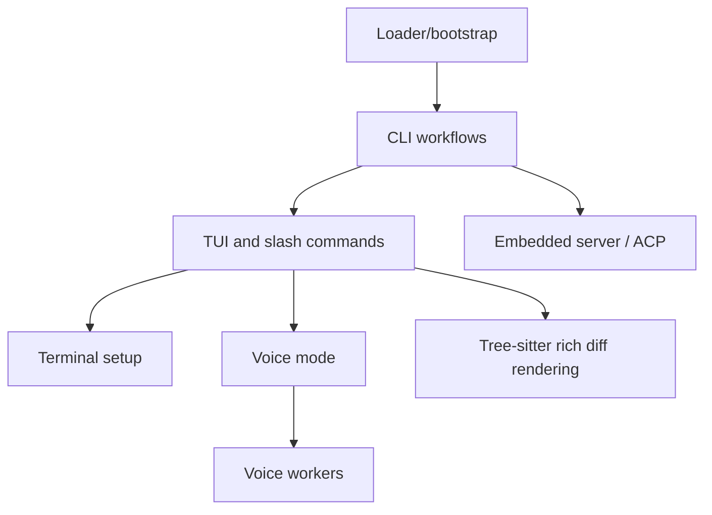

# Runtime and UI

Bootstrap, root command routing, interactive TUI, terminal ergonomics, voice mode, protocol server modes, and rendering support.

## Semantic alias and minified anchor mapping

This is a section index, not a direct `app.js` implementation analysis. Topic pages linked below carry the concrete bundle mappings.

| Semantic alias | Minified anchor | Scope |
|---|---|---|
| Runtime and UI section index | N/A — navigation page | Groups bootstrap, CLI routing, TUI, terminal, voice, server, and rendering docs. |
| Runtime and UI topic pages | See linked page-level mappings | Concrete `app.js` anchors are documented in the child pages. |

## How this section fits

Click a node in the map to jump to that page.

## Pages

| Page | Why read it | File |
|---|---|---|
| [Loader and bootstrap workflows](./loader-bootstrap.md) | SEA/npm loader chain, restart wrapper, secure module loading, and bootstrap safeguards. | `loader-bootstrap.md` |
| [CLI runtime workflows](./cli-runtime-workflows.md) | Root CLI routing, pre-action setup, prompt/headless/server dispatch, and session resolution. | `cli-runtime-workflows.md` |
| [Interactive TUI and slash-command workflows](./tui-and-slash-commands.md) | Interactive TUI event loop, dialogs, slash command macros, and permission surfaces. | `tui-and-slash-commands.md` |
| [Terminal setup and shell environment](./terminal-setup-and-shell-environment.md) | Terminal detection, Shift+Enter setup, shell context, and command-history state. | `terminal-setup-and-shell-environment.md` |
| [Voice mode and Foundry Local](./voice-mode-foundry-local.md) | Foundry Local dictation runtime, voice settings, native audio modules, and model cache checks. | `voice-mode-foundry-local.md` |
| [Voice runtime workers and transcription pipeline](./voice-runtime-workers-and-transcription.md) | Microphone, installer, and Foundry worker state machines; PCM flow; streaming/batch transcription; and cleanup. | `voice-runtime-workers-and-transcription.md` |
| [Embedded server, ACP, and JSON-RPC protocol](./embedded-server-acp-protocol.md) | JSON-RPC/ACP server modes, external tool calls, elicitation, sampling, and commands. | `embedded-server-acp-protocol.md` |
| [Tree-sitter WASM usage in the Copilot CLI](./tree-sitter-wasm-usage.md) | Packaged Tree-sitter grammars, highlight queries, rich diff rendering, and fallback behavior. | `tree-sitter-wasm-usage.md` |

## Reading guidance

- Follow the process lifecycle from bootstrap to TUI/server modes.
- Terminal setup and voice mode are user-facing runtime add-ons.

## Back to wiki home

- [Wiki home](../README.md)
- [Full table of contents](../SUMMARY.md)
