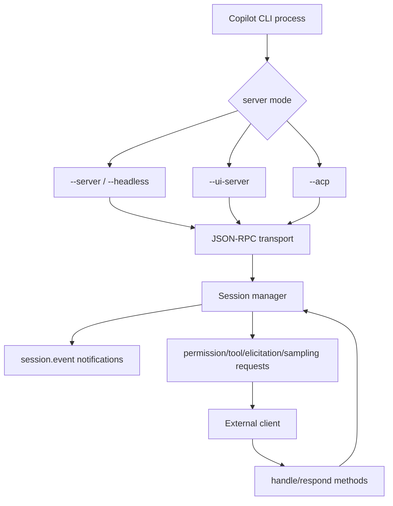
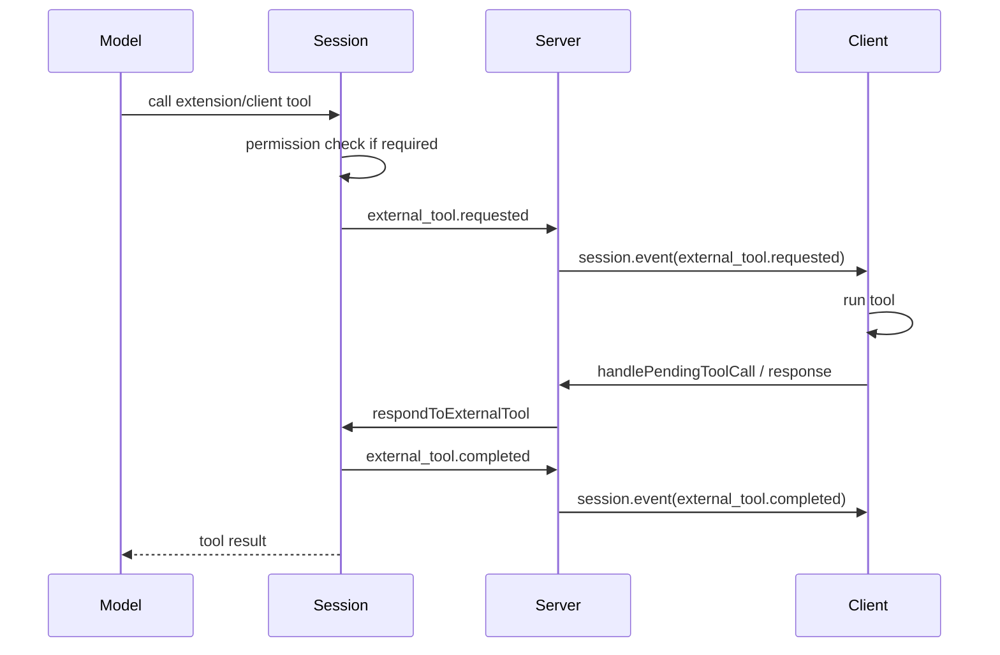

# Embedded server, ACP, and JSON-RPC protocol

This document explains the embedded server and Agent Client Protocol (ACP) surfaces visible in the extracted Copilot CLI `app.js` bundle. These paths let the CLI run headless or with an embedded server, forward session events to external clients, accept client-provided tools/commands/capabilities, and bridge user interactions such as permissions, elicitation, and sampling.

The important implementation point is that the CLI session model is exposed over a structured event/request protocol. The TUI is only one client; external clients can receive `session.event` notifications and respond to pending requests through JSON-RPC/ACP methods.

Because `app.js` is bundled/minified, symbol names are unstable. Line references below are searchable anchors in the extracted `1.0.48` bundle.

## Source anchors

| Area | Anchor strings / minified symbols | Approx. `app.js` line | What it shows |
|---|---|---:|---|
| CLI server flags | `--server`, `--ui-server`, `--headless`, `--acp`, `--stdio`, `--host` | 8225 | Root CLI can run headless JSON-RPC server, embedded UI server, or ACP server. |
| JSON-RPC schemas | `jsonrpc:"2.0"`, `ParseError`, `InvalidRequest`, `MethodNotFound`, `InvalidParams` | 4120, 6105 | Protocol layer validates JSON-RPC messages and maps standard error codes. |
| ACP connection | `ACP connection closed`, `sendRequest`, `sendNotification`, `pendingResponses` | 6105 | Connection class handles request/response correlation and serialized writes. |
| Session events | `SESSION_EVENT:"session.event"`, `SESSION_LIFECYCLE:"session.lifecycle"` | 6066, 6103 | Server forwards session events and lifecycle notifications. |
| External tools | `external_tool.requested`, `external_tool.completed`, `respondToExternalTool` | 4210, 4361, 4396, 4471 | Extension/client tools are requested through events and completed by client responses. |
| Elicitation | `elicitation.requested`, `elicitation.completed`, `respondToElicitation`, `handlePendingElicitation` | 4210, 4361, 4396, 4471 | UI/client can satisfy structured form/URL elicitation requests. |
| Sampling | `sampling.requested`, `sampling.completed`, `respondToSampling` | 4210, 4361, 4471 | MCP sampling requests can be delegated to capable clients. |
| Commands | `command.queued`, `command.execute`, `command.completed`, `respondToQueuedCommand` | 4210, 4361, 4471 | Server protocol can queue and execute slash/SDK commands through clients. |
| Capability changes | `capabilities.changed`, `commands.changed`, `capabilityProviders` | 4361, 4471, 6103 | Connections can add/remove UI capabilities and SDK commands dynamically. |
| Permission bridge | `requestPermission`, `requestPermissionCallback`, `permissionCallbackProviders` | 6103, 6106 | ACP clients can own permission prompts or callbacks. |

## Protocol map

## Server modes

The root command exposes several hidden or specialized server flags:

| Flag | Meaning |
|---|---|
| `--server` | Enable headless JSON-RPC server mode. |
| `--headless` | Alias for `--server`. |
| `--ui-server` | Run the TUI with an embedded JSON-RPC server. |
| `--acp` | Start as an Agent Client Protocol server. |
| `--stdio` | Use stdio transport instead of TCP for server mode. |
| `--host <host>` | Host address to bind server to, defaulting to localhost. |

This means the same bundled runtime can operate as an interactive app, a headless server, an ACP server, or a hybrid TUI-plus-server process.

## JSON-RPC connection behavior

The protocol layer accepts JSON-RPC 2.0 request, notification, result, and error messages. It has explicit schemas for:

- requests with `jsonrpc`, `id`, `method`, and optional `params`;
- notifications with `jsonrpc`, `method`, and optional `params`;
- responses with `jsonrpc`, `id`, and `result`;
- errors with `jsonrpc`, optional `id`, and `error.code/message/data`.

The connection class keeps a `pendingResponses` map so outgoing requests can be resolved/rejected when responses arrive. Writes are serialized through a write queue. On parse errors, it returns standard JSON-RPC error code `-32700`; on connection close, pending requests are rejected.

## Session event forwarding

The server defines notification names including:

| Notification | Purpose |
|---|---|
| `session.event` | Forward an event emitted by a specific session. |
| `session.lifecycle` | Report lifecycle changes such as session updated/created/closed. |
| `shell.output` | Stream shell output. |
| `shell.exit` | Report shell process exit. |

For most session events, the server builds `{ sessionId, event }` and sends it to connected clients. Non-ephemeral events also trigger a lifecycle `session.updated` broadcast.

When a client subscribes to an existing session, the server can replay existing non-ephemeral events so the client can reconstruct state.

## External tool bridge

Client-provided tools use a request/completion event pair:

| Event / method | Role |
|---|---|
| `external_tool.requested` | Session asks a client/extension to run a tool. Includes `requestId`, `sessionId`, `toolCallId`, `toolName`, and arguments. |
| `respondToExternalTool` / pending tool handler | Client returns a result or error for the request. |
| `external_tool.completed` | Session emits completion so UIs can dismiss pending state. |

The session tracks pending external tool requests by ID. It also handles duplicate responses and resume/orphan cases by remembering completed external tool request IDs and tool-call IDs.

## Elicitation bridge

Elicitation lets MCP servers or agent code ask the UI/client for structured user input. The event schema supports:

| Field | Meaning |
|---|---|
| `requestId` | Correlation ID used by `respondToElicitation` / `handlePendingElicitation`. |
| `toolCallId` | Optional tool-call ID for model/tool correlation. |
| `elicitationSource` | Source server or agent. |
| `message` | User-facing prompt. |
| `mode` | Form or URL-style elicitation. |
| `requestedSchema` | JSON schema for form fields. |
| `url` | URL for browser redirect mode. |

When a client provides the `elicitation` capability, the runtime can call it directly. If the capability disappears before a request is resolved, the pending request is canceled and `elicitation.completed` is emitted.

## Sampling bridge

MCP sampling lets an MCP server request model sampling through the host. The bundle exposes:

| Event / method | Role |
|---|---|
| `sampling.requested` | Emitted with `requestId`, `serverName`, `mcpRequestId`, and request payload. |
| `respondToSampling` | Resolves the pending sampling request. |
| `sampling.completed` | Notifies clients to dismiss pending sampling UI. |

The session only wires a sampling handler if it has listeners for `sampling.requested`, which avoids advertising unsupported client behavior.

## Command queue and SDK commands

The embedded protocol supports both queued slash commands and direct command execution:

| Event | Meaning |
|---|---|
| `command.queued` | A slash command should be handled by a client queue. |
| `command.execute` | A registered SDK/client command should execute. |
| `command.completed` | A queued/executed command was resolved. |
| `commands.changed` | Registered command list changed. |

`respondToQueuedCommand` resolves a queued command with `{ handled, stopProcessingQueue? }`. `respondToCommandExecution` resolves direct command execution. The server routes `command.execute` to the connection that owns the command name.

## Capability providers

The server tracks capability providers per session and connection. The clearest capability in the evidence is UI elicitation:

| Mechanism | Behavior |
|---|---|
| `addCapabilityProvider` | Adds a provider and emits `capabilities.changed` when the first provider appears. |
| `removeCapabilityProvider` | Removes a provider and emits `capabilities.changed` when the last provider disappears. |
| `capabilityChangedData("elicitation", true/false)` | Converts capability presence into `{ ui: { elicitation } }`. |

This allows clients to join/leave without restarting the session. The session can dynamically learn whether an external UI is capable of showing structured input forms.

## Permission bridge

ACP maps Copilot permission prompts into protocol requests with options such as:

- allow once;
- always allow;
- deny.

The bridge maps prompt kinds including command, path, URL, and hook prompts. For URL prompts, it delegates to URL permission handling. For path prompts, it delegates to path permission handling. Hook prompts are denied through this ACP mapping path.

The server also tracks `permissionCallbackProviders`, which can mark a session as requiring permission callbacks when at least one provider is connected.

## Event filtering and ownership

Not every event is sent to every connection in the same way:

- tool events can be routed to the extension connection that owns a tool;
- command execution events can be routed to the command owner;
- permission requests may be hidden from extension connections unless that extension is approved for the session;
- streaming event connections can limit which clients receive high-volume streaming events;
- ephemeral events are forwarded but do not trigger the same lifecycle update behavior as durable events.

This prevents a connected extension or client from accidentally receiving unrelated sensitive prompt/tool traffic.

## End-to-end external tool flow

## Relationship to other docs

- `tui-and-slash-commands.md` explains the interactive client that coexists with embedded server mode.
- `session-support-implementation.md` explains session events and server/ACP APIs from the session perspective.
- `built-in-tool-execution-pipeline.md` explains normal tool execution events that the server forwards.
- `mcp-support-implementation.md` explains MCP elicitation, OAuth, sampling, and tools from the MCP host perspective.
- `plugin-extension-architecture.md` explains extension-provided tools and SDK command registration.
