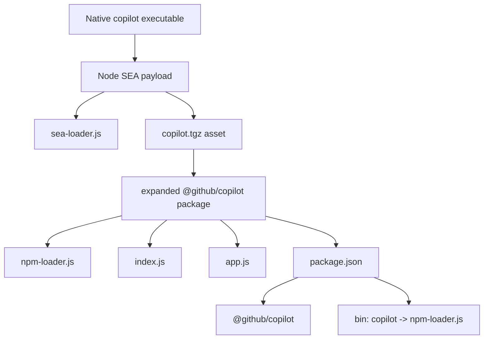
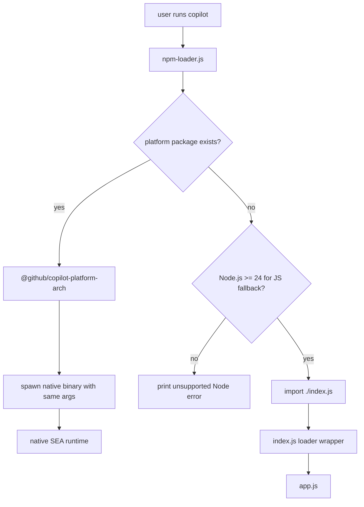
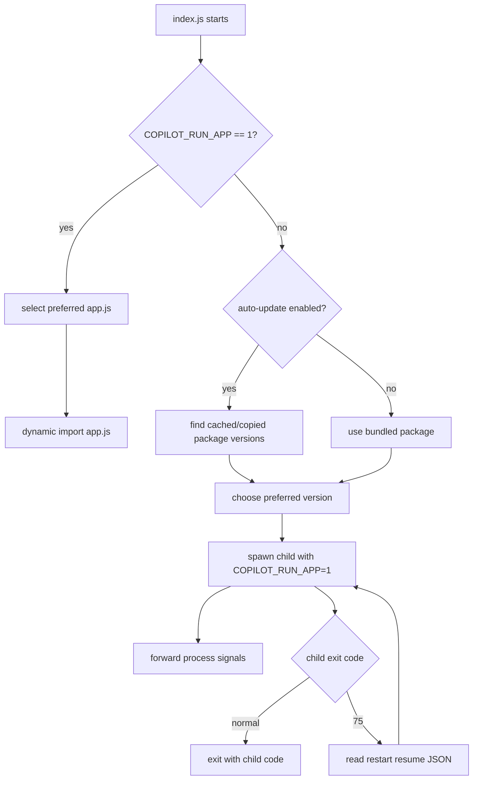
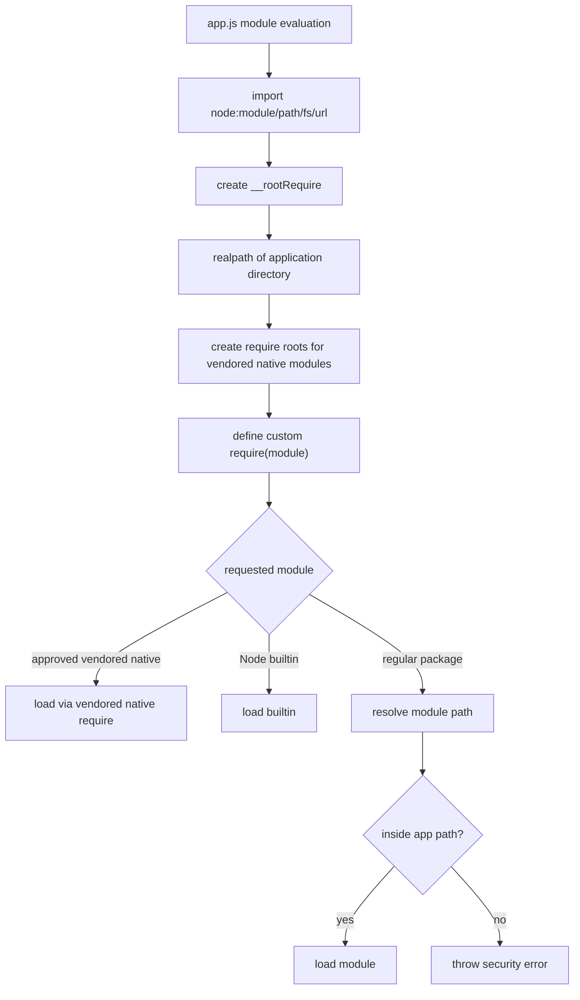
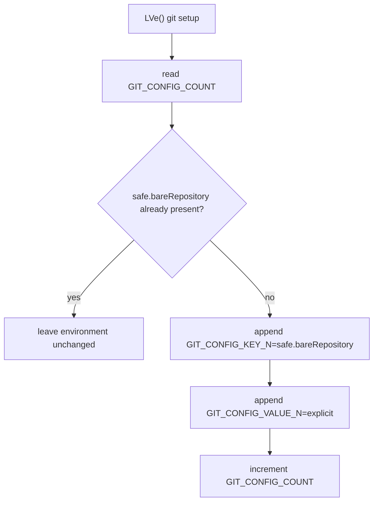
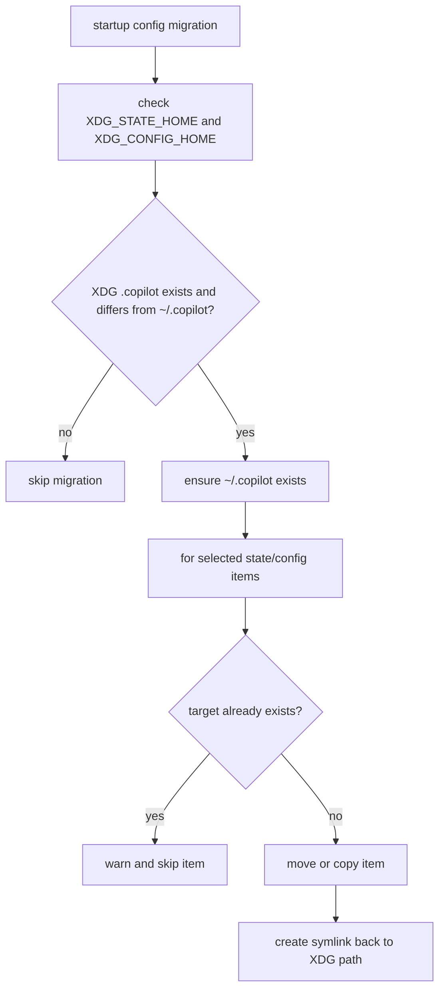

# Loader and bootstrap workflows

This file explains how execution reaches `app.js` and what `app.js` does before entering the main command/runtime flow.

Relevant files:

- `copilot-cli-pkg/npm-loader.js`
- `copilot-cli-pkg/index.js`
- `copilot-cli-pkg/app.js`

The SEA-internal artifacts referenced by the diagrams below (`sea-loader.js` and the embedded `copilot.tgz`) live inside the native `copilot` binary and are not committed to this repository; only the expanded package contents under `copilot-cli-pkg/` are tracked.

## Source anchors

`app.js` is bundled and minified, so the semantic aliases below are documentation names. Loader filenames are stable package anchors, while minified anchors are version-specific lookup aids.

| Semantic alias | Minified anchor | Location | Role |
|---|---|---|---|
| npm launcher | `copilot-cli-pkg/npm-loader.js` | package bin | Selects the native platform package or falls back to the JavaScript loader. |
| JavaScript restart wrapper | `copilot-cli-pkg/index.js`, `COPILOT_RUN_APP`, restart code `75` | package loader | Selects active package version, spawns child runtime, forwards signals, and restarts on update handoff. |
| App bootstrap module | `copilot-cli-pkg/app.js` | bundle entry | Installs restricted module loading, Git safety config, and runtime services before CLI dispatch. |
| Restricted require shim | `createRequire`, app-path containment check | early `app.js` bootstrap | Allows Node built-ins and approved vendored native modules while rejecting resolved paths outside the app directory. |
| Git hardening | `LVe()`, `safe.bareRepository=explicit`, `GIT_CONFIG_COUNT` | early `app.js` bootstrap | Adds environment-backed Git safety configuration. |
| Config migration | `COPILOT_HOME`, XDG `.copilot` migration helpers | early `app.js` bootstrap | Resolves state/config roots and compatibility migration behavior. |

## Distribution layout

The extracted binary is a Node/V8 single executable application (SEA) that carries a loader and a tarball asset. The tarball expands into the `@github/copilot` package.

## npm/native launcher path

When installed as an npm package, the `copilot` bin points at `npm-loader.js`. That loader prefers a platform-native package if available and falls back to the JavaScript loader.

## `index.js` update/restart wrapper

The JavaScript loader wrapper does more than import `app.js`. It chooses the active package version, supports auto-update cache locations, spawns a child process with `COPILOT_RUN_APP=1`, forwards signals, and handles restart exit code `75`.

## Early `app.js` bootstrap

The beginning of `app.js` sets up ESM/CommonJS compatibility and a restricted `require` shim. It allows built-in Node modules and selected vendored native modules, but rejects resolved module paths outside the application directory.

Approved vendored-native module families observed in the bootstrap section include:

- `sharp`
- `clipboard`
- `foundry-local-sdk`
- `@picovoice/pvrecorder-node`
- scoped native dependencies such as `@img/*` and `@teddyzhu/*`

## Git safety hardening

Early in startup, `app.js` adds `safe.bareRepository=explicit` to Git's environment-backed config list. This constrains how Git treats bare repositories during CLI operations.

## Config and state directory migration

The runtime recognizes `COPILOT_HOME` and XDG locations. The observed XDG migration helper moves selected state/config files from XDG-based `.copilot` locations back to the default home location when appropriate, then creates compatibility symlinks.

## Bootstrap summary

Before the user-facing CLI logic runs, `app.js` has already:

- constrained dynamic module loading;
- installed Git safety config in environment variables;
- checked Node compatibility;
- prepared config/state directory behavior;
- defined shutdown/error/logging infrastructure used later by the top-level action.
