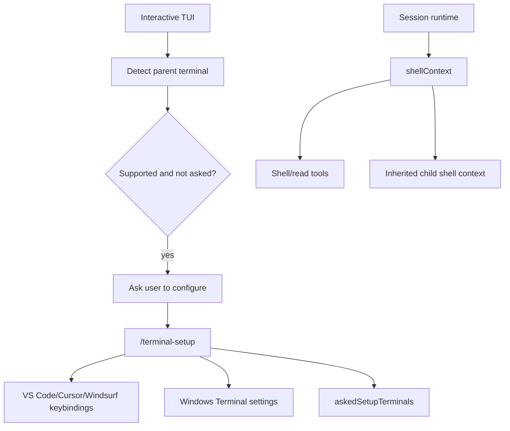
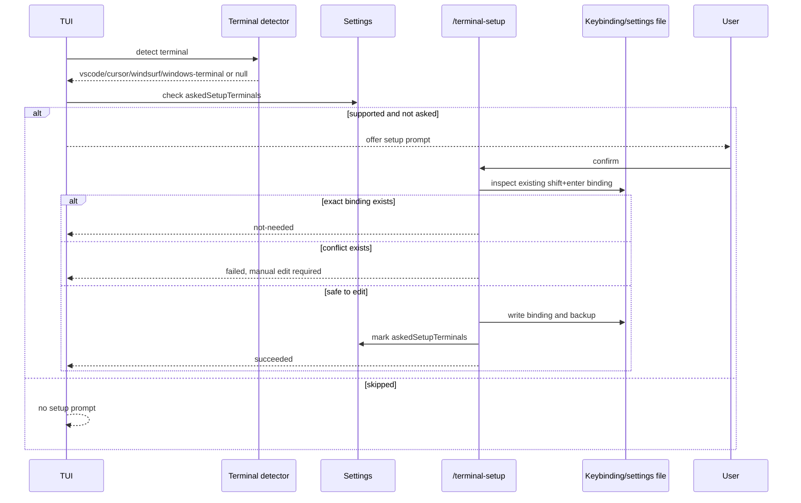

# Terminal setup and shell environment

This document explains how terminal setup and shell-environment handling are implemented in the extracted Copilot CLI `app.js` bundle. The user-visible part is `/terminal-setup`, but the implementation also includes automatic setup prompts, terminal detection, persisted “already asked” state, Shift+Enter keybinding edits, shell-context inheritance, and command-history state.

The important implementation point is that terminal setup is narrowly scoped: it configures multiline input support for known terminals. It is adjacent to, but separate from, the shell execution context used by tools and subagents.

Because `app.js` is bundled/minified, symbol names are unstable. Line references below are searchable anchors in the extracted bundle and will shift across releases.

## Source anchors

| Semantic alias | Minified anchor | Approx. `app.js` line | Role |
|---|---|---:|---|
| Slash command | `/terminal-setup` | 4512, 4643, 7351 | User-facing command and TUI prompt callback. |
| Opt-out env var | `COPILOT_SETUP_TERMINAL` | 4512 | Setting this to `false` suppresses automatic setup prompting. |
| Prompt persistence | `askedSetupTerminals` | 236, 4512 | The CLI records terminals for which it has already shown setup prompt. |
| Supported terminals | `VS Code`, `Cursor`, `Windsurf`, `Windows Terminal` | 4512 | The command only supports known editor terminals and Windows Terminal. |
| Keybinding target | `shift+enter`, `workbench.action.terminal.sendSequence`, `\x1B\r` | 4495, 4501 | Setup installs a Shift+Enter binding that sends the terminal multiline escape sequence. |
| Windows Terminal target | `sendInput`, `settings.json`, `WindowsTerminal_8wekyb3d8bbwe` | 4501, 4512 | Windows Terminal setup edits profile/keybinding settings JSON. |
| Shell context | `shellContext`, `inheritedShellContext`, `parentShellContext` | 4471, 4475, 4481 | Session and subagent shell processes are tracked separately from terminal keybinding setup. |
| Shell logging | `logInteractiveShells` | 4471 | Runtime option controlling shell process logging behavior. |
| Command history state | `command-history-state`, `command-history-state.json` | 7449 | Command history is a persisted state artifact under `.copilot`. |

## Capability map

## What `/terminal-setup` does

The command checks whether multiline terminal input already works. If so, it returns:

> Your terminal already has multiline support with **shift+enter**.

If setup is needed, it detects the terminal and then writes the appropriate keybinding entry for that host. Unsupported terminals produce a message saying `/terminal-setup` is supported only in VS Code, Cursor, Windsurf, and Windows Terminal.

The keybinding sends `\x1B\r`, which is represented in the bundle as the text sequence used for multiline terminal input.

## Automatic setup prompt

The bundle also has an automatic prompt path. During interactive startup, the CLI can detect a supported terminal and ask whether to run setup. The auto-prompt is skipped when:

- multiline support is already detected;
- `COPILOT_SETUP_TERMINAL=false` is set;
- the parent terminal cannot be recognized;
- the terminal is unsupported;
- the terminal appears in persisted `askedSetupTerminals`.

When the user declines, the TUI tells them they can run `/terminal-setup` later. The CLI records the terminal in `askedSetupTerminals` to avoid prompting repeatedly.

## Terminal detection

Detection uses environment hints and parent-process inspection. The bundle checks values such as:

| Signal | Inferred terminal |
|---|---|
| `CURSOR_TRACE_ID` or askpass path containing `cursor` | Cursor |
| askpass path containing `windsurf` | Windsurf |
| process name containing `code` | VS Code or VS Code Insiders |
| Windows Terminal settings path | Windows Terminal |

The supported editor terminal map is:

| Internal key | Application name | Display terminal name |
|---|---|---|
| `vscode` | `Code` | `VS Code` |
| `vscode-insiders` | `Code - Insiders` | `VS Code (Insiders)` |
| `cursor` | `Cursor` | `Cursor` |
| `windsurf` | `Windsurf` | `Windsurf` |

## Editor keybinding setup

For VS Code-family terminals, setup edits the editor keybindings file. The intended binding is:

| Field | Value |
|---|---|
| key | `shift+enter` |
| command | `workbench.action.terminal.sendSequence` |
| when | `terminalFocus` |
| args text | `\x1B\r` |

The implementation is cautious:

- if the exact binding already exists, it reports `not-needed`;
- if another `shift+enter` binding exists, it refuses to overwrite it and asks the user to modify/delete it manually;
- if it edits the file, it creates a backup of previous keybindings when possible;
- JSON edits try to preserve formatting where the parser can understand the original file.

## Windows Terminal setup

Windows Terminal setup looks for settings files under locations such as:

- `%LOCALAPPDATA%/Packages/Microsoft.WindowsTerminal_8wekyb3d8bbwe/LocalState/settings.json`;
- `%LOCALAPPDATA%/Microsoft/Windows Terminal/settings.json`;
- the Preview package path.

It checks whether an action with `keys: shift+enter` already sends the expected input. As with editor keybindings, an existing conflicting binding is not overwritten automatically.

## Persisted “already asked” state

The general settings schema includes `askedSetupTerminals`. The setup prompt appends a terminal key to this list and writes it via the settings helper.

This state prevents the CLI from becoming the world’s politest-but-most-annoying setup wizard: one prompt per terminal kind is enough.

## Relationship to shell execution

Terminal setup changes keyboard behavior in the user’s terminal. It does not create the shell execution environment used by tools.

The session class has separate shell-related state:

| Field / method | Meaning |
|---|---|
| `shellContext` | Tracks shell processes associated with a session. |
| `getSessionShellContext()` | Returns the current session shell context. |
| `parentShellContext` | Allows child/subagent sessions to inherit shell context. |
| `inheritedShellContext` | Prevents inherited shell contexts from being shut down by the child. |
| `shellInitProfile` / `shellProcessFlags` | Runtime shell configuration inputs that invalidate resolved shell config when changed. |
| `logInteractiveShells` | Controls shell logging behavior. |

When subagents are created, the parent shell context can be passed down. On disposal, a session only shuts down shell processes if it owns the context rather than inheriting it.

## Command history and `.copilot` state

The loader/migration area lists `.copilot` state artifacts including:

- `session-state`;
- `session-store.db`;
- `command-history-state`;
- `command-history-state.json`;
- `installed-plugins`.

This indicates command history is persisted as part of the same per-user Copilot state area as sessions and plugins. It is independent of `/terminal-setup`, but both affect interactive terminal ergonomics.

## End-to-end setup flow

## Relationship to other docs

- `tui-and-slash-commands.md` explains how the setup prompt and slash command are rendered.
- `settings-config-persistence.md` explains how `askedSetupTerminals` is stored.
- `built-in-tool-execution-pipeline.md` explains shell tools and command execution events.
- `sandboxing.md` explains shell execution under sandbox policies.
- `agent-task-orchestration.md` explains how shell context can be inherited by subagents.
