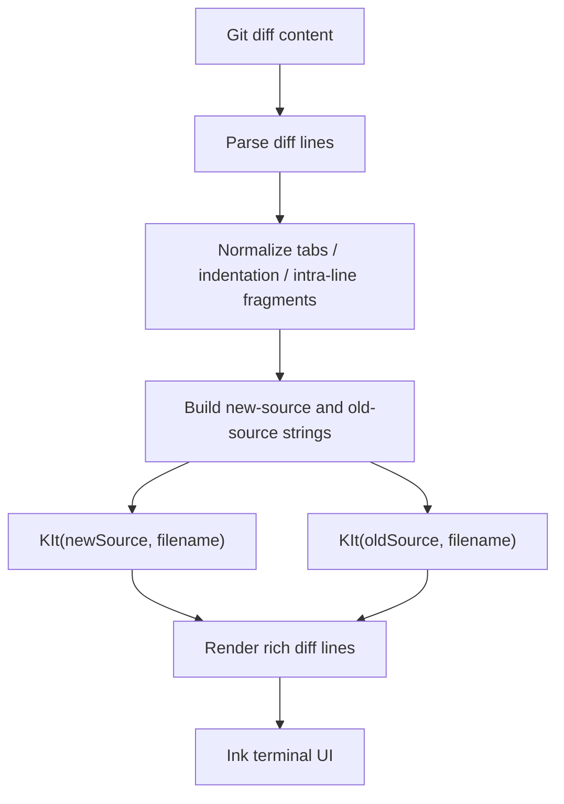

# Tree-sitter WASM usage in the Copilot CLI

This document explains how the packaged `tree-sitter-*.wasm` files are used by the extracted Copilot CLI bundle. The short version: in the analyzed `app.js`, Tree-sitter is used as a local syntax-highlighting engine for rich terminal diff rendering. It is not the primary code-understanding engine for model context, not an LSP server, and not a code execution mechanism.

## Source anchors

`app.js` is bundled and minified, so the symbol names below are semantic aliases for navigation rather than stable API names.

| Area | Semantic alias | Minified anchor / string | Approx. offset | Role |
|---|---|---:|---:|---|
| Tree-sitter binding | `Parser` / `Language` runtime | `lRr`, `aRr`, `tree-sitter.wasm` | `10.65M` | Emscripten-generated Tree-sitter runtime wrapper. |
| Language registry | `SUPPORTED_LANGUAGES` | `b_a` | `10.70M` | Maps file extensions to grammar wasm files and highlight query files. |
| Parser initialization | `ensureTreeSitterInitialized()` | `C_a()` | `10.71M` | Calls `Parser.init()` once and disables highlighting if initialization fails. |
| Grammar loader | `loadLanguage(...)` | `v_a(...)`, `Language.load(...)` | `10.71M` | Loads and caches a language grammar wasm. |
| Query loader | `loadHighlightQuery(...)` | `x_a(...)` | `10.71M` | Reads and caches `queries/*-highlights.scm` files. |
| Highlight entry point | `highlightSource(...)` | `KIt(source, filename)` | `10.71M` | Returns per-line syntax spans for a filename/source pair. |
| Diff consumer | `RichDiffBox` | `ABo(...)`, calls `KIt(...)` twice | `10.72M` | Applies syntax spans to old/new sides of a terminal diff. |
| Rich diff disable flag | `--plain-diff`, `PLAIN_DIFF` | `--plain-diff`, `process.env.PLAIN_DIFF="true"` | `11.82M` | User-facing path to disable rich diff rendering. |

## Packaged resources

The package contains one Tree-sitter runtime wasm plus grammar wasm files at the package root:

| Resource | Purpose |
|---|---|
| `tree-sitter.wasm` | Core Tree-sitter parser/query runtime loaded by `Parser.init()`. |
| `tree-sitter-<language>.wasm` | Language grammar modules loaded on demand by `Language.load(...)`. |
| `queries/*-highlights.scm` | Tree-sitter highlight queries used to capture syntax nodes and assign semantic capture names. |

Inventory observed in the package:

| WASM file | Referenced by rich diff language registry? | Notes |
|---|---:|---|
| `tree-sitter.wasm` | yes | Core runtime, not a language grammar. |
| `tree-sitter-bash.wasm` | yes | Used for `sh`, `bash`, `zsh`. |
| `tree-sitter-c.wasm` | yes | Used for `c`, `h`. |
| `tree-sitter-c_sharp.wasm` | yes | Used for `cs`. |
| `tree-sitter-cpp.wasm` | yes | Used for C++ extensions. |
| `tree-sitter-css.wasm` | yes | Used for `css`. |
| `tree-sitter-go.wasm` | yes | Used for `go`. |
| `tree-sitter-html.wasm` | yes | Used for `html`, `htm`. |
| `tree-sitter-java.wasm` | yes | Used for `java`. |
| `tree-sitter-javascript.wasm` | yes | Used for JavaScript extensions. |
| `tree-sitter-json.wasm` | yes | Used for `json`, `jsonc`. |
| `tree-sitter-php.wasm` | yes | Used for `php`. |
| `tree-sitter-python.wasm` | yes | Used for `py`, `pyi`, `pyw`. |
| `tree-sitter-ruby.wasm` | yes | Used for `rb`, `rake`, `gemspec`. |
| `tree-sitter-rust.wasm` | yes | Used for `rs`. |
| `tree-sitter-scala.wasm` | yes | Used for `scala`, `sc`. |
| `tree-sitter-tsx.wasm` | yes | Used for `tsx`. |
| `tree-sitter-typescript.wasm` | yes | Used for `ts`, `mts`, `cts`. |
| `tree-sitter-powershell.wasm` | no direct `app.js` reference found | Packaged asset, but not present in the rich diff language registry in this build. |

## Supported language mapping

The rich diff path uses a static language registry. Language selection is based on the displayed filename extension.

| Language entry | Extensions | Grammar wasm | Highlight queries |
|---|---|---|---|
| `typescript` | `ts`, `mts`, `cts` | `tree-sitter-typescript.wasm` | `javascript-highlights.scm`, `typescript-highlights.scm` |
| `tsx` | `tsx` | `tree-sitter-tsx.wasm` | `javascript-highlights.scm`, `typescript-highlights.scm` |
| `javascript` | `js`, `jsx`, `mjs`, `cjs` | `tree-sitter-javascript.wasm` | `javascript-highlights.scm` |
| `python` | `py`, `pyi`, `pyw` | `tree-sitter-python.wasm` | `python-highlights.scm` |
| `go` | `go` | `tree-sitter-go.wasm` | `go-highlights.scm` |
| `rust` | `rs` | `tree-sitter-rust.wasm` | `rust-highlights.scm` |
| `ruby` | `rb`, `rake`, `gemspec` | `tree-sitter-ruby.wasm` | `ruby-highlights.scm` |
| `java` | `java` | `tree-sitter-java.wasm` | `java-highlights.scm` |
| `c` | `c`, `h` | `tree-sitter-c.wasm` | `c-highlights.scm` |
| `cpp` | `cpp`, `cc`, `cxx`, `hpp`, `hxx`, `h++` | `tree-sitter-cpp.wasm` | `c-highlights.scm`, `cpp-highlights.scm` |
| `csharp` | `cs` | `tree-sitter-c_sharp.wasm` | `csharp-highlights.scm` |
| `bash` | `sh`, `bash`, `zsh` | `tree-sitter-bash.wasm` | `bash-highlights.scm` |
| `json` | `json`, `jsonc` | `tree-sitter-json.wasm` | `json-highlights.scm` |
| `html` | `html`, `htm` | `tree-sitter-html.wasm` | `html-highlights.scm` |
| `css` | `css` | `tree-sitter-css.wasm` | `css-highlights.scm` |
| `php` | `php` | `tree-sitter-php.wasm` | `php-highlights.scm` |
| `scala` | `scala`, `sc` | `tree-sitter-scala.wasm` | `scala-highlights.scm` |

## Runtime flow



The renderer does not parse unified diff syntax with Tree-sitter directly. Instead, it first reconstructs two source-like buffers from the diff:

- the **new** side excludes deleted lines;
- the **old** side excludes added lines.

Tree-sitter then highlights those source buffers using the filename extension. The resulting per-line spans are mapped back to diff line indices before rendering.

## Highlighting pipeline

The main highlighter entry point is equivalent to:

```text
highlightSource(source, filename) -> SyntaxSpan[][]
```

Where each returned span has roughly:

| Field | Meaning |
|---|---|
| `startCol` | Start column in the rendered line. |
| `endCol` | End column in the rendered line. |
| `colorName` | Theme token such as `syntaxKeyword`, `syntaxString`, or `syntaxFunction`. |

The pipeline is:

1. **Guard checks**
   - Empty source returns no spans.
   - Source longer than `100,000` characters returns no spans.
   - Unsupported filename extension returns no spans.
   - If `Parser.init()` has previously failed, highlighting remains disabled.

2. **Initialize Tree-sitter**
   - `Parser.init()` loads `tree-sitter.wasm` once.
   - Initialization failure is logged as `Tree-sitter Parser.init() failed for syntax highlighting` and disables future highlighting attempts.

3. **Load language grammar**
   - The file extension selects a language registry entry.
   - `Language.load(...)` reads the corresponding `tree-sitter-<language>.wasm` grammar.
   - In the packaged CLI path, grammar files are loaded from `import.meta.dirname`.
   - Loaded grammars are cached by language name.

4. **Load highlight queries**
   - The registry specifies one or more `queries/*-highlights.scm` files.
   - Query files are read from the packaged `queries/` directory.
   - Query text is concatenated and compiled through `language.query(...)`.
   - Compiled queries are cached by language name.

5. **Parse and query source**
   - A new parser is created for the request.
   - The selected language is set on the parser.
   - The source string is parsed into a syntax tree.
   - The highlight query runs against `tree.rootNode` and returns captures.

6. **Map captures to terminal theme tokens**
   - Capture names such as `@keyword`, `@function.call`, `@string`, or `@comment` are mapped to CLI theme keys.
   - More specific captures fall back to parent scopes; for example, `function.method.call` can fall back to `function.method` or `function`.
   - Multi-line captures are split into per-line spans.
   - Overlapping spans are normalized so rendering receives non-overlapping column ranges.

## Query preprocessing

Before compiling highlight queries, the CLI removes some predicates that are present in upstream query files but are not implemented by the bundled Tree-sitter query runtime. The stripped predicate families include:

- `lua-match?`
- `not-lua-match?`
- `vim-match?`
- `gsub!`
- `set!`
- `has-ancestor?`
- `not-has-ancestor?`
- `has-parent?`
- `not-has-parent?`
- `contains?`

This is a pragmatic compatibility step: the CLI keeps the query files close to upstream grammar packages while avoiding runtime query-compilation failures for unsupported predicates.

## Color mapping

Tree-sitter captures are not rendered directly. They are translated into a small terminal theme vocabulary:

| Capture family | CLI theme token |
|---|---|
| `keyword`, `conditional`, `repeat`, `include`, `exception`, `preproc`, `define`, `storageclass` | `syntaxKeyword` |
| `string`, `character` | `syntaxString` |
| `comment` | `syntaxComment` |
| `function`, `method`, `constructor` | `syntaxFunction` |
| `type`, `namespace`, `module` | `syntaxType` |
| `variable`, `parameter`, `property`, `field`, `label` | `syntaxVariable` |
| `number`, `float` | `syntaxNumber` |
| `operator` | `syntaxOperator` |
| `punctuation`, `delimiter` | `syntaxPunctuation` |
| `constant`, `boolean`, string escapes | `syntaxConstant` |
| `tag` | `syntaxTag` |
| `attribute`, `decorator`, `annotation` | `syntaxAttribute` |

The terminal theme then maps these tokens to colors. For example, the default theme uses colors like magenta for keywords, green for strings, black-bright for comments, blue for functions, cyan for types, yellow for numbers/constants, red for tags, and so on.

## Where the spans are rendered

The rich diff renderer applies spans while rendering diff lines in the Ink-based terminal UI:

- Plain line content is wrapped in text components.
- Highlighted ranges are split into child text segments with `color={theme[colorName]}`.
- Intra-line diff fragments keep addition/deletion background colors while syntax colors apply to foreground text.
- If there are no spans, the renderer falls back to normal diff coloring only.

This means Tree-sitter affects how changed code is displayed to the user, not what tools execute or what the model receives.

## Disable and fallback behavior

Tree-sitter highlighting is intentionally best-effort.

| Condition | Result |
|---|---|
| `--plain-diff` flag | Sets `PLAIN_DIFF=true`, disabling rich diff rendering. |
| `PLAIN_DIFF=true` environment variable | Disables rich diff rendering. |
| `NO_COLOR` environment variable | Disables color output; syntax highlighting is not attempted for the rich diff view. |
| Non-TTY output | Syntax highlighting is not attempted for the rich diff view. |
| `NODE_ENV=test` | Syntax highlighting is not attempted. |
| Unsupported extension | Returns no syntax spans. |
| Source over `100,000` characters | Returns no syntax spans. |
| Parser/runtime init failure | Logs a warning and disables future highlighting attempts. |
| Grammar/query load failure | Logs a warning and falls back to plain diff coloring. |
| Diff file over roughly `5 MiB` | Rich diff box reports the diff is too large to display. |

The CLI is careful to fail closed for UI decoration: if Tree-sitter cannot run, the diff still renders without syntax colors.

## What Tree-sitter is not used for here

Based on the inspected `app.js` paths, the packaged Tree-sitter wasm files are not the central mechanism for:

- semantic repository indexing;
- model context extraction;
- code navigation or symbol search;
- applying edits;
- permission decisions;
- sandboxing;
- MCP/tool execution;
- exported HTML transcript highlighting.

The HTML transcript/export path visible elsewhere in `app.js` contains a separate lightweight JavaScript regex highlighter. That is independent from the Tree-sitter rich terminal diff path.

## Takeaways

- `tree-sitter.wasm` is the core parser/query runtime.
- `tree-sitter-*.wasm` files are grammar modules loaded lazily by file extension.
- `queries/*-highlights.scm` files tell Tree-sitter which syntax nodes to capture.
- Captures are converted into a small CLI theme-token set and rendered in the terminal diff UI.
- The feature is cached, best-effort, size-limited, and disabled by `--plain-diff`, `PLAIN_DIFF=true`, `NO_COLOR`, non-TTY output, or init/load failures.
- `tree-sitter-powershell.wasm` is packaged in this build, but no direct rich-diff registry reference to it was found in `app.js`.