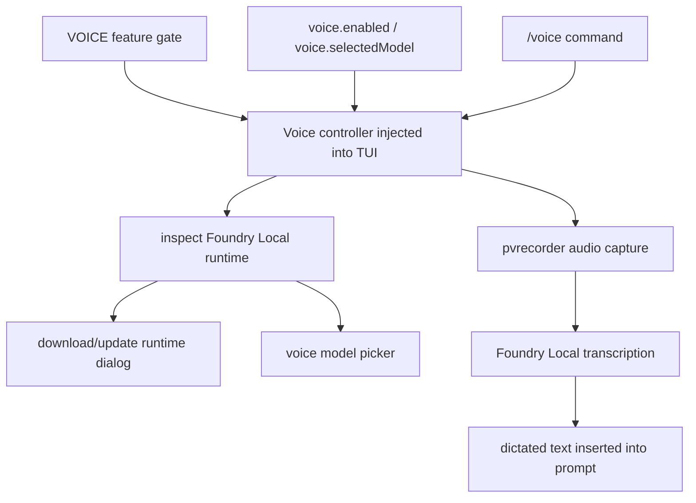
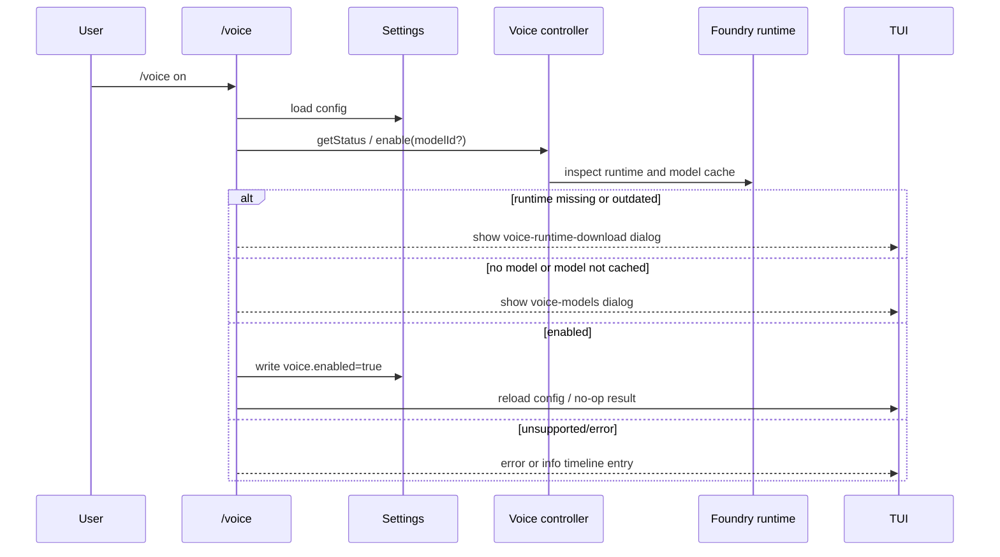

# Voice mode and Foundry Local

This document explains the voice-mode implementation visible in the extracted Copilot CLI `app.js` bundle. In the analyzed bundle, voice mode is a staff-gated interactive feature that records short dictation input, transcribes it locally through Microsoft Foundry Local runtime components, and feeds the resulting text back into the CLI input loop.

For the lower-level worker state machines that capture microphone PCM, install the Foundry runtime, load speech models, and produce streaming/batch transcription results, see [`voice-runtime-workers-and-transcription.md`](./voice-runtime-workers-and-transcription.md).

The important implementation point is that voice mode is not just a UI toggle. It combines:

- the `/voice` slash command;
- the `VOICE` feature gate;
- persisted `voice.enabled` and `voice.selectedModel` settings;
- bundled native-module routing for `foundry-local-sdk` and `@picovoice/pvrecorder-node`;
- runtime inspection/download/update dialogs;
- model selection and cache checks;
- TUI keybindings for recording and dictation.

Because `app.js` is bundled/minified, symbol names are unstable. Line references below are searchable anchors in the extracted bundle and will shift across releases.

## Source anchors

| Semantic alias | Minified anchor | Approx. `app.js` line | Role |
|---|---|---:|---|
| Slash command | `/voice`, `Manage voice mode (dictation transcription via Foundry Local)` | 4643, 4916 | `/voice [on\|off\|models]` is the user-facing management command. |
| Feature gate | `VOICE:"staff"`, `voiceEnabled:e.VOICE` | 239, 7344 | Voice is gated as staff-only in the analyzed configuration. |
| Runtime settings | `voice:{enabled, selectedModel}` | 239 | Voice state is persisted in regular CLI settings. |
| Session injection | `voice:e.VOICE?{getStatus, getSelectedModelId, inspectRuntime, enable, disable}` | 7346 | The TUI/session receives a voice controller only when the gate is enabled. |
| Foundry runtime | `foundry-local-sdk`, `deps_versions.json`, `Microsoft.AI.Foundry.Local.Core`, `onnxruntime` | 13, 29, 6865 | The bundle vendors/loads Foundry Local runtime dependencies and audits expected package versions. |
| Audio capture | `@picovoice/pvrecorder-node`, `pvrecorder` | 14, 29, 41 | Audio recording is routed through a vendored Picovoice recorder module. |
| Runtime states | `runtime-missing`, `runtime-outdated`, `runtime-unsupported`, `model-not-cached` | 4916, 6865 | Enablement is blocked or redirected to dialogs depending on runtime/model state. |
| Dialogs | `voice-runtime-download`, `voice-models` | 4916, 6617 | The TUI can ask the user to download/update runtime components or pick a model. |
| Ready prompt | `Voice ready. Hold \`space\` to record, or \`ctrl+x v\` to toggle dictation.` | 6865 | When ready, voice mode becomes an input affordance in the interactive UI. |

## Capability map

## Feature gate and command availability

The static feature table includes `VOICE:"staff"`. The slash-command list is then filtered by feature flags and staff state before being exposed to the TUI. Around the interactive setup area, the bundle constructs built-in slash commands with a `voiceEnabled:e.VOICE` option and removes staff-only commands for non-staff users.

The `/voice` command itself is marked `staffOnly: true` in the analyzed bundle. That means the command implementation can exist in the binary even when it is not visible to most users.

## `/voice` command behavior

The command accepts these subcommands:

| Command | Behavior |
|---|---|
| `/voice` | Runs the default enable/setup path. |
| `/voice on` | Enables voice mode. |
| `/voice off` | Disables voice mode and persists `voice.enabled:false`. |
| `/voice models` | Opens runtime/model inspection and model picker flow. |

If an unknown subcommand is passed, the command returns an error with the usage string `/voice [on|off|models]`.

The command first checks whether `t.voice` exists. If the session was not configured with a voice controller, it returns `Voice mode is not configured for this client.` This is the runtime guard after feature-gate filtering.

## Runtime inspection and download/update flow

The `/voice models` branch calls `inspectRuntime()` and branches on the result:

| Runtime result | User-visible behavior |
|---|---|
| `unsupported-platform` | Show `Voice mode is not supported on this platform.` |
| runtime currently installing | Show that the runtime is still downloading. |
| `not-downloaded` | Open `voice-runtime-download` in first-use mode. |
| `update-available` | Open `voice-runtime-download` in update mode. |
| downloaded/ready | Open `voice-models` picker. |

The normal enable path calls `enable({ modelId })` when a selected model is available. The result can be:

| Enable result | Behavior |
|---|---|
| `enabled` | Persist `voice.enabled:true`, reload config, and continue. |
| `no-model-selected` | Open the voice model picker. |
| `model-not-cached` | Open the voice model picker so the user can cache/select a model. |
| `runtime-missing` | Open runtime download dialog for first use. |
| `runtime-outdated` | Open runtime update dialog. |
| `runtime-unsupported` | Return unsupported-platform message. |
| `error` | Return an error timeline entry. |

## Settings persistence

The settings schema contains:

| Setting | Meaning |
|---|---|
| `voice.enabled` | Whether voice mode should be active on startup. |
| `voice.selectedModel` | The selected Foundry Local transcription model ID. |

The command loads settings through the same settings helper used elsewhere in the CLI, updates the `voice` object, writes it, and then calls `reloadConfig()` so the interactive runtime sees the new value.

When a selected model is deleted or unavailable, the voice controller clears `selectedModel`, disables voice, and emits an informational message that voice mode was disabled because the selected model was deleted.

## Native module routing

At the top of `app.js`, the SEA/bootstrap wrapper builds special `createRequire` entry points for bundled native modules:

| Vendored module | Purpose |
|---|---|
| `foundry-local-sdk` | Foundry Local runtime/client and installer metadata. |
| `@picovoice/pvrecorder-node` | Microphone/audio recording support. |

The custom `require` wrapper treats these modules as vendored native modules and resolves them from package-local directories such as `foundry-local-sdk/index.js` and `pvrecorder/index.js`.

This is important because the binary cannot rely on normal Node resolution for native modules embedded beside the SEA payload. The loader explicitly allows these package-local native modules while continuing to reject unexpected module paths outside the application root.

## Foundry runtime version audit

The bundle loads `foundry-local-sdk/deps_versions.json` and validates expected keys:

- `foundry-local-core.nuget`;
- `onnxruntime.version`;
- `onnxruntime-genai.version`.

If the JSON shape changes, the error text references an audit checklist in the source tree. This suggests the CLI pins assumptions about Foundry Local installer package names and versions, then maps platform-specific packages such as Linux GPU or Foundry ONNX Runtime packages.

## Platform support

The runtime platform map includes entries such as:

| Platform key | Runtime target |
|---|---|
| `win32-x64` | `win-x64` |
| `win32-arm64` | `win-arm64` |
| `linux-x64` | `linux-x64` |
| `darwin-arm64` | `osx-arm64` |

Unsupported platforms return `runtime-unsupported` / `unsupported-platform`, which is surfaced by `/voice` rather than falling through to a generic failure.

## TUI integration

When enabled and ready, the TUI displays:

> Voice ready. Hold `space` to record, or `ctrl+x v` to toggle dictation.

The implementation distinguishes readiness/warming state from runtime installation state. On startup, if settings say voice is enabled and a selected model exists, the voice hook calls `enable({ modelId })`. If the runtime is missing or outdated, it emits a warning telling the user to run `/voice`.

This makes persisted voice state optimistic but safe: the setting can survive restarts, while actual recording is blocked until runtime and model checks pass.

## Relationship to custom providers named Foundry Local

The help text elsewhere in the bundle also mentions “Foundry Local” as an OpenAI-compatible custom provider example for `COPILOT_PROVIDER_BASE_URL`. That is a separate model-provider path.

Voice mode uses Foundry Local for local dictation transcription through `foundry-local-sdk`; BYOK/custom provider mode uses OpenAI-compatible HTTP endpoints for LLM calls. They share a brand name but are different subsystems in `app.js`.

## End-to-end enable flow

## Relationship to other docs

- `voice-runtime-workers-and-transcription.md` explains the mic, installer, and Foundry worker internals beneath this user-facing voice flow.
- `tui-and-slash-commands.md` explains how slash commands and dialogs are surfaced.
- `settings-config-persistence.md` explains the settings load/write/reload path.
- `feature-gates.md` explains static feature tiers such as `VOICE:"staff"`.
- `loader-bootstrap.md` explains the secure module-loading wrapper used by vendored native modules.
- `models-providers-auth.md` explains the separate BYOK/custom-provider Foundry Local mention.
