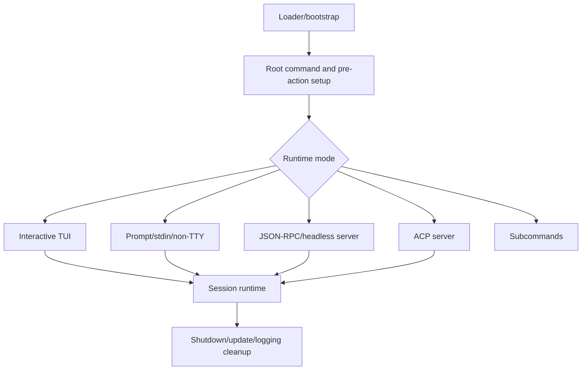

# Runtime lifecycle

This chapter follows the bundle from process start to cleanup. It is the right entry point for questions about package loading, root command routing, TUI/prompt/server modes, terminal integration, voice/runtime workers, protocol servers, rendering support, update behavior, and shutdown.

The runtime lifecycle is the outer harness around the model loop: it decides **which mode runs**, prepares shared services, connects to sessions/tools, and guarantees cleanup when execution ends.

## Source-anchor policy

This page is a chapter guide. The linked implementation pages carry concrete `app.js` anchors.

| Semantic alias | Minified anchor | Scope |
|---|---|---|
| Runtime lifecycle chapter | N/A — navigation page | Groups startup, command routing, mode dispatch, terminal/protocol support, voice workers, rendering, and cleanup. |
| Runtime implementation pages | See linked source-anchor tables | Concrete bundle anchors live in the destination pages. |

## Runtime flow

## Primary reading order

| Order | Page | Runtime question answered |
|---:|---|---|
| 1 | [Loader and bootstrap workflows](loader-bootstrap.md) | How does the SEA/npm package select and load the actual runtime bundle? |
| 2 | [Mode dispatch and runtime startup](mode-dispatch-and-runtime-startup.md) | How do argv, stdin, TTY, settings, auth, and sessions choose the execution mode? |
| 3 | [Interactive TUI and slash-command workflows](tui-and-slash-commands.md) | How does the terminal UI handle input, rendering, slash commands, dialogs, and permissions? |
| 4 | [Embedded server, ACP, and JSON-RPC protocol](embedded-server-acp-protocol.md) | How does the CLI expose runtime/session capabilities to external hosts? |
| 5 | [Telemetry, update, and shutdown](../05-hosted-agent-ops/telemetry-update-and-shutdown.md) | How are logs, telemetry, update/version behavior, signals, disposables, and graceful exit coordinated? |

## Runtime support topics

| Topic | Page | Why it belongs here |
|---|---|---|
| Terminal ergonomics | [Terminal setup and shell environment](terminal-setup-and-shell-environment.md) | Defines shell detection, Shift+Enter setup, history state, and command-environment context. |
| Syntax and diff rendering | [Tree-sitter WASM usage](tree-sitter-wasm-usage.md) | Explains packaged grammars, highlight queries, and rendering fallbacks. |
| Voice entry point | [Voice mode and Foundry Local](voice-mode-foundry-local.md) | Covers voice mode activation, Foundry Local checks, settings, and native modules. |
| Voice backend | [Voice runtime workers and transcription pipeline](voice-runtime-workers-and-transcription.md) | Traces microphone, installer, worker state machines, PCM flow, transcription, and cleanup. |

## Handoffs

- After mode dispatch, continue to [Sessions, persistence, and remote](../04-sessions-persistence-remote/README.md) for durable event/state behavior.
- For provider requests, continue to [Context and model loop](../02-context-model-loop/README.md).
- For tool exposure and permission boundaries, continue to [Tools, integrations, and security](../03-tools-integrations-security/README.md).
- For hosted-job environment contracts, continue to [Hosted agent ops](../05-hosted-agent-ops/README.md).

## Navigation

- [Start here](../00-start-here/README.md)
- [Full table of contents](../SUMMARY.md)
