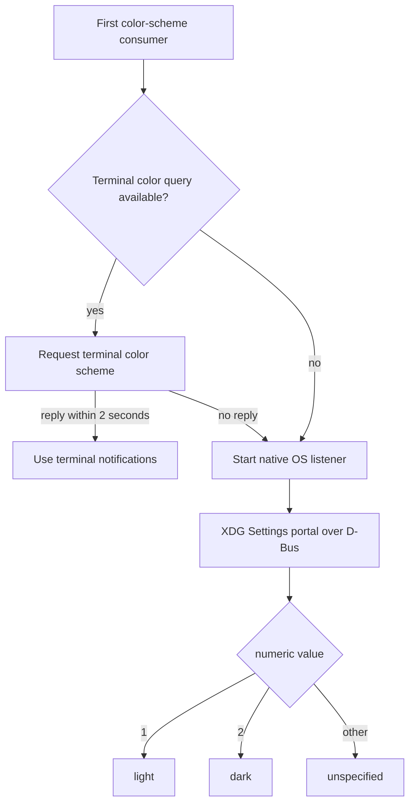

# CLI native Unicode and desktop helper

Copilot CLI `1.0.71` ships `copilot-cli-pkg/prebuilds/linux-x64/cli-native.node` beside the much larger `runtime.node`. The two addons have different responsibilities. `cli-native.node` is a compact UI/platform helper for Unicode terminal layout, OS color-scheme observation, and desktop notifications; it does not expose the model, tool, session, or sandbox runtime surface.

This page combines ELF inspection, read-only N-API reflection, selected pure-function probes, embedded Rust source/dependency strings, and the direct consumers in `app.js`.

## Binary identity

| Property | Observed value |
|---|---|
| Package baseline | `@github/copilot` `1.0.71` |
| Packaged path | `copilot-cli-pkg/prebuilds/linux-x64/cli-native.node` |
| Format | Stripped ELF 64-bit little-endian x86-64 shared object |
| Size | `2,748,280` bytes |
| SHA-256 | `f2bfd3b4799cd6ca11d9236fa78f09dcf0f27db132a0c41a323365576aeb5715` |
| Exported ELF symbols | `napi_register_module_v1` only |
| Declared shared-library dependencies | `libgcc_s`, `librt`, `libpthread`, `libdl`, `libc`, and the ELF loader |

The binary is approximately 3.5 percent of `runtime.node` by file size and reflects only 11 JavaScript functions. There are no reflected classes or constants.

## Source anchors

| Area | Exact/minified anchor | Location | Confirmed role |
|---|---|---|---|
| Addon resolver | `zL()`, `Vle("cli-native", ...)` | `app.js` approximately line 634 | Resolves the prebuild, caches either the addon or its load error, and rethrows a cached failure. |
| Unicode facade | `P$()`, `VCt`, `KCt`, `YCt`, `JCt`, `d4e`, `ZCt`, `XCt` | `app.js` approximately line 634 | Lazily loads the addon and wraps grapheme, line-break, width, emoji, and ignorable-code-point queries. |
| Cell-width policy | `g4e(...)` | `app.js` approximately line 634 | Converts code-point properties and variation selectors into terminal widths `0`, `1`, or `2`. |
| Grapheme iteration | `Jp(...)` | `app.js` approximately line 634 | Slices JavaScript strings at native grapheme boundaries before measuring/rendering terminal cells. |
| Color-scheme adapter | `BOr`, `OOr`, `bqe`, `NOr`, `LOr` | `app.js` approximately line 3239 | Prefers a terminal color-scheme response, then falls back to the native OS watcher. |
| Notification adapter | `Q8r`, `V8r`, desktop notification dispatch | `app.js` approximately line 3602 | Loads the addon optionally, normalizes notification content, and records cooldown only after native success. |
| Linux color backend | `src/native/cli/src/color_scheme.rs` | Embedded Rust source-path string | Implements the Linux color-scheme integration retained in this prebuild. |
| XDG portal contract | `org.freedesktop.portal.Settings`, `org.freedesktop.appearance`, `color-scheme`, `SettingChanged` | Embedded binary strings | Reads and watches the standard desktop appearance setting over D-Bus. |

## Reflected N-API surface

```text
getColorScheme
graphemeBoundaries
isDefaultIgnorable
isEastAsianFullwidth
isEastAsianWide
isEmojiPresentation
isExtendedPictographic
lineBreakPositions
showDesktopNotification
startColorSchemeListener
stopColorSchemeListener
```

The exports form three narrow groups:

| Group | Functions | Runtime consumer |
|---|---|---|
| Text segmentation | `graphemeBoundaries`, `lineBreakPositions` | Grapheme-safe slicing, wrapping, and terminal layout. |
| Code-point properties | `isDefaultIgnorable`, `isEastAsianFullwidth`, `isEastAsianWide`, `isEmojiPresentation`, `isExtendedPictographic` | Width calculation for control/default-ignorable characters, CJK text, emoji, and variation sequences. |
| Desktop integration | `getColorScheme`, `startColorSchemeListener`, `stopColorSchemeListener`, `showDesktopNotification` | Light/dark theme synchronization and completion/attention notifications. |

All reflected functions report JavaScript arity `0`, as expected for these N-API wrappers. Runtime conversion errors expose the actual property-predicate input type as Rust `u32`; callers pass a Unicode code point, not a JavaScript character string.

## Unicode segmentation contract

Pure probes show that segmentation results are JavaScript UTF-16 code-unit offsets. Both APIs include `0` and a terminal boundary at the JavaScript string length.

| Call | Result | Interpretation |
|---|---|---|
| `graphemeBoundaries("hello world")` | `[0,1,2,3,4,5,6,7,8,9,10,11]` | Each ASCII code unit is one grapheme. |
| `graphemeBoundaries("e\u0301x")` | `[0,2,3]` | Base `e` plus combining acute accent is one grapheme occupying two UTF-16 units. |
| `graphemeBoundaries("family-emoji + !")` | `[0,11,12]` for the actual ZWJ family sequence followed by `!` | The four-person ZWJ sequence remains one grapheme despite spanning 11 UTF-16 units. |
| `lineBreakPositions("hello world")` | `[0,6,11]` | A soft break is available after the space. |
| `lineBreakPositions("a\nb")` | `[0,2,3]` | The mandatory newline break is reported after the newline code unit. |

The family-emoji row describes the actual `man + ZWJ + woman + ZWJ + girl + ZWJ + boy + !` input; the textual label is used here to keep the documentation source ASCII-only.

Embedded crate paths identify ICU4X `icu_segmenter` `2.2.0` and `icu_collections` `2.2.0`. The native implementation therefore supplies Unicode segmentation tables/algorithms rather than delegating to terminal escape handling or JavaScript regular expressions.

## Terminal cell-width policy

`g4e(...)` applies the native predicates in a fixed JavaScript policy:

1. Empty input has width `0`.
2. Printable ASCII has width `1`; C0 control characters have width `0`.
3. A default-ignorable code point has width `0`.
4. An extended pictographic grapheme with variation selector `U+FE0F` has width `2`; `U+FE0E` forces width `1`.
5. Emoji-presentation, East Asian Wide, and East Asian Fullwidth code points have width `2`.
6. Other graphemes have width `1`.

This division is deliberate: Rust provides segmentation and Unicode properties, while `app.js` owns the CLI's final terminal-cell policy. A terminal displaying a different width convention can still disagree, but the renderer now has one consistent internal model for slicing, wrapping, and cursor placement.

## Color-scheme selection

The UI does not immediately rely on the OS addon. The source attempts this order:



The native listener calls back with numeric values that `OOr(...)` maps to `light`, `dark`, or `unspecified`. Stop failures are logged at debug level. If the addon cannot load for this optional path, `BOr()` returns `null` and the UI continues without a native watcher.

The Linux binary retains the portal destination/path, the `org.freedesktop.appearance` namespace, the `color-scheme` key, and the `SettingChanged` signal. This supports both an initial read and live updates without polling a desktop-specific configuration file.

## Desktop notifications

`app.js` treats notifications as best effort:

- addon loading failure disables this path rather than failing the CLI;
- title/body/subtitle content is normalized and length-limited before the native call;
- an icon is resolved from packaged Copilot assets when available;
- completion and attention notifications have separate cooldowns;
- the cooldown timestamp is updated only when `showDesktopNotification(...)` returns a truthy success result;
- native errors are swallowed at this outer adapter boundary.

The Linux prebuild embeds `notify-rust` `4.18.0`, `zbus` `5.17.0`, `dbus` `0.9.12`, and the `org.freedesktop.Notifications` protocol strings. It therefore talks to the desktop notification service over the session bus rather than requiring a dynamically linked GUI toolkit. Retained `xdotool` and `wmctrl` strings are dependency-level evidence for notification activation behavior, but the stripped binary is insufficient to claim that every desktop environment takes that path.

## Failure boundaries

| Failure | Observed behavior |
|---|---|
| Addon missing during Unicode layout | The cached resolver error is rethrown; there is no JavaScript segmentation fallback in this facade. |
| Terminal color query unavailable or times out | The UI attempts the native OS color-scheme listener. |
| Native color watcher unavailable | Color synchronization continues without that source; the failure is debug-logged. |
| Desktop bus or notification service unavailable | The native call fails or returns false; the outer dispatcher suppresses the notification and does not start its cooldown. |
| Invalid property-predicate input | N-API rejects conversion to Rust `u32`. |

## Boundary with `runtime.node`

| `cli-native.node` | `runtime.node` |
|---|---|
| 11 UI/platform functions | 2,429 domain runtime exports |
| Unicode segmentation and character properties | Tools, models, sessions, MCP, permissions, sandboxing, persistence, and protocols |
| Color-scheme and desktop-notification integration | In-process runtime plus provider/host C ABI |
| One N-API ELF export | N-API registration plus 17 `copilot_runtime_*` C exports |
| Best-effort desktop paths; required Unicode layout path | Broad application authority and process/runtime services |

The shared Rust/N-API implementation language and adjacent packaging do not make the addons one subsystem. `cli-native.node` supports presentation and desktop ergonomics; `runtime.node` carries application behavior and privileged runtime capabilities.

## Limits and next probes

- This analysis covers the packaged Linux x64 prebuild. Windows and macOS implementations may use different theme and notification backends while preserving the same JavaScript names.
- The binary is stripped. Export names, call sites, retained source paths, dependency strings, and pure probes confirm the public boundary but not every internal branch.
- `getColorScheme`, listener lifecycle, and desktop notification side effects were not invoked during analysis; their behavior is reconstructed from `app.js` consumers and retained Linux backend strings.
- A future binary baseline could track the 11 export names, hash, dependency versions, and selected pure Unicode vectors across package updates.

## Related docs

- [Native `runtime.node` binary architecture](native-runtime-binary.md) documents the separate application runtime addon.
- [Interactive TUI and slash-command workflows](tui-and-slash-commands.md) covers the UI that consumes Unicode width and theme state.
- [Terminal setup and shell environment](terminal-setup-and-shell-environment.md) covers terminal capability setup around this rendering helper.
- [Telemetry, update, and shutdown](../05-hosted-agent-ops/telemetry-update-and-shutdown.md) covers process-level cleanup and optional user notifications.