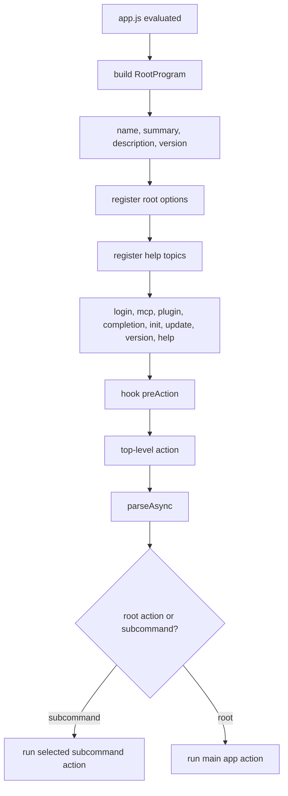
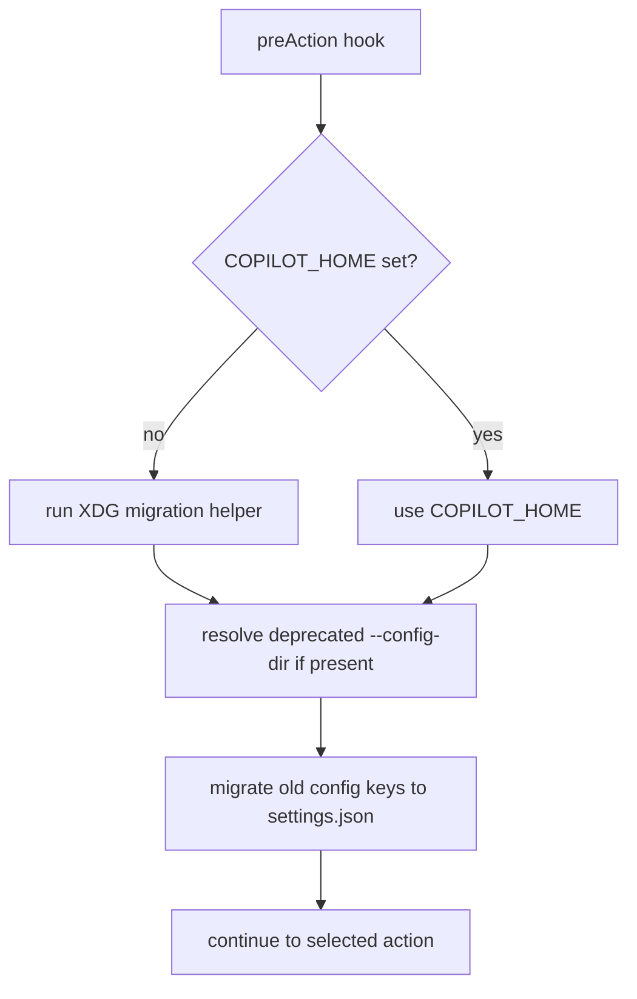
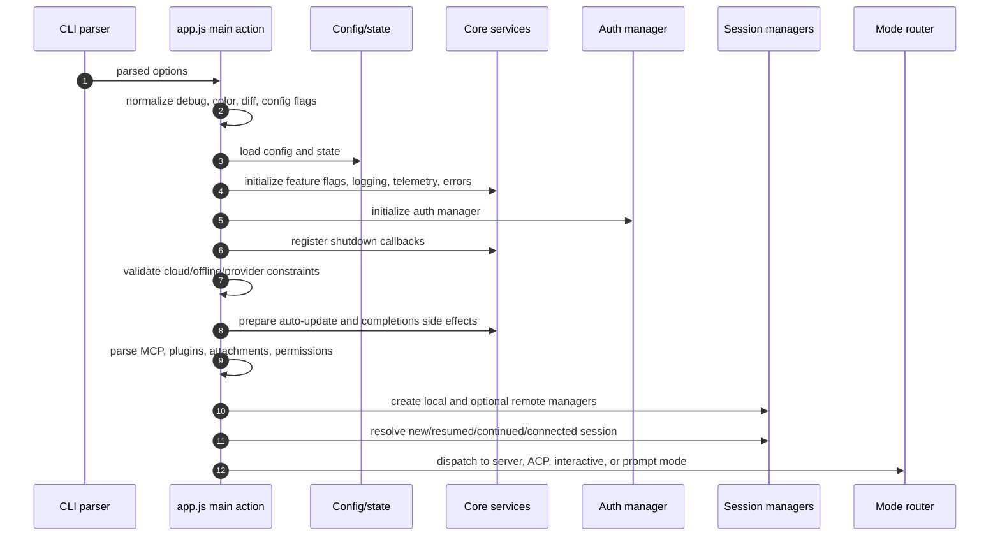
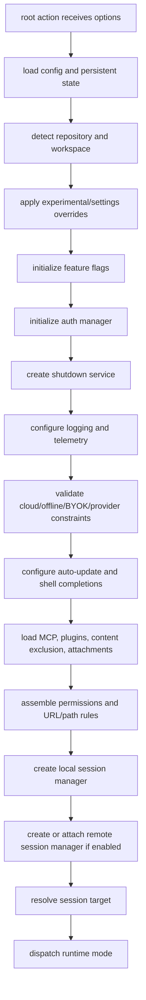
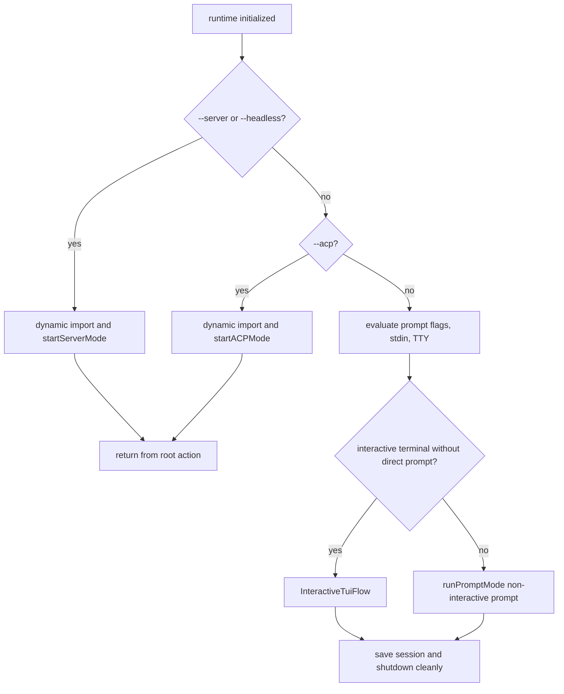
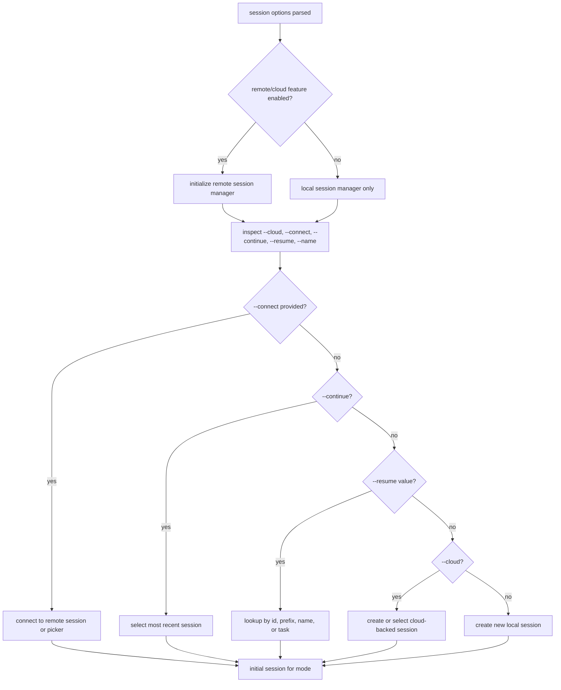
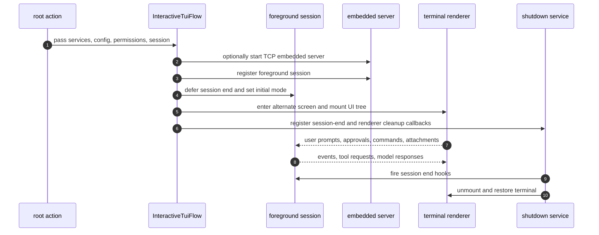
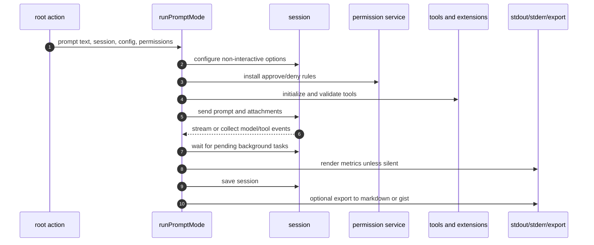
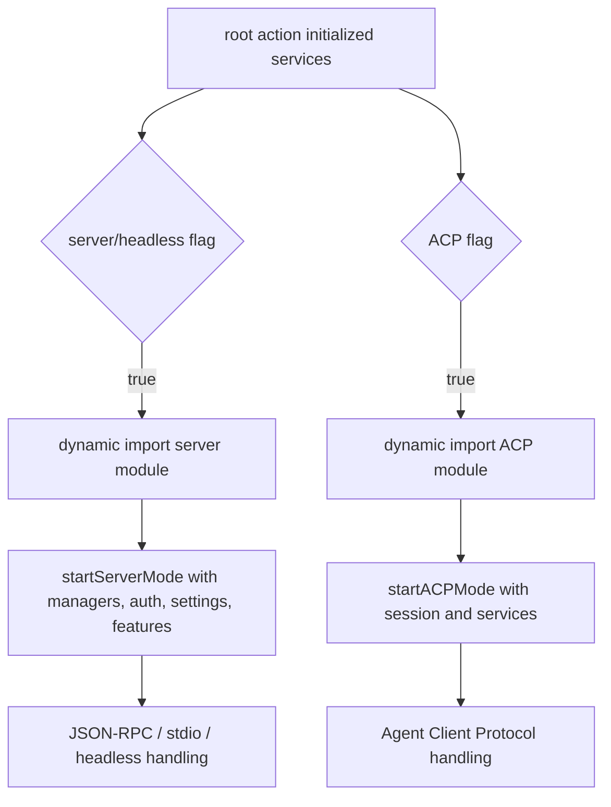
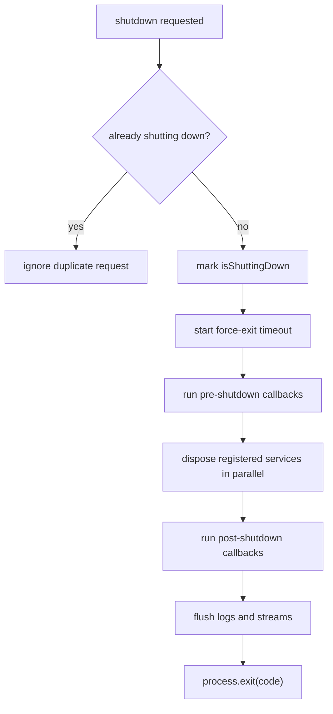

# Mode dispatch and runtime startup

This file documents the key control flow inside the tail section of `app.js`, where the root `copilot` command is assembled and executed.

The root program is built through a Commander-like API and ends with:

- registering options and subcommands;
- installing a `preAction` hook;
- installing a top-level async action;
- calling `parseAsync(...)`.

This is the central dispatch page for [Runtime lifecycle](README.md). It connects loader/bootstrap output to TUI, prompt, server/headless, ACP, and subcommand paths. After this page, follow [Interactive TUI and slash-command workflows](tui-and-slash-commands.md) for human terminal operation, [Embedded server, ACP, and JSON-RPC protocol](embedded-server-acp-protocol.md) for protocol hosts, or [Conversation session end-to-end](../04-sessions-persistence-remote/conversation-session-end-to-end.md) for durable session behavior.

## Source anchors

`app.js` is bundled and minified, so the semantic aliases below are documentation names. The minified anchors are lookup aids for this analyzed bundle only.

| Semantic alias | Minified anchor | Approx. `app.js` line | Role |
|---|---|---:|---|
| Root program builder | `mke` | 8221 | Commander-like root `copilot` program object. |
| Root runtime action | root `.action(async t => { ... })` | 8221-8347 | Main option normalization, service initialization, session resolution, and mode dispatch. |
| Interactive TUI workflow | `j$o(...)` | 7344 | Launches the terminal UI flow and embedded session wiring. |
| Non-interactive prompt workflow | `u1t(...)` | 7344 | Runs prompt mode for direct prompts, stdin, and non-TTY execution. |
| Server/headless branch | `--server`, `--headless`, dynamic server import | 8225-8347 | Starts JSON-RPC/headless server mode after shared initialization. |
| ACP branch | `--acp`, dynamic ACP import | 8225-8347 | Starts Agent Client Protocol mode after shared initialization. |

## Root parse flow

## `preAction` setup

The `preAction` hook prepares configuration paths before command actions run. It handles `COPILOT_HOME`, deprecated `--config-dir`, and settings migration.

## Main top-level action

The root `.action(async t => { ... })` is the primary runtime path for interactive and prompt use. It also routes to server and ACP modes.

## Main runtime phases

## Execution-mode router

The most important branch in the root action decides which runtime mode owns execution.

## Session-resolution workflow

The root action supports several ways to pick a session: new local session, continue last session, resume by ID/name/task, connect to remote, and cloud mode. Exact lookup internals are bundled, but the high-level decision pattern is visible from the CLI action.

## Interactive TUI workflow

The interactive branch (`InteractiveTuiFlow`) creates a terminal UI, optionally starts an embedded server, registers extension tooling, moves into the alternate screen, and renders the React/Ink-like UI tree.

## Non-interactive prompt workflow

Prompt mode (`runPromptMode(...)`) is used when a prompt is supplied directly, stdin is piped, or the CLI is otherwise not in an interactive TTY path.

A notable non-interactive behavior is that permission requests cannot ask the user unless explicitly supported by the mode. If no allow rule applies, many requests are resolved as unavailable/denied rather than prompting.

## Server and ACP branches

Server/headless and ACP modes are loaded dynamically only when their flags are selected. They reuse the same initialization work from the root action, then hand control to protocol-specific modules.

## Shutdown workflow

`app.js` uses a dedicated `ShutdownService` that tracks disposables and callbacks. It logs each disposal attempt, supports pre/post shutdown callbacks, flushes logs/output, and force-exits after a timeout.

