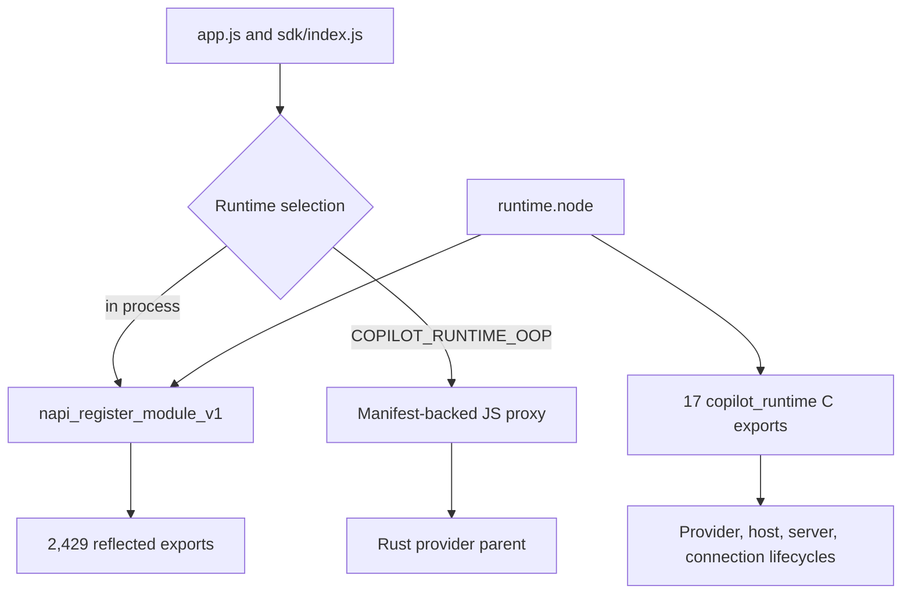

# Native `runtime.node` binary architecture

Copilot CLI `1.0.71` ships a stripped Rust-based Node addon at `copilot-cli-pkg/prebuilds/linux-x64/runtime.node`. The JavaScript bundle treats it as one native surface, but static ELF inspection and read-only Node reflection show that the file has two related interfaces:

1. a large N-API module used by the in-process JavaScript runtime;
2. a small exported C ABI for provider, host, server, connection, dispatch, and logging lifecycles.

This page looks one layer below the JavaScript bridge. It inventories recoverable binary structure and representative ownership boundaries without claiming to reconstruct stripped Rust control flow that is not directly observable.

## Binary identity

| Property | Observed value |
|---|---|
| Package baseline | `@github/copilot` `1.0.71` |
| Packaged path | `copilot-cli-pkg/prebuilds/linux-x64/runtime.node` |
| Format | ELF 64-bit little-endian x86-64 shared object |
| Size | `77,405,448` bytes |
| SHA-256 | `f5beb249797084e462dc92397ee29d7a81cd0779edf13ea75fa3575ffdaf4a0d` |
| Symbol state | Stripped; `.dynsym`, unwind data, and embedded strings remain |
| Declared shared-library dependencies | System runtime libraries only: `libdl`, `libgcc_s`, `libutil`, `librt`, `libpthread`, `libm`, `libc`, and the ELF loader |

The package also contains a separate, much smaller [`cli-native.node` Unicode and desktop helper](cli-native-platform-helper.md). The observations below apply to `runtime.node`; the two addons should not be treated as interchangeable.

## Recoverable source anchors

| Area | Exact anchor | Binary evidence | Semantic meaning |
|---|---|---|---|
| Node module registration | `napi_register_module_v1` | Exported ELF dynamic symbol | Registers the in-process N-API surface. |
| Provider entrypoint | `copilot_runtime_provider_main` | Exported ELF dynamic symbol | Exposes a provider-side runtime entrypoint outside the ordinary Node module interface. |
| Host lifecycle | `copilot_runtime_host_start`, `copilot_runtime_host_shutdown` | Exported ELF dynamic symbols | Starts and stops a native runtime host. |
| Server lifecycle | `copilot_runtime_server_create`, `copilot_runtime_server_register_session`, `copilot_runtime_server_remove_session`, `copilot_runtime_server_begin_shutdown`, `copilot_runtime_server_remove` | Exported ELF dynamic symbols | Owns server creation, per-session registration, shutdown, and removal. |
| Connection lifecycle | `copilot_runtime_connection_open`, `copilot_runtime_connection_request`, `copilot_runtime_connection_notify`, `copilot_runtime_connection_notify_after_response`, `copilot_runtime_connection_write`, `copilot_runtime_connection_close` | Exported ELF dynamic symbols | Provides request, notification, write, and close operations for native connections. |
| Dispatch and logging | `copilot_runtime_dispatch_complete`, `copilot_runtime_register_log_sink`, `copilot_runtime_log_dropped_count` | Exported ELF dynamic symbols | Completes dispatches and bridges native log delivery/backpressure accounting. |
| Interop implementation | `src/runtime/src/interop/cabi.rs`, `bridge_backed_seam.rs`, `api_callbacks.rs`; `src/napi-oop/crates/napi-oop/src/lib.rs` | Embedded Rust source-path strings | Confirms separate C-ABI, bridge-backed, callback, and NAPI-OOP implementation modules. |
| Protocol implementation | `src/runtime/src/protocol/jsonrpc/napi_seam.rs`, `napi_server.rs`, `native_registry.rs` | Embedded Rust source-path strings | Places a native registry and N-API seam beside the JSON-RPC engine/server implementation. |

The 17 `copilot_runtime_*` symbols are a coherent C ABI, not accidental Rust symbol leakage: they are explicitly exported even though the rest of the binary is stripped. Their names and the retained `interop/cabi.rs` path directly support the lifecycle grouping above. Exact C signatures and ownership rules are not recoverable from the dynamic symbol table alone.

## Dual runtime surface

The JavaScript selector still decides between local N-API loading and the manifest-driven OOP proxy described in [Out-of-process native runtime bridge](out-of-process-native-runtime.md). Binary inspection adds an important lower-level fact: the addon itself contains an exported provider/host ABI and NAPI-OOP Rust modules. This is consistent with the same implementation being usable behind both seams, although the stripped binary does not reveal the external launch policy or prove which host executable calls every C export.

## Reflected N-API inventory

Loading the addon in an isolated Node process and inspecting own properties, without invoking runtime methods, returns `2,429` exports:

| Export kind | Count | Notes |
|---|---:|---|
| Functions and constructors | `2,420` | N-API wrappers report JavaScript arity `0`; this is not the underlying Rust signature. |
| Numeric constants | `8` | Includes MCP limits, Git diff size, remote-registry schema/default values, and environment-resolution length. |
| Object constants | `1` | `SandboxDenialKind`. |

The largest exact camel-case prefix families include:

| Prefix | Count | Representative exports |
|---|---:|---|
| `mcp*` | `332` | `mcpClientRequest`, `mcpClientCallTool`, `mcpClientConnectStdio`, `mcpOauthFlowAuthenticate` |
| `tool*` | `253` | `toolExecuteBuiltin`, `toolShellPlanExecution`, `toolRipgrepRun`, `toolSessionStoreSqlExecute` |
| `remote*` | `181` | `remoteRegistryPublisherStart`, `remoteRegistryPublisherPublish`, registry and mission-control helpers |
| `prompts*` | `124` | System, compaction, provider-tuning, and tool-use prompt builders |
| `session*` | `111` | Search, SQLite, persistence, filesystem, compaction, and store operations |
| `configLoader*` | `106` | Plugin, skill, marketplace, rule, LSP, and MCP configuration loading |
| `shell*` | `79` | Shell-manager lifecycle, execution planning, output, cancellation, and detached state |
| `agents*` | `64` | Built-in/custom-agent loading, validation, prompt assembly, and model selection |
| `model*` | `62` | Model catalog/policy, provider planning, HTTP cancellation, and promotion helpers |
| `telemetry*` | `50` | Event construction, qualification, redaction, queueing, and session state |
| `lsp*` | `41` | Client lifecycle, requests, document state, diagnostics, and tool integration |
| `workspace*` | `41` | Workspace persistence, plans, checkpoints, summaries, and path resolution |

These counts describe the exported binding namespace, not relative code size or product importance. Some exports are small parsers or formatters, while others create long-lived native services.

### Stateful classes

Only four reflected functions expose nontrivial JavaScript prototypes:

| Class | Prototype methods | Native role |
|---|---|---|
| `SandboxResolvedPolicy` | `spawn` | A resolved sandbox policy is the object that creates a constrained child process. |
| `SandboxHandle` | `pid`, `writeStdin`, `closeStdin`, `readStdout`, `closeStdout`, `readStderr`, `closeStderr`, `kill`, `wait`, `buildSpawnEventJson` | Owns process I/O, termination, waiting, and spawn telemetry after sandboxed launch. |
| `AgentLoopAccumulator` | `accumulateEvent`, `snapshot` | Holds incremental agent-loop accounting state. |
| `McpStderrCapture` | `append`, `getFirstLine` | Retains bounded MCP process stderr state for diagnostics. |

The sandbox pair is especially useful architectural evidence: policy resolution and process lifetime are distinct native objects, and process I/O remains behind an explicit handle rather than being returned as a plain serialized result.

## Embedded Rust module map

The stripped binary retains `486` unique internal Rust source paths under `src/runtime`, `src/mcp`, and `src/napi-oop`. The largest `src/runtime/src` families are:

| Module family | Unique paths | Confirmed scope from path and export names |
|---|---:|---|
| `tools` | `59` | Built-in tool descriptors, preparation, result formatting, and execution helpers |
| `slash_commands` | `42` | Command parsing/dispatch plus command modules for MCP, model, sandbox, session, plugins, skills, schedule, autopilot, chronicle, and others |
| `mcp` | `34` | Host state, OAuth, registry policy, secret storage, tool naming, and runtime adapters |
| `model` | `26` | Model client, provider policy/planning, response handling, and HTTP state |
| `protocol` | `23` | JSON-RPC, AHP, AIP, IFC, SDK wire headers, dispatch, and transport |
| `session` | `20` | Filesystem, store, SQLite, search, compaction, locks, and persistence APIs |
| `remote` | `19` | Registry, control, mission-control, relay, and hosted coordination paths |
| `hooks` | `14` | Loading, command/HTTP execution, callbacks, session hooks, and observability |
| `workspace` | `13` | Metadata, path management, folder trust, environment information, and manager APIs |
| `extensions` | `12` | Plugin discovery, fetching, installation/operations, tools, and extension directories |
| `permissions` | `9` | Rule parsing, path/URL policy, auto-approval, hooks, and persisted locations |
| `embeddings` | `9` | Blackbird/Copilot providers plus MCP, skill, and instruction indexes |
| `lsp` | `8` | Client, manager, JSON-RPC, configuration, and tool adapters |
| `sandbox` | `6` | API, settings, policy checks, denial decoding, spawn, and telemetry |

There is also a separate embedded `src/mcp` crate with client, server, handler, process-tree, SSE transport, and dynamic-header modules. The runtime's `mcp` directory is therefore an integration/policy layer over a lower-level MCP implementation rather than the only MCP code in the addon.

## Native capability envelope

The ELF import table includes `fork`, `execvp`, `posix_spawnp`, `waitpid`, sockets, `send`/`recv`, `sendfile64`, pthread synchronization, and dynamic loading. Combined with the handle classes and source-path map, this confirms that `runtime.node` is not merely a computation helper: it owns process, IPC, transport, persistence, and policy-capable implementation paths.

Embedded dependency paths identify Rust crates including Tokio `1.52.3`, RMCP `2.2.0`, rusqlite `0.40.1`, tree-sitter `0.26.11`, OpenTelemetry `0.32.x`, `image` `0.25.10`, and serde/serde_json. None appears as a direct ELF `NEEDED` shared library. Their code is linked into the addon or reached through lower-level system libraries rather than shipped as separate declared shared-object dependencies.

## What this changes in the runtime model

The earlier JavaScript-only view made `runtime.node` look like a narrow implementation detail behind `S.*`. The binary evidence supports a stronger model:

1. JavaScript is a large orchestration and UI consumer, but substantial parsers, policy engines, persistence helpers, protocol clients, and execution services are native exports.
2. The native boundary is organized by domain-prefixed functions plus a few stateful handle classes, not one monolithic runtime object.
3. The same binary exposes a second host/provider ABI next to N-API, matching the bridge-backed/OOP source modules retained inside it.
4. Direct mode places all of those native capabilities in the Node process. OOP mode changes the process and crash boundary, but not the authority of the exposed runtime surface.

## Limits and next probes

- The ELF is stripped and has no full symbol table or bundled Rust source. Embedded paths prove compiled module presence, not that every path is active in every CLI mode.
- Reflected export names prove binding availability, but they do not by themselves prove callers, argument schemas, error handling, or cleanup order. Those remain best traced from `app.js`, SDK code, and observable diagnostics.
- Imported process/socket APIs establish a capability envelope; without code cross-references they should not be assigned to one specific subsystem.
- The C ABI names expose lifecycle shape, but exact signatures and the external host that drives them remain candidate work for a disassembler/decompiler pass.
- Future package comparisons can diff export names, class prototypes, C symbols, source-path strings, and the binary hash. The current source atlas indexes `app.js`, so these binary surfaces require a separate extractor if they are to become an automated baseline.

## Related docs

- [CLI native Unicode and desktop helper](cli-native-platform-helper.md) documents the separate `cli-native.node` addon used for grapheme layout, cell width, theme observation, and notifications.
- [Out-of-process native runtime bridge](out-of-process-native-runtime.md) covers runtime selection, manifest reconstruction, IPC framing, callbacks, and remote-handle cleanup.
- [Sandbox implementation](../03-tools-integrations-security/sandboxing.md) follows the JavaScript consumers of `sandbox*` and `SandboxResolvedPolicy` APIs.
- [MCP host, transport, and tools](../03-tools-integrations-security/mcp-host-transport-and-tools.md) documents the MCP lifecycle exposed through the runtime.
- [Session persistence, replay, and indexing](../04-sessions-persistence-remote/session-persistence-replay-and-indexing.md) and [Session-store SQLite indexing](../04-sessions-persistence-remote/session-store-sqlite-indexing.md) cover major consumers of the native session/storage APIs.