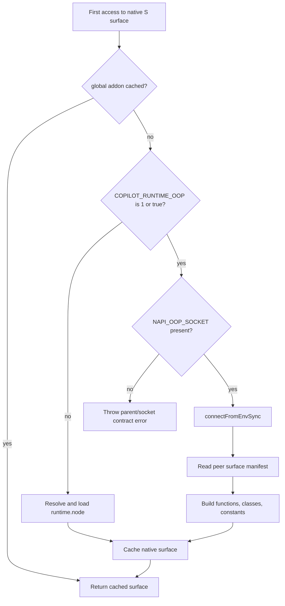
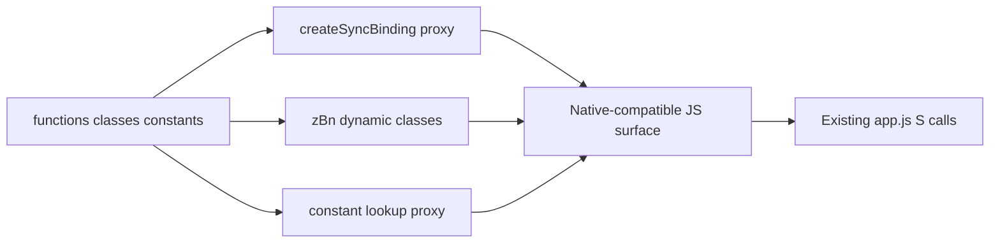
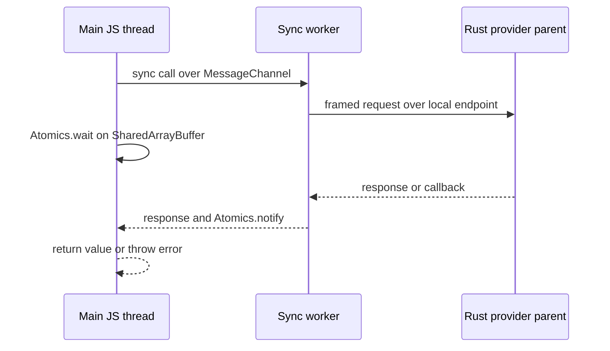

# Out-of-process native runtime bridge

Copilot CLI normally loads `runtime.node` into the JavaScript process. The `1.0.71` package also contains a second execution path: a Rust parent can launch the CLI with `COPILOT_RUNTIME_OOP=true` and a connect-back endpoint, and the JavaScript runtime remotes native calls to that parent instead of loading the addon locally.

This is a distinct bootstrap and process boundary. It is not a shell sandbox, an SDK extension host, or the JSON-RPC server API. The bridge recreates the native runtime's functions, classes, constants, callbacks, and external-object handles over a private framed protocol so the rest of `app.js` can keep using the same `S.*` native surface.

Because `app.js` and the vendored runtime are bundled/minified, semantic names below are explanatory aliases. Exact export names, environment variables, and protocol strings are retained as searchable anchors.

## Source anchors

| Area | Semantic alias | Exact/minified anchor | Current location | Role |
|---|---|---|---|---|
| Vendored require root | OOP package resolver | `__napiOopEntrypoint`, `__napiOopRequire` | `app.js` ~15-42 | Resolves `napi-oop-runtime` from its adjacent package-local `node_modules`. |
| Runtime mode switch | Native runtime selector | `Ust()`, `IU()`, `COPILOT_RUNTIME_OOP` | `app.js` ~63 | Chooses remote calls or the in-process `runtime.node` addon and caches the result globally. |
| CLI OOP initializer | Manifest-driven bridge | `$st()` | `app.js` ~63 | Connects to the parent, parses the advertised surface, and builds function/class/constant proxies. |
| Dynamic class binder | Native class proxy builder | `zBn(...)` | `app.js` ~63 | Synthesizes constructors, methods, getters, and external-handle wrappers from manifest class records. |
| Runtime package | Node-side OOP transport | `napi-oop-runtime` `1.0.9` | `napi-oop-runtime/node_modules/napi-oop-runtime/package.json` | Describes the package as the Node-side runtime for an out-of-process Rust peer. |
| Endpoint contract | Connect-back endpoint | `SOCKET_ENV`, `NAPI_OOP_SOCKET` | vendored `dist/index.js` | Names the environment variable consumed by child-side connection setup. |
| Wire protocol | Framed peer | `PROTOCOL_VERSION`, `Peer.handshake`, `encodeFrame` | vendored `dist/index.js` | Uses versioned hello exchange, length-prefixed MessagePack frames, requests, responses, callbacks, and releases. |
| Synchronous facade | Worker-backed binding | `createSyncBinding`, `sync-worker.js` | vendored runtime | Preserves synchronous native-call semantics through a worker, MessageChannels, SharedArrayBuffer, and Atomics. |
| Object lifetime | External-handle tracking | `trackExternal`, `FinalizationRegistry`, `releaseExternal` | vendored `dist/index.js` | Notifies the peer when remote object handles are no longer retained. |
| Other bundle entrypoints | Reused bridge bootstrap | `sdk/index.js`, `voice-server.js`, `voice-engine.worker.js` | package entrypoints | Repeats the package-local require and runtime bridge pattern where those bundles consume native APIs. |

## Runtime selection

The native surface is cached under a global runtime-addon slot. The first access chooses one path:

`COPILOT_RUNTIME_OOP` does not mean "try remote, then fall back." Once selected, a missing `NAPI_OOP_SOCKET`, failed connection, missing manifest, or protocol mismatch is a startup failure. The in-process addon path is used only when OOP mode is not enabled.

After connection, the child removes the consumed mode/socket variables from its environment. That limits accidental inheritance by descendants and makes the connect-back endpoint effectively single-use for this process.

## Connect-back endpoint

The vendored runtime exposes both parent-side launch helpers and child-side connection helpers. Copilot CLI uses the child-side `connectFromEnvSync()` path because the Rust provider parent has already launched it.

Endpoint generation in the package is platform-specific:

| Platform | Generated endpoint form |
|---|---|
| Linux / Android | Abstract local socket name; the Node transport prefixes it with a NUL byte. |
| Windows | Named pipe such as `\\.\pipe\napi-oop-<pid>-<random>`. |
| macOS and other Unix | Filesystem socket under the platform temp directory. |

The endpoint is local IPC, but it should not be described as Unix-only. The exact endpoint is supplied through `NAPI_OOP_SOCKET` by the parent.

## Handshake and framing

`Peer.handshake(...)` sends and expects a `hello` message with protocol version `1`. A version mismatch rejects the connection before bindings are exposed.

Normal messages are encoded as:

1. MessagePack payload;
2. four-byte big-endian payload length;
3. payload bytes.

The peer then exchanges message families such as:

- `request`, `response`, and `error` for function calls;
- `callbackInvoke`, `callbackCall`, callback results/errors, and callback release;
- `releaseExternal` for remote object handles;
- connection close/error events that reject pending operations.

The initial hello from the provider includes the runtime surface manifest. `app.js` rejects an OOP provider that does not advertise one.

## Manifest-driven API reconstruction

The manifest lets JavaScript reconstruct the same shape exported by `runtime.node`.

For functions, `$st()` derives:

- the list of asynchronous functions;
- functions returning `ExternalObject` handles;
- JavaScript-to-Rust wire-name mappings.

`createSyncBinding(...)` returns functions lazily from a Proxy. Synchronous manifest entries call `provider.call`; asynchronous entries call `provider.callAsync`. External-object return values are registered for lifetime tracking.

For classes, `zBn(...)` creates JavaScript classes at runtime. Constructors call the manifest's Rust constructor name, methods prepend the remote handle, getters preserve getter syntax, and methods returning another manifest class wrap the returned handle through `__fromHandle(...)`.

Constants are overlaid with a final Proxy so property reads and `in` checks behave like an ordinary native module export.

## Preserving synchronous calls

Node socket APIs are asynchronous, but many native runtime methods are consumed synchronously. The vendored package preserves that contract through `sync-worker.js`:

A second message channel handles asynchronous calls and callbacks without blocking. The main-side provider buffers out-of-order synchronous results and sequences callback delivery, so a callback raised during a blocking native call can still be dispatched coherently.

This mechanism explains why OOP mode can substitute for an in-process NAPI addon without changing thousands of existing synchronous call sites.

## Handles, callbacks, and cleanup

Remote class instances and function-returned external objects carry opaque handles. `trackExternal(...)` registers those handles with a `FinalizationRegistry`; collection sends a release message to the peer. Explicit peer-side releases also remove callback registrations.

When the provider closes:

- pending async calls reject with a provider-closed error;
- callbacks and buffered results are cleared;
- the synchronous worker receives a close message and terminates;
- the transport closes and parent launch helpers clean up child/socket state when they own it.

The CLI's runtime surface is process-global and cached. The visible `app.js` bridge does not expose a mid-process fallback from OOP mode to `runtime.node` after connection failure.

## Failure boundaries

| Failure | Observable behavior |
|---|---|
| `COPILOT_RUNTIME_OOP` set without `NAPI_OOP_SOCKET` | `$st()` throws a parent/connect-back contract error. |
| Parent endpoint unavailable | Child-side connection or sync-worker readiness fails. |
| Hello protocol version differs | Handshake rejects with local/peer versions. |
| Provider omits manifest | CLI throws before constructing the native surface. |
| Remote request fails | Error response becomes a rejected async call or thrown synchronous call. |
| Peer disconnects | Pending calls fail; no automatic in-process fallback is attempted. |
| Remote handle is collected | Finalizer sends `releaseExternal` unless the peer is already closed. |

## Security and architecture caveats

- OOP mode is a process and fault boundary, not proof of security isolation. The parent still exposes powerful native capabilities to JavaScript.
- The packaged `runtime.node` contains provider/host C exports and NAPI-OOP implementation modules, documented in [Native `runtime.node` binary architecture](native-runtime-binary.md). The external launch policy and exact host caller remain outside the visible JavaScript path.
- Synchronous remote calls block the main JavaScript thread while `Atomics.wait` waits for the worker result.
- Manifest compatibility is guarded by the transport protocol version and advertised shape, but semantic compatibility still depends on parent/child package alignment.
- `napi-oop-runtime/index.js` is intentionally an empty resolution anchor; `createRequire` finds the actual package in its adjacent `node_modules` directory.

## Related docs

- [Native `runtime.node` binary architecture](native-runtime-binary.md) inventories the addon's N-API bindings, stateful classes, C ABI, embedded Rust module paths, and native capability envelope.
- [Loader and bootstrap workflows](loader-bootstrap.md) explains how execution reaches `app.js` and how package-local require roots are constrained.
- [Mode dispatch and runtime startup](mode-dispatch-and-runtime-startup.md) begins after the native surface is available.
- [Shell command execution events](../03-tools-integrations-security/shell-command-execution-events.md) and [Sandbox implementation](../03-tools-integrations-security/sandboxing.md) document major consumers of the native runtime without conflating them with this transport.
- [Voice runtime server and transcription pipeline](voice-runtime-workers-and-transcription.md) documents another out-of-process boundary that can consume the same native bridge pattern.
