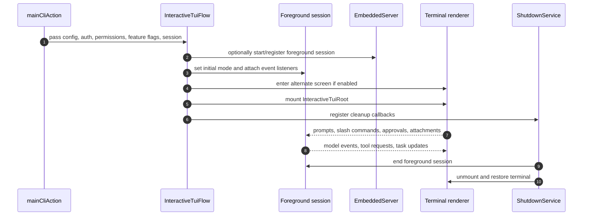
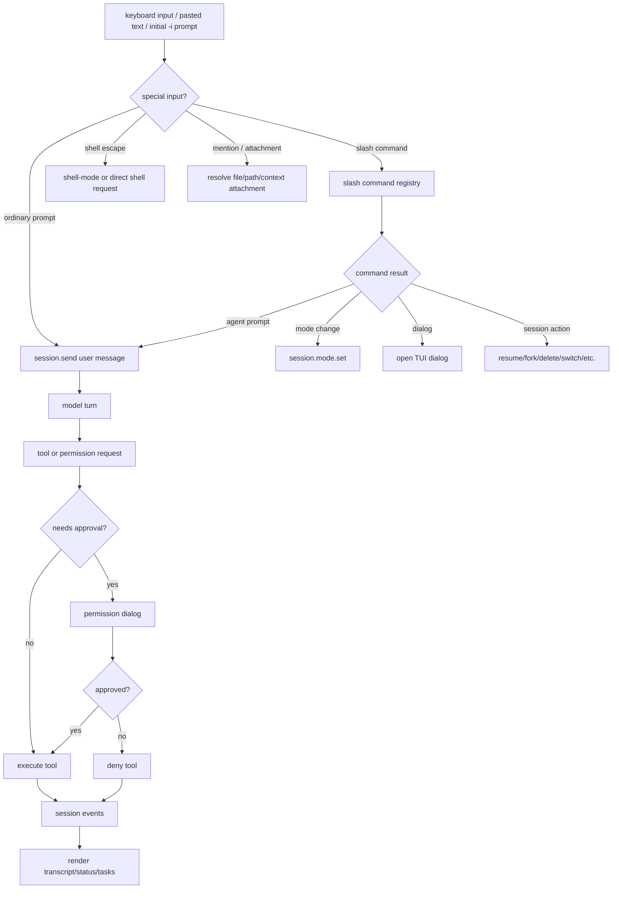
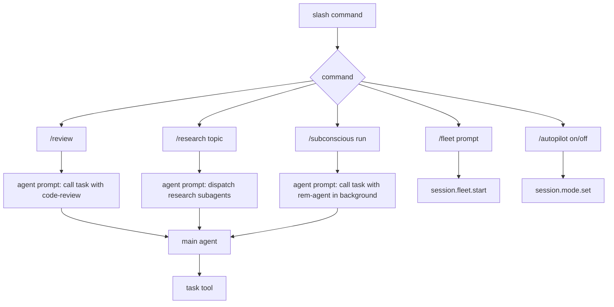
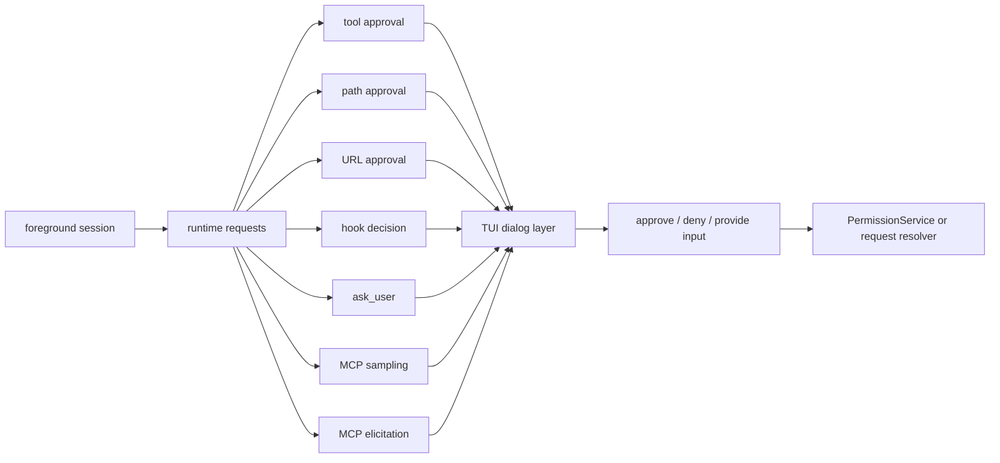
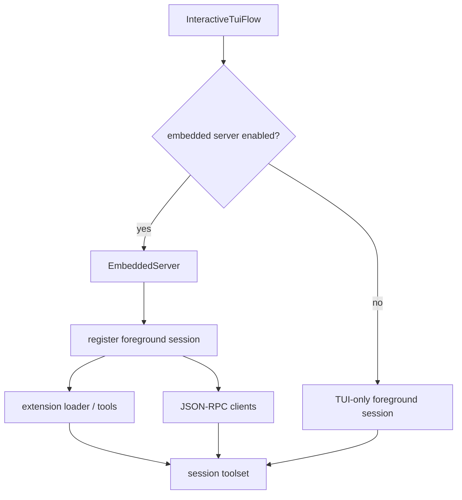

# Interactive TUI and slash-command workflows

This document fills the standalone coverage gap for the interactive terminal UI in `app.js`. It focuses on how the TUI is launched, what runtime services it hosts, how dialogs and approvals fit into the event loop, and how slash commands act as user-facing shortcuts over deeper session, mode, integration, and agent orchestration behavior.

`app.js` is bundled and minified, so semantic aliases are used as stable documentation names. Minified symbols are retained only as search anchors for the analyzed `@github/copilot` artifact and may shift across releases.

## Internals scope

This page explains the human-facing branch of [Runtime lifecycle](README.md). It sits between [Mode dispatch and runtime startup](mode-dispatch-and-runtime-startup.md) and the subsystems the TUI hosts: [Context and model loop](../02-context-model-loop/README.md), [Tools, integrations, and security](../03-tools-integrations-security/README.md), [Sessions, persistence, and remote](../04-sessions-persistence-remote/README.md), and [Agents and automation](../06-agents-automation/README.md). Read it when a slash command or dialog appears to be “UI-only” but actually routes into deeper runtime behavior.

## Source anchors

| Area | Semantic alias | Minified anchor | Approx. line | Role |
|---|---|---:|---:|---|
| TUI launcher | `InteractiveTuiFlow` | `j$o(...)` | 7000-7445 | Creates the interactive runtime, starts optional embedded services, mounts the terminal UI, and registers shutdown cleanup. |
| TUI component tree | `InteractiveTuiRoot` | `jQa(...)` and nearby React/Ink-style components | 7000-7445 | Hosts input, transcript, dialogs, task/session widgets, model/status UI, and event subscriptions. |
| Embedded server | `EmbeddedServer` | `p1t` | 7441 | Registers the foreground session and supports JSON-RPC/extension integration while the TUI is active. |
| Slash commands | `slashCommandRegistry` | `Z6o(...)` usage plus command definitions | 7000-7445, 1300-1340 | Normalizes typed slash commands into session actions, prompts, mode changes, or dialogs. |
| Agent slash commands | `researchCommand`, `reviewCommand`, `subconsciousCommand`, `fleetCommand`, `autopilotCommand` | `Yps`, `eLn`, `Wps`, `Lps`, `Rps` | 1300-1340 | Implements commands that steer the main agent toward `task`, fleet, or mode changes. |
| Compaction slash command | `compactCommand` | `kps(...)` | 1300, 1340 | Calls session-history compaction to summarize old conversation history and reduce context-window usage. |
| Sandbox slash command | `SandboxSlashCommand` | `jps(...)` | 1331 | Implements `/sandbox enable`, `/sandbox disable`, and status output when the `SANDBOX` gate exposes the command. |
| Permission UI | `PermissionDialogFlow` | TUI permission handlers | 7000-7445 | Handles tool/path/URL/hook/user-input/sampling approvals when the session can ask a human. |
| Model UI | `ModelPickerFlow` | model picker handlers | 7000-7445 | Allows model and reasoning effort selection in interactive sessions. |
| Extension UI | `ExtensionManagerFlow` | extension loader/dialog handlers | 7000-7445 | Loads/reloads extensions and exposes extension-provided tools in the foreground session. |
| Shutdown | `ShutdownService` | `eke` | 7420 | Unmounts the renderer, restores terminal state, ends the session, and flushes logs/telemetry. |

## High-level TUI launch

The interactive branch is selected when the root action has initialized services and determines that the process is running in a human-oriented terminal path rather than direct prompt, server, or ACP mode.

The TUI is therefore a session host, not just a text prompt. It coordinates model turns, tool calls, permission decisions, mode state, background sessions, extension tools, and shutdown behavior.

## Interactive event loop

Important points:

- The same foreground session owns ordinary prompts and slash-command-generated prompts.
- Interactive approval is available only because the TUI can ask a human; prompt mode often cannot.
- Slash commands are mostly dispatch helpers. Some directly mutate session state, while others inject agent prompts that cause the main agent to call tools.

## Slash-command categories

The bundled command list is broad. Some commands are directly visible in the analyzed code and existing docs; others are implied by the TUI sections that register session, task, extension, and debug dialogs.

| Category | Examples observed or inferred from the TUI wiring | Runtime effect |
|---|---|---|
| Mode control | `/autopilot`, plan/autopilot toggles | Changes the session mode between interactive, plan, and autopilot-style behavior. |
| Agent orchestration | `/research`, `/review`, `/subconscious run`, `/fleet` | Injects an agent prompt or starts a fleet/autopilot workflow. |
| Context management | `/compact`, `/session checkpoints` | Summarizes current conversation history, updates context metrics, and exposes compaction checkpoints. |
| Session control | resume, fork, switch, rename, delete, background-session commands | Routes into local/background session managers. |
| Tool and permission UI | permission approvals, path/URL/tool decisions, shell actions | Opens dialogs or records decisions in the permission service. |
| Runtime settings and sandboxing | `/sandbox enable`, `/sandbox disable` | Writes the separate local command sandbox setting and triggers runtime settings refresh. |
| Integrations | MCP dialogs, plugin/extension manager, skills UI | Loads, reloads, or configures integration-provided capabilities. |
| Diagnostics/help | debug logs, feedback, help, status views | Exposes runtime/support information without leaving the TUI. |
| Model and voice | model picker, reasoning effort, voice selection/recording paths | Updates model configuration or starts voice-specific UI paths when enabled. |

## Agent-oriented slash commands

Several slash commands do not perform heavy work themselves. They produce prompts or session actions that steer the main agent.

The important design pattern is that user-facing commands often remain thin. They translate human intent into one of four effects:

- a session state mutation;
- a TUI dialog request;
- an agent prompt that leads the model to call `task` or another tool;
- a background/fleet workflow.

Fleet mode has its own implementation notes in [`fleet-mode.md`](../06-agents-automation/fleet-mode.md), because `/fleet` is a thin slash-command entry into `session.fleet.start(...)`, SQL todo coordination, and parallel subagent dispatch. The `/subconscious run` path, including `rem-agent`, `context_board`, sidekicks, and shutdown consolidation, is covered in [`memory-and-context-board.md`](../02-context-model-loop/memory-and-context-board.md).

`/compact` is not an agent-task macro. It directly calls session-history compaction, which asks a model to summarize older conversation turns and then replaces the current session message list. The full flow is documented in [`conversation-compaction.md`](../02-context-model-loop/conversation-compaction.md).

`/autopilot` and `--autopilot` both change agent mode, while `--no-ask-user` changes whether the TUI exposes the model-visible `ask_user` capability. These are separate controls: autopilot adds autonomous instructions, `task_complete`, and continuation, whereas no-ask-user removes the structured question tool. See [`autopilot-and-no-ask-user.md`](../06-agents-automation/autopilot-and-no-ask-user.md) for the full implementation trace.

## Dialog and approval surfaces

Interactive mode supports approval flows that non-interactive prompt mode cannot reliably perform.

The TUI acts as the human-interaction adapter for these requests. The underlying permission service still owns rule precedence and persistence decisions. The full permission pipeline is documented in [`tool-path-url-permissions.md`](../03-tools-integrations-security/tool-path-url-permissions.md).

`/sandbox` looks adjacent to permission commands because it affects command execution safety, but it is not a permission approval. It writes `settings.sandbox.enabled`; later shell-session construction decides whether to spawn through the local sandbox path. See [`sandboxing.md`](../03-tools-integrations-security/sandboxing.md) for the full flow and platform caveats.

## Embedded server and extension coupling

Interactive mode can start an embedded server and register the current foreground session. That gives extensions and protocol clients a way to interact with the same session that the terminal UI renders.

This explains why extension loading is tied closely to the interactive branch: the TUI can host dialogs, reloads, session registration, and tool augmentation in one place.

## TUI-specific gates

| Gate or setting | Effect in the interactive surface |
|---|---|
| `STATUS_LINE` | Enables custom status-line rendering behavior. |
| `PROMPT_FRAME` | Enables a framed prompt input UI. |
| `VOICE` | Enables voice runtime and recording/model-selection surfaces. |
| `BACKGROUND_SESSIONS` | Enables concurrent background session management in the TUI. |
| `EXTENSIONS` | Enables Copilot SDK extension loading and extension tools. |
| `SANDBOX` | Exposes `/sandbox` in the slash-command list; the flag defaults to off in the analyzed bundle. |
| `ASK_USER_ELICITATION` | Replaces or augments normal ask-user behavior with structured elicitation flows. |
| `NATIVE_CURSOR`, `CELL_RENDERER` | Affect terminal rendering behavior and cursor/cell handling. |

## Takeaways

- `InteractiveTuiFlow` is the human-facing host for the same session/runtime systems used elsewhere.
- The TUI owns user interaction for approvals, dialogs, model selection, extension reloads, and background session switching.
- Slash commands are intentionally lightweight orchestration adapters over sessions, tools, modes, and subagents.
- Commands such as `/research`, `/review`, and `/subconscious run` are best understood as prompt-generation macros around the `task` tool.
- `/sandbox` is a settings-backed local shell-sandbox toggle, not a model prompt macro and not a permission-rule decision.
- Embedded server registration makes the foreground TUI session available to extension/protocol integrations.

Related docs: [`sandboxing.md`](../03-tools-integrations-security/sandboxing.md), [`tool-path-url-permissions.md`](../03-tools-integrations-security/tool-path-url-permissions.md), [`agent-task-orchestration.md`](../06-agents-automation/agent-task-orchestration.md), [`fleet-mode.md`](../06-agents-automation/fleet-mode.md), [`memory-and-context-board.md`](../02-context-model-loop/memory-and-context-board.md), and [`conversation-compaction.md`](../02-context-model-loop/conversation-compaction.md).