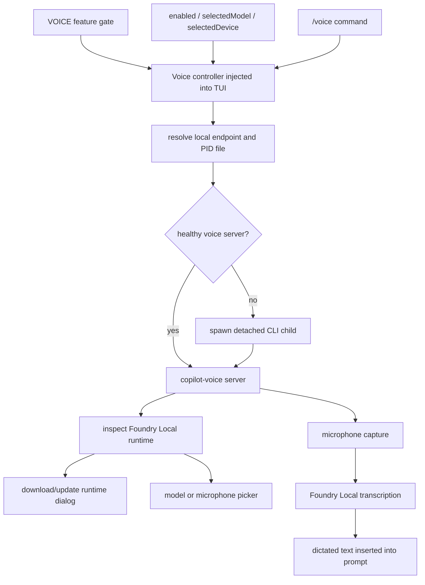

# Voice mode and Foundry Local

This document explains the voice-mode implementation in the extracted Copilot CLI `1.0.71` bundle. Voice mode records short dictation input, transcribes it locally through Microsoft Foundry Local components, and feeds the resulting text back into the CLI input loop.

The current build no longer runs microphone capture and Foundry transcription in `voice-mic.worker.js` and `voice-foundry.worker.js`. The TUI connects to a reusable local `copilot-voice` server, spawning a detached CLI child when no healthy server is available. For that process boundary and the historical worker architecture it replaced, see [`voice-runtime-workers-and-transcription.md`](voice-runtime-workers-and-transcription.md).

The important implementation point is that voice mode is not just a UI toggle. It combines:

- the `/voice` slash command;
- the `VOICE` feature gate;
- persisted `voice.enabled`, `voice.selectedModel`, and `voice.selectedDevice` settings;
- a local socket/named-pipe RPC connection to the dedicated voice engine;
- runtime inspection/download/update dialogs;
- model selection and cache checks;
- TUI keybindings for recording and dictation.

This is the voice feature overview for [Runtime lifecycle](README.md). It explains the interactive command and settings surface; [Voice runtime server and transcription pipeline](voice-runtime-workers-and-transcription.md) explains the engine process and transport. Voice output feeds back into the same prompt/session path covered by [Context and model loop](../02-context-model-loop/README.md) and [Sessions, persistence, and remote](../04-sessions-persistence-remote/README.md).

Because `app.js` is bundled/minified, symbol names are unstable. Line references below are searchable anchors in the extracted bundle and will shift across releases.

## Source anchors

| Semantic alias | Minified anchor | Approx. `app.js` line | Role |
|---|---|---:|---|
| Slash command | `/voice`, `voice-models`, `voice-devices` | 2438 | `/voice [on\|off\|models\|devices]` manages activation and opens model/device pickers. |
| Runtime settings | `voice:{enabled, selectedModel, selectedDevice}` | 4347, 4404 | Voice state and a stable microphone descriptor are persisted in regular settings. |
| Endpoint resolver | `Axn(...)`, `copilot-voice`, `COPILOT_VOICE_SERVER_INSTANCE` | 4402 | Resolves a version/user-scoped Unix socket or Windows named pipe plus PID file. |
| Dedicated server spawn | `Cxn(...)`, `Txn(...)`, `kxn(...)` | 4404 | Reuses a live server when possible or spawns a detached CLI child in voice-server mode. |
| Engine controller | `Fxn(...)`, `Nxn(...)` | 4404 | Owns connection/start/shutdown state and subscribes to engine snapshots and fatal errors. |
| Engine boot environment | `COPILOT_VOICE_SERVER_MODE`, `COPILOT_VOICE_SERVER_BOOT` | 4404 | Marks the child process and transfers sanitized voice boot settings. |
| TUI injection | `voiceActivation`, `voice-devices` dialog | 2438, 4427 | The slash command toggles the active engine or opens a picker supplied by the TUI. |
| Installer boundary | `voice-installer.worker.js`, `foundry-local-sdk` | package worker, 4404 | Runtime installation remains isolated, while capture/transcription moved behind the voice server. |

## Capability map



## Feature gate and command availability

The static feature table includes `VOICE:"staff"`. The slash-command list is then filtered by feature flags and staff state before being exposed to the TUI. Around the interactive setup area, the bundle constructs built-in slash commands with a `voiceEnabled:e.VOICE` option and removes staff-only commands for non-staff users.

The `/voice` command itself is marked `staffOnly: true` in the analyzed bundle. That means the command implementation can exist in the binary even when it is not visible to most users.

## /voice command behavior

The command accepts these subcommands:

| Command | Behavior |
|---|---|
| `/voice` | Runs the default enable/setup path. |
| `/voice on` | Enables voice mode. |
| `/voice off` | Disables voice mode and persists `voice.enabled:false`. |
| `/voice models` | Opens runtime/model inspection and model picker flow. |
| `/voice devices` | Opens the microphone picker and persists the selected device. |

If an unknown subcommand is passed, the command returns an error with the usage string `/voice [on|off|models|devices]`.

The `models` and `devices` branches open dialogs directly. Activation uses `voiceActivation`; if the engine is unavailable in the build, the command returns `Voice engine is not available in this build.`

## Runtime inspection and download/update flow

The `/voice models` branch calls `inspectRuntime()` and branches on the result:

| Runtime result | User-visible behavior |
|---|---|
| `unsupported-platform` | Show `Voice mode is not supported on this platform.` |
| runtime currently installing | Show that the runtime is still downloading. |
| `not-downloaded` | Open `voice-runtime-download` in first-use mode. |
| `update-available` | Open `voice-runtime-download` in update mode. |
| downloaded/ready | Open `voice-models` picker. |

The normal enable path calls `enable({ modelId })` when a selected model is available. The result can be:

| Enable result | Behavior |
|---|---|
| `enabled` | Persist `voice.enabled:true`, reload config, and continue. |
| `no-model-selected` | Open the voice model picker. |
| `model-not-cached` | Open the voice model picker so the user can cache/select a model. |
| `runtime-missing` | Open runtime download dialog for first use. |
| `runtime-outdated` | Open runtime update dialog. |
| `runtime-unsupported` | Return unsupported-platform message. |
| `error` | Return an error timeline entry. |

## Settings persistence

The settings schema contains:

| Setting | Meaning |
|---|---|
| `voice.enabled` | Whether voice mode should be active on startup. |
| `voice.selectedModel` | The selected Foundry Local transcription model ID. |
| `voice.selectedDevice` | Stable microphone identity as `{ name, occurrence }`; `null` selects the default device. |

The command loads settings through the same settings helper used elsewhere in the CLI, updates the `voice` object, writes it, and then calls `reloadConfig()` so the interactive runtime sees the new value.

When a selected model is deleted or unavailable, the voice controller clears `selectedModel`, disables voice, and emits an informational message that voice mode was disabled because the selected model was deleted.

## Dedicated voice server

`Axn(...)` derives a local endpoint from the CLI version and user identity. Unix builds use a restricted socket directory and Windows uses a named pipe; both use a PID file to distinguish a live reusable server from stale state.

`kxn(...)` implements connect-or-spawn behavior. It tries a live PID first, removes or works around stale endpoint state, and otherwise calls `Txn(...)` to launch a detached CLI child with `COPILOT_VOICE_SERVER_MODE=1`. The sanitized `voice` boot object is serialized through `COPILOT_VOICE_SERVER_BOOT`; it includes only `enabled`, `selectedModel`, and normalized `selectedDevice` fields.

The client uses framed JSON-RPC over the local socket. `Fxn(...)` owns start, snapshot subscription, fatal-error handling, and shutdown. This keeps microphone/native model work outside the TUI process and lets multiple interactive restarts reconnect to the same version-scoped engine.

## Foundry runtime version audit

The installer path still loads `foundry-local-sdk/deps_versions.json` and validates expected keys:

- `foundry-local-core.nuget`;
- `onnxruntime.version`;
- `onnxruntime-genai.version`.

If the JSON shape changes, the error text references an audit checklist in the source tree. This suggests the CLI pins assumptions about Foundry Local installer package names and versions, then maps platform-specific packages such as Linux GPU or Foundry ONNX Runtime packages.

## Platform support

The runtime platform map includes entries such as:

| Platform key | Runtime target |
|---|---|
| `win32-x64` | `win-x64` |
| `win32-arm64` | `win-arm64` |
| `linux-x64` | `linux-x64` |
| `darwin-arm64` | `osx-arm64` |

Unsupported platforms return `runtime-unsupported` / `unsupported-platform`, which is surfaced by `/voice` rather than falling through to a generic failure.

## TUI integration

When enabled and ready, the TUI displays:

> Voice ready. Hold `space` to record, or `ctrl+x v` to toggle dictation.

The implementation distinguishes readiness/warming state from runtime installation state. On startup, if settings say voice is enabled and a selected model exists, the voice hook calls `enable({ modelId })`. If the runtime is missing or outdated, it emits a warning telling the user to run `/voice`.

This makes persisted voice state optimistic but safe: the setting can survive restarts, while actual recording is blocked until runtime and model checks pass.

## Relationship to custom providers named Foundry Local

The help text elsewhere in the bundle also mentions “Foundry Local” as an OpenAI-compatible custom provider example for `COPILOT_PROVIDER_BASE_URL`. That is a separate model-provider path.

Voice mode uses Foundry Local for local dictation transcription through `foundry-local-sdk`; BYOK/custom provider mode uses OpenAI-compatible HTTP endpoints for LLM calls. They share a brand name but are different subsystems in `app.js`.

## End-to-end enable flow

```mermaid
sequenceDiagram
    participant User
    participant Slash as /voice
    participant Settings
    participant Voice as Voice controller
    participant Server as copilot-voice server
    participant Runtime as Foundry runtime
    participant TUI

    User->>Slash: /voice on
    Slash->>Settings: load config
    Slash->>Voice: requestEnable()
    Voice->>Server: connect or spawn; start engine
    Server->>Runtime: inspect runtime and model cache
    alt runtime missing or outdated
        Slash-->>TUI: show voice-runtime-download dialog
    else no model or model not cached
        Slash-->>TUI: show voice-models dialog
    else enabled
        Slash->>Settings: write voice.enabled=true
        Slash->>TUI: reload config / no-op result
    else unsupported/error
        Slash-->>TUI: error or info timeline entry
    end
```

## Relationship to other docs

- `voice-runtime-workers-and-transcription.md` explains the current dedicated server boundary and preserves the removed `1.0.54` worker design as historical context.
- `tui-and-slash-commands.md` explains how slash commands and dialogs are surfaced.
- `settings-config-persistence.md` explains the settings load/write/reload path.
- `feature-gates.md` explains static feature tiers such as `VOICE:"staff"`.
- `loader-bootstrap.md` explains the secure module-loading wrapper used by vendored native modules.
- `models-providers-auth.md` explains the separate BYOK/custom-provider Foundry Local mention.
