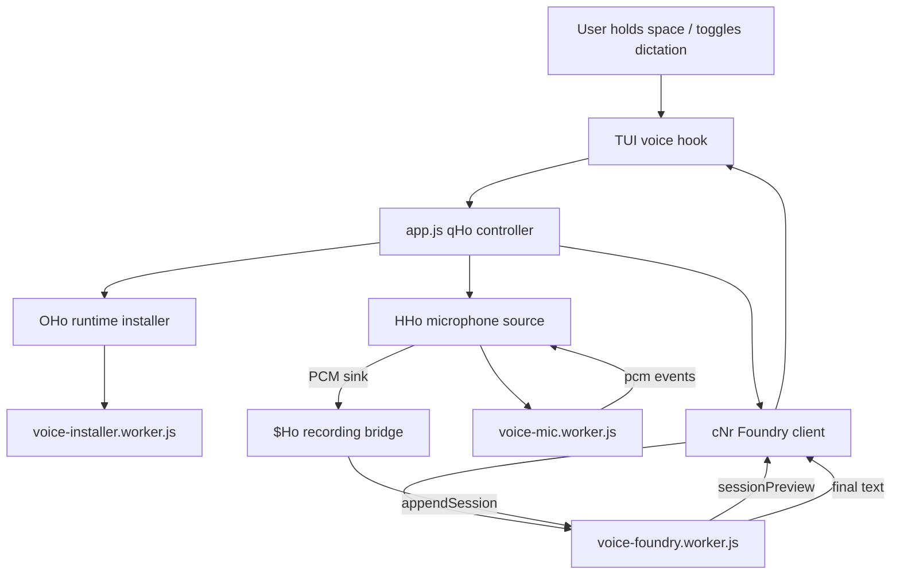
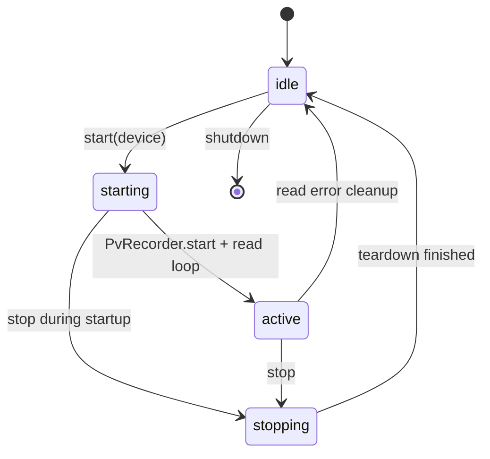
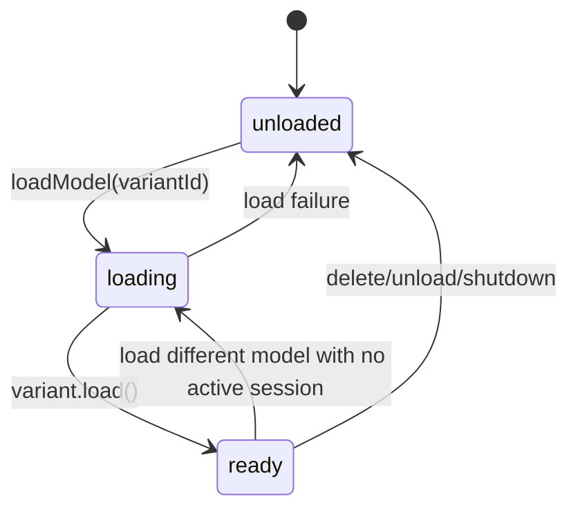
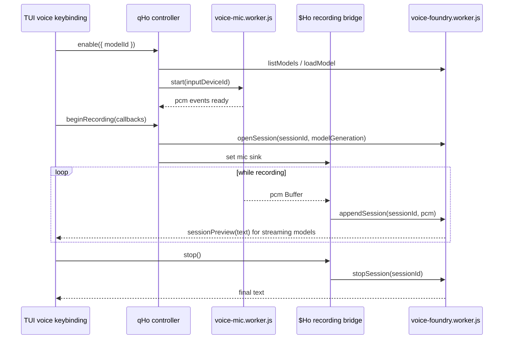

# Voice runtime workers and transcription pipeline

This document drills into the voice-mode backend that sits below [`voice-mode-foundry-local.md`](voice-mode-foundry-local.md). The existing voice-mode page explains the staff-gated `/voice` command, settings, runtime inspection, model picker, and TUI entry points. This page focuses on the core code paths that actually record audio, install/locate the Foundry Local runtime, load speech models, and turn PCM buffers into preview/final text.

The analyzed implementation is split across `app.js` and three bundled worker files:

- `copilot-cli-pkg/voice-mic.worker.js` captures microphone PCM through `@picovoice/pvrecorder-node`.
- `copilot-cli-pkg/voice-installer.worker.js` resolves/downloads the Foundry Local native runtime.
- `copilot-cli-pkg/voice-foundry.worker.js` manages Foundry Local models and transcription sessions.

Because these files are bundled/minified, line numbers are approximate. The worker bundles are mostly one-line payloads, so the exact string anchors and offsets are more useful than line numbers.

## MVP placement

This is the voice backend deep dive for [Runtime lifecycle](README.md). Read [Voice mode and Foundry Local](voice-mode-foundry-local.md) first for the user-facing command/settings path, then use this page to trace worker-thread RPC, microphone PCM capture, runtime installation, model loading, streaming previews, final transcription, and cleanup. The resulting text re-enters the normal prompt/session flow rather than creating a separate model pipeline.

## Source anchors

| Semantic alias | Minified anchor | Approx. location | Role |
|---|---|---:|---|
| Voice hook/controller | `qHo(...)` | `app.js` ~6861 | React-style voice controller: inspect runtime, warm model, open mic, expose `enable`, `disable`, `selectModel`, and status. |
| Recording bridge | `$Ho(...)` | `app.js` ~6861 | Binds a loaded Foundry model handle to a microphone source and forwards PCM chunks into an active transcription session. |
| Model-handle wrapper | `GHo(...)` | `app.js` ~6861 | Loads a model through the Foundry client and returns `beginRecording(...)` / `cancelCurrentRecording()`. |
| Foundry RPC client | `cNr` / `UHo(...)` | `app.js` ~6861 | Main-thread wrapper around `voice-foundry.worker.js` RPC methods and events. |
| Foundry recording session | `uNr` | `app.js` ~6861 | Per-recording session wrapper; forwards `appendSession`, `stopSession`, `cancelSession`, and `sessionPreview`. |
| Foundry worker channel | `FHo(...)` | `app.js` ~6861 | Creates the `voice-foundry.worker.js` worker RPC channel with `nativeLocation`. |
| Mic worker channel | `QHo(...)` | `app.js` ~6861 | Creates the `voice-mic.worker.js` worker RPC channel and decodes transferable PCM buffers. |
| Microphone source adapter | `HHo(...)` | `app.js` ~6861 | Main-thread adapter for mic `start`/`stop` plus `pcm` and `error` subscriptions. |
| Runtime installer | `OHo(...)` / `ZFa(...)` | `app.js` ~6861 | Caches runtime inspection and launches `voice-installer.worker.js` for install/update. |
| Slash command entry | `/voice`, `inspectRuntime`, `voice-runtime-download`, `voice-models` | `app.js` ~4916 | User-facing control path that triggers runtime/model dialogs and calls the controller. |
| TUI session injection | `voice:e.VOICE ? { ... }` | `app.js` ~7342 | Injects voice controller methods into the interactive session only when the `VOICE` gate is enabled. |
| Mic backend state machine | `var O=1600,C=15,l=class{...}` | `voice-mic.worker.js` line 59 | Opens `PvRecorder`, reads PCM frames, emits `pcm`, and handles start/stop/shutdown. |
| Runtime install state | `var J=1,b=".complete"`, platform map | `voice-installer.worker.js` line 59 | Builds the runtime cache path, validates required files, and marks completed downloads. |
| Foundry backend state machine | `var h=class{managerPromise;state={tag:"unloaded"}...}` | `voice-foundry.worker.js` line 59 | Lists/downloads/loads models and opens streaming or batch transcription sessions. |

## High-level pipeline



The split is deliberate. The main TUI process owns settings, UI state, status text, and lifecycle cleanup. Native code and long-running voice work are isolated behind worker-thread RPC channels:

- mic capture can fail or block without freezing the TUI;
- Foundry Local runtime/model operations run outside the TUI loop;
- PCM buffers are transferred rather than copied when possible;
- shutdown can terminate or dispose each subsystem independently.

## Main-thread controller in `app.js`

The voice controller created by `qHo(...)` is the runtime coordinator. It keeps a small state machine in React state:

| State | Meaning |
|---|---|
| `off` | No active voice runtime, mic, or Foundry client. |
| `preparing` | Runtime/model checks are in progress before a first activation. |
| `installing` | The installer worker is downloading or updating Foundry Local. |
| `warming` | Runtime is present and the model/mic/client are being opened. |
| `ready` | A selected model is loaded and the mic source is ready for recordings. |
| `error` | Activation or backend operation failed. |

The `enable({ modelId })` path serializes work through an internal promise chain so overlapping enable/disable/select operations do not race. It:

1. chooses the requested model ID or the persisted selected model;
2. calls `installer.inspect()`;
3. maps installer states to `runtime-unsupported`, `runtime-missing`, `runtime-outdated`, or a downloaded `location`;
4. checks whether the selected model exists and is cached through `client.listModels()`;
5. constructs an owned `{ client, mic }` pair when needed;
6. opens the microphone source;
7. warms up the Foundry model with `GHo(...)`;
8. sets state to `ready` and fires the “Voice ready” notification after the first warmup.

When the selected model changes, `qHo(...)` cancels any current recording before switching the active model. On fatal backend failure, it aborts the active controller, moves to `error`, and disposes the owned mic/client pair.

## Recording bridge: `$Ho(...)`

`$Ho(...)` is the short-lived object for one recording. It joins a loaded model handle from `GHo(...)` with the microphone source from `HHo(...)`.

Runtime flow:

1. Open a Foundry transcription session through `modelHandle.openSession(callbacks)`.
2. Ensure the microphone source is open.
3. Set the microphone sink to a callback that receives each PCM `Buffer`.
4. For each PCM chunk:
   - call optional `onPcm`;
   - call `session.append(buffer)`;
   - if append fails while active, unset the sink, surface `onError`, and cancel the session.
5. On `stop()`:
   - unset the sink;
   - call `session.stop()`;
   - deliver the final text through `onFinal`.
6. On `cancel()`:
   - unset the sink;
   - call `session.cancel()`;
   - resolve even if cancel itself fails.

This bridge is where audio becomes model input. Everything above it is UI/setup; everything below it is mic or Foundry worker implementation.

## Microphone worker

`voice-mic.worker.js` exposes a tiny RPC backend with four methods:

| Method | Behavior |
|---|---|
| `start({ inputDeviceId })` | Loads `@picovoice/pvrecorder-node`, opens `PvRecorder`, starts the read loop. |
| `stop()` | Cancels startup or stops an active recorder, then releases it. |
| `getState()` | Returns `{ open: false }` for idle/starting/stopping and `{ open: true }` for active. |
| `shutdown()` | Stops the recorder and clears event subscribers. |

The worker state machine is:



Important constants and behavior:

- `O=1600` is passed as the `PvRecorder` frame length.
- `C=15` is passed as the recorder buffered-frame/count argument.
- The default device is `-1` when no `inputDeviceId` is supplied.
- Starting a different device while one is starting/active returns `device-busy`.
- Loading failures become `mic-unavailable` errors with a reinstall hint.
- Opening failures stop/release any partially-created recorder before throwing.
- `runReadLoop(...)` repeatedly awaits `recorder.read()`, converts returned PCM into a `Buffer`, and emits `pcm`.
- Read failures stop and release the recorder, reset state to `idle`, and emit an `error` event.

The worker posts PCM as a transferable event:

| Event | Payload |
|---|---|
| `pcm` | `{ buffer, byteOffset, byteLength }`, transferred back to the parent thread. |
| `error` | Serialized `VoiceBackendError` or generic error. |

`app.js` decodes the `pcm` event back into a `Buffer` before handing it to `HHo(...)`.

## Runtime installer worker

`voice-installer.worker.js` is responsible for turning “voice runtime is needed” into a concrete native library location.

### Platform and cache resolution

The worker maps supported Node platform/architecture pairs to Foundry runtime IDs:

| Node key | Foundry runtime directory |
|---|---|
| `win32-x64` | `win-x64` |
| `win32-arm64` | `win-arm64` |
| `linux-x64` | `linux-x64` |
| `darwin-arm64` | `osx-arm64` |

Unsupported pairs throw a user-facing “Voice mode is not supported” error. The cache path is:

```text
<COPILOT_CACHE_HOME or default cache root>/foundry/<hash>/<runtime-dir>
```

The `<hash>` is derived from a schema number and the expected Foundry/ONNX artifacts, so a dependency version change moves the runtime to a new cache directory.

### Version audit

The worker requires two upstream Foundry Local files to have the expected shape:

- `foundry-local-sdk/script/install-utils.cjs` must export `runInstall`.
- `foundry-local-sdk/deps_versions.json` must include:
  - `foundry-local-core.nuget`;
  - `onnxruntime.version`;
  - `onnxruntime-genai.version`.

Those checks are defensive source-shape audits. Their error strings explicitly mention re-running the source audit checklist if the upstream SDK layout changes.

### Download and atomic install

Install flow:

1. Check for `.complete` plus required runtime files.
2. If missing, post `download-started` to the parent.
3. Create a sibling temporary directory named like `.tmp-<runtime>-<pid>-<timestamp>`.
4. Run Foundry Local `runInstall(artifacts, { binDir: tmp })` while suppressing stdout/stderr noise.
5. Verify required files exist in the temporary directory.
6. Write the `.complete` sentinel.
7. Rename the temporary directory into the final cache path.
8. If rename collides with an already-complete runtime, delete the temporary directory and reuse the existing install.

On Windows, the returned location also reports whether `Microsoft.WindowsAppRuntime.Bootstrap.dll` exists. The Foundry worker later uses that to add a `Bootstrap` setting when creating the manager.

## Foundry worker

`voice-foundry.worker.js` is the transcription backend. It exposes these RPC methods:

| Method | Behavior |
|---|---|
| `listModels()` | Reads Foundry catalog models and returns ASR variants with cached/model metadata. |
| `downloadModel({ variantId, downloadId })` | Downloads one variant and emits progress. |
| `deleteModel({ variantId })` | Removes a cached model, unless an active session blocks deletion. |
| `loadModel({ variantId })` | Loads a cached model and returns a `modelGeneration`. |
| `openSession({ sessionId, modelGeneration })` | Opens a streaming or batch transcription session for the loaded model. |
| `appendSession({ sessionId, pcm })` | Appends PCM to the active session. |
| `stopSession({ sessionId })` | Stops the session and returns `{ text }`. |
| `cancelSession({ sessionId })` | Cancels and tears down the active session. |
| `shutdown()` | Cancels active work, unloads the selected model, and clears events. |

### Manager and model lifecycle

The worker initializes `FoundryLocalManager.create(...)` with:

- `appName: "github-copilot-cli"`;
- `libraryPath` from the installer result;
- additional settings `{ AzureCatalogFilter: "'',test" }`;
- `Bootstrap: "true"` on Windows when the installer reports that Windows App Runtime bootstrap is needed.

Model state moves through:



The `modelGeneration` number prevents stale UI handles from opening sessions after a model was changed. `app.js` stores the generation returned by `loadModel(...)`; `openSession(...)` rejects with `stale-model` if the currently loaded model no longer matches that generation.

### Streaming vs batch transcription

The worker chooses the transcription mode from the variant alias:

- aliases containing `streaming` use `createLiveTranscriptionSession()`;
- other ASR variants use a temporary WAV file and batch `transcribe(path)`.

Streaming session flow:

1. Create and start the Foundry live transcription session.
2. `appendSession(...)` forwards PCM directly to `foundrySdkSession.append(pcm)`.
3. `runStreamingDrain(...)` reads `foundrySdkSession.getStream()`.
4. Non-final text is appended to `tail`; final text is appended to `committed` and clears `tail`.
5. Each update emits `sessionPreview` with `committed + tail`.
6. `stopSession(...)` calls `foundrySdkSession.stop()` and waits for the drain task, with a timeout.

Batch session flow:

1. Create a temporary file named `voice-foundry-batch-<sessionId>.wav` under `os.tmpdir()` or the configured temp dir.
2. Write a placeholder WAV header.
3. `appendSession(...)` writes PCM chunks and increments data size.
4. `stopSession(...)` finalizes the WAV header.
5. Call `variant.createAudioClient().transcribe(wav.path)` and return `text ?? ""`.
6. Delete the WAV file in `finally`.

Batch mode has no live preview because transcription happens only after the WAV file is finalized.

## Main-thread Foundry client wrapper

`cNr` wraps the Foundry worker RPC channel in a main-thread client API:

- `listModels()` forwards `listModels`.
- `downloadModel(variantId, onProgress)` creates a `downloadId`, subscribes to `modelDownloadProgress`, and filters progress by that ID.
- `loadModel(variantId)` returns a handle with `openSession(callbacks)`.
- `dispose()` shuts the worker down and notifies active sessions.

`uNr` is the per-recording session object returned by `openSession(...)`:

| Method/event | Runtime behavior |
|---|---|
| `sessionPreview` event | Delivered as `callbacks.onPreview(text)` while the session is still open. |
| `append(buffer)` | Calls worker `appendSession`; transfers the underlying `ArrayBuffer` when the buffer covers it exactly. |
| `stop()` | Calls worker `stopSession` and delivers `callbacks.onFinal(text)`. |
| `cancel()` | Calls worker `cancelSession`; errors are swallowed because cancel is best-effort cleanup. |
| dispose notification | Marks the session errored and calls `callbacks.onError(...)`. |

This wrapper keeps recording-session state (`open`, `stopping`, `final`, `cancelled`, `errored`) on the main side so UI callbacks cannot fire after terminal states.

## End-to-end dictation sequence



## Failure and cleanup behavior

| Failure point | Handling |
|---|---|
| Runtime unsupported/missing/outdated | `qHo(...)` returns a structured result; `/voice` opens the runtime download/update dialog or reports unsupported platform. |
| Model not selected or not cached | `qHo(...)` returns `no-model-selected` / `model-not-cached`; UI opens the model picker. |
| Mic backend missing | `voice-mic.worker.js` returns `mic-unavailable` with a reinstall hint. |
| Mic read error | Worker emits `error`; `qHo(...)` logs a warning and cancels the current recording so the next recording can recover. |
| Append failure | `$Ho(...)` unsets the mic sink, calls `onError`, and cancels the Foundry session. |
| Stale model generation | Foundry worker rejects `openSession` with `stale-model`; main wrapper cleans up the session handle. |
| Streaming drain timeout | `stopStreaming(...)` fails with `session-timeout` after the timeout wrapper. |
| Windows native dependency missing | Foundry manager initialization maps dependency-load errors to a Visual C++ Redistributable message. |
| Shutdown | `qHo.shutdown()` aborts active state, cancels recording, closes mic, disposes Foundry client, and worker shutdown callbacks clear subscribers. |

## Relationship to other docs

- [`voice-mode-foundry-local.md`](voice-mode-foundry-local.md) covers `/voice`, settings, model picker, and TUI affordances.
- [`loader-bootstrap.md`](loader-bootstrap.md) covers the secure native-module routing that makes `foundry-local-sdk` and `@picovoice/pvrecorder-node` loadable from the extracted package.
- [`settings-config-persistence.md`](../03-tools-integrations-security/settings-config-persistence.md) covers the settings helpers used to persist `voice.enabled` and `voice.selectedModel`.
- [`observability-update-shutdown.md`](../05-hosted-agent-ops/observability-update-shutdown.md) covers the broader shutdown-service pattern that voice uses for Foundry client disposal.