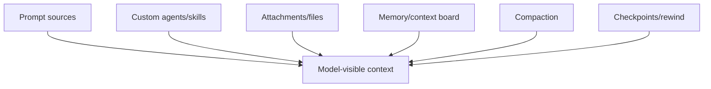

# Context and input

Everything that becomes model-visible context: prompts, custom instructions, attachments, memory, compaction, and rewind boundaries.

## How this volume fits

## Pages

| Page | Why read it | File |
|---|---|---|
| [Prompt sources in `app.js`](./prompt-sources.md) | Static/runtime prompt sources, YAML package prompts, instructions, MCP prompts, hooks, and provider mapping. | `prompt-sources.md` |
| [Custom agents and skills packaging](./custom-agents-and-skills-packaging.md) | AGENTS.md, SKILL.md, plugin/remote/provided agents, skill directories, and enable/disable events. | `custom-agents-and-skills-packaging.md` |
| [Attachment and file-ingestion pipeline](./attachments-and-file-ingestion.md) | Native image/document attachments, tagged-file fallback, MIME detection, payload mapping, and limits. | `attachments-and-file-ingestion.md` |
| [Memory and dynamic context board in `app.js`](./memory-and-context-board.md) | Agentic memory API, local memory, dynamic context board, rem-agent, sidekicks, and shutdown consolidation. | `memory-and-context-board.md` |
| [Conversation compaction and memory compression in `app.js`](./conversation-compaction.md) | /compact, automatic compaction, summary replacement, checkpoints, hooks, telemetry, and UI status. | `conversation-compaction.md` |
| [Checkpoints, undo, rewind, and fork](./checkpoints-undo-rewind.md) | /undo, /rewind, /fork, event-log truncation/replay, snapshot_rewind, and workspace events. | `checkpoints-undo-rewind.md` |

## Reading guidance

- This volume explains how input becomes prompt/context.
- Compaction and rewind describe how context is later rewritten or replayed.

## Back to wiki home

- [Wiki home](../README.md)
- [Full table of contents](../SUMMARY.md)
