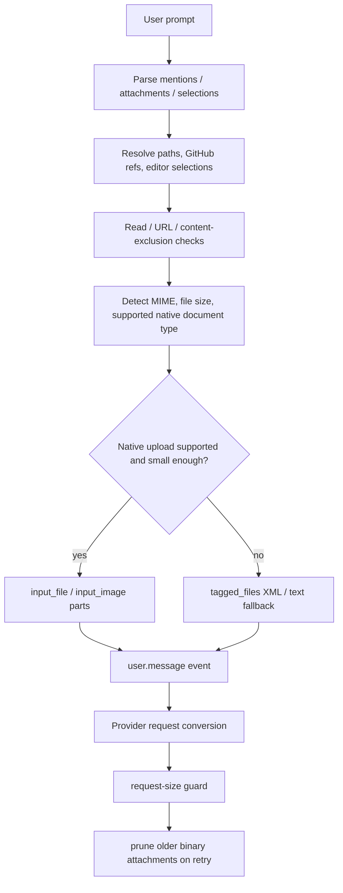

# Attachment and file-ingestion pipeline

This document explains how the extracted Copilot CLI bundle ingests files, images, native documents, editor selections, and GitHub references before they become model input.

The implementation in `app.js` is not a single attachment subsystem. It is a cross-cutting path through prompt parsing, permission checks, MIME detection, request-size budgeting, provider-specific payload conversion, retry logic, and session events.

## Source anchors

| Area | `app.js` anchor | Evidence |
|---|---|---|
| Native file payloads | `input_file` | File attachments are converted into Responses-style `input_file` content parts. |
| Native image payloads | `input_image`, `image_url` | Images are represented either as `input_image` or image URL/data content depending on provider path. |
| Document MIME support | `application/pdf`, `docx`, `application/vnd.openxmlformats-officedocument...` | The bundle contains native document MIME mapping for PDF and common Office/OpenDocument formats. |
| Native document read result | `base64Data`, `mimeType`, `filename` | Path-backed and inline documents are normalized into base64 data plus MIME metadata. |
| Message event schema | `attachments`, `supportedNativeDocumentMimeTypes`, `nativeDocumentPathFallbackPaths` | `user.message` records original attachments and which native documents stayed or fell back. |
| Size guard | `The attached image or document is too large to send natively through CAPI Responses` | The Responses request path computes serialized size and raises a native-attachment-specific error. |
| Retry cleanup | `binary_attachments_removed` | Older binary attachments can be removed from retried requests to avoid request-size failures. |

Representative line anchors from the analyzed bundle:

- line `1026`: native document MIME mapping, base64 document readers, token/request-size estimation for files and images, and Chat-to-Responses content conversion.
- line `3367`: base64/data payload normalization for file and image content.
- line `3439`: retry path that emits `binary_attachments_removed` after removing old image/native document payloads.
- line `3459`: CAPI Responses request-size validation and native attachment error text.
- line `4361`: `user.message` event schema includes attachments and native-document metadata.
- line `4471`: session replay/message conversion turns attachment records into model-visible message parts and tagged-file fallback text.

## High-level flow

The important design point is that the CLI preserves both the **user-facing attachment record** and the **provider-specific payload representation**. Session history can keep enough metadata to replay or render the user message while the provider request path can choose the compact/native or text/tagged representation it needs.

## Attachment classes

`app.js` handles several attachment-like inputs:

| Class | Typical runtime representation | Notes |
|---|---|---|
| Text files | Tagged-file text context | Usually converted to model-visible text with path/provenance wrappers. |
| Editor selections | Selection attachment/context | IDE selection may flow through the same prompt assembly path as file attachments. |
| Images | `input_image` / `image_url` / image content | Token budgeting treats images separately from text. |
| Native documents | `input_file` plus `file_data`, `file_id`, `filename` | PDF and Office/OpenDocument formats have explicit native MIME support. |
| Inline documents | Base64 plus MIME metadata | Inline base64 can be normalized into native document data if MIME is supported. |
| GitHub references | GitHub-reference attachment entries | Later converted into repository/issue/PR context text or MCP/GitHub-backed content. |
| MCP resource results | Resource/image/content records | MCP can return binary or resource-like outputs that participate in the same model-output and context rules. |

The file-type support is partly extension-based and partly signature-based. Around line `1021`, the bundle contains a file-type detector with entries such as `%PDF` mapping to `application/pdf`, plus Office MIME strings. Around line `1026`, a smaller map defines supported native document extensions such as `.doc`, `.docx`, `.odt`, `.pdf`, `.ppt`, `.pptx`, `.xls`, and `.xlsx`.

## Native document detection

The native document path has three visible stages.

### 1. MIME lookup

A helper checks file extension and normalized MIME type. In the evidence scan this appears around line `1026` as a map from file extensions to document MIME values, including:

| Extension family | Native MIME class |
|---|---|
| `.pdf` | `application/pdf` |
| `.doc`, `.docx` | Microsoft Word / OpenXML Word document |
| `.ppt`, `.pptx` | Microsoft PowerPoint / OpenXML presentation |
| `.xls`, `.xlsx` | Microsoft Excel / OpenXML spreadsheet |
| `.odt` and related formats | OpenDocument document classes |

Unsupported documents are not read as native documents. The bundle logs that the attachment does not resolve to a supported native document MIME type and skips the native read path.

### 2. Size check

The native document reader applies a maximum size before producing base64. The evidence scan shows a `32 * 1024 * 1024` constant near the native-document helpers. If the document is too large, the code records a warning/error path and returns no native payload.

That local read limit is separate from the later provider request-size guard. A document can be small enough to read but still make the final serialized provider request too large.

### 3. Base64 normalization

For accepted native documents, the read result has the shape implied by these fields:

| Field | Role |
|---|---|
| `base64Data` | Base64 document body. |
| `mimeType` | Normalized MIME type for provider routing. |
| `filename` | Display/provenance name used in the provider content part. |

Inline document data follows a similar path: the CLI validates the MIME type, normalizes the base64 string, creates a filename/provenance label, and rejects it if it crosses the size threshold.

## Message event shape

The session event schema at line `4361` describes `user.message` with fields for:

| Field | Meaning |
|---|---|
| `content` | The displayed user prompt. |
| `transformedContent` | The model-facing transformed prompt when XML wrappers/timestamps/context are added. |
| `attachments` | Files, selections, or GitHub references attached to the message. |
| `supportedNativeDocumentMimeTypes` | Normalized document MIME types that were sent natively instead of through tagged-file XML. |
| `nativeDocumentPathFallbackPaths` | Path-backed native documents that had to remain in the tagged-file path because native upload would exceed request limits. |

This schema matters for replay. During session replay, line `4471` shows the session taking the stored attachment records, computing native `parts`, collecting `failedNativeDocumentPaths`, and appending tagged-file fallback text when needed.

## Provider payload conversion

The bundle maps between multiple provider message formats.

One visible conversion around line `1026` converts Chat-style content into Responses-style content parts:

| Input content type | Output content type |
|---|---|
| text | `input_text` |
| image URL | `input_image` |
| file | `input_file` |

The conversion keeps image detail when present and maps file objects to `file_data`, `file_id`, and `filename`.

A later normalization path around line `3367` rewrites data URLs and raw base64 file data before sending. That path handles both image and file content, including `input_image`, `input_file`, `image`, and `document` style parts.

## Token and request-size budgeting

The CLI has two related but different accounting paths.

### Token estimation

Around line `1026`, the bundle estimates token cost for images, files, and documents. Images receive a model-dependent fixed-ish estimate depending on detail (`high`, `auto`, or lower detail). File/document estimates use serialized filename and base64 length approximations.

This is used for context budgeting, not as the final wire-size limit.

### Serialized request-size validation

Around line `3459`, the Responses provider path serializes the request and compares it with `getCapiResponsesMaxRequestSizeBytes()`. If the request contains `input_file` or `input_image`, the error message is attachment-specific:

> The attached image or document is too large to send natively through CAPI Responses. Try a smaller attachment or fewer attachments.

If the request is large for non-attachment reasons, the error is phrased as a general request-size failure.

## Fallback and retry behavior

The bundle has two fallback mechanisms.

### Native-to-tagged fallback

When a path-backed document cannot be sent natively, the session conversion path tracks it through `nativeDocumentPathFallbackPaths`. Those paths stay in the older tagged-file/text context path so the model can still receive useful content, assuming the text extraction/read path succeeds.

### Binary pruning on retry

If a provider rejects a request because it is too large, the retry path can remove older binary attachments from previous user messages while preserving the latest user message. Around line `3439`, the code emits `binary_attachments_removed` with counts for:

- `imagesRemoved`
- `filesRemoved`
- `largeImagesRemoved` when applicable

Telemetry aggregation later folds those counts into model-call metrics.

## Permission and security boundaries

The attachment path inherits the CLI's normal safety systems rather than bypassing them:

- path-backed file attachments require file read access;
- URL-backed attachments intersect with URL allow/deny rules;
- content exclusion can remove or redact repository content;
- native binary payloads are size-capped before upload;
- failed or unsupported native document paths fall back to tagged text rather than silently disappearing;
- session events retain metadata needed for audit/replay without treating provider-specific base64 as the only source of truth.

## User-visible implications

| Situation | Expected behavior |
|---|---|
| Small supported PDF/Office document | Sent natively where provider/model supports it. |
| Unsupported document type | Skips native path and may use text/tagged fallback if available. |
| Large native document | Rejected from native read or sent through fallback path. |
| Request too large due to attachments | Error explicitly mentions attached image/document size. |
| Retry after request-size failure | Older binary attachments may be pruned and reported through `binary_attachments_removed`. |
| Session resume/replay | Attachment metadata is replayed and reconverted into model-visible parts/fallbacks. |

## Relationship to other docs

- `prompt-sources.md` explains where attachments enter prompt assembly.
- `model-api-routing.md` explains provider endpoint selection.
- `resilience-rate-limits-concurrency.md` mentions request-too-large retry behavior.
- This document fills the gap between those topics: how attachment records become provider-specific payloads and fallback text.
