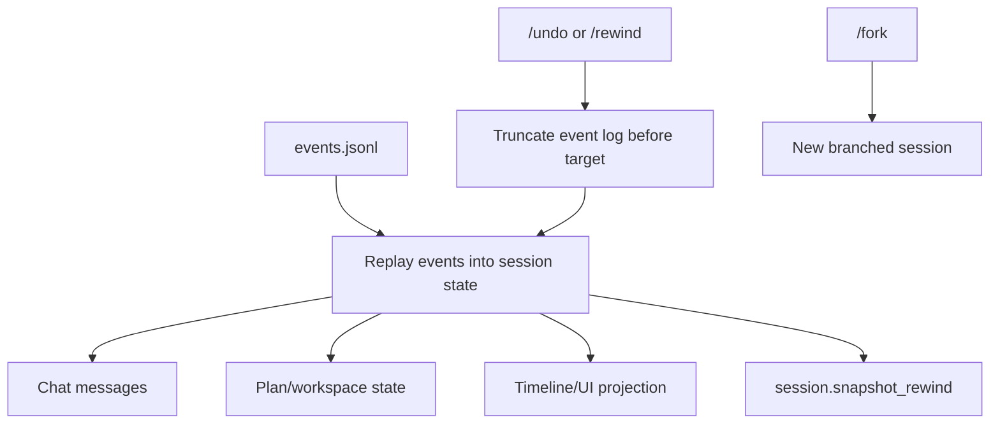
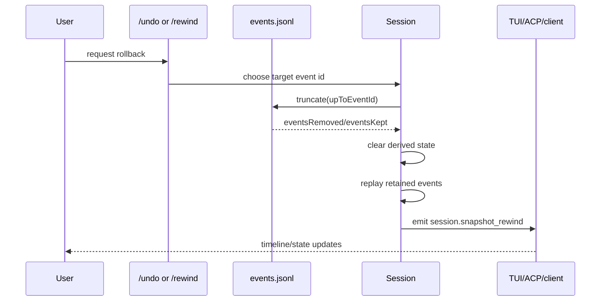

# Checkpoints, undo, rewind, and fork

This document explains the checkpoint/rewind mechanics visible in the extracted Copilot CLI `app.js` bundle. The user-visible surface includes `/undo`, `/rewind`, and `/fork`, while the core implementation is event-sourced session truncation and replay.

The important implementation point is that rewind is not implemented as an ad-hoc UI-only mutation. The session event log is truncated to a chosen event boundary, in-memory state is rebuilt by replaying remaining events, and a `session.snapshot_rewind` event is emitted so clients can update their UI.

Because `app.js` is bundled/minified, symbol names are unstable. Line references below are searchable anchors in the extracted bundle and will shift across releases.

## Source anchors

| Semantic alias | Minified anchor | Approx. `app.js` line | Role |
|---|---|---:|---|
| Slash constants | `/rewind`, `/undo`, `/fork` | 4643, 4942 | The command table exposes rewind/undo/fork surfaces. |
| Fork command help | `Fork the current session into a new session, optionally with a name` | 4942 | Fork is a separate session-branching surface. |
| Event schema | `session.snapshot_rewind`, `upToEventId`, `eventsRemoved` | 4361 | Rewind emits structured metadata about the cutoff event and removed event count. |
| JSONL truncation | `truncate`, `eventsRemoved`, `eventsKept`, `events.jsonl` | 236 | Persistent local session history can be rewritten up to an event ID. |
| State replay | reset chat/system/original messages, `processEventForState`, `emitEphemeral("session.snapshot_rewind")` | 4471 | In-memory state is rebuilt from retained events after rewind. |
| Telemetry | `session_snapshot_rewind`, `events_removed`, `up_to_event_id` | 4033, 4491, 5745 | Rewind is tracked as a first-class telemetry/session event. |
| Workspace sidecar events | `session.plan_changed`, `session.workspace_file_changed` | 4361, 4477, 4487 | Session workspace artifacts have their own events and can participate in post-rewind UI state. |
| Compaction checkpoints | `compactionCheckpointLength`, `compactionCheckpointEventIndex`, `evictTransientEventsBeforeIndex` | 4475 | Compaction uses checkpoints to replace/evict earlier transient context safely. |
| Session-store schema | `idx_checkpoints_session`, `checkpoints(session_id)` | 4582 | The SQLite store has checkpoint-related indexing for historical/session analysis. |

## Conceptual model

## Event-sourced session state

The session implementation stores and processes an ordered list of events. Those events drive derived state such as:

- chat messages;
- system-context messages;
- original user messages;
- invoked skills;
- compaction checkpoints;
- workspace/plan state;
- pending tool or external-tool requests;
- UI timeline projection.

This design makes rewind feasible: instead of trying to reverse every side effect individually, the runtime can remove events after a boundary and replay the remaining history to reconstruct state.

## Persistent truncation

The local session filesystem helper includes a `truncate` operation for `events.jsonl`:

1. Load events from the session state path.
2. Find the target event ID.
3. Keep only events before the target index.
4. Rewrite `events.jsonl` with the retained JSONL content.
5. Return counts for `eventsRemoved` and `eventsKept`.

The event schema says `upToEventId` is the event ID that was rewound to and that “this event and all after it were removed.” The JSONL helper slices before the matching index, so the target event is part of the removed suffix.

## In-memory rewind

After truncation, the session resets derived state and replays retained events. The bundle clears fields such as chat messages, system context, original user messages, invoked skills, handoff context, and compaction checkpoint state, then calls the event processor for each retained event.

After replay, it emits an ephemeral event:

| Event | Data |
|---|---|
| `session.snapshot_rewind` | `upToEventId`, `eventsRemoved` |

The event is ephemeral because it describes a runtime UI update about the snapshot operation rather than durable conversation content to keep for future replay.

## `/undo` versus `/rewind`

The evidence in `app.js` clearly exposes both slash-command constants and the shared `session.snapshot_rewind` mechanism. The exact command-to-target selection logic is minified/scattered, but the likely division is:

| Surface | Role |
|---|---|
| `/undo` | A quick rollback to a recent change/turn boundary. |
| `/rewind` | A richer rewind UI or command path for selecting an earlier event/snapshot boundary. |

Both ultimately need the same primitive: identify a target event ID, truncate the event log, rebuild state, and notify clients through `session.snapshot_rewind`.

## Forking a session

`/fork` is documented in the command table as:

> Fork the current session into a new session, optionally with a name.

Forking is different from rewind. Rewind mutates the current session history by removing events after a boundary. Fork creates a new session branch, preserving the current one. That gives users a way to explore an alternative path without destroying the original timeline.

The command accepts an optional name and validates it before proceeding. The implementation is marked experimental in the analyzed bundle.

## Checkpoints in compaction

The word “checkpoint” appears in several contexts. The most visible in-session use is compaction:

- `session.compaction_start` records the current message length and event index;
- `session.compaction_complete` replaces earlier context with a summary;
- transient events before the checkpoint can be evicted after compaction is applied;
- telemetry records compaction start/complete metrics.

This is not the same as `/undo`, but it uses the same event-sourced idea: preserve a safe boundary before rewriting derived conversation context.

## Workspace sidecar state

The session workspace emits structured events when sidecar artifacts change:

| Event | Meaning |
|---|---|
| `session.plan_changed` | Plan file was created, updated, or deleted. |
| `session.workspace_file_changed` | A file under the session workspace files directory was created or updated. |

These events matter for rewind because they are part of the session event stream that clients use to project state. File-system side effects made by tools may not be magically undone by event replay, but session-owned artifacts and UI state are tracked through events.

## Telemetry and observability

Rewind produces telemetry with:

| Metric/property | Meaning |
|---|---|
| `session_snapshot_rewind` | Telemetry event kind. |
| `event_id` | The `session.snapshot_rewind` event ID. |
| `up_to_event_id` | Boundary event ID used for truncation. |
| `events_removed` | Number of events removed. |

This makes rollback behavior visible in logs/metrics without exposing full event contents.

## End-to-end rewind flow

## Edge cases and limitations

- If the target event ID is not found, truncation throws an explicit error.
- Rewind reconstructs session state from events; it should not be assumed to reverse arbitrary external effects outside the session store.
- Transient events such as deltas/progress may already have been evicted by compaction or session cleanup.
- Fork is safer than rewind when the user wants to preserve the original branch.

## Relationship to other docs

- `session-support-implementation.md` explains event-sourced local session persistence.
- `conversation-compaction.md` explains compaction checkpoints and transient-event eviction.
- `system-events-and-ui-projection.md` explains how `session.snapshot_rewind` reaches UI clients.
- `embedded-server-acp-protocol.md` explains how session events are forwarded to external clients.
- `observability-update-shutdown.md` explains telemetry and shutdown metrics.
