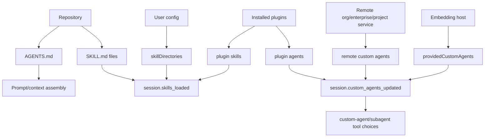
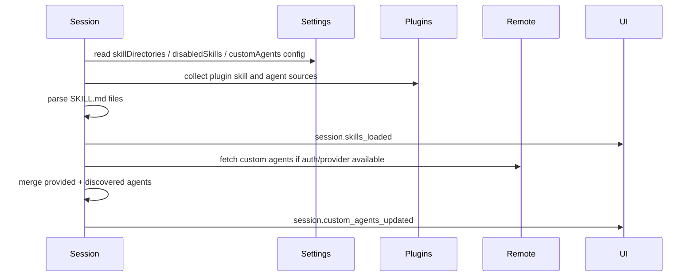

# Custom agents and skills packaging

This document explains how custom agents and skills are packaged, discovered, loaded, enabled/disabled, and surfaced in the extracted Copilot CLI `app.js` bundle. Existing docs cover prompts and task orchestration broadly; this document focuses on the packaging surfaces: `AGENTS.md`, `SKILL.md`, skill directories, plugin contributions, remote/custom-agent sources, and session events such as `session.skills_loaded` and `session.custom_agents_updated`.

The important implementation point is that “customization” is multi-layered:

- instruction files such as `AGENTS.md` influence prompt/context;
- `SKILL.md` files define reusable skills and sometimes slash-command-like invocations;
- custom agent markdown/config files define specialized agents with prompts, tools, models, MCP servers, and skills;
- plugins can contribute both skills and agents;
- remote/project/inherited sources can merge into a session.

Because `app.js` is bundled/minified, symbol names are unstable. Line references below are searchable anchors in the extracted bundle and will shift across releases.

## Source anchors

| Area | Anchor strings / minified symbols | Approx. `app.js` line | What it shows |
|---|---|---:|---|
| Instruction files | `AGENTS.md`, `Nested AGENTS.md`, `Child instruction files` | 499 | Repo/cwd/inherited instruction files are discovered and folded into prompt context. |
| Skill files | `SKILL.md`, `skillsParseSkillMarkdown`, `allowedTools`, `userInvocable`, `disableModelInvocation` | 525 | Skills are parsed from markdown files and normalized into runtime metadata. |
| Skill settings | `skillDirectories`, `disabledSkills` | 239, 4471 | Settings can add skill search roots and disable named skills. |
| Skill events | `session.skills_loaded`, `enableSkill`, `disableSkill`, `emitSkillsChanged` | 4361, 4396, 4471 | Loaded/enabled skill metadata is emitted to clients and updated dynamically. |
| Custom-agent settings | `customAgents:{defaultLocalOnly}`, `customAgentsLocalOnly` | 239, 4471 | Settings/runtime options control custom-agent discovery scope. |
| Agent events | `session.custom_agents_updated`, `emitCustomAgentsUpdated` | 4361, 4475 | Session emits agent metadata, warnings, and errors after load/merge. |
| Provided agents | `providedCustomAgents`, `mergeProvidedCustomAgents` | 4471, 4475 | Agents passed by the host are merged with discovered agents and de-duplicated. |
| Remote agents | `agents/swe/custom-agents`, `include_sources=org,enterprise` | 2789 | Remote custom agents can be loaded from GitHub service endpoints. |
| Plugin agents | `source:{type:"plugin", pluginName, marketplaceName, filePath}` | 2789 | Plugins can package custom-agent definitions. |
| Agent execution | `customAgents`, `disableModelInvocation`, `executeAgent`, `Unknown agent type` | 3735, 4043 | Agent names become callable subagent/custom-agent types when model invocation is enabled. |

## Packaging map

## Instruction files versus skills versus agents

The bundle distinguishes three related concepts:

| Concept | File/source | Runtime role |
|---|---|---|
| Instructions | `AGENTS.md`, `.github/copilot-instructions.md`, nested/child instruction files | Add prompt context and rules. |
| Skills | `SKILL.md` or command markdown | Add reusable capability descriptions, optional allowed tools, and optional user-invocable commands. |
| Custom agents | Agent markdown/config from user/project/plugin/remote/provided sources | Add specialized subagent personas with prompts, tools, models, MCP servers, and skills. |

This distinction matters because disabling a skill does not remove a custom agent, and instruction files are prompt context rather than callable tools.

## `AGENTS.md` discovery

The instruction-discovery path looks for model/instruction files including:

- `copilot-instructions.md` under `.github`;
- `AGENTS.md` in repository or working-directory locations;
- `CLAUDE.md` and `GEMINI.md` compatibility files;
- nested `AGENTS.md`;
- child instruction files when enabled.

The bundle labels discovered content with source/location metadata such as repository, working directory, nested agents, and child instructions. These entries feed prompt assembly rather than the `session.custom_agents_updated` event.

## Skill discovery

Skills are loaded from multiple roots:

- configured `skillDirectories`;
- plugin-contributed skill directories;
- built-in/default skill locations;
- markdown command files that can be parsed as user-invocable skills/commands.

The loader checks each directory for a direct `SKILL.md` or for child directories containing `SKILL.md`. It deduplicates by real path and skill name, collects warnings/errors, and returns normalized skill metadata.

## Skill metadata

A parsed skill includes fields such as:

| Field | Meaning |
|---|---|
| `name` | Unique skill identifier. |
| `description` | Human-readable description. |
| `source` | Source type such as project, personal, plugin, etc. |
| `filePath` | Path to the `SKILL.md` definition when available. |
| `baseDir` | Directory containing the skill. |
| `allowedTools` | Optional tools auto-approved/allowed while the skill is active. |
| `content` | Full skill markdown content injected when invoked. |
| `userInvocable` | Whether users can invoke the skill directly. |
| `disableModelInvocation` | Whether the model should not invoke it as an agent/tool capability. |
| `pluginName` / `pluginVersion` | Plugin provenance when contributed by a plugin. |

`skill.invoked` events include name, path, content, allowed tools, and plugin provenance, showing that skill content can be injected into the conversation when used.

## Skill enable/disable lifecycle

The settings schema includes `disabledSkills`. At runtime:

| Method/API | Behavior |
|---|---|
| `enableSkill(name)` | Removes the name from `disabledSkills`, persists/config-refreshes, and emits updated skill metadata. |
| `disableSkill(name)` | Adds the name to `disabledSkills`, persists/config-refreshes, and emits updated skill metadata. |
| `emitSkillsChanged()` | Emits `session.skills_loaded` with `enabled` flags derived from `disabledSkills`. |
| Skill reload API | Clears caches, reloads skills, and returns load diagnostics. |

The `session.skills_loaded` event includes each skill’s name, description, source, user-invocable flag, enabled flag, and path.

## Custom-agent sources

Custom agents can originate from several places:

| Source | Evidence / behavior |
|---|---|
| Host-provided agents | `providedCustomAgents` are set from runtime options and merged before emitting updates. |
| User/project discovery | Discovery respects config discovery and local-only settings. |
| Plugins | Plugin agent files parse into agents with plugin provenance. |
| Remote service | Endpoint path like `agents/swe/custom-agents/<owner>/<repo>` can return project/org/enterprise agents. |
| Inherited/remote metadata | Event schema allows source values such as user, project, inherited, remote, and plugin. |

When no auth info or provider is available, the bundle skips remote/custom-agent loading and emits only provided agents.

## Custom-agent metadata

The `session.custom_agents_updated` schema emits agents with:

| Field | Meaning |
|---|---|
| `id` | Stable identifier, falling back to name. |
| `name` | Internal name. |
| `displayName` | Human-readable display name. |
| `description` | Description shown to users/model prompts. |
| `source` | Source location: user, project, inherited, remote, or plugin. |
| `tools` | Allowed/requested tools, nullable. |
| `userInvocable` | Whether a user can directly choose/invoke the agent. |
| `model` | Optional default model for the agent. |
| `warnings` / `errors` | Load diagnostics for UI/debugging. |

The merge logic de-duplicates agents by normalized `id` or `name`, preserving host-provided agents first.

## Plugin-packaged agents

Plugin agent parsing can produce agents with:

- `name` and `displayName`;
- `description`;
- `tools` or default `*`;
- `prompt` loader;
- `mcpServers`;
- `model`;
- `disableModelInvocation`;
- `userInvocable`;
- `source:{ type:"plugin", pluginName, marketplaceName, filePath }`;
- `skills`.

This is why `plugin-extension-architecture.md` and this document overlap: plugins are a packaging vehicle, while custom agents/skills are runtime capabilities contributed by that vehicle.

## Agent execution integration

During tool/prompt construction, available custom agents are merged with built-in agent types. The runtime filters out agents with `disableModelInvocation:true` when building model-invocable agent lists.

Agent dispatch maps a requested agent name to:

- built-in general-purpose agent path;
- built-in specialized agent path;
- custom agent executor path;
- error if the agent type is unknown.

Custom agents can also select or override models, including inherited auto-mode behavior from the parent session.

## `/env` visibility

The environment/status command path lists loaded components. Evidence shows output sections for:

- MCP servers;
- skills;
- custom agents;
- plugins.

For skills it includes source and path. For custom agents it lists display names. This is the main user-facing inventory for verifying whether packaging/discovery succeeded.

## End-to-end load flow

## Relationship to other docs

- `prompt-sources.md` explains how instruction files and invoked skills become model-visible context.
- `plugin-extension-architecture.md` explains plugin install/cache/config and plugin-contributed capabilities.
- `agent-task-orchestration.md` explains how custom agents participate in subagent execution.
- `built-in-tool-execution-pipeline.md` explains how allowed tools and tool filters affect execution.
- `settings-config-persistence.md` explains `skillDirectories`, `disabledSkills`, and custom-agent settings persistence.
