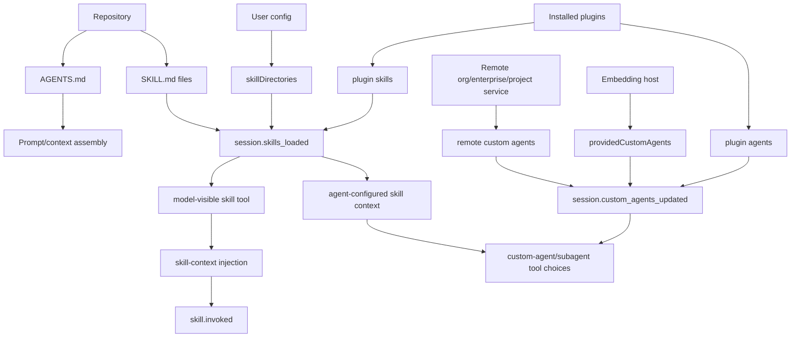
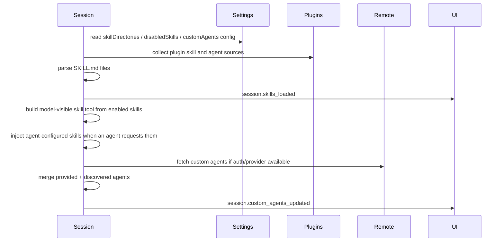
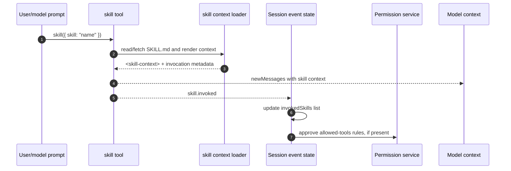

# Custom agents and skills packaging

This document explains how custom agents and skills are packaged, discovered, loaded, enabled/disabled, invoked, and surfaced in the extracted Copilot CLI `app.js` bundle. Existing docs cover prompts and task orchestration broadly; this document focuses on the customization surfaces: `AGENTS.md`, `SKILL.md`, built-in skills, skill directories, plugin contributions, remote/custom-agent sources, the model-visible `skill` tool, and session events such as `session.skills_loaded`, `skill.invoked`, and `session.custom_agents_updated`.

The important implementation point is that “customization” is multi-layered:

- instruction files such as `AGENTS.md` influence prompt/context;
- `SKILL.md` files define reusable skills and sometimes slash-command-like invocations;
- custom agent markdown/config files define specialized agents with prompts, tools, models, MCP servers, and skills;
- plugins can contribute both skills and agents;
- remote/project/inherited sources can merge into a session.

Because `app.js` is bundled/minified, symbol names are unstable. Line references below are searchable anchors in the extracted bundle and will shift across releases.

## Source anchors

| Semantic alias | Minified anchor | Approx. `app.js` line | Role |
|---|---|---:|---|
| Instruction files | `AGENTS.md`, `Nested AGENTS.md`, `Child instruction files` | 499 | Repo/cwd/inherited instruction files are discovered and folded into prompt context. |
| Skill files | `SKILL.md`, `skillsParseSkillMarkdown`, `skillsParseCommandMarkdown`, `allowedTools`, `userInvocable`, `disableModelInvocation` | 525 | Skills and command markdown files are parsed and normalized into runtime metadata. |
| Skill loader | `I9(...)`, `sWr(...)`, `cbi(...)`, `aWr(...)` | 525 | Resolves skill roots, reads direct/child `SKILL.md` files, loads command markdown, de-duplicates, caches, and returns diagnostics. |
| Built-in skills | `copilot-cli-pkg/builtin-skills/**/SKILL.md`, `customize-cloud-agent` | package tree | Packaged skills are loaded through the same skill loader as user/plugin skill roots. |
| Skill settings | `skillDirectories`, `disabledSkills` | 239, 4471 | Settings can add skill search roots and disable named skills. |
| Skill events | `session.skills_loaded`, `enableSkill`, `disableSkill`, `emitSkillsChanged` | 4361, 4396, 4471 | Loaded/enabled skill metadata is emitted to clients and updated dynamically. |
| Model-visible skill tool | `HVn(...)`, `LTe="skill"`, `QVn`, `_4n(...)`, `B0s(...)` | 4138 | Builds the `skill` tool, renders available-skill instructions, filters disabled/model-disabled skills, and loads selected skill context. |
| Skill context injection | `Aft(...)`, `<skill-context>`, `skillInvocation`, `S0s(...)` | 3146, 3085 | Reads skill body, wraps it as context, emits invocation metadata, and preserves invoked-skill instructions through compaction. |
| Skill slash commands | `/skills`, `pto(...)`, `R_t(...)`, `dHs(...)`, `JYn(...)`, `gGo(...)` | 1312, 4361, 4918, 6103 | Lists/info/reloads skills and exposes user-invocable skills as slash/available commands that prompt the model to call the `skill` tool. |
| Skill allowed tools | `allowed-tools`, `Xar(...)`, `w4n(...)`, `N6o(...)` | 4811, 6689 | Parses skill tool approvals and applies/restores session permission rules after a skill is invoked. |
| Custom-agent settings | `customAgents:{defaultLocalOnly}`, `customAgentsLocalOnly` | 239, 4471 | Settings/runtime options control custom-agent discovery scope. |
| Agent events | `session.custom_agents_updated`, `emitCustomAgentsUpdated` | 4361, 4475 | Session emits agent metadata, warnings, and errors after load/merge. |
| Provided agents | `providedCustomAgents`, `mergeProvidedCustomAgents` | 4471, 4475 | Agents passed by the host are merged with discovered agents and de-duplicated. |
| Remote agents | `agents/swe/custom-agents`, `include_sources=org,enterprise` | 2789 | Remote custom agents can be loaded from GitHub service endpoints. |
| Plugin agents | `source:{type:"plugin", pluginName, marketplaceName, filePath}` | 2789 | Plugins can package custom-agent definitions. |
| Agent execution | `customAgents`, `disableModelInvocation`, `executeAgent`, `Unknown agent type` | 3735, 4043 | Agent names become callable subagent/custom-agent types when model invocation is enabled. |

## Packaging map

## Instruction files versus skills versus agents

The bundle distinguishes three related concepts:

| Concept | File/source | Runtime role |
|---|---|---|
| Instructions | `AGENTS.md`, `.github/copilot-instructions.md`, nested/child instruction files | Add prompt context and rules. |
| Skills | `SKILL.md` or command markdown | Add reusable capability descriptions, optional allowed tools, and optional user-invocable commands. |
| Custom agents | Agent markdown/config from user/project/plugin/remote/provided sources | Add specialized subagent personas with prompts, tools, models, MCP servers, and skills. |

This distinction matters because disabling a skill does not remove a custom agent, and instruction files are prompt context rather than callable tools.

## `AGENTS.md` discovery

The instruction-discovery path looks for model/instruction files including:

- `copilot-instructions.md` under `.github`;
- `AGENTS.md` in repository or working-directory locations;
- `CLAUDE.md` and `GEMINI.md` compatibility files;
- nested `AGENTS.md`;
- child instruction files when enabled.

The bundle labels discovered content with source/location metadata such as repository, working directory, nested agents, and child instructions. These entries feed prompt assembly rather than the `session.custom_agents_updated` event.

## Skill discovery

Skills are loaded from multiple roots:

- configured `skillDirectories`;
- plugin-contributed skill directories;
- built-in/default skill locations such as `copilot-cli-pkg/builtin-skills`;
- markdown command files that can be parsed as user-invocable skills/commands.

The loader checks each directory for a direct `SKILL.md` or for child directories containing `SKILL.md`. It deduplicates by real path and skill name, collects warnings/errors, and returns normalized skill metadata.

`I9(...)` is the central loader. Its cache key includes project root, custom skill directories, config directory, environment skill directories, working directory, plugin/additional source paths, command source paths, and whether config discovery is enabled. That means a reload or config/source change can invalidate the cache, while repeated calls in the same environment can reuse the loaded skill set.

The same loader also accepts command markdown sources. Those parse through `skillsParseCommandMarkdown`, become `isCommand:true`, and are treated as user-invocable skills unless their frontmatter disables model invocation.

## Built-in skills in this artifact

The extracted package currently contains one built-in skill directory:

| Skill | File | User-invocable | Trigger/selection intent | What it contributes |
|---|---|---:|---|---|
| `customize-cloud-agent` | `copilot-cli-pkg/builtin-skills/customize-cloud-agent/SKILL.md` | `false` | Use when the user mentions `copilot-setup-steps`, Copilot setup steps, or configuring the Copilot cloud agent environment. | Guidance for `.github/workflows/copilot-setup-steps.yml`, preinstalling dependencies/tools, larger or self-hosted runners, Windows environments, Git LFS, environment variables/secrets, and cloud-agent firewall/proxy constraints. |

This skill is packaged content rather than JavaScript logic. Its YAML frontmatter provides the runtime metadata:

| Frontmatter field | Observed value / meaning |
|---|---|
| `name` | `customize-cloud-agent` |
| `description` | Describes customization of the Copilot cloud agent environment, including setup steps, tools/dependencies, runners, and settings. |
| `user-invocable` | `false`, so it is intended for model/runtime selection rather than direct user invocation. |

The Markdown body is effectively an embedded GitHub Docs-style guide. It explains that Copilot cloud agent setup is controlled by `.github/workflows/copilot-setup-steps.yml`, whose single required job must be named `copilot-setup-steps`. The documented accepted job customizations are `steps`, `permissions`, `runs-on`, `services`, `snapshot`, and `timeout-minutes` with a maximum of `59`.

Notable implementation-relevant content in the built-in skill:

- setup steps only trigger for the cloud agent after the workflow exists on the repository default branch;
- changes to the setup workflow can be validated through normal GitHub Actions triggers such as `workflow_dispatch`, `push`, and `pull_request` on the setup file;
- `actions/checkout` `fetch-depth` is overridden by the platform so the agent can roll back commits while reducing security risk;
- setup failures skip remaining setup steps and let the agent continue with the current environment state;
- larger runners and self-hosted runners require network/firewall planning for GitHub/Copilot endpoints;
- self-hosted runner guidance emphasizes ephemeral, single-use runners;
- Windows cloud-agent environments are supported through appropriate Windows runners, but the integrated cloud-agent firewall is called out as incompatible with Windows;
- Git LFS requires `actions/checkout` with `lfs: true`;
- environment variables should be configured through the GitHub Actions `copilot` environment, using secrets for sensitive values.

Because the skill content includes external documentation links and operational guidance, it can materially change the model's answer when users ask about cloud-agent setup even though it does not add a new executable tool.

## Skill metadata

A parsed skill includes fields such as:

| Field | Meaning |
|---|---|
| `name` | Unique skill identifier. |
| `description` | Human-readable description. |
| `source` | Source type such as project, personal, plugin, etc. |
| `filePath` | Path to the `SKILL.md` definition when available. |
| `baseDir` | Directory containing the skill. |
| `allowedTools` | Optional tools auto-approved/allowed while the skill is active. |
| `content` | Full skill markdown content injected when invoked. |
| `userInvocable` | Whether users can invoke the skill directly. |
| `disableModelInvocation` | Whether the model should not invoke it as an agent/tool capability. |
| `pluginName` / `pluginVersion` | Plugin provenance when contributed by a plugin. |

`skill.invoked` events include name, path, content, allowed tools, and plugin provenance, showing that skill content can be injected into the conversation when used.

## Runtime invocation model

Skills are not injected wholesale into every prompt. The runtime uses a two-step design:

1. load lightweight metadata for all available skills;
2. expose a model-visible `skill` tool that can load the full selected skill on demand.

`HVn(...)` builds this tool. It reloads or reads the current skill set through `I9(...)`, merges additional runtime-provided skills, removes names in `disabledSkills`, and renders the remaining model-invocable subset into `<available_skills>` instructions. The tool schema is intentionally tiny:

| Field | Meaning |
|---|---|
| `skill` | Name of the skill to invoke, for example `pdf` or `code-reviewer`. |

The tool instructions tell the model to call the `skill` tool immediately when a matching skill is relevant, before answering in text. `disableModelInvocation:true` removes a skill from that advertised model-invocable list. The callback can still resolve any enabled loaded skill by exact name, which supports the instruction that an explicitly requested skill name may be invoked even if it was not listed.

When the tool runs successfully, `Aft(...)`:

- reads local skill markdown or fetches remote skill content;
- strips YAML frontmatter before exposing the instruction body;
- builds a `<skill-context name="...">` message;
- adds the skill base directory or remote-skill notice;
- includes a bounded related-file listing for local skills, with large directories summarized and noisy folders such as `.git`, `node_modules`, `dist`, and `build` skipped;
- returns `skillInvocation` metadata containing name, path, content, allowed tools, plugin provenance, and description.

The tool result adds `newMessages` sourced as `skill-<name>`, so the model sees the loaded skill context in the ongoing conversation. The session then emits `skill.invoked`, and replay state records the invocation in `invokedSkills`.

## Skill context after compaction

Compaction would otherwise risk summarizing away the exact skill instructions that shaped the current task. The replacement-history builder calls `S0s(...)` with the session's invoked-skill list:

- the most recent skill is preserved with full content and path under `<invoked_skills>`;
- earlier skills are retained as name/path references with an instruction to re-read the skill file if needed.

This is deliberately asymmetric: the active/latest skill remains directly model-visible after compaction, while older skills are compacted to pointers to save tokens.

## User-invocable skill commands

`userInvocable` controls whether a skill is exposed to the user as a slash-style command, not whether the model can use it. The user-facing flow has two related surfaces:

| Surface | Behavior |
|---|---|
| `/skills list` | Groups loaded skills by source, shows enabled/disabled state, and reports the count. |
| `/skills info <name>` | Shows source, location, description, and allowed tools for one skill. |
| `/skills reload` | Clears skill caches, reloads all roots, and reports warnings/errors. |
| User-invocable skill command | Converts `/skill-name optional text` into an agent prompt such as “Use the skill tool to invoke the `skill-name` skill…”. |
| SDK/ACP available commands | Includes enabled user-invocable skills in command lists; `session.skills_loaded` triggers available-command refreshes. |

Invoking a user-invocable skill command does not directly paste the skill file into the conversation. It queues a prompt instructing the agent to call the `skill` tool, so the same `HVn(...)`/`Aft(...)`/`skill.invoked` path is used.

## Allowed tools and permission side effects

Skill frontmatter can declare `allowed-tools`. The runtime parses those declarations into permission rules and applies them only after the skill is active.

The relevant flow is:

1. `skillsParseSkillMarkdown` or `skillsParseCommandMarkdown` reads `allowed-tools` into skill metadata.
2. `Aft(...)` copies those entries into `skillInvocation.allowedTools`.
3. `N6o(...)` listens for `skill.invoked` and calls `Xar(...)` to parse tool specs into approval rules.
4. The permission service receives `addApprovedRules(...)` for valid rules.
5. When a UI/session component mounts or restores state, it resets session tool approvals and reapplies rules for already invoked skills. If `allowedTools` metadata is missing, it falls back to parsing `allowed-tools` from the skill markdown body through `w4n(...)`.

Unknown tool specs are warning-only; valid specs still apply. This means `allowed-tools` is a session-scoped convenience after invocation, not a global bypass before the model selects a skill.

## Skill enable/disable lifecycle

The settings schema includes `disabledSkills`. At runtime:

| Method/API | Behavior |
|---|---|
| `enableSkill(name)` | Removes the name from `disabledSkills`, persists/config-refreshes, and emits updated skill metadata. |
| `disableSkill(name)` | Adds the name to `disabledSkills`, persists/config-refreshes, and emits updated skill metadata. |
| `emitSkillsChanged()` | Emits `session.skills_loaded` with `enabled` flags derived from `disabledSkills`. |
| Skill reload API | Clears caches, reloads skills, and returns load diagnostics. |

The `session.skills_loaded` event includes each skill’s name, description, source, user-invocable flag, enabled flag, and path.

Disabled skills are filtered out before the model-facing skill tool can load them. If the model nevertheless asks for one by name, the callback returns a failure telling the model that the skill is disabled and should be enabled with `/skills`.

## Custom-agent sources

Custom agents can originate from several places:

| Source | Evidence / behavior |
|---|---|
| Host-provided agents | `providedCustomAgents` are set from runtime options and merged before emitting updates. |
| User/project discovery | Discovery respects config discovery and local-only settings. |
| Plugins | Plugin agent files parse into agents with plugin provenance. |
| Remote service | Endpoint path like `agents/swe/custom-agents/<owner>/<repo>` can return project/org/enterprise agents. |
| Inherited/remote metadata | Event schema allows source values such as user, project, inherited, remote, and plugin. |

When no auth info or provider is available, the bundle skips remote/custom-agent loading and emits only provided agents.

## Custom-agent metadata

The `session.custom_agents_updated` schema emits agents with:

| Field | Meaning |
|---|---|
| `id` | Stable identifier, falling back to name. |
| `name` | Internal name. |
| `displayName` | Human-readable display name. |
| `description` | Description shown to users/model prompts. |
| `source` | Source location: user, project, inherited, remote, or plugin. |
| `tools` | Allowed/requested tools, nullable. |
| `userInvocable` | Whether a user can directly choose/invoke the agent. |
| `model` | Optional default model for the agent. |
| `warnings` / `errors` | Load diagnostics for UI/debugging. |

The merge logic de-duplicates agents by normalized `id` or `name`, preserving host-provided agents first.

Custom agents can also declare a `skills` array. During agent prompt construction, `zae(...)` maps those names to the loaded skill set and injects each matching skill's `<skill-context>` directly into that agent's context. Missing skills are logged as diagnostics rather than becoming fatal load errors.

## Plugin-packaged agents

Plugin agent parsing can produce agents with:

- `name` and `displayName`;
- `description`;
- `tools` or default `*`;
- `prompt` loader;
- `mcpServers`;
- `model`;
- `disableModelInvocation`;
- `userInvocable`;
- `source:{ type:"plugin", pluginName, marketplaceName, filePath }`;
- `skills`.

This is why `plugin-extension-architecture.md` and this document overlap: plugins are a packaging vehicle, while custom agents/skills are runtime capabilities contributed by that vehicle.

## Agent execution integration

During tool/prompt construction, available custom agents are merged with built-in agent types. The runtime filters out agents with `disableModelInvocation:true` when building model-invocable agent lists.

Agent dispatch maps a requested agent name to:

- built-in general-purpose agent path;
- built-in specialized agent path;
- custom agent executor path;
- error if the agent type is unknown.

Custom agents can also select or override models, including inherited auto-mode behavior from the parent session.

## `/env` visibility

The environment/status command path lists loaded components. Evidence shows output sections for:

- MCP servers;
- skills;
- custom agents;
- plugins.

For skills it includes source and path. For custom agents it lists display names. This is the main user-facing inventory for verifying whether packaging/discovery succeeded.

## End-to-end load flow

## End-to-end invocation flow

## Relationship to other docs

- `prompt-sources.md` explains how instruction files and invoked skills become model-visible context.
- `conversation-compaction.md` explains why the most recent invoked skill is preserved when old conversation turns are summarized.
- `plugin-extension-architecture.md` explains plugin install/cache/config and plugin-contributed capabilities.
- `agent-task-orchestration.md` explains how custom agents participate in subagent execution.
- `built-in-tool-execution-pipeline.md` explains how allowed tools and tool filters affect execution.
- `settings-config-persistence.md` explains `skillDirectories`, `disabledSkills`, and custom-agent settings persistence.
