# Memory and dynamic context board in Copilot CLI

This document explains the memory-related systems in the extracted `@github/copilot` CLI bundle. The implementation is easiest to understand as four cooperating layers:

1. **Agentic memory API**: service-backed memories injected into the main system prompt and curated through `store_memory` / `vote_memory` tools.
2. **Local repository memory strategy**: an optional in-repository JSONL strategy that writes `.github/copilot-memories.jsonl`.
3. **Dynamic context board**: a local, repository/branch-scoped scratchpad updated by `rem-agent` through `context_board`.
4. **Sidekick inbox retrieval**: background sidekicks that read memory/context signals and publish useful findings into the main session inbox.

These layers are related, but they are not the same storage system. The memory API is remote/service-backed. The context board is local session-store-backed state with its own tool and consolidation workflow.

For current-session context-window reduction, see [`conversation-compaction.md`](./conversation-compaction.md). Conversation compaction summarizes old transcript turns and replaces session messages; it does not write durable memories or dynamic context board entries.

## Source anchors

`app.js` is bundled/minified. This table uses semantic aliases first and keeps generated names only as lookup anchors for the analyzed `@github/copilot` bundle; they may shift across releases.

| Area | Semantic alias | Minified anchor | Approx. location | What it does |
|---|---|---:|---:|---|
| Memory feature resolver | `MemoryFeatureGateResolver` | `k0e(...)` | `app.js` 3625 | Enables cloud memory from `copilot-feature-agentic-memory` unless disabled; enables local memory from `copilot_swe_agent_memory_in_repo_store`. |
| Memory prompt loader | `loadMemoryPromptContext(...)` | `b6n(...)` | `app.js` 3625 | Calls the memory prompt endpoint, returning prompt text, counts, store instructions, and tool definitions. |
| Memory endpoint builder | `buildMemoryApiUrl(...)` | `V3e(...)`, `TIs(...)` | `app.js` 3625 | Builds internal memory API URLs for prompt, repository, and user scopes. |
| Memory tool constants | `STORE_MEMORY_TOOL_NAME`, `VOTE_MEMORY_TOOL_NAME` | `Zk`, `K3e` | `app.js` 3625 | Defines `store_memory` and `vote_memory`. |
| Memory tool provider | `MemoryToolProvider` | `W3e` | `app.js` 3694 | Builds store/vote tool schemas and callbacks, validates inputs, filters secrets, and requests permission. |
| Service memory strategy | `ServiceMemoryStrategy` | `Y3e` | `app.js` 3694 | Stores and votes memories through the memory service and emits memory-tool telemetry. |
| Local JSONL memory strategy | `JsonFileMemoryStrategy` | `FCr` | `app.js` 5730 | Stores local memories in `.github/copilot-memories.jsonl` and optimizes them at shutdown. |
| Memory tool loader | `loadMemoryTools(...)` | `Yjs(...)` | `app.js` 5734 | Creates memory tools from service definitions, test injections, or the local JSONL strategy. |
| Memory API cache loader | `loadMemoryApiCache(...)`, `getCachedMemoryPrompt(...)` | `nco(...)`, `t7n(...)` | `app.js` 5734 | Checks eligibility, fetches prompt API context, caches in-flight results, and invalidates on repository changes. |
| System prompt injection | `buildSystemPrompt(...)` call site | `X3e(...)` call | `app.js` 4481 | Passes enabled memory prompt text into the main system prompt. |
| Allowed-tool mapping | `AllowedToolsFrontmatterMap` | `T4n` | `app.js` 3194 | Maps `memory`, `store_memory`, and `vote_memory` to permission kind `memory`. |
| Memory permission dispatcher | `PermissionService.onMemory(...)` | `Kge(...)` branch | `app.js` 555 | Applies allow/deny/session rules and asks the user for memory store/vote approval when needed. |
| Memory permission UI | `MemoryPermissionPrompt` | `DOa(...)` | `app.js` 6599 | Displays memory update approval prompts in the TUI. |
| Context board formatter | `formatDynamicContextBoard(...)` | `K3n(...)` | `app.js` 3473 | Renders board metadata as a compact model-visible table and instructs agents to fetch full content. |
| Consolidation context builder | `buildMemoryConsolidationContext(...)` | `Rvs(...)`, `Z3n(...)` | `app.js` 3488-3507 | Builds `rem-agent` evidence from board entries, conversation turns, and latest checkpoint. |
| Context board tool | `createContextBoardTool(...)` | `cYn(...)`, `owe` | `app.js` 4339-4359 | Exposes `get`, `add`, `prune`, and `get_board` commands. |
| Dynamic context store | `DynamicContextStore` methods | method names preserved | `app.js` 4630-4637 | Persists board entries in `dynamic_context_items`. |
| Board initialization | `initDynamicContextBoard(...)` | source name preserved | `app.js` 5756 | Configures repository/branch board state on session create and resume. |
| Built-in REM agent | `BuiltInRemAgent` | built-in catalog row | `app.js` 4037 | Registers feature-gated `rem-agent` with side effects and `context_board` access. |
| `/subconscious run` macro | `subconsciousRunCommand(...)` | `Wps(...)`, `Udt` | `app.js` 1295, 1335-1340 | Tells the main agent to call `task` once for a background `rem-agent`. |
| Detached REM process | `spawnDetachedMemoryAgent(...)` | `T5a(...)` | `app.js` 7441 | Spawns a detached `copilot --agent rem-agent` during interactive shutdown when eligible. |
| Sidekick launch conditions | `SidekickLaunchConditions` | `d8s`, `p8s`, `f8s` | `app.js` 4463 | Launches sidekicks only when memories or board entries exist. |
| Sidekick manager | `SidekickAgentManager` | `_Et` | `app.js` 4463-4464 | Starts/cancels sidekick agents and publishes their findings through the inbox. |
| REM agent definition | `rem-agent.agent.yaml` | n/a | `copilot-cli-pkg/definitions/rem-agent.agent.yaml` | Defines the memory-consolidation agent prompt parts and `context_board` tool access. |
| Subconscious sidekick | `subconscious-agent.yaml` | n/a | `copilot-cli-pkg/definitions/sidekick/subconscious-agent.yaml` | Reads board entries and forwards relevant content to the inbox. |
| GitHub context sidekick | `github-context.yaml` | n/a | `copilot-cli-pkg/definitions/sidekick/github-context.yaml` | Uses local/GitHub/prior-session tools and sends high-signal context to the inbox. |

## Architecture at a glance

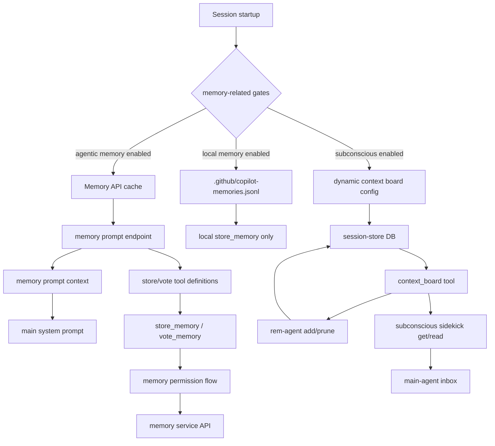

There are three important boundaries:

- **Memory API context** can be injected directly into the main system prompt.
- **Memory tools** mutate or curate service/local memory only after validation and permission checks.
- **Dynamic context board entries** are retrieved through `context_board`; the main default agent is normally excluded from direct board access, while specialized agents and sidekicks use it.

## Agentic memory API

The cloud memory path is enabled when the agentic-memory feature is on and the explicit disabled flag is not set. The local memory path is separately enabled by the in-repository memory-store flag.

| Mode | Gate behavior | Storage target | Tool surface |
|---|---|---|---|
| Cloud/service memory | Agentic memory enabled, not disabled; repository or user scope must be resolvable. | Internal memory service API. | `store_memory`; `vote_memory` if the service returns a vote tool definition. |
| Local/in-repository memory | In-repository memory-store flag enabled. | `.github/copilot-memories.jsonl` under the repository root. | `store_memory` only. |
| Test-injected memory | Runtime setting provides injected memory text. | No service dependency. | Prompt memory, optional vote tool for tests. |

### Prompt retrieval and caching

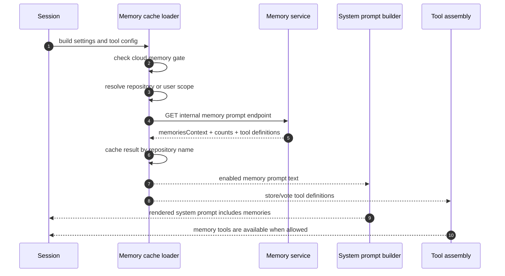

The prompt endpoint returns both **content** and **capabilities**:

- memory prompt text when at least one memory exists;
- memory counts for telemetry and sidekick launch decisions;
- store/vote tool descriptions and definition versions;
- store instructions that can be attached to the `store_memory` tool.

The observed request uses no retry wrapper for the prompt fetch. Failures are logged and converted into disabled memory context for that build instead of blocking the whole session.

The cache is repository-aware:

- if repository scope changes, the cached result and in-flight promise are invalidated;
- if no repository is known and user-scoped memory is not enabled, cloud memory is skipped;
- if HMAC/service settings require repository identity and no repository is known, cloud memory is skipped.

### System prompt injection

The memory prompt text is not a separate user message. It is passed into the main system-prompt builder when the memory API cache says memory is enabled.

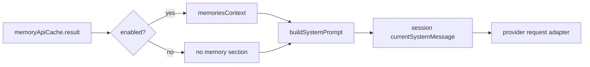

That means model-visible memories are part of the same top-level system context as identity, safety, tool instructions, custom instructions, MCP instructions, and runtime environment context.

## Memory tools

The runtime can expose two model tools:

| Tool | Purpose | Key input requirements | Storage path |
|---|---|---|---|
| `store_memory` | Store a concise fact for future code generation or review tasks. | `subject`, `fact`, `citations`, `reason`, and optionally `scope` when the service definition supports scopes. | Service API or local JSONL strategy. |
| `vote_memory` | Mark an existing memory as useful or incorrect/outdated. | Exact `fact`, `direction` of `upvote` or `downvote`, and `reason`. | Service API only when voting is supported. |

The store flow is defensive:

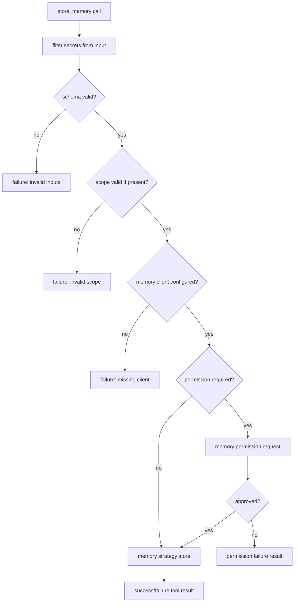

The vote flow is similar, but validates exact fact text, vote direction, and reason. It also verifies that the selected memory strategy actually supports voting.

### Local JSONL memory

The local in-repository strategy is simple and intentionally file-backed:

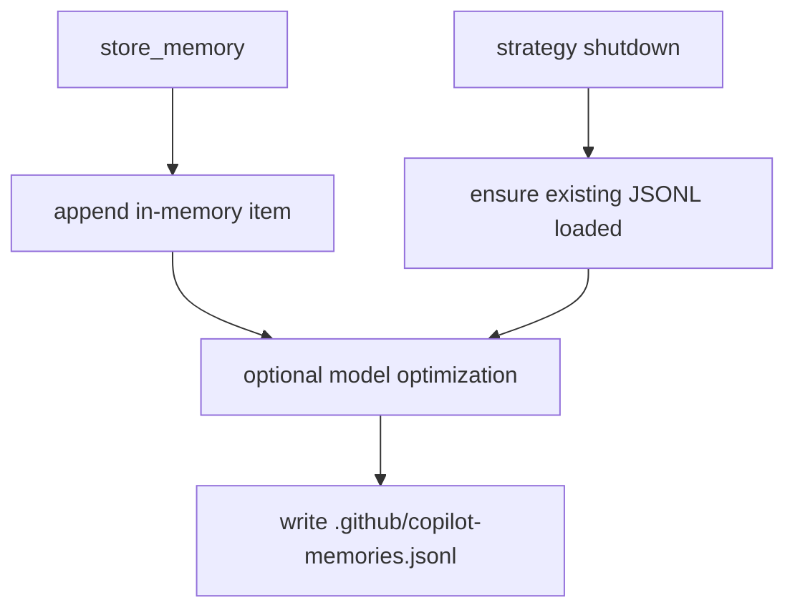

Local memory records include an id, subject, fact, citations, reason, and source metadata. On shutdown, the strategy can optimize the accumulated memories through a model call, then writes one JSON object per line to `.github/copilot-memories.jsonl`.

## Memory permissions

Memory writes and votes are treated as permissioned side effects. The permission kind is `memory`.

The broader permission service, including how `memory` rules interact with deny rules, session/location approvals, allow-all, and prompt/RPC surfaces, is documented in [`permission-system-design.md`](../05-security-and-policy/permission-system-design.md).

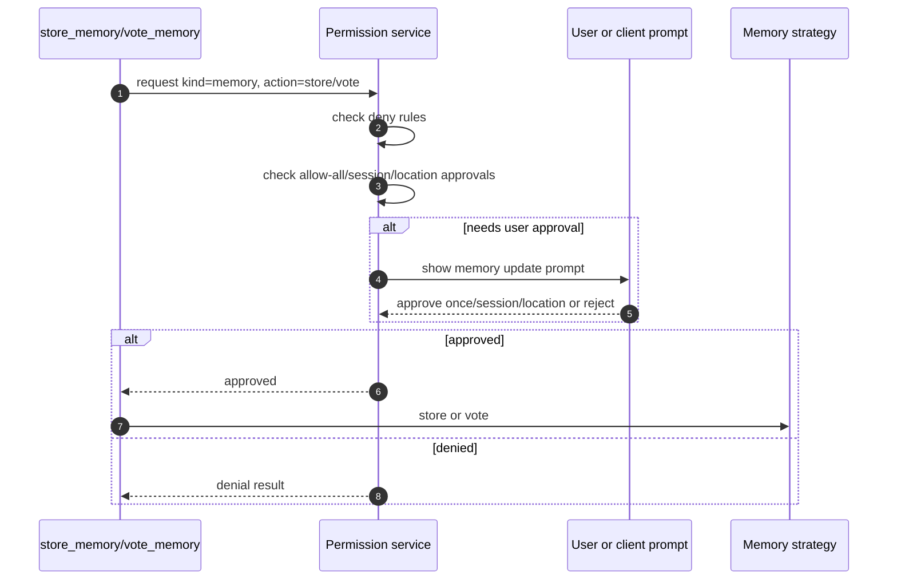

Observed permission surfaces:

- allow-tool frontmatter and CLI rule parsing map `memory`, `store_memory`, and `vote_memory` to permission kind `memory`;
- deny rules for `memory` block memory updates;
- a session approval stores `{ kind: "memory" }` as an approved rule;
- ACP permission conversion also preserves memory permission requests;
- the TUI prompt shows the fact, citations/scope for store, or direction/reason for vote.

## Dynamic context board

The dynamic context board is a small local board of reusable facts for one repository and branch. It is enabled by the subconscious feature flag and initialized when a session is created or resumed.

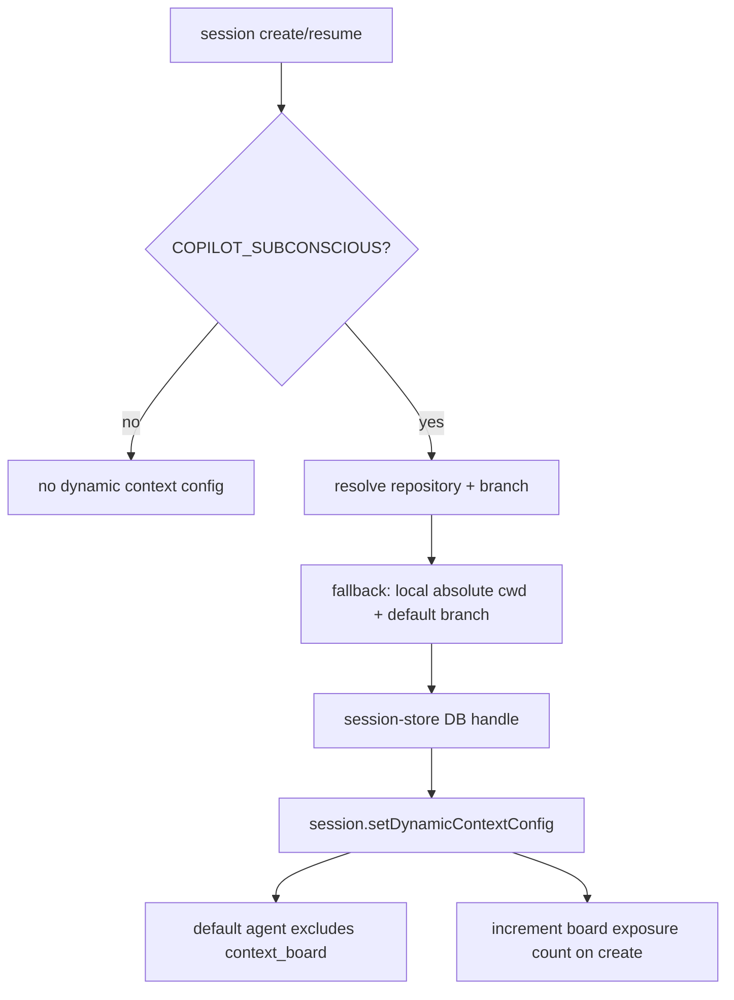

The board stores metadata separately from full content. Metadata is rendered into prompt/context tables; full content requires an explicit tool call.

| Field | Meaning |
|---|---|
| `repository` | Repository identifier or a local-path fallback. |
| `branch` | Git branch or default fallback. |
| `src` | Source of the item, usually `agent` or `user`. |
| `name` | Short kebab-case item identifier. |
| `description` | One-line list summary. |
| `content` | Full reusable context body. |
| `read_count` | Incremented when an item is retrieved with `get`. |
| `count` | Incremented when a new eligible session sees the board. |

### Board rendering

The board formatter emits an XML-like `<dynamic_context_board>` section containing a Markdown table with `src`, `name`, `description`, `read_count`, and `count`. It explicitly tells the model to call `context_board` with `command: "get"` to read full content.

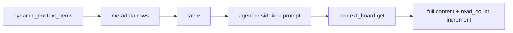

## The `context_board` tool

The `context_board` tool manages dynamic context board entries. It supports four commands:

| Command | Required fields | Behavior |
|---|---|---|
| `get_board` | none | Lists all board items as metadata; returns an empty-board message if none exist. |
| `get` | `src`, `name` | Returns full content for one item and increments `read_count`. |
| `add` | `name`, `description`, `context` | Creates or overwrites an agent-authored item with `src: "agent"`. |
| `prune` | `name` | Deletes an agent-authored item; user-authored items cannot be pruned by this command. |

The board has a capacity limit of `25` entries. The consolidation prompt warns at `23` entries and instructs the worker to prune down to `18` or fewer to leave headroom.

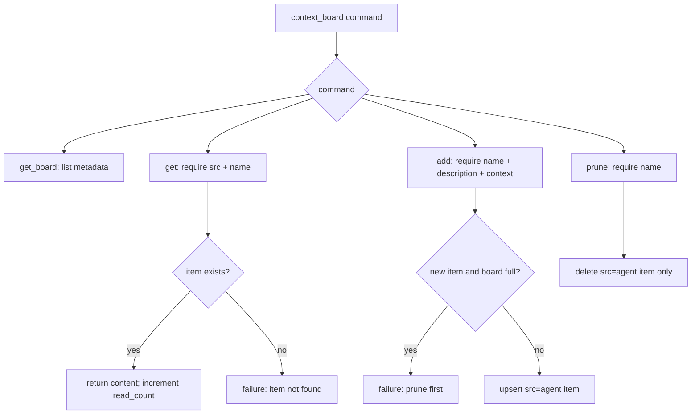

## `rem-agent` consolidation

`rem-agent` is the built-in memory-consolidation agent. Its YAML definition gives it only the `context_board` tool and includes a special consolidation prompt. It does not include environment context, custom-agent instructions, or parallel-tool-calling prompt parts.

The consolidation prompt builds historical evidence from three sources:

- existing dynamic context board entries;
- session turns stored in the session store;
- the latest checkpoint summary when available.

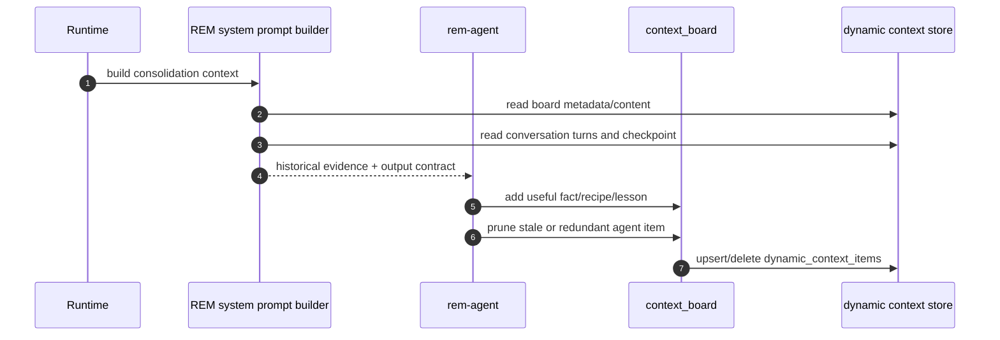

The key instruction is that `rem-agent` is an **offline memory-consolidation worker**. Conversation turns, board entries, and checkpoints are historical evidence, not a new user task. The agent is told to treat file paths and symbols as opaque labels and to output only `context_board` add/prune calls.

## Manual `/subconscious run`

The manual path starts from a slash command. The command itself does not directly mutate the board. Instead, it returns an agent prompt that tells the main agent to call `task` exactly once.

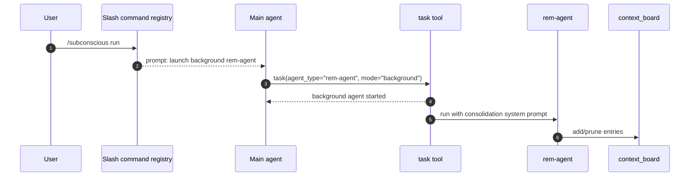

The fixed task name and description observed in the macro are `rem-consolidate` and `Consolidate session learnings`. The prompt explicitly says not to pass extra context because `rem-agent` receives the per-session context in its system prompt.

## Detached shutdown consolidation

The interactive TUI can also start a detached `rem-agent` during shutdown. This is gated by the subconscious feature and a minimum of three user turns.

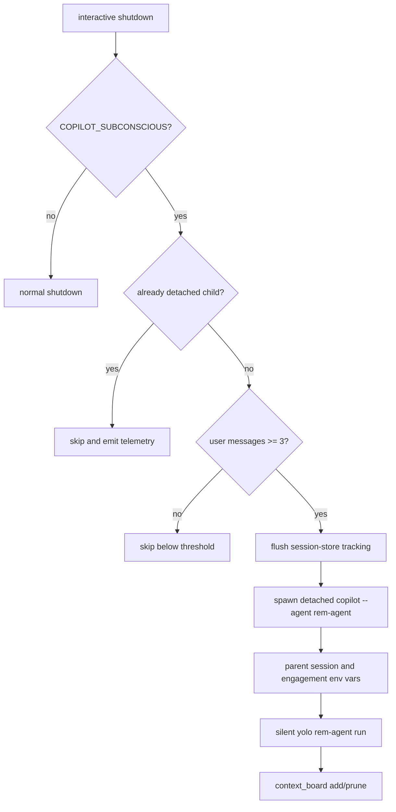

The detached child is launched with:

- `--agent rem-agent`;
- a fixed prompt requesting context-board add/prune updates;
- `--yolo` and `--silent`;
- environment variables linking the child to the parent session and engagement;
- a detached process mode so shutdown does not wait for consolidation to finish.

The shutdown gate emits telemetry for `spawned`, `below_min_turns`, and `detached_child` outcomes.

## Sidekick agents and the inbox

Sidekick agents are background helpers triggered on user messages. They do not answer the user directly. They publish high-signal context into the session inbox, and the main agent can decide whether to read it.

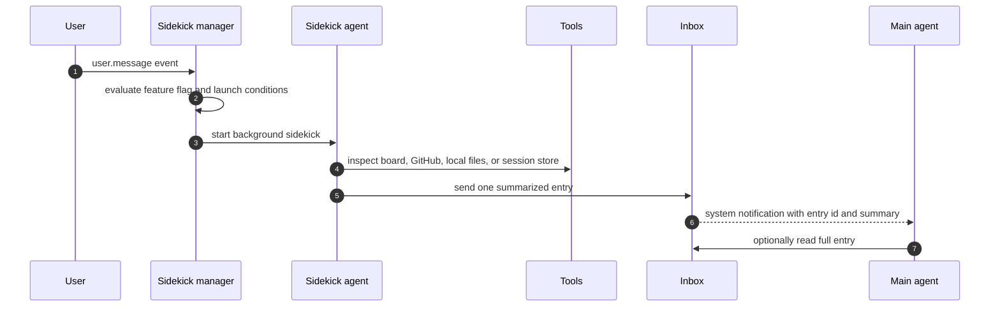

Two built-in sidekicks are relevant here:

| Sidekick | Feature flag | Launch condition | Tools | Role |
|---|---|---|---|---|
| `subconscious-agent` | `COPILOT_SUBCONSCIOUS` | Dynamic context board has entries. | `context_board`, `send_inbox` | Read-only board retrieval. It gets the board, fetches relevant entries, and sends verbatim content to the inbox once per turn. |
| `github-context` | `GITHUB_CONTEXT_SIDEKICK_AGENT` | Memory API cache has memory count or memory prompt context. | local search/read, GitHub MCP, session store SQL, `send_inbox` | Gathers optional GitHub or prior-session context only when it would materially help. |

The sidekick manager cancels superseded runs on a newer user turn, limits sends per turn, persists inbox state when a workspace path is available, and sends a system notification with a short summary. The main agent is not forced to read the full inbox entry.

## Prompt-source impact

Memory affects model-visible prompts in several places:

| Source | Prompt impact |
|---|---|
| Memory API prompt context | Injected into the main system prompt when the memory cache is enabled and contains prompt text. |
| Store-tool instructions | Service can provide model-visible instructions for when and how to call `store_memory`. |
| Vote-tool definition | Service can expose `vote_memory` with its own description and schema version. |
| Dynamic context board metadata | Rendered as a compact table that requires explicit `context_board get` for full content. |
| REM consolidation prompt | Built from session turns, latest checkpoint, and board snapshot, then appended to the `rem-agent` system prompt. |
| Inbox notifications | Sidekick messages appear as system notifications telling the main agent that inbox context is available. |

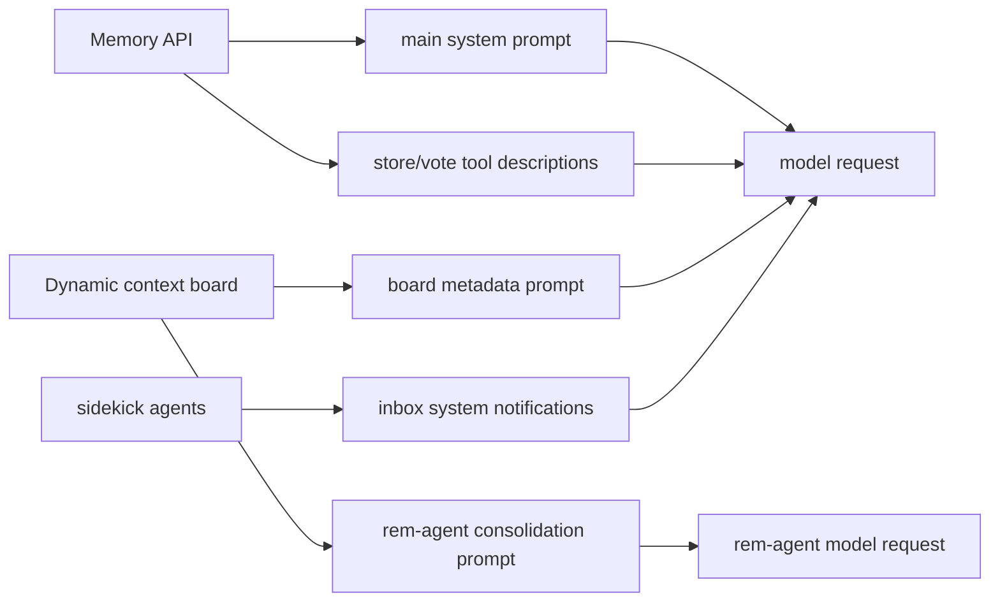

## Persistence summary

| Data | Persistence mechanism | Scope | Notes |
|---|---|---|---|
| Cloud memories | Internal memory service API | Repository or user scope. | Prompt context and store/vote operations are service-backed. |
| Local memories | `.github/copilot-memories.jsonl` | Repository root. | Enabled only by the local memory flag; optimized and written at shutdown. |
| Dynamic context board | `dynamic_context_items` table in the local session store DB | Repository + branch. | Stores metadata and full content; `read_count` and `count` support pruning/relevance decisions. |
| Session turns and checkpoints | Session store tables | Session id. | Used by `rem-agent` to build consolidation evidence. |
| Sidekick inbox | Inbox persistence provider under workspace/session state | Session/workspace. | Used to notify the main agent about sidekick findings. |

## Safety and design takeaways

- Memory updates are permissioned side effects. The model cannot silently store or vote memories when permission is required.
- Inputs to memory tools are passed through the secret filter before validation and storage.
- The memory API prompt fetch is fail-soft: failure disables memory context for that build rather than failing the session.
- The dynamic context board is deliberately small. The runtime uses capacity warnings, read counts, and pruning to keep it high-signal.
- The default main agent is not normally given direct `context_board` access after board initialization. `rem-agent` and sidekicks are the intended board actors.
- `rem-agent` does not re-open or verify files during consolidation. Its prompt tells it to treat historical paths and symbols as opaque labels.
- Sidekicks communicate through the inbox, not through direct hidden state sharing. The main agent remains the final judge of whether sidekick context is useful.

Related docs: [`prompt-sources.md`](./prompt-sources.md), [`agent-task-orchestration.md`](../07-agents-and-automation/agent-task-orchestration.md), [`permission-system-design.md`](../05-security-and-policy/permission-system-design.md), [`feature-gates.md`](../08-operations-and-research/feature-gates.md), [`observability-update-shutdown.md`](../08-operations-and-research/observability-update-shutdown.md), and [`sessions-remote-cloud.md`](../03-sessions-and-remote/sessions-remote-cloud.md).