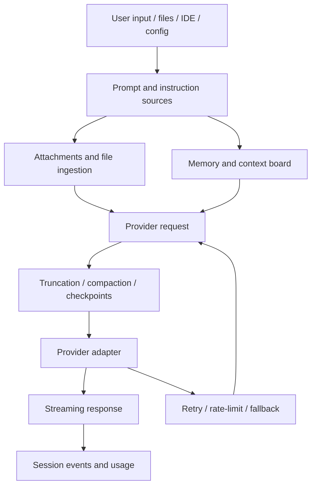

# Context and model loop

This chapter follows a model turn from input collection to provider request and response handling. It covers what becomes model-visible context, how the request is shaped for a provider, how token pressure is managed, and how failures, retries, quota, and usage are surfaced.

Read this chapter when the question is: **what did the model see, why did it see that, and how did the runtime handle the model call?**

## Source-anchor policy

This page is a chapter guide. Linked implementation pages carry concrete `app.js` anchors.

| Semantic alias | Minified anchor | Scope |
|---|---|---|
| Context/model loop chapter | N/A — navigation page | Groups prompt/context assembly, attachments, memory, compaction, provider routing, retries, quota, and usage. |
| Context/model implementation pages | See linked source-anchor tables | Concrete bundle anchors live in the destination pages. |

## Model-turn map

## Primary reading order

| Order | Page | Context/model question answered |
|---:|---|---|
| 1 | [Prompt sources in Copilot CLI](prompt-sources.md) | Which static/runtime prompts, custom instructions, hooks, MCP prompts, and provider mappings feed the request? |
| 2 | [Prompt catalog](prompt-catalog.md) | What prompt families and templates are embedded in the bundle? |
| 3 | [Attachment and file-ingestion pipeline](attachments-and-file-ingestion.md) | How are images, documents, tagged files, MIME metadata, and size limits mapped into request payloads? |
| 4 | [Memory and dynamic context board](memory-and-context-board.md) | How do agentic memory, local memory, context board, rem-agent, sidekicks, and consolidation affect context? |
| 5 | [Conversation compaction and memory compression](conversation-compaction.md) | How do `/compact`, automatic compaction, request trimming, summaries, and checkpoints manage context pressure? |
| 6 | [Model API routing and provider wire formats](model-api-routing.md) | How are requests routed to Chat Completions, Responses, WebSocket Responses, or Anthropic Messages APIs? |
| 7 | [Rate limits, concurrency, retries, and error recovery](resilience-rate-limits-concurrency.md) | How do retry policy, queue pauses, fallback, cancellation, rate-limit recovery, and request-size handling work? |

## Supporting topics

| Topic | Page | Why it matters |
|---|---|---|
| Provider identity and auth | [Models, providers, and authentication workflows](models-providers-auth.md) | Explains GitHub auth, BYOK/custom providers, model catalog access, and offline/custom paths. |
| Usage accounting | [Usage, quota, and billing metrics](usage-quota-billing-metrics.md) | Tracks `/usage`, `assistant.usage`, quota snapshots, premium metrics, and token details. |
| Rewind boundaries | [Checkpoints, undo, rewind, and fork](checkpoints-undo-rewind.md) | Shows how context history can be truncated, replayed, forked, or restored. |
| Agent-specific prompts | [Custom agents and skills packaging](../06-agents-automation/custom-agents-and-skills-packaging.md) | Explains AGENTS.md, SKILL.md, custom-agent prompts, allowed-tools, and skill invocation. |

## Handoffs

- Context assembly hands model-visible tool schemas to [Tools, integrations, and security](../03-tools-integrations-security/README.md).
- Durable model/tool events are persisted by [Sessions, persistence, and remote](../04-sessions-persistence-remote/README.md).
- Subagent prompt variants and task handoff live in [Agents and automation](../06-agents-automation/README.md).

## Navigation

- [Start here](../00-start-here/README.md)
- [Full table of contents](../SUMMARY.md)
