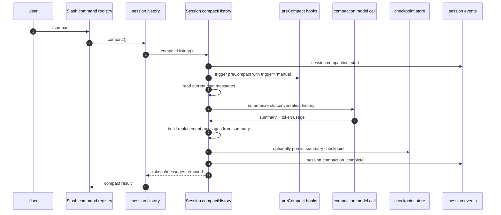
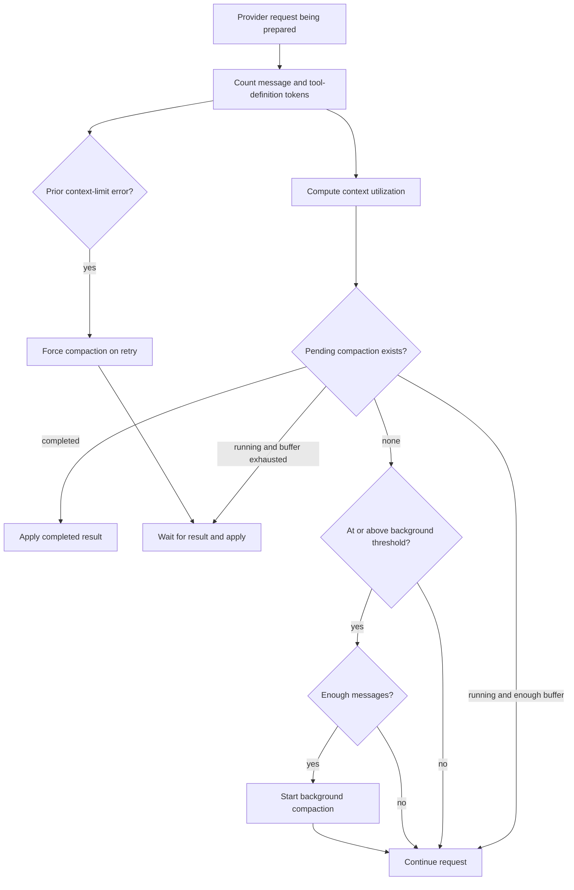
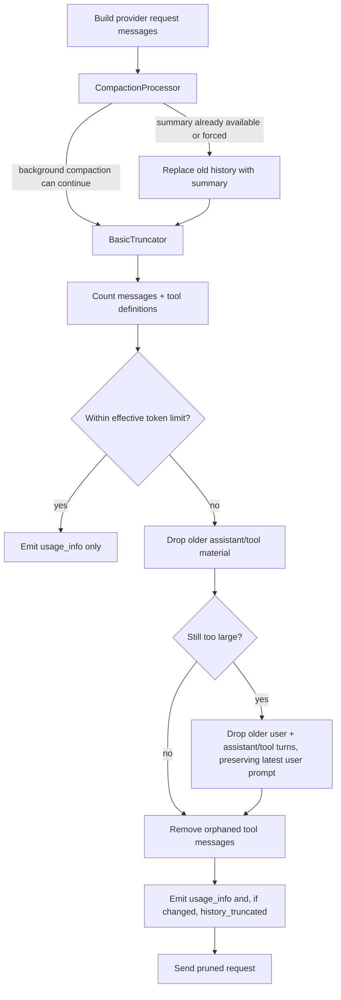
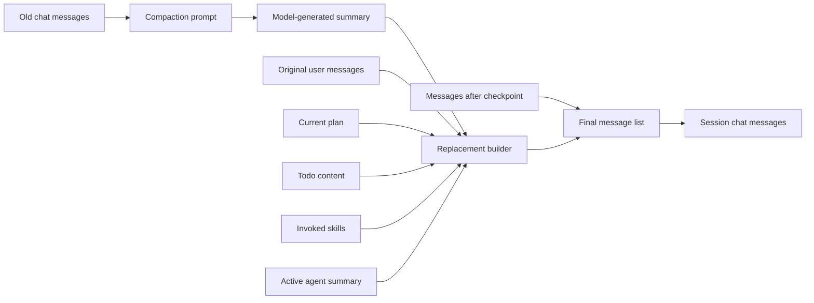
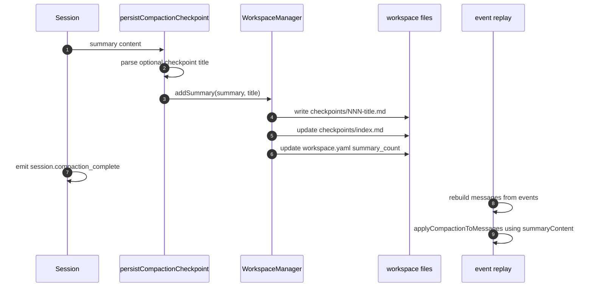
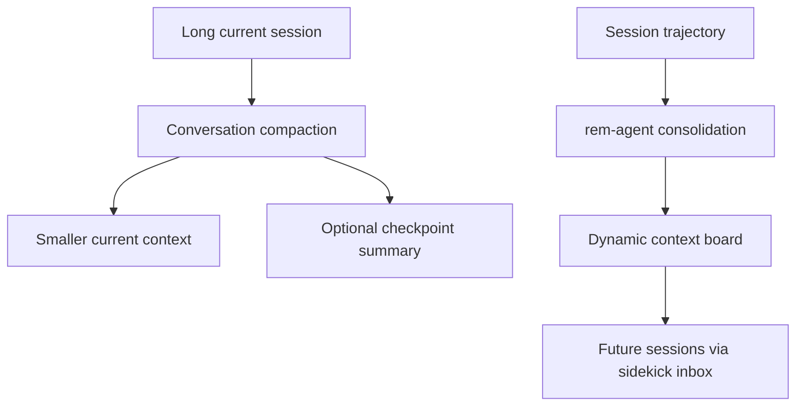

# Conversation compaction and memory compression in Copilot CLI

## MVP placement

> **Why this page is here:** This page belongs to [Context and model loop](README.md). It explains one part of the request/turn pipeline: how model-visible inputs are selected, compressed, routed, retried, or accounted for. Read it with [Runtime lifecycle](../01-runtime-lifecycle/README.md) for the host branch that invokes the loop, and [Tools, integrations, and security](../03-tools-integrations-security/README.md) when the context includes executable capabilities.

This document explains the implementation behind the Copilot CLI behavior that is easy to describe as "memory compression" or "prompt trimming". In the analyzed bundle, there are two local context-window mechanisms:

- **conversation compaction**: old chat history is summarized by a model call, then the session replaces many prior messages with a compact summary; and
- **request-time prompt truncation**: immediately before a provider request, a `BasicTruncator` can remove older message/tool-call material from the request message array so the current request fits the effective token budget.

Compaction is the semantic, state-mutating mechanism. Basic truncation is the last-mile, message-aware request guardrail.

This is different from binary compression and also different from long-term memory consolidation. The CLI uses four adjacent concepts:

| Concept | Primary purpose | Main output | Scope |
|---|---|---|---|
| Conversation compaction | Reduce current context-window usage. | Summary-backed replacement messages and optional checkpoints. | Current session. |
| Request-time prompt truncation | Make an individual provider request fit the token budget. | In-place request-message pruning plus `session.truncation`/`session.usage_info`. | Current model request. |
| Memory consolidation | Extract reusable learnings for future sessions. | Dynamic context board entries via `context_board add/prune`. | Repository and branch board. |
| Provider-side compaction | Let a provider or remote agent report context compaction events. | Provider stream events or SDK-level edits. | Provider request internals. |

## Source anchors

`app.js` is bundled/minified. This table uses semantic aliases first and keeps generated names only as lookup anchors for the analyzed `@github/copilot` bundle; they may shift across releases.

| Area | Semantic alias | Minified anchor | Approx. location | What it does |
|---|---|---:|---:|---|
| Slash command definition | `/compact` command | `kps(...)`, command registry | `app.js` 1300, 1340 | Calls `history.compact()` and returns messages/tokens removed. |
| Session history facade | `SessionHistory.compact()` | `oKn(...)` | `app.js` 4396 | Exposes `compact()` as a wrapper over `session.compactHistory()`. |
| Manual compaction | `Session.compactHistory()` | method name preserved | `app.js` 4481 | Runs the explicit `/compact` path, emits events, calls the model, applies the summary, and persists checkpoints. |
| Compaction hooks | `preCompact` hook | `PreCompact`, `preCompact`, `NI(...)` | `app.js` 238, 2797, 4481, 4487 | Allows configured hooks to run before manual or automatic compaction. |
| Compaction prompts | `buildCompactionPrompt(...)` | `n4n`, `i4n`, `V5e` | `app.js` 2797-3034 | Defines the detailed summary instructions and `conversation-compaction` interaction type. |
| Message preparation | `prepareCompactionMessages(...)` | `j5e(...)` | `app.js` 3063 | Filters/augments messages and appends the summary request. |
| Replacement builder | `buildCompactedHistory(...)` | `yCe(...)` | `app.js` 3063 | Builds the summary-backed replacement message list using summary, user turns, plan/todo, invoked skills, and agent summary. |
| Tool-boundary adjustment | `adjustCompactionBoundary(...)` | `ift(...)`, `g4n(...)` | `app.js` 3090-3092 | Avoids orphaned tool-result messages when splitting compacted and new history. |
| Model call | `runCompactionModelCall(...)` | `sft(...)` | `app.js` 3090 | Calls the selected model with compaction-specific headers and returns summary plus token usage. |
| Automatic processor | `CompactionProcessor` | `ECe` | `app.js` 3092 | Starts background compaction around context thresholds and applies it before requests that need space. |
| Request-time truncator | `BasicTruncator` | `M3` | `app.js` 3062 | Counts message/tool-definition tokens, removes older request messages when necessary, emits usage/truncation callback events, and adjusts retry token limits after provider errors. |
| Truncation helpers | `truncateAssistantToolMaterial`, `truncateOldMessages`, `removeOrphanToolMessages` | `u4n(...)`, `g0s(...)`, `p4n(...)` | `app.js` 3062 | Implements message-aware pruning while preserving system messages, the latest user prompt, and tool-call boundaries. |
| Truncation events | `history_truncated`, `session.truncation`, `session.usage_info` | callback/event cases | `app.js` 4361, 4487 | Projects request-time token pruning and current context usage to session/UI events. |
| Token accounting | `countMessagesAndTools`, tool-definition tokens | `$T(...)`, `Y2(...)`, `Wbe(...)` | `app.js` 1026 | Separately counts system, conversation, and tool-definition tokens. |
| Context-limit detection | `isContextLimitError(...)` | `ise(...)` | `app.js` 1026 | Detects provider context-limit errors and forces compaction on retry. |
| Checkpoint persistence | `persistCompactionCheckpoint(...)` | method name preserved | `app.js` 4479 | Writes the summary as a workspace checkpoint when workspace state is enabled. |
| Workspace checkpoints | `WorkspaceManager.addSummary(...)` | `qq.addSummary(...)` | `app.js` 3559 | Writes checkpoint Markdown files and updates the checkpoint index. |
| Event replay | `applyCompactionToMessages(...)` | method name preserved | `app.js` 4475 | Reapplies compaction when rebuilding session state from events. |
| Event schemas | `session.compaction_start`, `session.compaction_complete` | schema rows | `app.js` 4361 | Defines fields for summary content, token counts, checkpoint number/path, and model usage. |
| Telemetry mapping | Compaction telemetry | `z6n(...)`, `j6n(...)` | `app.js` 4033 | Emits `session_compaction_start` and `session_compaction_complete` telemetry. |
| Timeline rendering | Conversation compacted entry | `onCompaction(...)` | `app.js` 1739, 1817, 1952, 6860 | Shows compacted-history events in timeline/export renderers. |
| TUI status | Compacting indicator | `kOo(...)` and event handlers | `app.js` 6405, 7335 | Shows "Compacting conversation history" while a compaction is in progress. |
| Model switch trigger | Pre-switch compaction | `gte(...)` | `app.js` 7340 | Compacts before switching to a model whose context limit is too small for current history. |
| Memory pressure trigger | Emergency compaction | `respondToMemoryPressure()` | `app.js` 4481 | After garbage collection, can trigger manual-style compaction if session history is large enough. |
| Remote session gap | Remote compaction unsupported | `RemoteSession.compactHistory()` | `app.js` 4489 | Remote sessions throw because local compaction is not implemented for that class. |

## Manual `/compact` workflow

The manual path starts from the slash command and ends by mutating the session's in-memory chat messages.

Important guardrails in `compactHistory()`:

- it rejects a second manual compaction while one is already running;
- it requires at least two chat messages;
- it requires authentication or a configured provider;
- it requires an active system/agent context, so compaction cannot run before the session has built a model prompt;
- it uses an `AbortController`, allowing the TUI to cancel manual compaction.

The compaction model input is not just the raw transcript. The manual path builds a special prompt that asks for a detailed summary, passes the active system context separately, and excludes system messages from the summarized message list. The result is then merged back into a replacement history through `buildCompactedHistory(...)`.

## Automatic background compaction

`CompactionProcessor` is registered as a request processor for model calls. It watches token utilization and starts background compaction before the context window is exhausted.

The default thresholds are encoded in `CompactionProcessor`:

| Setting | Default | Override |
|---|---:|---|
| Background compaction threshold | `0.8` | `COPILOT_BACKGROUND_COMPACTION_THRESHOLD` |
| Buffer exhaustion threshold | `0.95` | `COPILOT_BUFFER_EXHAUSTION_THRESHOLD` |
| Minimum messages | `4` | Constructor option in the processor configuration |

The background path is intentionally opportunistic. At roughly 80 percent utilization, it starts a summary request in the background while the current turn can continue. At roughly 95 percent utilization, or after a provider context-limit failure, it waits for the summary and applies it before sending the next request.

## Request-time prompt trimming: `BasicTruncator`

Compaction is not the only protection against an overlong prompt. In the main agentic request pipeline, processors are registered in this order around the model call:

1. attachment/native-document processor, when present;
2. `CompactionProcessor`;
3. `BasicTruncator`;
4. immediate-prompt and premium-request processors;
5. MCP/file-content request processors.

That ordering is important: compaction gets the first chance to reduce history semantically, and `BasicTruncator` then performs request-local pruning if the prepared message array still exceeds the effective model token budget.

### What gets trimmed

`BasicTruncator` is message-aware rather than byte/string slicing:

- it derives the limit from `modelInfo.capabilities.limits.max_prompt_tokens` or `max_context_window_tokens`, falling back to `128000`;
- it counts normal chat messages separately from tool definitions, because tool schemas consume prompt tokens too;
- if the request already fits, it still removes orphaned trailing `tool` messages that no longer have matching assistant tool calls;
- its first truncation pass removes older assistant messages and matching tool-result messages before the latest user prompt where possible;
- if that is insufficient, it can remove older user messages and assistant/tool-call pairs while preserving the latest user prompt;
- it avoids removing `system` messages;
- after pruning, it removes orphaned tool-result messages and emits token/message deltas.

The helper uses an internal safety target below the hard effective limit, so truncation aims to create some headroom instead of landing exactly on the boundary.

There is also a small character-level clipping path inside compaction replacement construction: original user messages copied into the compacted-history reminder are capped and represented with markers such as `...<truncated>...` or omitted-message text. That clipping is for the compaction reminder payload, not the general request-time token-pruning algorithm.

### What does **not** get trimmed

This path is not the same as `/undo`, `/rewind`, or event-log truncation:

- it mutates the request message array sent to the model, not the persisted JSONL event log;
- `session.truncation` is handled as a no-op during state replay, which is a clue that it is an observation about a request rather than a durable session-state rewrite;
- the durable semantic rewrite remains `session.compaction_complete`, where the session replay path reapplies the summary replacement.

### Events from trimming

`BasicTruncator` yields internal callback events that the session projects outward:

| Internal callback | Session event | Meaning |
|---|---|---|
| `usage_info` | `session.usage_info` | Current token limit, token count, message count, system/conversation/tool-definition token breakdown, and `isInitial` flag. |
| `history_truncated` | `session.truncation` | Pre/post token counts, pre/post message counts, tokens/messages removed, and `performedBy:"BasicTruncator"`. |

`session.usage_info` can appear even when no trimming happened; it is the live context-window measurement. `session.truncation` appears only when request messages were actually removed.

### Retry behavior after provider context-limit errors

Both processors react to context-limit failures:

- `CompactionProcessor` marks the next retry for forced compaction after HTTP `413` or recognized context-window error text.
- `BasicTruncator` inspects the same errors, can lower the model token limit if the provider reports a concrete limit, or increase its retry buffer up to a maximum buffer when the nominal limit was still too optimistic.

So the recovery path is layered: force semantic compaction when possible, then retry with a more conservative request-time truncation budget.

## How the replacement history is built

The compacted history is not a single plain string appended to the transcript. The implementation builds a replacement message list that preserves the important scaffolding the agent needs after compaction.

The replacement builder uses several context sources when available:

- the model-generated compaction summary;
- original user-message content tracked by the session;
- current plan content from the workspace plan file;
- todo content captured by the session;
- invoked skill names and instructions;
- active custom-agent summary for agent handoff continuity;
- newly arrived messages after the checkpoint boundary.

This is a **lossy semantic compression**. It preserves what the summary prompt asks the model to preserve, not every byte of the prior transcript.

### Tool-call boundary safety

The helper that adjusts the compaction boundary prevents malformed chat history after replacement. If the split point would leave tool-result messages without their preceding assistant tool calls, the boundary is moved or leading orphaned tool messages are dropped. This matters because provider chat APIs generally require tool messages to appear only after matching assistant tool-call messages.

## Checkpoints and session replay

When workspace state is enabled, successful compaction persists the summary as a checkpoint.

The `/session checkpoints` command reads this checkpoint index. Its empty-state text explicitly says checkpoints are created when context is compacted.

Session replay also understands compaction. When a saved `session.compaction_complete` event is processed, the session applies the same summary replacement to reconstructed `_chatMessages`, then resets the compaction checkpoint marker. Snapshot rewind and truncation paths account for compacted checkpoints so local workspace metadata stays aligned with the retained event history.

## Events, telemetry, and UI status

Compaction is visible as a first-class session event, not just an internal mutation.

| Event or output | Purpose |
|---|---|
| `session.compaction_start` | Records token breakdown when compaction starts. |
| `session.compaction_complete` | Records success/failure, token deltas, summary, checkpoint data, request id, and model usage. |
| `session.truncation` | Records request-time prompt pruning by `BasicTruncator`; this is not event-log truncation. |
| `session.usage_info` | Updates current token and message counts after compaction. |
| `session_compaction_start` telemetry | Captures pre-compaction context breakdown. |
| `session_compaction_complete` telemetry | Captures tokens removed, messages removed, checkpoint number, model, duration, and request id. |
| Timeline entry `compaction` | Renders as Conversation Compacted in timeline/export output. |
| TUI status | Shows Compacting conversation history while manual or blocking compaction is active. |

The compaction interaction type is `conversation-compaction`, which lets telemetry and request headers distinguish summary calls from normal user turns.

## Other triggers

Manual `/compact` and automatic threshold compaction are the two main paths, but the same session-level `compactHistory()` can also be reached by adjacent flows.

| Trigger | Behavior |
|---|---|
| Model switch to a smaller context window | The TUI checks whether compaction is needed before applying the target model. If the user proceeds, it calls `compactHistory()` first. |
| Memory pressure | After requesting garbage collection, the session can trigger emergency compaction if enough messages and an active system context exist. |
| Provider context-limit error | `CompactionProcessor` marks the next retry for forced compaction after status `413` or recognized context-window error text. |

## Relationship to memory consolidation

Conversation compaction is separate from the memory systems documented in [`memory-and-context-board.md`](memory-and-context-board.md).

| Question | Conversation compaction | Memory consolidation |
|---|---|---|
| What starts it? | `/compact`, automatic thresholds, model switch, memory pressure, or context-limit retry. | `/subconscious run` or eligible detached shutdown. |
| What does it mutate? | Current session chat messages. | Dynamic context board entries. |
| What does it optimize for? | Fitting the current request into the context window. | Reusing durable learnings in future sessions. |
| What tool is involved? | No model-visible tool is required; the session calls the model directly. | `rem-agent` uses the `context_board` tool. |
| Is it lossy? | Yes, old turns become a model-generated summary. | Yes, the agent chooses which facts are worth keeping. |

## Provider-side compaction signals

The bundle also contains provider and remote-agent compaction signals, including `agent.thread_context_compacted`, `compaction_delta`, and Anthropic SDK `compactionControl` support. Those are adjacent compatibility paths. They do not replace the CLI's local conversation-compaction pipeline, where the session itself builds the summary request and mutates local history.

## Failure and cancellation behavior

Observed failure handling is conservative:

- manual compaction throws if there is nothing to compact or no active model context;
- empty model output is treated as compaction failure;
- manual compaction can be aborted, producing an `AbortError`-style cancellation;
- background compaction failure emits a failed `session.compaction_complete` event but does not necessarily destroy the session;
- cancelled background compaction results are discarded;
- remote sessions currently throw `RemoteSession.compactHistory() is not implemented yet.`

## Takeaways

- The core implementation is semantic summary compaction, not binary compression.
- `/compact` is a thin slash-command wrapper over `session.compactHistory()`.
- Automatic compaction is request-pipeline logic in `CompactionProcessor`, using 80 percent and 95 percent context-utilization defaults.
- Prompt trimming is handled by `BasicTruncator` after compaction has had a chance to run; it prunes request messages and emits `session.truncation`, but it does not rewrite the persisted event log.
- The summary replaces prior chat messages and can be persisted as a checkpoint.
- Hooks, events, telemetry, timeline rendering, and TUI status all treat compaction as a first-class session lifecycle event.
- Long-term memory consolidation is handled separately by `rem-agent` and the dynamic context board.
