# Model API routing and provider wire formats

## MVP placement

> **Why this page is here:** This page belongs to [Context and model loop](README.md). It explains one part of the request/turn pipeline: how model-visible inputs are selected, compressed, routed, retried, or accounted for. Read it with [Runtime lifecycle](../01-runtime-lifecycle/README.md) for the host branch that invokes the loop, and [Tools, integrations, and security](../03-tools-integrations-security/README.md) when the context includes executable capabilities.

This document explains how the extracted `@github/copilot` CLI bundle decides which model API shape to call after a model is selected. It complements [`models-providers-auth.md`](models-providers-auth.md), which focuses on authentication, provider configuration, model selection, and offline mode, and [`resilience-rate-limits-concurrency.md`](resilience-rate-limits-concurrency.md), which covers retries, rate limits, fallback, and concurrency.

The short version: the CLI normalizes every agent turn into internal messages and tools, then dispatches through a small set of provider adapters. The selected adapter is determined by either GitHub Copilot model metadata or BYOK/custom-provider configuration.

## Executive summary

- In the default GitHub Copilot path, the CLI lists models from the Copilot API and uses each model's `supported_endpoints` metadata to choose among Anthropic Messages, OpenAI Responses, WebSocket Responses, or Chat Completions.
- In BYOK/custom-provider mode, `COPILOT_PROVIDER_TYPE` chooses the provider family: `openai`, `azure`, or `anthropic`.
- For `openai` and `azure` BYOK providers, `COPILOT_PROVIDER_WIRE_API` chooses `completions` or `responses`; the default is `completions`.
- For `anthropic` BYOK providers, `COPILOT_PROVIDER_WIRE_API` is ignored and the runtime always uses Anthropic Messages.
- Regardless of wire format, the adapter normalizes provider responses back into a ChatCompletion-like internal shape before session events, tool handling, telemetry, and UI rendering continue.

## Source anchors

`app.js` is bundled/minified, so semantic aliases below are analysis names. Minified anchors are version-specific lookup aids for the analyzed `@github/copilot` artifact and will shift across releases.

| Area | Semantic alias | Minified anchor | Approx. location | Role |
|---|---|---:|---:|---|
| Provider env parser | `loadCustomProviderConfigFromEnv(...)` | `pQo(...)` | `app.js` 6597 | Reads `COPILOT_PROVIDER_*`, `COPILOT_MODEL`, token limits, provider type, wire model, and wire API. |
| Provider config validator | `validateCustomProviderConfig(...)` | `mQo(...)` | `app.js` 6597 | Validates model presence, provider type, wire API, token limits, and GPT-5 response-wire recommendations. |
| Provider type default | `getProviderType(config)` | `Lcr(...)` | `app.js` 3437 | Defaults provider type to `openai`. |
| Wire API default | `getWireApi(config)` | `sle(...)` | `app.js` 3437 | Defaults wire API to `completions`. |
| Model runtime factory | `createModelRuntime(...)` | `vM(...)` | `app.js` 3473 | Chooses built-in Copilot, Anthropic, OpenAI, or custom provider runtime. |
| Custom provider router | `createCustomProviderRuntime(...)` | `_vs(...)` | `app.js` 3473 | Routes BYOK `openai`, `azure`, and `anthropic` providers to the right adapter. |
| GitHub Copilot endpoint router | `CopilotEndpointRouter` | `O3e` | `app.js` 3472 | Reads `supported_endpoints` and chooses Anthropic Messages, Responses, WebSocket Responses, or Chat Completions. |
| Chat Completions adapter | `ChatCompletionsAdapter` | `U3`, `M3e`, `Emt` | `app.js` 3439, 3472 | Calls `chat.completions.create(...)` with `messages`, tools, and streaming options. |
| Responses HTTP adapter | `ResponsesHttpAdapter` | `yU`, `xmt` | `app.js` 3460, 3470 | Calls `responses.create(...)` with `instructions`, `input`, tools, reasoning, and text config. |
| Responses WebSocket adapter | `ResponsesWebSocketAdapter` | `Pmt` | `app.js` 3470 | Sends a `response.create` event over a WebSocket Responses session when enabled. |
| Anthropic Messages adapter | `AnthropicMessagesAdapter` | `lle`, `vmt` | `app.js` 3457, 3472 | Calls `messages.create(...)` or `messages.stream(...)` with `system`, `messages`, tools, thinking, and beta headers. |
| Custom OpenAI provider | `CustomOpenAIProviderFactory` | `Amt` | `app.js` 3437 | Creates an OpenAI-compatible client from BYOK base URL, API key, bearer token, headers, and model metadata. |
| Azure provider | `AzureProviderFactory` | `L3e` | `app.js` 3472 | Creates Azure OpenAI clients using versionless `/openai/v1` or versioned `/openai` plus `api-version` and deployment routing. |
| Custom Anthropic provider | `CustomAnthropicProviderFactory` | `w3e`, `Mcr` | `app.js` 3437 | Creates an Anthropic client from BYOK base URL, API key or bearer token. |
| Copilot API client wrapper | `CopilotApiClientWrapper` | `Tmt`, `wmt` | `app.js` 3457 | Adds Copilot integration, auth, HMAC, session, interaction, feature-assignment, and API-version headers. |
| Streaming/final response normalizers | `mergeChoices(...)`, `toChatCompletionChunk(...)`, `normalizeFinishReason(...)` | `eCn(...)`, `nCn(...)`, `oCn(...)` | `app.js` 1026 | Merge multi-choice assistant outputs, preserve reasoning/annotation fields, normalize finish reasons, and build the final `model_call_success.responseChunk`. |
| Streaming UI callbacks | `StreamingChunkDisplay` | `ubt` | `app.js` 4207 | Converts provider stream chunks into ephemeral assistant streaming events and response-size updates. |

## High-level routing flow

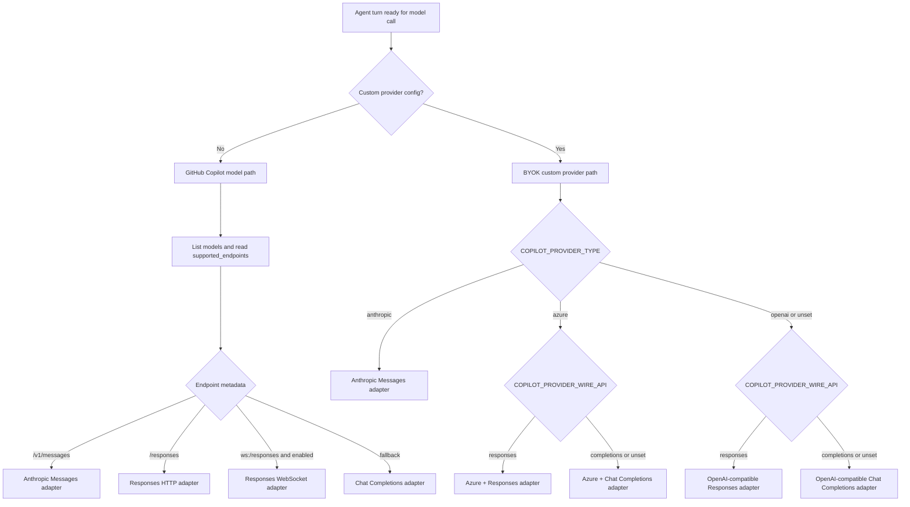

## Selection inputs

| Input | Applies to | Effect |
|---|---|---|
| `--model` | All paths | Sets the requested session model. It overrides `COPILOT_MODEL`. |
| `COPILOT_MODEL` | All paths | Default model when `--model` is not provided. In BYOK it can set both model ID and wire model. |
| GitHub Copilot `/models` metadata | Default Copilot path | Provides model names, capabilities, token limits, and `supported_endpoints`. |
| `COPILOT_PROVIDER_BASE_URL` | BYOK path | Activates custom-provider mode and bypasses GitHub Copilot model routing for model calls. |
| `COPILOT_PROVIDER_TYPE` | BYOK path | Chooses `openai`, `azure`, or `anthropic`; default is `openai`. |
| `COPILOT_PROVIDER_WIRE_API` | BYOK OpenAI/Azure | Chooses `completions` or `responses`; default is `completions`. |
| `COPILOT_PROVIDER_MODEL_ID` | BYOK path | Internal model identity used for token limits and model-specific behavior. |
| `COPILOT_PROVIDER_WIRE_MODEL` | BYOK path | Model or deployment name sent to the provider API. Defaults to `COPILOT_MODEL` or the model ID. |
| `COPILOT_PROVIDER_AZURE_API_VERSION` | BYOK Azure | Switches Azure from the versionless `/openai/v1` route to a versioned `/openai` route with `api-version`. |
| `COPILOT_PROVIDER_MAX_PROMPT_TOKENS`, `COPILOT_PROVIDER_MAX_OUTPUT_TOKENS` | BYOK path | Override built-in/default token limits. |
| Feature flags | Default Copilot path | Can enable WebSocket Responses and influence model-specific behavior. |

The validator warns when a GPT-5-family BYOK model uses the default Chat Completions wire API, because those models are expected to work better with `COPILOT_PROVIDER_WIRE_API=responses`.

## Default GitHub Copilot path

When no custom provider is configured, model calls go through the GitHub Copilot API path. The runtime builds a Copilot API client wrapper, lists models, and then chooses an adapter from the selected model's endpoint metadata.

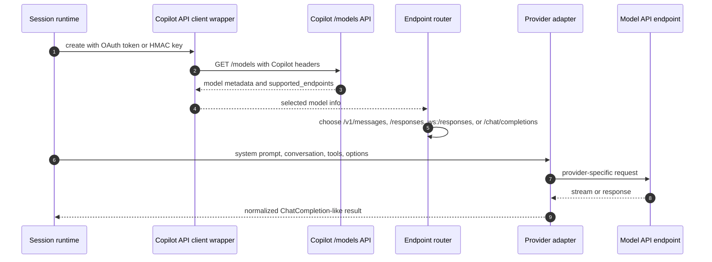

The Copilot API client wrapper adds headers such as:

- `Authorization: Bearer ...` for OAuth-token paths, or HMAC-related headers for HMAC paths;
- `Copilot-Integration-Id`;
- `User-Agent` and editor/client version headers;
- `X-GitHub-Api-Version`;
- interaction/session headers such as `X-Interaction-Id`, `X-Interaction-Type`, `X-Agent-Task-Id`, `X-Parent-Agent-Id`, and `X-Client-Session-Id` when context exists;
- feature-assignment context headers when available.

## Endpoint selection matrix

| Path | Selector | Endpoint tag reported internally | Request shape | Notes |
|---|---|---|---|---|
| GitHub Copilot Anthropic Messages | Model metadata includes `/v1/messages` | `/v1/messages` | `system`, `messages`, `tools`, `tool_choice`, `thinking`, `output_config`, `max_tokens` | Uses the Anthropic Messages adapter against the Copilot API client wrapper, not necessarily the public Anthropic URL. |
| GitHub Copilot Responses HTTP | Model metadata includes `/responses` | `/responses` | `instructions`, `input`, `tools`, `parallel_tool_calls`, `reasoning`, `text`, `store: false` | Used for Responses-capable models and native file/tool-search style items. |
| GitHub Copilot Responses WebSocket | Model metadata includes `ws:/responses` and the feature path is enabled | `ws:/responses` | WebSocket `response.create` event with Responses-style fields | Used for streaming Responses when tools are present and the WebSocket path is enabled. Falls back to HTTP Responses on early failure. |
| GitHub Copilot Chat Completions | Fallback when newer endpoint metadata is absent | `/chat/completions` | `messages`, `tools`, completion options | Streaming sets `stream: true` and `stream_options.include_usage: true`. |
| BYOK OpenAI-compatible Chat | `COPILOT_PROVIDER_TYPE=openai` and `COPILOT_PROVIDER_WIRE_API=completions` or unset | `/chat/completions` | OpenAI Chat Completions-compatible payload | Default BYOK route. Works with OpenAI-compatible servers such as Ollama, vLLM, and Foundry Local when they expose a compatible `/v1` API. |
| BYOK OpenAI-compatible Responses | `COPILOT_PROVIDER_TYPE=openai` and `COPILOT_PROVIDER_WIRE_API=responses` | `/responses` | OpenAI Responses-compatible payload | Recommended by the CLI for GPT-5-family BYOK models. |
| BYOK Azure Chat | `COPILOT_PROVIDER_TYPE=azure` and `COPILOT_PROVIDER_WIRE_API=completions` or unset | `/chat/completions` | Azure OpenAI Chat Completions route | Uses versionless `/openai/v1` unless an Azure API version is set. |
| BYOK Azure Responses | `COPILOT_PROVIDER_TYPE=azure` and `COPILOT_PROVIDER_WIRE_API=responses` | `/responses` | Azure/OpenAI Responses route | Uses the Azure client wrapper with the Responses adapter. |
| BYOK Anthropic Messages | `COPILOT_PROVIDER_TYPE=anthropic` | `/v1/messages` | Anthropic Messages payload | Ignores `COPILOT_PROVIDER_WIRE_API`; uses Anthropic SDK headers including `anthropic-version`. |

## Payload mapping by adapter

### Chat Completions

The Chat Completions adapter keeps the system prompt as a system-role message at the front of `messages`.

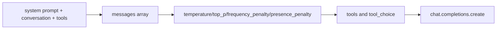

Observed request fields include:

| Field | Meaning |
|---|---|
| `model` | Selected model or BYOK wire model. |
| `messages` | Internal system/user/assistant/tool messages converted to chat format. |
| `tools` | Function or custom tool definitions when available. |
| `tool_choice` | Optional requested tool policy. |
| `reasoning_effort` | Used when a reasoning effort is configured for compatible models. |
| `thinking_budget` | Alternative budget-style option used by some model paths. |
| `max_tokens` | Output-token cap from provider config, model metadata, or defaults. |
| `stream` | Set to `true` for streaming mode. |
| `stream_options.include_usage` | Set for streaming usage reporting. |

The adapter returns a ChatCompletion-style object directly, with additional Copilot fields such as reasoning text, annotations, or usage preserved when present.

### OpenAI Responses

The Responses adapter separates the system prompt from the rest of the conversation.

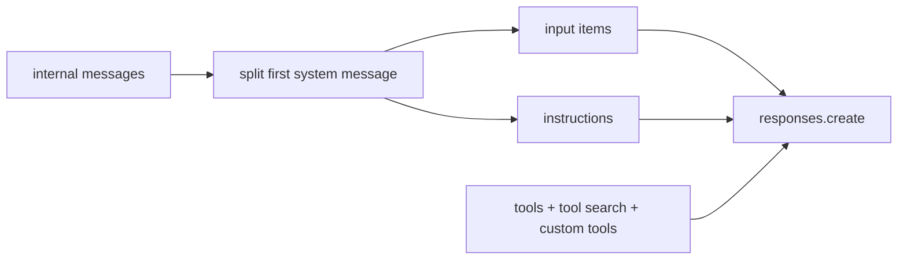

Observed request fields include:

| Field | Meaning |
|---|---|
| `model` | Selected model or BYOK wire model. |
| `instructions` | System prompt text. |
| `input` | User, assistant, tool, function-call, custom-tool, reasoning, and output items converted to Responses input format. |
| `tools` | Responses-style tool definitions. |
| `parallel_tool_calls` | Enabled when tools are present. |
| `reasoning` | Reasoning configuration derived from effort and model settings. |
| `text` | Optional response text configuration. |
| `store` | Set to `false`. |
| `include` | Includes `reasoning.encrypted_content` in observed requests. |
| `stream` | Set for streaming HTTP Responses. |

The adapter maps Responses output items back to assistant messages, tool calls, finish reasons, and usage tokens.

### WebSocket Responses

The WebSocket Responses path is a streaming optimization for Responses-capable Copilot models.

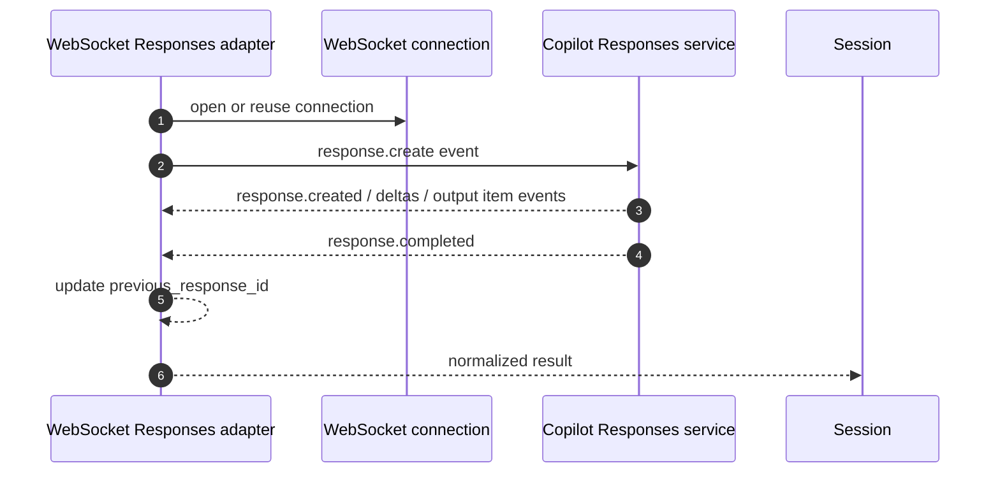

If the WebSocket request fails before meaningful streaming output arrives, the adapter disables that WebSocket attempt and falls back to HTTP Responses for the remaining retry path.

### Anthropic Messages

The Anthropic Messages adapter maps the system prompt into `system` and converts the rest into Anthropic `messages`.

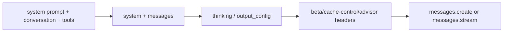

Observed request fields include:

| Field | Meaning |
|---|---|
| `model` | Selected Claude-family model or BYOK wire model. |
| `max_tokens` | Output-token cap, adjusted for thinking budgets when needed. |
| `system` | System prompt text, sometimes augmented by advisor-system guidance. |
| `messages` | Conversation converted to Anthropic message blocks. |
| `tools` | Anthropic tool definitions; custom tools and deferred-loading metadata are handled where supported. |
| `tool_choice` | Optional tool policy. |
| `temperature` | Temperature chosen by reasoning/thinking configuration. |
| `thinking` | Anthropic thinking configuration for reasoning-capable paths. |
| `output_config` | Additional output/effort configuration for adaptive reasoning paths. |

The bundled Anthropic SDK layer also adds `anthropic-version: 2023-06-01`. Additional beta headers can be added for features such as cache control, deferred tools, or advisor behavior.

## BYOK provider details

### OpenAI-compatible providers

OpenAI-compatible BYOK mode is activated by `COPILOT_PROVIDER_BASE_URL` with `COPILOT_PROVIDER_TYPE=openai` or no provider type. The factory creates an OpenAI-compatible client with the configured base URL, API key, bearer token, and custom request headers.

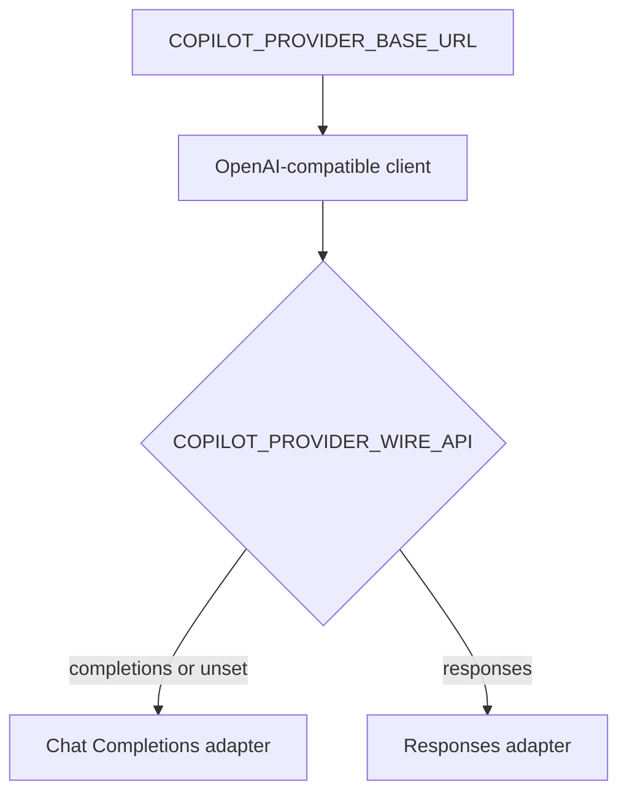

Use `COPILOT_PROVIDER_WIRE_MODEL` when the model name sent to the provider differs from the semantic model ID used by the CLI for limits and model-specific behavior.

### Azure OpenAI providers

Azure BYOK mode is activated with `COPILOT_PROVIDER_TYPE=azure`. The runtime creates an Azure-aware client and then still chooses Chat Completions or Responses from `COPILOT_PROVIDER_WIRE_API`.

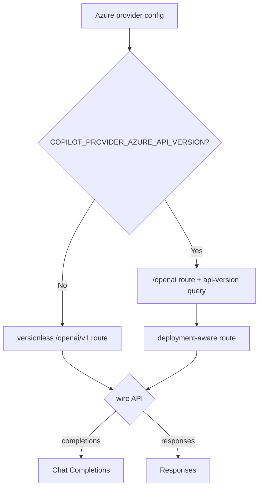

Observed authentication options include API key, bearer token, and Azure managed identity fallback. For the versioned Azure path, the SDK can insert `/deployments/{model-or-deployment}` before eligible paths such as `/chat/completions`.

### Anthropic providers

Anthropic BYOK mode is activated with `COPILOT_PROVIDER_TYPE=anthropic`. The runtime creates an Anthropic client using the configured base URL and API key or bearer token, then uses the Anthropic Messages adapter.

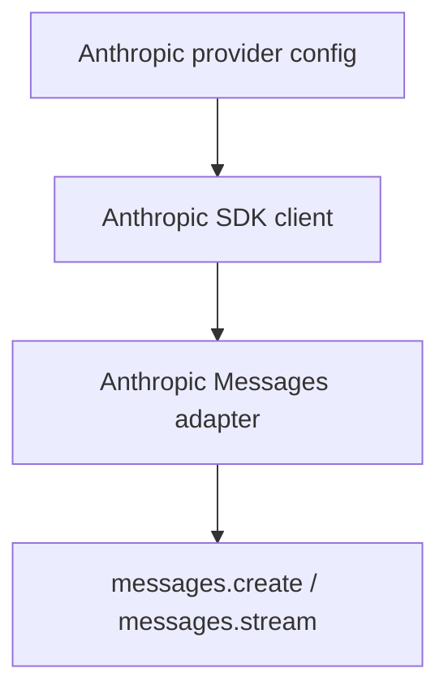

The CLI warns that `COPILOT_PROVIDER_WIRE_API` is ignored for this provider family.

## Request lifecycle

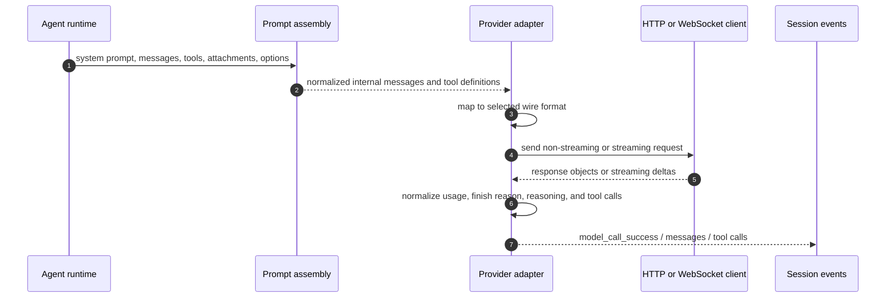

All adapters feed the rest of the runtime through a common normalized output shape. That is why tool orchestration, task handling, telemetry, and UI rendering can remain mostly provider-agnostic even when the network API shape differs.

## Streaming behavior

| Adapter | Streaming call | Streaming events handled |
|---|---|---|
| Chat Completions | `chat.completions.create(..., stream: true)` | Choice deltas, tool-call deltas, reasoning text, annotations, usage. |
| Responses HTTP | `responses.create(..., stream: true)` | `response.created`, text deltas, reasoning summary/text deltas, function/custom tool argument deltas, output item events, `response.completed`. |
| Responses WebSocket | WebSocket `response.create` event | Same conceptual Responses event stream, plus connection state and `previous_response_id` tracking. |
| Anthropic Messages | `messages.stream(...)` | Content-block starts/stops, text deltas, thinking/reasoning deltas, tool-use deltas, message deltas, usage. |

## Normalized response and streaming lifecycle

The provider adapters do more than change HTTP payload shape. They also converge very different stream semantics into a common sequence of model-loop events.

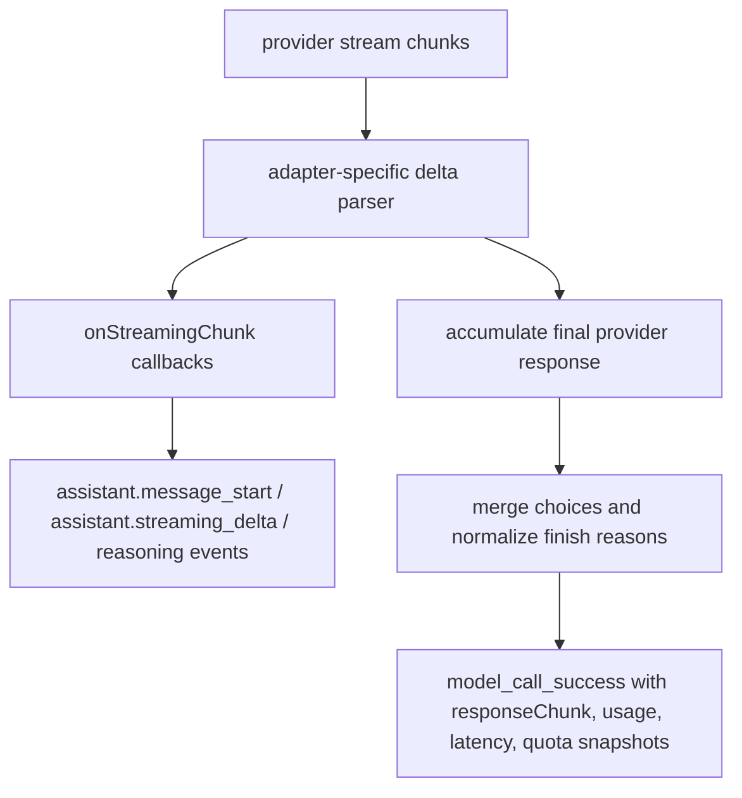

Observed normalization steps include:

- The Chat Completions path measures time-to-first-token and inter-token latency while streaming, then includes `ttftMs` and `interTokenLatencyMs` in the final `model_call_success` event.
- The final response is converted back into a `chat.completion.chunk`-like shape by `nCn(...)`, even when the original provider API was Responses or Anthropic Messages.
- `eCn(...)` merges assistant messages across choices while preserving text content, `reasoning_content`, `encrypted_reasoning_content`, Copilot annotations, output phase, and tool calls.
- `oCn(...)` maps provider-specific stop reasons into the small finish-reason vocabulary consumed by the rest of the session runtime.
- `StreamingChunkDisplay` turns streaming text and reasoning deltas into ephemeral session events. Those events are UI-facing and size-tracking; the durable session history still depends on final assistant/tool messages and `model_call_success` records.

This normalization layer is the reason downstream code can treat Anthropic, OpenAI Responses, WebSocket Responses, and Chat Completions as one model-turn abstraction for history, tool calls, telemetry, and rendering.

## What is not statically recoverable

Static analysis can identify routing logic and payload shapes, but several values are runtime-dependent:

- the exact Copilot API base URL for GitHub Enterprise or debug overrides;
- the exact model metadata returned by `/models` for a user, account, policy, and feature gate state;
- provider-specific default headers injected by SDKs or network middleware;
- feature flags controlling WebSocket Responses and model-specific behavior;
- custom provider behavior behind an OpenAI-compatible endpoint;
- final prompt content after runtime instructions, hooks, MCP, memory, tools, and session state are applied.

For exact request capture, instrument immediately before the adapter sends the provider request or capture debug/network logs in a controlled environment with secrets redacted.
