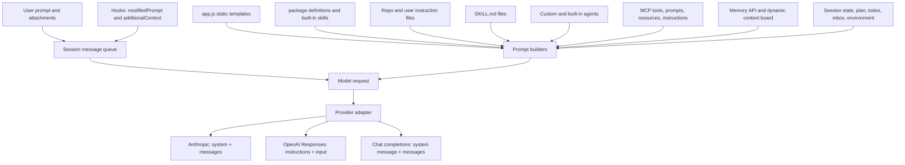
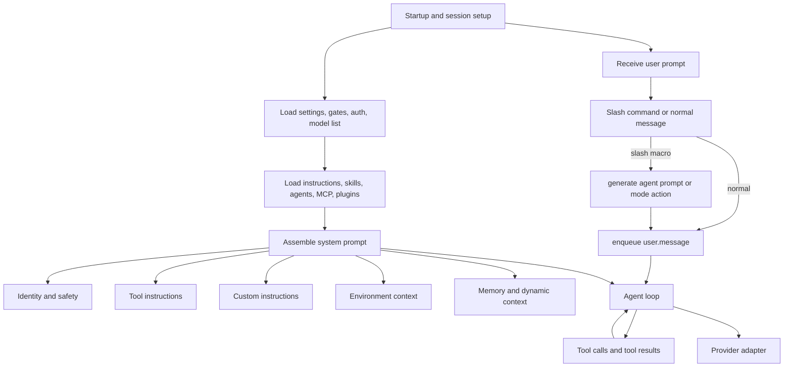
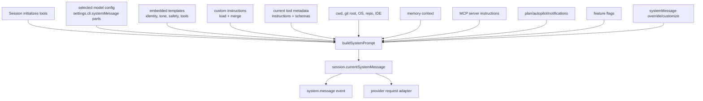
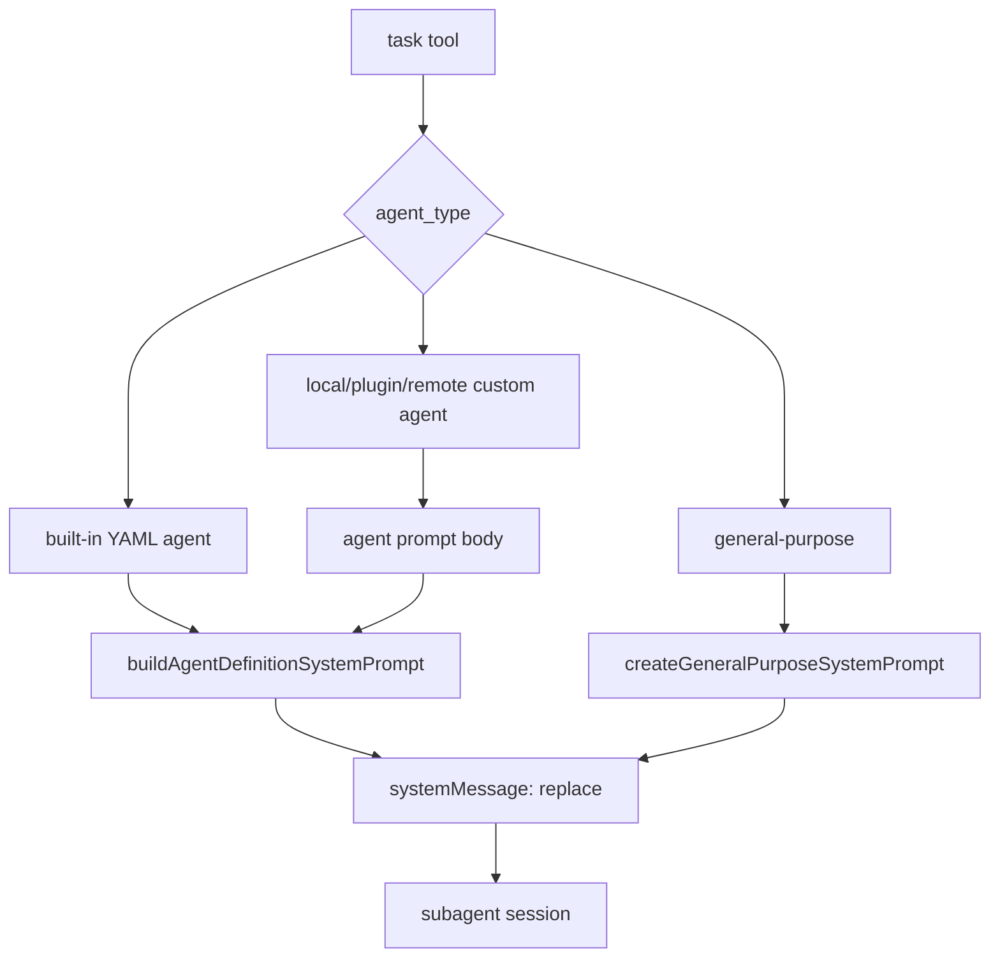
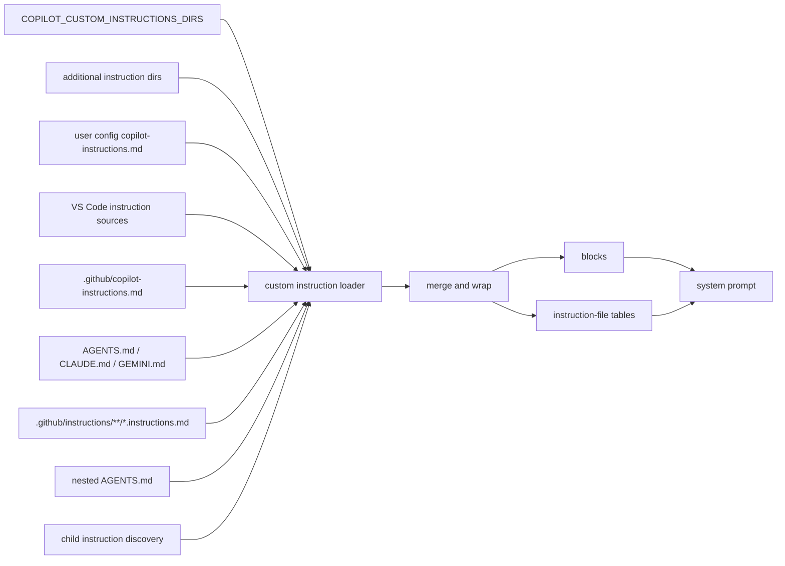
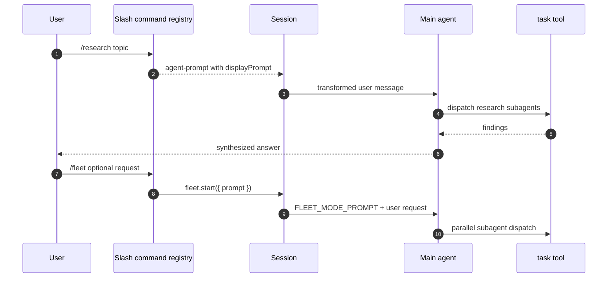
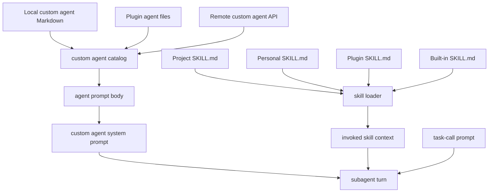
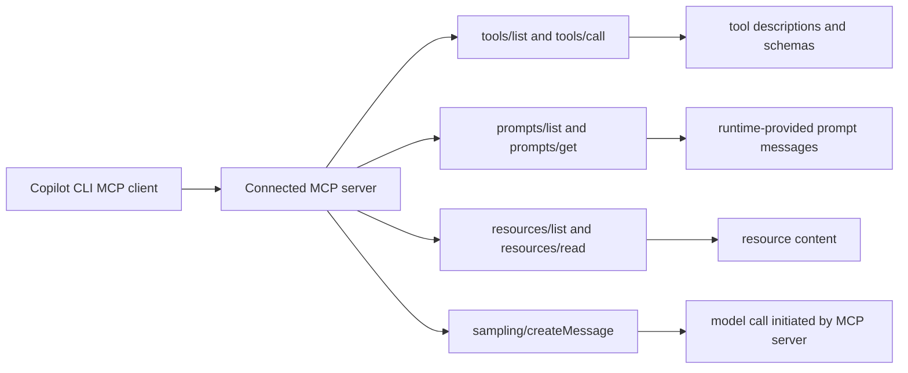
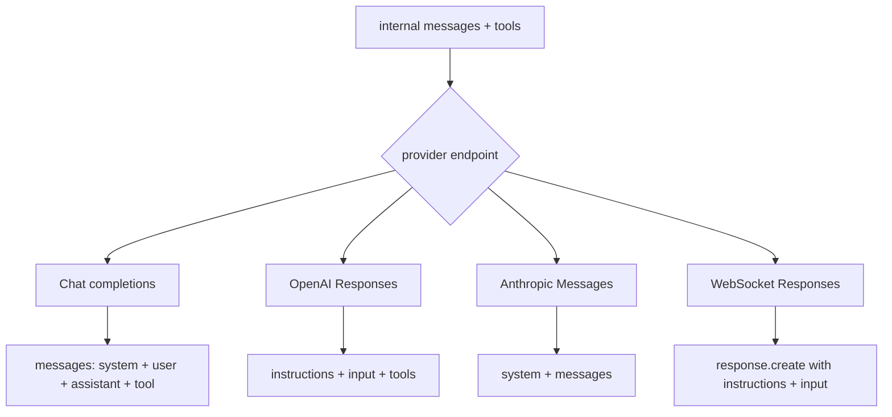
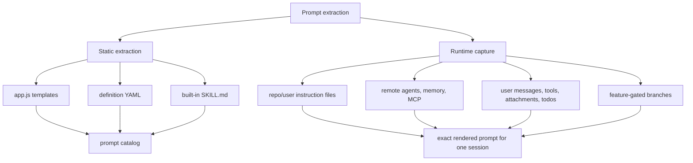

# Prompt sources in Copilot CLI

This document answers two questions from the static analysis of the extracted `@github/copilot` CLI bundle:

1. Can every prompt be extracted from `app.js`?
2. Where do the prompts used by the CLI actually come from?

Short answer: **no, not from `app.js` alone**. The bundle contains many embedded prompt templates and the most important prompt assembly logic, but a real runtime prompt is assembled from static templates plus user input, repository files, user configuration, skills, custom agents, MCP servers, hooks, memory APIs, session state, tools, attachments, and feature-gated context.

## Executive answer

`app.js` can reveal three valuable things:

- **Static embedded templates**: system prompt fragments, tool instructions, slash-command prompts, fleet mode instructions, research orchestration instructions, SQL/todo instructions, memory/context-board instructions, and provider request adapters.
- **Prompt-loading rules**: which external files, APIs, plugin directories, MCP methods, hooks, and runtime services can add or modify prompt content.
- **Prompt assembly order**: how content is combined into system/developer messages, user messages, tool schemas, tool results, and provider-specific request shapes.

It cannot reveal every possible final prompt because many prompt components are supplied at runtime and are different for every user, repository, session, model, feature-gate treatment, and integration.

## What is statically extractable

The extractable set includes prompt-like strings and files that ship with the package. These can be cataloged without running the CLI.

| Category | Where it lives | Static extraction quality | Notes |
|---|---|---|---|
| Main system prompt fragments | `app.js` around prompt builders near lines 3085-3368 and 3824-4031 | High | Includes identity, safety, tool usage, custom instruction, skill, and task/coding-agent rules. The final rendered text still depends on variables and gates. |
| Slash-command prompt macros | `app.js` around lines 1250-1545 | High | Includes `/init`, `/plan`, `/review`, `/research`, `/subconscious run`, and `/fleet` dispatch prompts. |
| Fleet mode prompt | `app.js` around line 4363 | High | `FLEET_MODE_PROMPT` is a static template that can optionally append the user's request. See [`fleet-mode.md`](../06-agents-automation/fleet-mode.md). |
| SQL/todo coordination instructions | `app.js` around lines 5205-5270 | High | Static model-visible tool instructions for session database tables such as `todos` and `todo_deps`. |
| Task tool instructions | `app.js` around lines 3735-3815 | High | Defines the model-visible `task` schema, usage rules, background/multi-turn guidance, and agent dispatch behavior. |
| Built-in agent prompts | `copilot-cli-pkg/definitions/*.agent.yaml` and `copilot-cli-pkg/definitions/sidekick/*.yaml` | High | Not embedded directly as string literals in `app.js`; loaded by the built-in agent definition loader and sidekick loaders. |
| Built-in skill prompts | `copilot-cli-pkg/builtin-skills/**/SKILL.md` | High | Loaded through the skill loader rather than hard-coded into the main system template. |
| MCP protocol prompt schemas | `app.js` MCP protocol code around lines 4120-4127 | Medium | The protocol supports `prompts/list` and `prompts/get`, but actual MCP prompt text comes from connected MCP servers. |
| Tool descriptions and schemas | `app.js`, MCP servers, SDK extensions, plugins | Medium | Model-visible, but mixed with many non-prompt UI/schema strings. |
| Provider request formatting | `app.js` around lines 3439-3470 | High for structure, not content | Shows how assembled prompts become provider request payloads. |

## What is not fully extractable from `app.js`

A final prompt cannot be reconstructed from `app.js` alone when it depends on runtime state.

| Runtime source | Why `app.js` alone is insufficient |
|---|---|
| User messages | The actual prompt typed with `-p`, stdin, TUI input, remote steering, scheduled prompts, or SDK clients is user/session-specific. |
| Attachments and selections | Files, directories, editor selections, images, documents, and GitHub references are resolved at runtime and may be included natively or as tagged context. |
| Repository instructions | Files such as `.github/copilot-instructions.md`, `AGENTS.md`, `CLAUDE.md`, `.claude/CLAUDE.md`, `GEMINI.md`, and `.github/instructions/**/*.instructions.md` are repository-specific. |
| User instructions | User config locations, VS Code instruction sources, and directories from `COPILOT_CUSTOM_INSTRUCTIONS_DIRS` are machine-specific. |
| Skills | Project, inherited, personal, plugin, custom, and built-in `SKILL.md` files are loaded dynamically; installed plugins and user skill dirs change the set. |
| Custom agents | Local/plugin agent Markdown is read from disk, while remote agents are fetched through GitHub APIs; their prompt bodies are not knowable from the bundle alone. |
| MCP prompts and server instructions | MCP servers can expose prompts via `prompts/list` and `prompts/get`, plus tools/resources/instructions. The bundle only contains the client protocol. |
| Hooks | `userPromptSubmitted`, `subagentStart`, `notification`, `postToolUseFailure`, and permission hooks can modify prompts or inject additional context. |
| Memory and dynamic context | The memory API can return prompt text, tool descriptions, and memory context; the dynamic context board and inbox vary by repo/session. See [`memory-and-context-board.md`](memory-and-context-board.md). |
| Feature gates | Flags such as `DYNAMIC_INSTRUCTIONS_RETRIEVAL`, `SKILLS_INSTRUCTIONS`, `REMOVE_CWD_LISTING`, `REMOVE_PARALLEL_TOOL_PROMPT`, and `SUBAGENT_PARALLELISM_PROMPTS` alter prompt content. |
| Model/provider behavior | `app.js` shows request formatting, but provider-side policies or hidden service behavior are outside the extracted bundle. |

## Main prompt pipeline

The CLI uses a layered prompt pipeline. Some layers become **system/developer context**, some become **user messages**, and some become **tool definitions/results**.

The important design point is that prompts are not one giant literal. They are composed immediately before a model call, and the same session can add more context between turns.

## System prompt sources

The CLI's **main system prompt** is not read from one standalone file. For normal CLI sessions, it is rendered by `buildSystemPrompt(...)` from a mix of embedded templates, model-specific settings, loaded instructions, runtime services, and session state.

### Main CLI session path

The normal interactive and prompt-mode session path builds the active system prompt during tool/session initialization:

| Step | Source | Source anchor | What it contributes |
|---|---|---:|---|
| Gather current tools | Session tool initialization | ~4481 | Produces the active tool metadata list used by the prompt and provider tool definitions. See [`runtime-tool-assembly-and-filtering.md`](../03-tools-integrations-security/runtime-tool-assembly-and-filtering.md). |
| Get model-specific prompt parts | `settings.cli.systemMessage` | ~4481, ~5734 | Adds or overrides `toneAndStyle`, `rules`, `toolInstructions`, and `additionalInstructions` depending on the selected model/provider configuration. |
| Load custom instructions | `loadCustomInstructions(...)` then `mergeCustomInstructions(...)` | ~499-512, ~3824 | Loads repo/user/VS Code/nested instruction sources and wraps them into custom-instruction blocks. |
| Add static identity and safety | `CliIdentityTemplate`, `GuidelinesTemplate`, `EnvironmentLimitationsTemplate`, `CodeChangeRulesTemplate`, `InstructionPriorityPolicy` | ~3085-3368, ~3824 | Adds Copilot CLI identity, tone, search/delegation, tool efficiency, safety, environment limitations, and code-change rules. |
| Add environment context | `buildCliEnvironmentContext(...)` and helpers | ~3824 | Adds current working directory, git repository root, OS, available tools, optional cwd listing, connected IDE, and repository identity. |
| Add runtime state | plan/autopilot/system-notification/memory/workspace branches | ~3824 | Adds plan-mode instructions, autopilot instructions, memory context, workspace context, content-exclusion policy, system notification rules, and GitHub CLI preference. `--autopilot` reaches this path through `autopilotActive`; `--no-ask-user` instead affects tool capability assembly and does not directly add prompt text. See [`autopilot-and-no-ask-user.md`](../06-agents-automation/autopilot-and-no-ask-user.md). |
| Apply feature-gated changes | `resolveFeatureGate(...)` checks | ~3824 | Removes cwd listing, removes parallel-tool prompt, changes subagent parallelism wording, or prefers `gh` CLI over MCP, depending on gates. |
| Render final system prompt | `renderCliSystemPrompt(...)` | ~3220, ~3824 | Combines identity, code-change rules, guidelines, safety, tool instructions, custom instructions, additional instructions, and final reminders. |
| Store active prompt | `currentSystemMessage`, `system.message` | ~4481 | Saves the rendered text as the session's active system message and emits it as a `system.message` event. |

`buildSystemPrompt(...)` also has an explicit override path: if `systemMessage.mode === "replace"` and `systemMessage.content` is set, it returns that content instead of rendering the normal default template. If `systemMessage.mode === "customize"`, it renders the normal prompt first and then applies a section-level customization transform.

### Subagent and custom-agent paths

Subagents do not always use the same system prompt as the top-level CLI session.

| Agent path | System prompt source | Source anchor | Notes |
|---|---|---:|---|
| Built-in YAML agents | `copilot-cli-pkg/definitions/*.agent.yaml` plus `buildAgentDefinitionSystemPrompt(...)` | ~3551-3553, ~4037-4043 | The YAML `prompt` body is rendered with variables such as `cwd`, tool names, and shell examples. `promptParts` controls whether environment context, AI safety, tool instructions, parallel-calling text, and consolidation prompts are appended. |
| Local/plugin custom agents | Markdown body prompt plus `wrapCustomAgentDefinition(...)` and `buildAgentDefinitionSystemPrompt(...)` | ~2789, ~4043 | The Markdown body becomes the agent prompt. Agent metadata controls tools, MCP servers, skills, and model selection. |
| Remote custom agents | GitHub API prompt text plus custom-agent wrapper | ~2789, ~4043 | The prompt is fetched at runtime, so it cannot be statically recovered from the local bundle. |
| General-purpose agent | `createGeneralPurposeSystemPrompt(...)`, which calls `buildSystemPrompt(...)` | ~4031-4043 | Uses the standard CLI-style system prompt, then appends an extra general-purpose/system suffix. |
| Search agent | `createSearchAgentDefinition(...)` inline agent definition | ~4064 | Uses a constrained, inline research/search system prompt and a small toolset. |
| Coding/SWE agent path | `buildCodingAgentPrompt(...)` / `buildTaskAgentPrompt(...)` | ~3263-3291, ~4149 | Uses coding-agent and task-agent templates for cloud/SWE-style execution rather than the normal CLI session prompt. |

### Where the final provider-level system text is taken from

After the prompt is rendered, the session stores it in `currentSystemMessage`. The model request layer then reads system-context messages and provider adapters reshape them:

- Chat-style clients keep it as a `role: "system"` message.
- Anthropic-style clients map it into the provider's `system` field plus remaining `messages`.
- OpenAI Responses and WebSocket Responses map it into `instructions` and put the remaining conversation into `input`.

So the immediate source of a provider request's system text is usually **the session's active `currentSystemMessage`**, but the contents of that message are composed from the layers above.

## Static prompt catalog

This catalog lists the major prompt families found during static inspection. It intentionally uses semantic names as the primary names. Minified symbols are kept only in the `Minified anchor` column so the analyzed bundle can still be searched.

| Prompt family | Semantic alias | Minified anchor | Approx. location | Example content or role |
|---|---|---|---:|---|
| Custom instruction loader | `loadCustomInstructions(...)`, `discoverCustomInstructionSources(...)`, `mergeCustomInstructions(...)` | `q4(...)`, `YAi(...)`, `z7r(...)` | `app.js` 499-512 | Loads and wraps custom instruction files, including repo, cwd, inherited, VS Code, nested, and child sources. |
| Scoped instruction tables | `buildInstructionReferenceTables(...)` | `KAi(...)`, `pyi(...)`, `fyi(...)` | `app.js` 499-512 | Tells the model about applicable `.instructions.md` and nested `AGENTS.md` files, often instructing it to read them with `view`. |
| Skill loader and skill context | `loadSkills(...)`, `renderInvokedSkillsContext(...)` | `I9(...)`, `S0s(...)` | `app.js` 525, 3085 | Loads `SKILL.md`; injects the most recent skill and previously used skills into context. |
| `/init` macro | `INIT_COMMAND_PROMPT` | `xSe` | `app.js` 1254 | Asks the agent to analyze a codebase and create `.github/copilot-instructions.md`. |
| `/plan` macro | `PLAN_COMMAND_PROMPT_PREFIX`, `planCommand(...)` | `$Bn`, `Fps(...)` | `app.js` 1254, 1305 | Prefixes user input with an implementation-plan request and sets plan mode. |
| `/review` macro | `REVIEW_COMMAND_PROMPT`, `reviewCommand(...)` | `WBn`, `Ops(...)` | `app.js` 1300 | Instructs the main agent to use `task` with `agent_type: "code-review"`. |
| `/subconscious run` macro | `SUBCONSCIOUS_CONTEXT_BOARD_PROMPT`, `subconsciousRunCommand(...)` | `Udt`, `Wps(...)` | `app.js` 1254, 1336 | Instructs the main agent to start `rem-agent` in background mode with a fixed consolidation prompt. |
| `/research` macro | `researchCommand(...)`, `buildResearchOrchestratorPrompt(...)` | `Yps(...)`, `wLn(...)` | `app.js` 1339-1545 | Builds a research request and a strict research-orchestrator prompt that delegates investigation to research subagents. |
| Fleet mode | `FLEET_MODE_PROMPT`, `createFleetApi(session)`, `fleetCommand(...)` | `eKn`, `rKn(...)`, `Lps(...)` | `app.js` 4363, 1305 | Tells the agent to decompose work into SQL todos and dispatch subagents in parallel. |
| Main system prompt | `buildSystemPrompt(...)`, `createGeneralPurposeSystemPrompt(...)` | `X3e(...)`, `Wmt(...)` | `app.js` 3824-4031 | Builds the default system prompt for top-level and general-purpose agent sessions. |
| Base identity and safety | `baseAgentIdentityTemplate`, `environmentLimitationsTemplate`, `guidelinesTemplate`, `instructionPriorityPolicy` | `fft`, `wCe`, `TCe`, `I0s` | `app.js` 3101-3137 | Defines Copilot identity, prompt-level sandbox/environment wording, prohibited actions, and instruction priority rules. |
| Tool instruction assembly | `renderToolInstructions(...)`, `assembleToolInstructions(...)`, `parallelToolCallingPrompt(...)` | `H0s(...)`, `yft(...)`, `Vae(...)` | `app.js` 3203-3230 | Converts tool-specific instructions and parallel-calling rules into model-visible instructions. |
| Task/coding agent prompts | `buildTaskAgentPrompt(...)`, `buildCodingAgentPrompt(...)`, `TaskAgentIdentity`, `CodingAgentIdentity` | `v4n(...)`, `x4n(...)`, `J0s`, `tTs` | `app.js` 3266-3366 | Builds task and coding-agent system prompts, including build/test/lint validation guidance. |
| Task tool instructions | `createTaskTool(...)`, `taskToolInputSchema`, `TASK_TOOL_NAME` | `I6n(...)`, `v6n`, `H3="task"` | `app.js` 3735-3815 | Defines subagent usage rules, background-agent guidance, and the model-visible task tool schema. |
| Built-in agents | `loadBuiltInAgentDefinition(...)`, `BUILT_IN_AGENTS`, YAML definitions | `D0e(...)`, `nHn` | `app.js` 4037 plus `copilot-cli-pkg/definitions/*.agent.yaml` | Built-in agent descriptions are listed in `app.js`; full prompts are loaded from YAML definition files. |
| Custom agent prompts | `loadCustomAgentDefinitions(...)`, `loadLocalCustomAgents(...)`, `loadPluginCustomAgents(...)`, `loadRemoteCustomAgents(...)` | `mQn(...)`, `SSs(...)`, `ISs(...)`, `DSs(...)` | `app.js` 2789 | Local/plugin Markdown body or remote API text becomes the custom agent system prompt. |
| Custom agent executor | `CustomAgentExecutor`, `buildAgentDefinitionSystemPrompt(...)` | `$vs(...)`, `ule(...)` | `app.js` 3548-3559 | Combines custom agent system prompt, hook context, skill context, and task-call prompt. |
| Environment context | `buildAgentEnvironmentContext(...)`, `buildCliEnvironmentContext(...)` | `i6n(...)`, `oxs(...)` | `app.js` 3548, 3824 | Adds cwd, git root, OS, directory snapshot, available tools, repository, and connected IDE context. |
| Memory prompt | `loadMemoryPromptContext(...)` | `b6n(...)` | `app.js` 3625 | Fetches memory context and memory tool definitions from a prompt API when enabled. See [`memory-and-context-board.md`](memory-and-context-board.md). |
| Session queue and scheduled prompts | `Session.send(...)`, `ScheduledPromptRegistry`, `scheduledPromptMessageTransform(...)` | `send(...)`, `Sbt`, `Qyr` | `app.js` 4210, 4479 | Queues user messages, transforms scheduled prompts, handles plan-mode prefixes, and injects immediate prompts. |
| System notifications | `sendSystemNotification(...)` and related hooks | source name is already semantic | `app.js` 4481 | Wraps runtime notifications in `<system_notification>` and can inject hook-provided context. |
| SQL/session database instructions | `SessionDatabaseToolInstructions` | SQL tool definition area | `app.js` 5205-5270 | Explains session DB usage, `todos`, `todo_deps`, and status-update discipline. |
| Provider adapters | `ProviderRequestAdapters`, Responses client, Anthropic mapping | `U3` and provider client classes | `app.js` 3439-3470 | Converts assembled messages and tool definitions into provider-specific request payloads. |

## Built-in agent prompt files

Not all packaged prompts are inline in `app.js`. Several important prompts are shipped as YAML files and loaded at runtime.

For the central catalog of all built-in agent types, including the runtime-defined `general-purpose` agent that is not backed by a YAML file, see [`built-in-agents.md`](../06-agents-automation/built-in-agents.md).

| File | Agent or sidekick | Prompt role |
|---|---|---|
| `copilot-cli-pkg/definitions/explore.agent.yaml` | `explore` | Fast codebase exploration with search/read tools and short cited answers. |
| `copilot-cli-pkg/definitions/task.agent.yaml` | `task` | Command execution with concise success summaries and verbose failure output. |
| `copilot-cli-pkg/definitions/code-review.agent.yaml` | `code-review` | High-signal review; must not modify code; reports only material issues. |
| `copilot-cli-pkg/definitions/research.agent.yaml` | `research` | Research subagent with GitHub/web/local search, direct file reads, and citation requirements. |
| `copilot-cli-pkg/definitions/rubber-duck.agent.yaml` | `rubber-duck` | Constructive critique of plans, implementations, and tests. |
| `copilot-cli-pkg/definitions/rem-agent.agent.yaml` | `rem-agent` | Dynamic-context consolidation through the `context_board` tool. |
| `copilot-cli-pkg/definitions/sidekick/github-context.yaml` | GitHub context sidekick | Sends high-signal GitHub or prior-session context to the inbox. |
| `copilot-cli-pkg/definitions/sidekick/subconscious-agent.yaml` | Copilot Subconscious sidekick | Reads the dynamic context board and forwards relevant entries to the inbox. |

These files are part of the extracted package, so they are extractable from the package, but they are not recoverable by scanning only inline JavaScript template strings in `app.js`.

## External prompt and instruction sources

The custom instruction loader is one of the clearest examples of runtime prompt assembly. It scans multiple locations and merges the results.

The loader supports more than one instruction convention. The exact files are workspace-specific, and some discovered instruction files are surfaced as references for the model to read on demand rather than always inlining the full content.

## Slash commands as prompt macros

Slash commands often do not execute the final work themselves. They translate input into a model-visible prompt or a session state change.

This is why slash-command prompt extraction should include both the command handler and the downstream agent/tool prompts it activates.

Prompt wording that mentions a sandbox is not the same as local command sandbox enforcement. Local enforcement is wired through `settings.sandbox.enabled`, shell configuration, and the MXC spawn path; see [`sandboxing.md`](../03-tools-integrations-security/sandboxing.md).

## Custom agents and skills

Custom agents and skills are separate prompt systems layered on top of the core runtime.

Custom agent frontmatter determines tools, MCP servers, model overrides, skills, and user visibility. The Markdown body becomes the agent prompt. Skills are selected/invoked at runtime, and the full `SKILL.md` content is injected only when relevant or explicitly invoked.

## MCP prompts and MCP sampling

`app.js` contains the MCP client implementation and schemas for prompt support, but not the actual prompt text that a server may expose.

The bundle tells us the CLI can request MCP prompts, resources, tools, elicitation, tasks, and sampling. The connected MCP server determines the concrete prompt names, arguments, messages, and resource content.

## Hook-injected prompt changes

Hooks are another reason final prompts are not statically extractable.

| Hook family | Prompt impact |
|---|---|
| `userPromptSubmitted` | Can return `modifiedPrompt`, `additionalContext`, `handled`, `responseContent`, or suppress output. |
| `subagentStart` | Can add context before a subagent receives its task. |
| `subagentStop` | Can block/continue and feed a reason back into a subagent loop. |
| `notification` | Can add system context in response to runtime notifications. |
| `postToolUseFailure` | Can add failure-specific context to the session. |
| `preToolUse` | Can deny, modify arguments, approve, or add context around tool execution. |

These hooks can come from plugins, SDK extensions, or ad hoc runtime wiring.

## Provider-specific formatting

After prompts are assembled into internal messages, provider clients reshape them.

The provider adapter layer is extractable as structure, but it does not change the fact that the content was composed from runtime-specific sources before the adapter saw it. See [`model-api-routing.md`](model-api-routing.md) for the dedicated endpoint-selection and wire-format analysis.

## How to extract prompts safely

A practical extraction strategy should separate static templates from runtime-dependent prompt sources:

1. **Static bundle strings**: search `app.js` for prompt builders, `prompt:` fields, `instructions`, `You are`, slash-command handlers, tool descriptions, and provider adapters.
2. **Packaged agent definitions**: read `copilot-cli-pkg/definitions/*.agent.yaml` and `copilot-cli-pkg/definitions/sidekick/*.yaml`.
3. **Packaged built-in skills**: read `copilot-cli-pkg/builtin-skills/**/SKILL.md`.
4. **Runtime file sources**: enumerate instruction files and skill directories for a specific repository and user config.
5. **Runtime service sources**: query custom-agent APIs, memory APIs, and MCP `prompts/list` / `prompts/get` only in the target environment.
6. **Rendered prompt capture**: for an exact final prompt, capture the session's system/developer/user messages immediately before a model call; static source analysis can only approximate this.

## Key takeaways

- `app.js` contains the core prompt architecture and many long embedded templates, but it is not the full prompt corpus.
- The extracted package includes additional static prompts under `copilot-cli-pkg/definitions` and `copilot-cli-pkg/builtin-skills`.
- The CLI prompt is assembled from layers: static templates, custom instructions, skills, agent definitions, tool instructions, runtime environment, memory, hooks, user messages, attachments, session state, and MCP/server-provided content.
- Slash commands are usually prompt-generation macros or session-state adapters.
- To reproduce an exact final prompt, static extraction is not enough; you need a concrete session, loaded integrations, feature flags, and pre-request message capture.

Related docs: [Main feature map](../00-start-here/main-feature-map.md), [`memory-and-context-board.md`](memory-and-context-board.md), [`tui-and-slash-commands.md`](../01-runtime-lifecycle/tui-and-slash-commands.md), [`sandboxing.md`](../03-tools-integrations-security/sandboxing.md), [`agent-task-orchestration.md`](../06-agents-automation/agent-task-orchestration.md), [`fleet-mode.md`](../06-agents-automation/fleet-mode.md), and [`models-providers-auth.md`](models-providers-auth.md).
