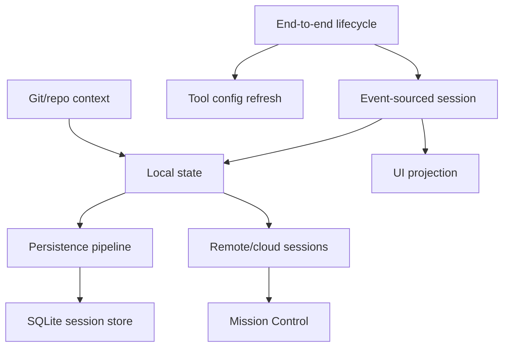

# Sessions and remote

Local event-sourced sessions, end-to-end lifecycle flow, persistence layers, cloud/remote control, SQLite indexing, UI projection, repository metadata, and Mission Control steering.

## Semantic alias and minified anchor mapping

This is a section index, not a direct `app.js` implementation analysis. Topic pages linked below carry the concrete bundle mappings.

| Semantic alias | Minified anchor | Scope |
|---|---|---|
| Sessions and remote section index | N/A — navigation page | Groups end-to-end lifecycle, event-sourced sessions, persistence layers, schemas, SQLite, UI projection, git context, and remote-control docs. |
| Sessions and remote topic pages | See linked page-level mappings | Concrete `app.js` anchors are documented in the child pages. |

## How this section fits

Click a node in the map to jump to that page.

## Pages

| Page | Why read it | File |
|---|---|---|
| [End-to-end session lifecycle](./session-lifecycle-end-to-end.md) | Creation/resume/continue, event replay, workspace state, tool refresh, UI projection, indexing, remote export, and shutdown in one path. | `session-lifecycle-end-to-end.md` |
| [Session support implementation in the Copilot CLI](./session-support-implementation.md) | Event-sourced local persistence, workspace artifacts, startup resolution, APIs, and handoff behavior. | `session-support-implementation.md` |
| [Persistence pipeline for sessions](./persistence-pipeline.md) | JSONL events, SessionFs, workspace sidecars, SQLite/FTS, search/reindex, fork, rewind, checkpoints, and cloud sync. | `persistence-pipeline.md` |
| [SessionFs provider and state-file lifecycle](./session-fs-provider-and-state-files.md) | Local vs SDK/RPC-backed session filesystems, reverse calls, workspace files, large-output temp files, and fork-time state copying. | `session-fs-provider-and-state-files.md` |
| [API and session event schema contracts](./api-and-session-event-schemas.md) | Public/package schema contracts for JSON-RPC methods and session events, cross-checked against SDK generation and `app.js` runtime forwarding. | `api-and-session-event-schemas.md` |
| [Session, remote, cloud, and history workflows](./sessions-remote-cloud.md) | Resume/continue/name handling, background sessions, cloud sessions, remote steering, and history. | `sessions-remote-cloud.md` |
| [Session-store SQLite indexing](./session-store-sqlite-indexing.md) | session-store.db schema, FTS/search, /reindex, Chronicle, refs, cloud sync, and backfill. | `session-store-sqlite-indexing.md` |
| [System events and UI projection](./system-events-and-ui-projection.md) | System messages, notifications, info/warning/error events, timeline entries, and ephemeral UI projection. | `system-events-and-ui-projection.md` |
| [Git, repository, PR, and ref context](./git-repository-context.md) | Git root/branch/head/base detection, session refs, PR context, and GitHub MCP overlap. | `git-repository-context.md` |
| [Remote control implementation in Copilot CLI](./remote-control-implementation.md) | Mission Control exporter, command polling, /remote, permission bridging, and remote task attach. | `remote-control-implementation.md` |

## Reading guidance

- Start with the end-to-end lifecycle page when you need the full create/resume/tool/UI/shutdown path.
- Read local session support for manager/replay details, then the persistence pipeline for how JSONL, workspace files, and SQLite fit together.
- Read SessionFs when debugging where session files live or how SDK clients take over persistence.
- Read the schema contract page when building SDK/JSON-RPC clients or interpreting raw session event logs.
- Repository context feeds both session selection and indexing.

## Back to wiki home

- [Wiki home](../README.md)
- [Full table of contents](../SUMMARY.md)
