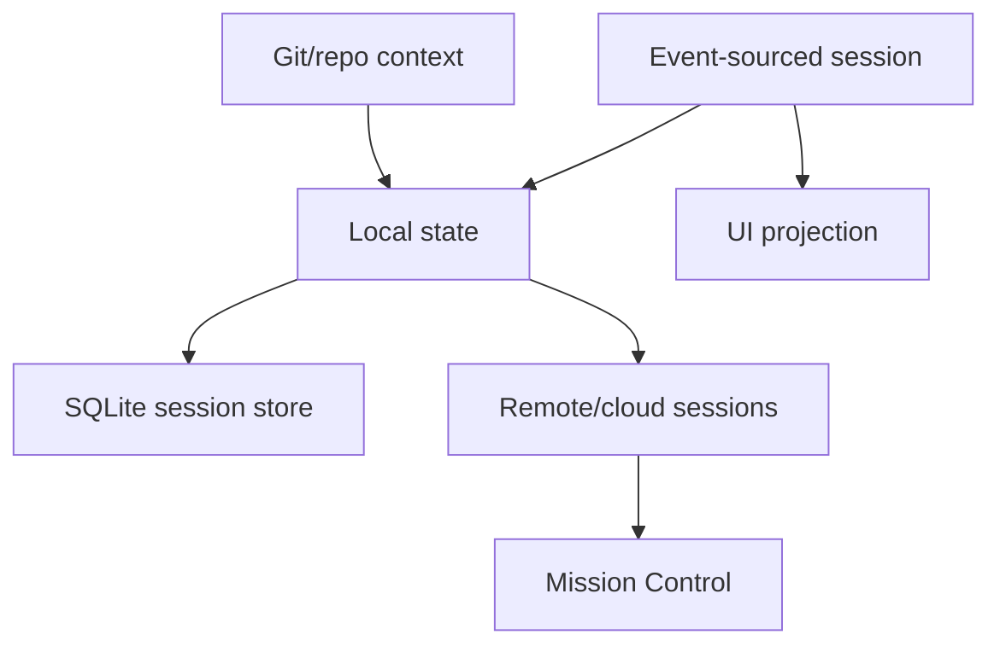

# Sessions and remote

Local event-sourced sessions, cloud/remote control, SQLite indexing, UI projection, repository metadata, and Mission Control steering.

## How this volume fits

## Pages

| Page | Why read it | File |
|---|---|---|
| [Session support implementation in the Copilot CLI](./session-support-implementation.md) | Event-sourced local persistence, workspace artifacts, startup resolution, APIs, and handoff behavior. | `session-support-implementation.md` |
| [Session, remote, cloud, and history workflows](./sessions-remote-cloud.md) | Resume/continue/name handling, background sessions, cloud sessions, remote steering, and history. | `sessions-remote-cloud.md` |
| [Session-store SQLite indexing](./session-store-sqlite-indexing.md) | session-store.db schema, FTS/search, /reindex, Chronicle, refs, cloud sync, and backfill. | `session-store-sqlite-indexing.md` |
| [System events and UI projection](./system-events-and-ui-projection.md) | System messages, notifications, info/warning/error events, timeline entries, and ephemeral UI projection. | `system-events-and-ui-projection.md` |
| [Git, repository, PR, and ref context](./git-repository-context.md) | Git root/branch/head/base detection, session refs, PR context, and GitHub MCP overlap. | `git-repository-context.md` |
| [Remote control implementation in `app.js`](./remote-control-implementation.md) | Mission Control exporter, command polling, /remote, permission bridging, and remote task attach. | `remote-control-implementation.md` |

## Reading guidance

- Start with local session support, then move to remote/cloud/indexing.
- Repository context feeds both session selection and indexing.

## Back to wiki home

- [Wiki home](../README.md)
- [Full table of contents](../SUMMARY.md)
