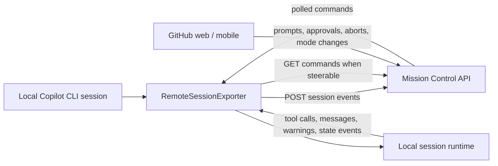
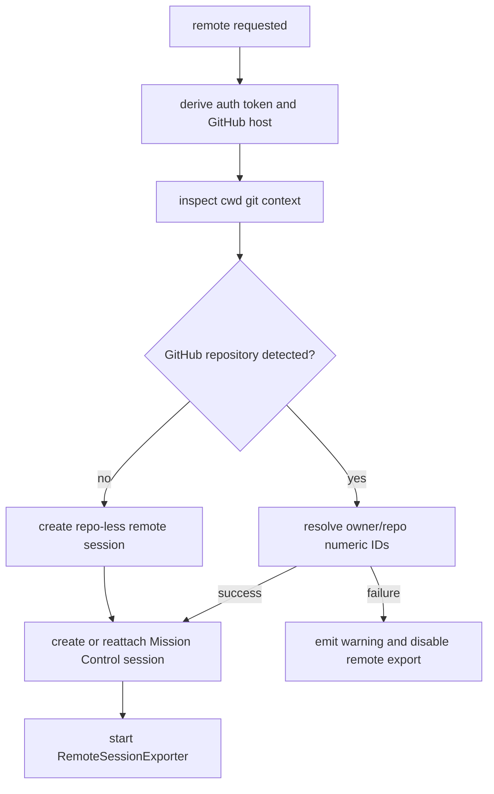
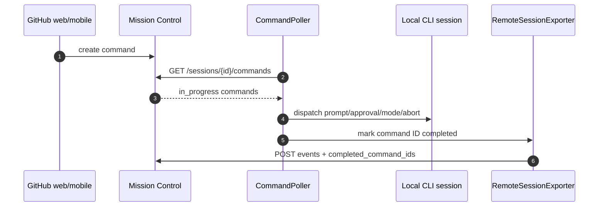

# Remote control implementation in Copilot CLI

This document describes what can be inferred from the bundled `app.js` about the Copilot CLI remote feature. In short, the CLI implements remote control as an outbound HTTPS integration with GitHub's **Mission Control** service: an internal GitHub-hosted control plane for Copilot tasks/sessions that stores remote session state, receives CLI event uploads, and exposes commands for the local CLI to poll. The CLI exports local session events to a GitHub-hosted task/session, then optionally polls that task/session for remote commands from GitHub web or mobile.

The implementation is not an SSH-style remote shell and does not require an inbound connection to the local terminal. The local CLI remains the executor; GitHub web/mobile acts as a remote steering client.

## Source anchors

`app.js` is bundled and minified, so names are not stable public APIs. The anchors below are useful for searching the analyzed `@github/copilot` artifact and may shift across releases.

| Area | Semantic alias | Minified anchor / string | Approx. offset | Role |
|---|---|---:|---:|---|
| Slash command | `/remote` handler | `Vps`, `"/remote [on|off|show]"` | `4.36M` | Implements `/remote show`, `/remote on`, and `/remote off`. |
| Remote RPC schema | `RemoteSessionMode` | `BHs`, `OKn`, `"off"`, `"export"`, `"on"` | `6.08M` | Defines remote modes and `remote.enable` / `remote.disable` result shape. |
| Mission Control client | `MissionControlClient` | `gR` | `6.35M` | Wraps `/sessions`, `/sessions/{id}/events`, `/sessions/{id}/commands`, `/tasks`, and frontend URL construction. |
| Command polling | `RemoteCommandPoller` | `Vve` | `7.40M` | Polls Mission Control commands and dispatches them into the local session. |
| Prompt bridge | `RemotePromptManager` | `jve` | `7.41M` | Resolves local ask-user, plan, elicitation, and permission prompts from remote responses. |
| Event exporter | `RemoteSessionExporter` | `q9e` | `7.41M` | Buffers, redacts, uploads, replays, and flushes session events; owns steering state. |
| Exporter factory | `setupRemoteExporter(...)` | `Rz(...)` | `7.42M` | Resolves auth/repo context, creates or reattaches the exporter, and emits user warnings. |
| JSON-RPC session wiring | `injectRemoteDelegate(...)` | `remoteExporters`, `session.remote_steerable_changed` | `9.90M` | Exposes per-session enable/disable behavior to server clients and slash commands. |
| Remote task/session attach | `RemoteSessionManager` | `Xce`, `mN`, `Yve`, `fAo` | `10.04M` | Lists, reconstructs, connects to, and optionally hands off remote Mission Control tasks. |
| Interactive startup | TUI remote bootstrap | `--remote requires authentication` | `11.84M` | Starts remote export/steering at launch when flags/settings request it. |

## High-level architecture

The core idea is simple:

1. A local session is created or resumed.
2. The CLI creates or reuses a Mission Control session/task for that local session.
3. The CLI uploads session events to Mission Control.
4. If steering is enabled, the CLI also polls Mission Control for commands.
5. Polled commands are translated back into normal local session operations: user messages, approval responses, mode switches, aborts, or start-session requests.

## User-visible entry points

### CLI flags

The root command registers these remote-related options:

| Option | Behavior inferred from `app.js` |
|---|---|
| `--remote` | Enables remote control from GitHub web and mobile. In interactive TTY startup, this requests export plus steering. |
| `--no-remote` | Disables remote control. |
| `--disable-remote-sessions` | Hidden server-mode option that disables remote session access. |

The interactive startup path logs `--remote ignored outside interactive TTY mode` when the flag cannot apply to the current execution mode. Server/JSON-RPC mode has its own remote wiring through session create/resume parameters.

### Slash command

The `/remote` command is implemented as a built-in runtime slash command:

| Command | Runtime behavior |
|---|---|
| `/remote show` | Reads the current workspace field `remote_steerable` and reports whether remote control is enabled. |
| `/remote on` | Calls the session remote delegate with `{ mode: "on" }`; on success, reports `Remote control enabled` and prints the Mission Control frontend URL if present. |
| `/remote off` | Calls the remote delegate's disable path, stops the exporter if present, persists `remote_steerable: false`, and reports `Remote control disabled.` |

Invalid usage produces `Invalid usage. Use: /remote [on|off|show]`.

### JSON-RPC / SDK sessions

The session API exposes a remote capability with three modes:

| Mode | Meaning |
|---|---|
| `off` | Disable remote export and steering. |
| `export` | Upload session events to Mission Control, but do not accept remote steering commands. |
| `on` | Upload session events and enable remote steering. |

The return shape is `{ url?: string, remoteSteerable: boolean }`, where `url` is the Mission Control frontend URL for the session/task.

## Mission Control client

The Mission Control client wrapper constructs its base URL from the authenticated GitHub API host and appends `/agents` by default. It can be overridden with environment variables.

| Environment variable | Use |
|---|---|
| `COPILOT_MC_BASE_URL` | Overrides the Mission Control API base URL. |
| `COPILOT_MC_ACCESS_TOKEN` | Overrides the bearer token used by Mission Control requests. |
| `COPILOT_MC_FRONTEND_URL` | Overrides the frontend URL used when constructing links. |
| `COPILOT_MC_REPO` | Overrides the repository owner/name associated with the remote session. |
| `COPILOT_MC_REPO_IDS` | Overrides resolved numeric owner/repository IDs as `ownerId,repoId`. |

The client sets JSON headers, a `Copilot-Integration-Id`, and an `Authorization: Bearer ...` header when a token is available.

Observed API calls include:

| Method and path | Purpose |
|---|---|
| `POST /sessions` | Create a Mission Control session for the local CLI session. |
| `POST /sessions/{sessionId}/events` | Upload buffered local session events and completed remote command IDs. |
| `GET /sessions/{sessionId}/commands` | Poll for remote commands. |
| `GET /sessions/{sessionId}` | Check whether a previously persisted Mission Control session still exists. |
| `GET /tasks/{taskId}` and `GET /tasks/{taskId}/events` | Inspect remote task state/events. |
| `POST /tasks/{taskId}/steer` | Send a prompt/steering request to an existing remote task. |
| `DELETE /tasks/{taskId}` | Delete a synced Mission Control task. |

The frontend URL is constructed as:

`{frontendBaseUrl}/copilot/tasks/{taskId}`

## Session creation and repository association

The exporter factory performs the setup work before any event forwarding begins.

Important behavior:

- The current working directory is inspected for repository metadata.
- If no GitHub repository is detected, the CLI can still create a repo-less remote session.
- If a GitHub repository is detected, the CLI resolves numeric repository IDs before creating the remote session.
- Failures emit `session.warning` events and telemetry such as `remote_control_connection_failed`.
- A `403` from Mission Control is interpreted as a policy block and shown as: remote sessions are not enabled for this repository/organization.
- Repository resolution failures produce user-facing hints for expired auth, SSO authorization, account switching, or login.

The session creation payload includes the local session ID as `agent_task_id`, optional repository owner/repo IDs, optional compute metadata, an optional task ID, and a `remote_context` containing a local device ID, device display name, and working directory when available.

## Event export path

`RemoteSessionExporter` owns local-to-remote event forwarding.

### Reattach and persistence

On initialization, the exporter tries to avoid creating duplicates:

1. If an existing Mission Control session is supplied, it reattaches to it.
2. Otherwise, it checks persisted workspace fields for `mc_session_id` and `mc_task_id`.
3. If the persisted session still exists, it reuses it and resumes after `mc_last_event_id`.
4. Otherwise, it creates a new Mission Control session.

The exporter persists these workspace fields:

| Field | Meaning |
|---|---|
| `mc_session_id` | Mission Control session ID. |
| `mc_task_id` | Mission Control task ID used for the frontend URL. |
| `mc_last_event_id` | Last successfully uploaded non-ephemeral local event ID. |
| `remote_steerable` | Whether steering is currently enabled. |

### Replay and batching

When started, the exporter:

- replays non-ephemeral local session events after the last uploaded event marker;
- if no marker exists, replays all non-ephemeral events;
- injects a `session.title_changed` event from the workspace name when available;
- subscribes to all future session events;
- schedules flushes on a short batch interval and a longer heartbeat interval.

Observed constants in the analyzed bundle:

| Constant | Value | Use |
|---|---:|---|
| Batch interval | `500 ms` | Normal event flush cadence. |
| Heartbeat interval | `10,000 ms` | Idle flush/heartbeat cadence. |
| Max batch size | `500 events` | Number of events sent in one flush. |
| Buffer cap | `1,000 events` | Oldest events are dropped if the buffer grows beyond this while unavailable. |
| Detached flush threshold | `5 items` | Small shutdown payloads can be flushed by a detached child process. |

Before upload, events are passed through the runtime secret-filtering service, so remote export is designed to redact secrets from event objects.

### Failure handling

The exporter uses a circuit breaker around event uploads:

- failure threshold: `5` consecutive failures;
- reset timeout starts around `1,000 ms`;
- maximum reset timeout is `30,000 ms`.

When the circuit opens, the exporter stops command polling and caps the event buffer. After successful recovery, it restarts command polling if the session is still steerable.

### Shutdown flushing

On stop, the exporter:

1. stops the command poller;
2. unsubscribes from session events;
3. waits for any active flush;
4. attempts to flush pending events and command acknowledgements;
5. for small pending payloads, may spawn a detached process using `COPILOT_SHUTDOWN_FLUSH`;
6. optionally forces local session events to disk;
7. persists `mc_last_event_id`.

## Remote steering path

Steering is the difference between `export` and `on` mode. Export-only sessions upload events but do not poll for commands. Steerable sessions create a command poller.

The command poller runs every `3,000 ms` by default and ignores commands it has already processed. It only processes commands whose state is `in_progress`.

Observed command handling:

| Remote command type | Local effect |
|---|---|
| `ask_user_response` | Resolves a pending ask-user prompt. |
| `plan_approval_response` | Resolves a pending plan approval prompt. |
| `permission_response` | Resolves a pending tool/path/URL/hook permission request. |
| `elicitation_response` | Resolves a pending elicitation prompt. |
| `mode_switch` | Parses JSON and switches the local session mode if valid. |
| `start_session` | Calls the configured start-session callback to spawn another session. |
| `abort` | Clears pending items when possible and aborts the local session with a remote-command reason. |
| default / no type | Sends command content as a normal immediate user prompt into the local session. |

After each command is dispatched, the command ID is queued as completed and acknowledged on the next event upload.

## Prompt and permission bridging

The prompt manager is what makes remote approvals behave like local approvals. It wraps local prompt callbacks and registers pending prompt IDs, usually keyed by the tool call ID.

Supported remote-resolved prompt categories include:

- ask-user prompts;
- exit-plan / plan approval prompts;
- elicitation prompts;
- generic tool permission requests;
- URL permission requests;
- path permission requests;
- hook permission requests.

For permission responses, the bridge converts remote approvals into the same local decision objects used by the TUI:

| Remote response | Local permission decision |
|---|---|
| denied | `reject` or `denied-interactively-by-user` |
| approved once | `approve-once` |
| approved for session | `approve-for-session` with the relevant command/write/read/MCP/memory/custom-tool/extension scope |
| URL approved for session | `approve-for-session` scoped to the URL origin |
| path approved for session | `approve-for-session` path decision |

This means remote control reuses the normal permission system rather than bypassing it.

## Enable, upgrade, and disable behavior

The per-session remote delegate handles runtime changes:

- `mode: "off"` stops any exporter, removes it from the active exporter map, emits `session.remote_steerable_changed` with `false`, and returns `{ remoteSteerable: false }`.
- `mode: "export"` creates an exporter without command polling.
- `mode: "on"` creates a steerable exporter, or upgrades an existing export-only exporter by calling `enableSteering()`.
- Disabling persists `remote_steerable: false` and emits a `session.remote_steerable_changed` event.

When an export-only session is upgraded, the exporter creates a prompt manager, starts the command poller, persists `remote_steerable: true`, and begins accepting remote commands.

## Remote task/session attach is adjacent but separate

`app.js` also contains a remote session manager that lists Mission Control tasks and reconstructs sessions from remote logs. This supports flows such as `--connect`, remote task resume, and handoff to a local session.

That path is distinct from enabling remote control on a local session:

| Path | Purpose | Key behavior |
|---|---|---|
| Remote exporter / steering | Make the current local CLI session visible and optionally controllable from GitHub web/mobile. | Upload local events; poll commands; execute locally. |
| Remote session/task attach | Connect to or hand off an already-existing Mission Control task/session. | List tasks; fetch logs/events; reconstruct session history; optionally stream status; optionally create a local handoff session. |

For CLI-originated remote tasks, the attach path can create a remote-backed session object, start event polling, and mark it `remoteSteerable: true`. For non-CLI or handoff flows, it can reconstruct events from logs and then save a local session after repository validation/checkout steps.

## Security and operational implications

- The transport is outbound HTTPS polling/uploading, not inbound shell access.
- The local CLI remains responsible for executing prompts and tools.
- Remote commands enter through the same session APIs as local user messages or permission responses.
- Permission prompts remain enforced; remote approvals resolve normal pending permission requests.
- Events are secret-filtered before upload.
- Authentication is GitHub-token based; missing or invalid auth disables explicit remote setup and emits warnings.
- Organization/repository policy can block remote sessions, reported as `policy_blocked`.
- Persisted Mission Control IDs allow reattachment and reduce duplicate remote sessions.

## What is not visible from `app.js`

The bundled client reveals the local implementation and the HTTP contract it calls, but not the server-side Mission Control implementation. Specifically, `app.js` does not show:

- how GitHub web/mobile stores or authorizes command creation;
- the complete server schema for Mission Control tasks;
- server-side policy checks beyond client-observed status handling;
- how device IDs are generated internally outside the client helper calls.

Even with those limits, the local architecture is clear: remote control is an event-exporter plus command-poller around the normal Copilot CLI session runtime.