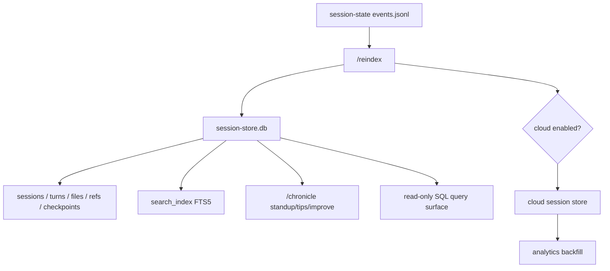
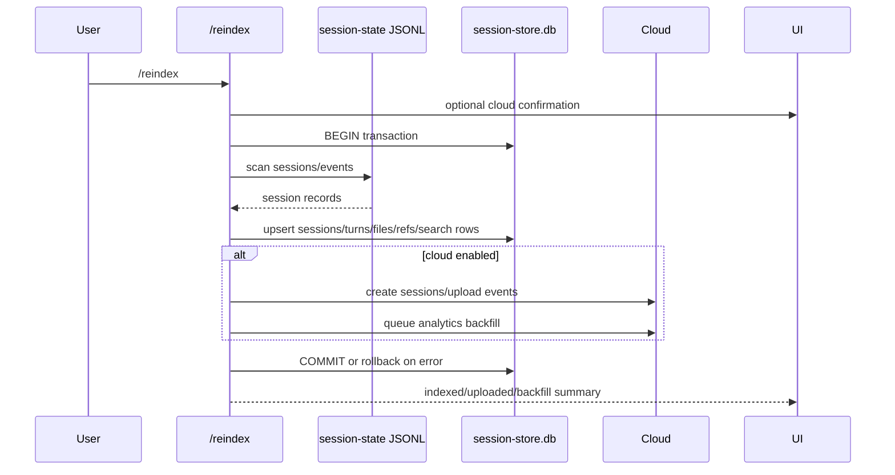

# Session-store SQLite indexing

This document explains the local session-store and indexing implementation visible in the extracted Copilot CLI `app.js` bundle. The relevant surfaces include `session-store.db`, the `/reindex` slash command, Chronicle prompts, `SESSION_STORE` and `SESSION_INDEXING` feature gates, local SQLite schema/tables, search indexing, and optional cloud-session-store synchronization.

The important implementation point is that the CLI maintains two related session histories:

- raw per-session event logs under session state directories;
- an indexed SQLite store (`session-store.db`) optimized for search, Chronicle summaries, references, and debugging queries.

Because `app.js` is bundled/minified, symbol names are unstable. Line references below are searchable anchors in the extracted bundle and will shift across releases.

## Source anchors

| Area | Anchor strings / minified symbols | Approx. `app.js` line | What it shows |
|---|---|---:|---|
| SQLite store | `session-store.db`, `node:sqlite`, `DatabaseSync` | 4518, 7449 | Store lives in Copilot state and uses Node’s SQLite binding. |
| Store feature gate | `SESSION_STORE:"on"` | 239 | Local session store is enabled by default in the analyzed bundle. |
| Indexing gates | `SESSION_INDEXING:"staff"`, `SESSION_INDEXING_REPO:"staff"`, `CLOUD_SESSION_STORE:"staff"` | 239 | Reindex/cloud indexing are separately gated. |
| `/reindex` command | `/reindex`, `Index all session history into the session store.` | 4643-4644 | Rebuilds the local SQLite index and optionally syncs cloud session state. |
| SQLite schema | `sessions`, `session_files`, `session_refs`, `turns`, `checkpoints`, `search_index` | 4569, 4582 | Store has relational tables plus FTS search index. |
| Ref indexing | `session_refs`, `ref_type`, `ref_value`, `idx_session_refs_type_value` | 4569, 4582, 4629 | PR/issue/commit-style references are indexed separately. |
| Read-only SQL | `SQLITE_READ`, `SQLITE_SELECT`, `SQLITE_FUNCTION`, `SQLITE_RECURSIVE`, `executeReadOnly` | 4518 | Query surface restricts SQLite operations to read-only statements. |
| Chronicle prompts | `/chronicle`, `standup`, `tips`, `improve`, `session_store` | 4643, 4690, 4738 | Chronicle reads indexed session history to build standup/tips/improvement prompts. |
| Cloud sync | `Starting cloud session sync`, `eventsUploaded`, `backfillQueued`, `analytics/backfill` | 4516, 4643-4644 | Reindex can create/upload cloud sessions and queue analytics backfill. |
| State migration | `.copilot`, `session-state`, `session-store.db`, `command-history-state` | 7449 | State artifacts are migrated/copied together under `.copilot`. |

## Architecture map

## Store location and initialization

The store file is named `session-store.db` and is part of the `.copilot` state artifact set. The initialization path:

1. Resolves the state directory from settings.
2. Opens the SQLite database with Node’s `node:sqlite` `DatabaseSync` API.
3. Enables `PRAGMA journal_mode = WAL`.
4. Sets `PRAGMA busy_timeout = 3000`.
5. Enables `PRAGMA foreign_keys = ON`.
6. Ensures the schema exists/migrates.

WAL mode and busy timeout are practical choices for a CLI that may have background sessions or helper flows reading/writing state concurrently.

## Schema overview

The schema evidence includes these tables/indexes:

| Table/index | Purpose |
|---|---|
| `sessions` | Session-level metadata such as ID, repository, branch, cwd, summary, timestamps. |
| `turns` | Turn-level prompt/response/tool activity. |
| `session_files` | Files touched/read/modified by a session, keyed by session and path. |
| `session_refs` | References such as PRs, issues, commits, or other ref values associated with a session. |
| `checkpoints` | Checkpoint/session recovery records, indexed by session. |
| `dynamic_context_items` | Context-board entries keyed by repository/branch. |
| `search_index` | FTS5 virtual table for full-text search over indexed session content. |
| `idx_sessions_repo`, `idx_sessions_cwd` | Common lookup indexes. |
| `idx_session_files_path` | Path lookup index. |
| `idx_session_refs_type_value` | Reference lookup index. |
| `idx_turns_session`, `idx_checkpoints_session` | Session-local lookup indexes. |

The schema is not merely a transcript dump. It is designed for queryable summaries, references, file relationships, and text search.

## Read-only query safety

The query helper executes SQL in a read-only mode and checks SQLite authorizer constants. Allowed operations include:

- `SQLITE_READ`;
- `SQLITE_SELECT`;
- `SQLITE_FUNCTION`;
- `SQLITE_RECURSIVE`.

This keeps interactive/debug query features from mutating the store. The helper also limits returned rows and marks results as truncated when the limit is exceeded.

## `/reindex` command

`/reindex` is described as:

> Index all session history into the session store.

Its implementation:

1. Optionally shows a cloud confirmation dialog when `SESSION_INDEXING` is enabled, the user is logged in, and repository context exists.
2. Opens the local session store.
3. Adds an info timeline entry: `Reindexing sessions into SQLite store…`.
4. Starts a SQLite transaction.
5. Scans session history.
6. Upserts sessions, turns, files, refs, search-index entries, and related metadata.
7. Optionally runs cloud session sync.
8. Reports counts such as sessions indexed locally, cloud sessions created, events uploaded, and queued backfills.

The final user-facing message distinguishes clean success from partial success with errors.

## Session refs

`session_refs` stores references independently of full text. The schema includes:

| Column | Meaning |
|---|---|
| `session_id` | Owning session. |
| `ref_type` | Reference category, such as PR/issue/commit-like type. |
| `ref_value` | Reference value. |
| `turn_index` | Optional turn where it appeared. |
| `created_at` | Insert timestamp. |

There is a uniqueness constraint over `(session_id, ref_type, ref_value)`, so repeated mentions do not produce duplicate refs for the same session.

Chronicle standup prompts use refs to ask the agent to check PR status or summarize work streams.

## Search index

The store creates a `search_index` virtual table using FTS5 when it does not already exist. This allows session history to be searched by indexed text rather than by scanning all JSONL logs.

The exact indexed fields are minified in the bundle, but the surrounding code shows the FTS table is part of the session-store schema and is rebuilt by indexing flows.

## Chronicle integration

The `/chronicle` command family uses the session store for higher-level reports:

| Chronicle flow | Store usage |
|---|---|
| `standup` | Prefetches sessions from the last 24 hours and refs, then asks the agent to format a standup update. |
| `tips` | Analyzes usage patterns and recommends CLI workflow improvements. |
| `improve` | Finds where the agent struggled or needed correction and suggests instruction-file improvements. |
| `reindex` | Rebuilds the store when history is missing/stale. |

The standup prompt explicitly says that if no sessions are found, the user should try a longer range or run `/chronicle reindex` if sessions have not been indexed.

## Cloud session store sync

When cloud features and repository settings are available, reindex can also sync with a cloud session store. The evidence shows:

| Cloud metric | Meaning |
|---|---|
| `created` | Cloud sessions created. |
| `eventsUploaded` | Events uploaded. |
| `failed` | Sessions that failed cloud sync. |
| `backfillQueued` | Analytics/session backfill queued. |
| `backfillFailed` | Backfill request failed. |

Cloud sync reports progress every 20 scanned sessions and can queue `/analytics/backfill` calls through Mission Control-style APIs.

## Local versus cloud querying

The local store uses SQLite. Chronicle cloud prompts mention DuckDB-style SQL syntax for cloud/pre-fetched data in some flows. The distinction is:

| Store | Role |
|---|---|
| Local `session-store.db` | SQLite store in `.copilot` state for local indexing/search/debug queries. |
| Cloud session store | Optional remote indexed session data for repo/account-scoped Chronicle and cloud workflows. |

Reindex can bridge both by indexing locally and uploading events remotely.

## State migration

The state migration code lists these `.copilot` artifacts together:

- `session-state`;
- `session-store.db`;
- `command-history-state`;
- `command-history-state.json`;
- `installed-plugins`.

This indicates `session-store.db` is first-class persistent runtime state, not a temporary cache file.

## End-to-end reindex flow

## Relationship to other docs

- `session-support-implementation.md` explains raw session event persistence and resume/handoff behavior.
- `sessions-remote-cloud.md` explains cloud sessions, remote steering, and session indexing at a higher level.
- `git-repository-context.md` explains repository/branch/ref extraction that feeds `session_refs`.
- `memory-and-context-board.md` explains dynamic context board entries stored by repository/branch.
- `diagnostics-feedback-debug-bundles.md` explains session log artifacts that can be packaged for debugging.
