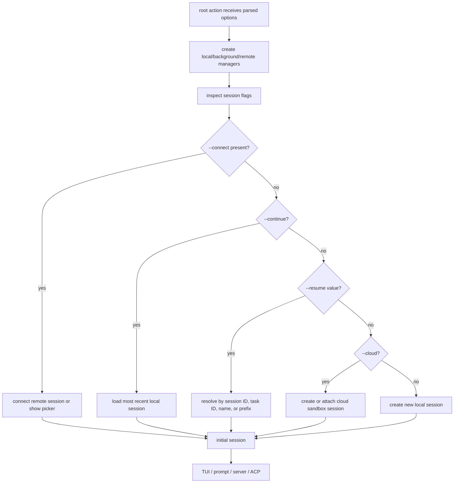
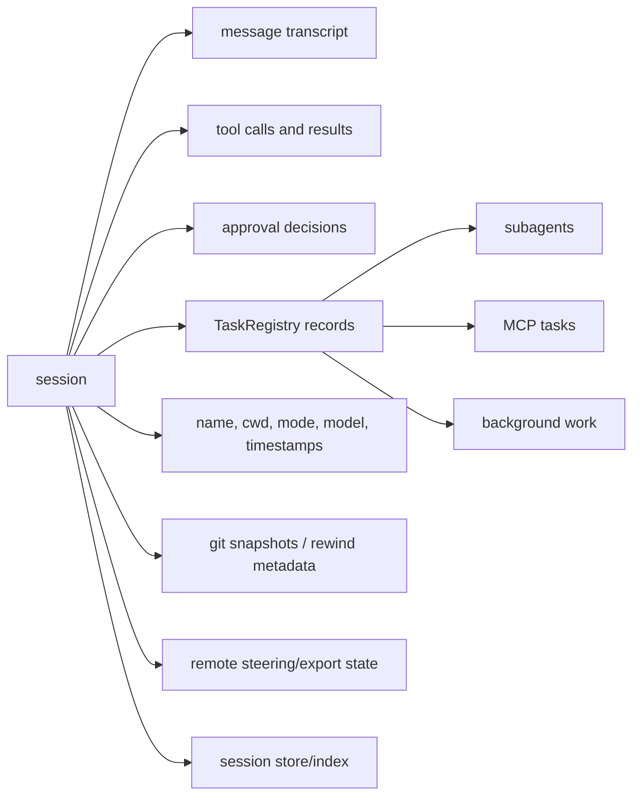
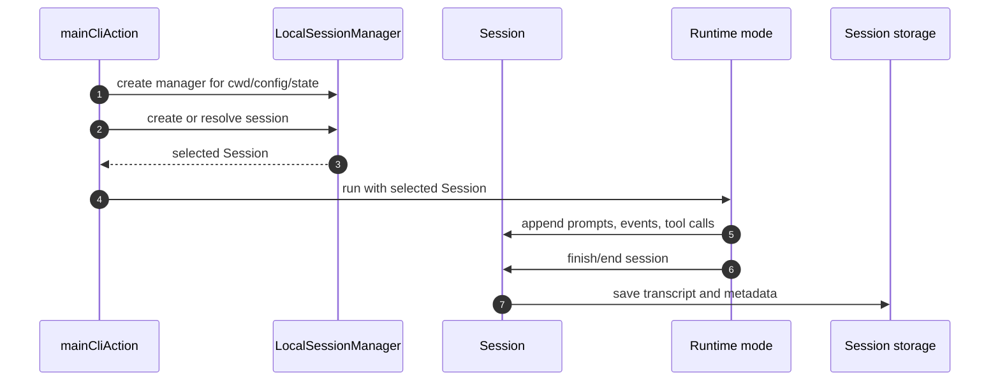
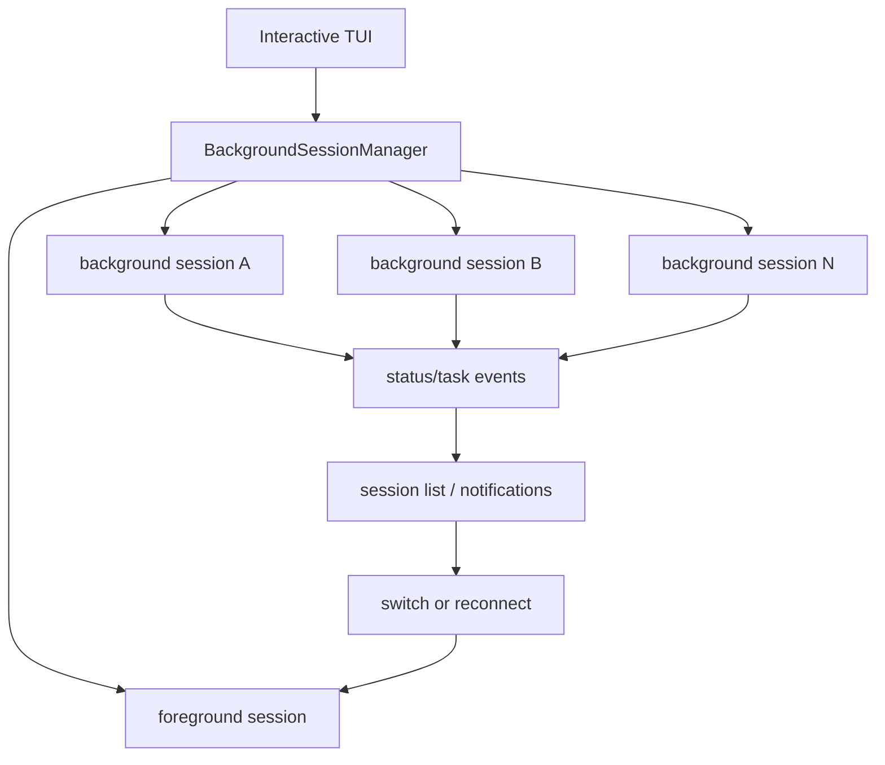
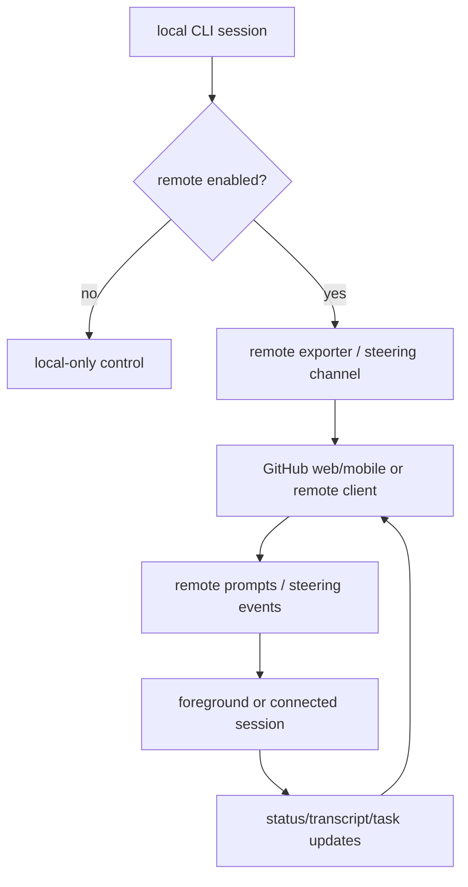
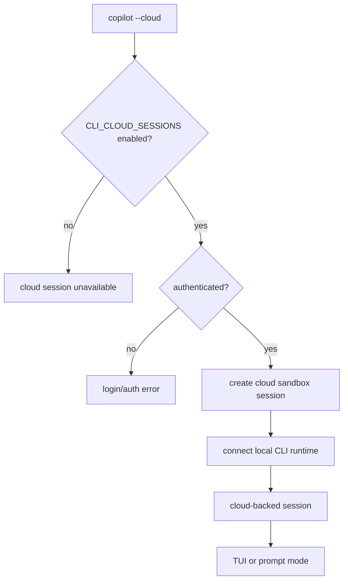
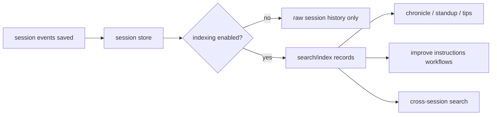
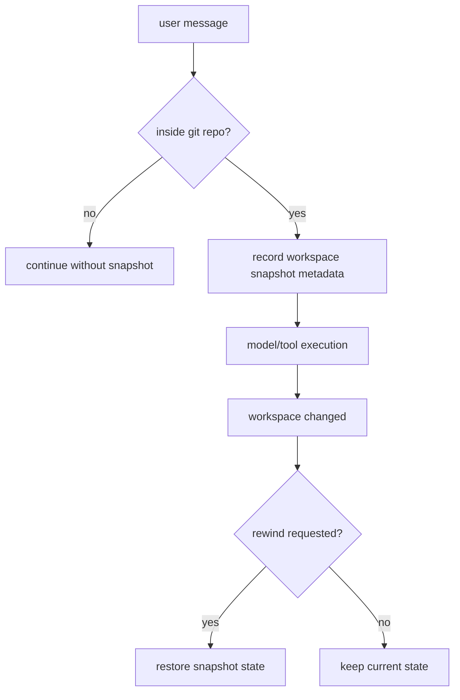

# Session, remote, cloud, and history workflows

This document expands the session coverage that was previously spread across the runtime overview and main feature map. It focuses on how `app.js` resolves local sessions, attaches remote/cloud behavior, manages background sessions, and wires session history/indexing into the runtime.

## Source anchors

| Area | Semantic alias | Minified anchor | Approx. line | Role |
|---|---|---:|---:|---|
| Root session router | `mainCliAction(...)` | root `.action(...)` | 8298 | Parses `--resume`, `--continue`, `--name`, `--connect`, `--cloud`, and remote flags before dispatching a mode. |
| Local sessions | `LocalSessionManager` | `P6` usage | 8298 | Creates, stores, resumes, continues, names, and resolves local sessions. |
| Background sessions | `BackgroundSessionManager` | `sV` usage | 6599, 8298 | Tracks multiple concurrent sessions in interactive mode. |
| Remote sessions | `RemoteSessionManager` / remote exporter | remote manager usage | 8298 | Connects the foreground runtime to remote steering/start-session flows. |
| Cloud sessions | `CloudSessionFlow` | cloud branch in main action | 8298 | Creates or attaches to a cloud-backed sandbox session; distinct from local `/sandbox` command sandboxing. |
| Session store | `SessionStore`, `session indexing` | `SESSION_STORE`, `SESSION_INDEXING`, `CLOUD_SESSION_STORE` | 239, 8298 | Persists/searches session history and powers chronicle-style workflows. |
| Task registry | `TaskRegistry` | `B3` | 3367 | Tracks background subagent and MCP task state inside a session. |
| Shutdown/save | `ShutdownService` | `eke` | 7420 | Saves sessions, waits for pending work, and ends foreground sessions cleanly. |

## Session selection at startup

The root action supports several mutually interacting ways to choose the initial session. The selected session is then passed into TUI, prompt, server, or ACP mode.

Important behavior from the captured root help and main action flow:

- `--continue` selects the most recent session.
- `--resume` can be empty, a full session ID, an ID prefix, a task ID, or an exact case-insensitive name.
- `--name` names a newly created session.
- `--connect` attaches to a remote session, optionally by session ID or task ID.
- `--cloud` requests a cloud sandbox-backed session. This is separate from local command sandboxing via `/sandbox`; see [`sandboxing.md`](../05-security-and-policy/sandboxing.md).

## Session state model

A session is not just a transcript. It is the container that ties together model turns, tool calls, permission state, background work, workspace metadata, and save/export behavior.

Conversation compaction is part of this session-history layer: successful compaction emits session events, mutates reconstructed chat history during replay, and can persist checkpoint summaries. See [`conversation-compaction.md`](../02-context-and-input/conversation-compaction.md) for the implementation details.

## Local sessions

Local session behavior is the baseline for all modes.

Local sessions provide:

- stable session identifiers;
- named sessions;
- resume and continue behavior;
- transcript and event persistence;
- optional export/share behavior in prompt mode;
- backing state for history/indexing features.

## Background sessions

Background sessions are distinct from background subagent tasks. A background session is a separate session that can continue while another foreground session is active.

Key distinction:

| Concept | Scope | Owner |
|---|---|---|
| Background session | Whole session running outside the foreground UI | `BackgroundSessionManager` |
| Background agent/task | Subagent or MCP task inside a session | `TaskRegistry` |

The TUI can surface both, but they are different layers.

## Remote steering and remote sessions

Remote support lets GitHub web/mobile or another remote client steer a CLI session when enabled.

Remote behavior is shaped by:

- `--remote` to enable remote control;
- `--no-remote` to disable it;
- `--connect` to attach directly to a remote session or task;
- the `REMOTE_KICKSTART` feature gate;
- authentication, because remote control is tied to GitHub-hosted state.

Permission prompts can also travel over remote steering paths: remote clients send permission responses back into the prompt manager, which converts them into the same approval decisions used by the local TUI. See [`permission-system-design.md`](../05-security-and-policy/permission-system-design.md) for that prompt/RPC bridge.

## Cloud sessions

Cloud sessions create or attach to a sandbox-backed environment rather than only using the local workspace. This section is about **remote cloud sandbox sessions**. The local `/sandbox` command toggles shell-process sandboxing inside local sessions and is documented in [`sandboxing.md`](../05-security-and-policy/sandboxing.md).

Cloud sessions differ from normal local sessions because the compute/workspace backing can be remote. The CLI still uses the same high-level session machinery after the connection is established. Do not conflate this with `settings.sandbox.enabled`, which changes local shell spawning rather than session location.

## Session store and indexing

Session history features are controlled by gates such as `SESSION_STORE`, `SESSION_INDEXING`, `SESSION_INDEXING_REPO`, and `CLOUD_SESSION_STORE`.

The session store allows the CLI to treat prior conversations as structured historical data rather than plain log files.

## Snapshot and rewind behavior

The main feature map and TUI code indicate support for git snapshot/rewind-style behavior. At a high level, the session can record workspace state around user messages and later support rollback.

## Gate map

| Gate | Session impact |
|---|---|
| `SESSION_STORE` | Enables core persisted session history behavior. |
| `SESSION_INDEXING` | Enables indexing/search over session history. |
| `SESSION_INDEXING_REPO` | Narrows or augments indexing with repository-aware behavior. |
| `CLOUD_SESSION_STORE` | Enables cloud-backed session store paths. |
| `BACKGROUND_SESSIONS` | Enables multiple concurrent/background sessions in the interactive UI. |
| `REMOTE_KICKSTART` | Enables remote start/delegation workflows. |
| `CLI_CLOUD_SESSIONS` | Enables cloud sandbox sessions. |
| `SANDBOX` | Enables the local `/sandbox` slash command, but does not enable cloud sessions. |
| `WEBSOCKET_RESPONSES` | Affects response/event transport behavior for remote/session integrations. |

## Takeaways

- Session resolution happens before runtime mode dispatch, so TUI, prompt, server, and ACP modes all receive an already-selected session.
- Local session state is the foundation for resume, continue, naming, transcript persistence, and export/share behavior.
- Background sessions and background agent tasks are separate concepts, managed by different layers.
- Remote and cloud session features extend the same session abstraction rather than replacing it.
- Cloud sandbox sessions and local `/sandbox` command sandboxing are separate paths with different gates and enforcement points.
- Session indexing turns prior sessions into searchable data for chronicle, tips, standups, and instruction-improvement workflows.