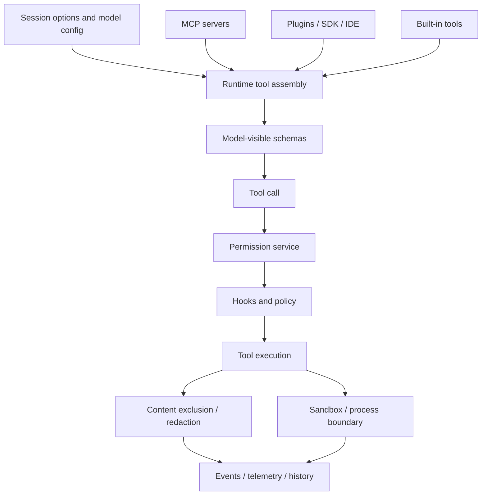

# Tools, integrations, and security

This chapter combines three concerns that are inseparable in an agent runtime:

1. Which capabilities become model-visible tools?
2. Which external systems contribute tools, prompts, hooks, or agents?
3. Which trust boundaries approve, deny, redact, sandbox, or persist policy?

Read this chapter when the question is: **why could the model do that, and what guarded the action?**

## Chapter ownership model

The chapter is organized around the lifecycle of an action, not around package names:

1. **Expose capability** — decide which tools and integration-provided capabilities become visible to the model.
2. **Execute capability** — run the selected tool through hooks, permissions, streaming, telemetry, and durable events.
3. **Constrain capability** — apply path/URL/tool policies, redaction, content exclusion, sandboxing, and persisted configuration.
4. **Extend capability** — let MCP servers, plugins, SDK extensions, IDE/LSP bridges, web access, and validation tools contribute new surfaces without bypassing the same guards.

If a page explains what is sent to the model as prompt/context, it belongs in [Context and model loop](../02-context-model-loop/README.md). If it explains durable event replay or remote projection, it belongs in [Sessions, persistence, and remote](../04-sessions-persistence-remote/README.md). This chapter owns the trust boundary between those two layers.

## Source-anchor policy

This page is a chapter guide. Linked implementation pages carry concrete `app.js` anchors.

| Semantic alias | Minified anchor | Scope |
|---|---|---|
| Tools/integrations/security chapter | N/A — navigation page | Groups runtime tool assembly, execution, MCP/plugins/SDK/IDE/web integrations, permissions, redaction, hooks, sandboxing, and policy state. |
| Tool/security implementation pages | See linked source-anchor tables | Concrete bundle anchors live in the destination pages. |

## Trust-boundary map

## Primary reading order

| Order | Page | Tool/security question answered |
|---:|---|---|
| 1 | [Runtime tool assembly and filtering](runtime-tool-assembly-and-filtering.md) | How are built-ins, MCP, SDK extensions, plugins, custom agents, filters, deferred search, and gates assembled into the final toolset? |
| 2 | [Built-in tools, execution events, and results](built-in-tools-execution-events.md) | How do permission checks, hooks, execution events, streaming, telemetry, and history wrap a tool call? |
| 3 | [Shell command execution events](shell-command-execution-events.md) | How do Bash/PowerShell tools choose PTY/process backends, async/detached behavior, task tracking, and large-output handling? |
| 4 | [MCP host, transports, and tools](mcp-host-transport-and-tools.md) | How are MCP servers discovered, transported, authorized, filtered, and mapped into tools/resources/prompts/tasks? |
| 5 | [Tool, path, and URL permissions](tool-path-url-permissions.md) | How do tool/path/URL/MCP/hook approval rules and precedence work? |
| 6 | [Content exclusion and redaction](content-exclusion-and-redaction.md) | How do policy fetch/merge, filtered outputs, secret env vars, and redaction boundaries affect model-visible data? |
| 7 | [Sandbox implementation](sandboxing.md) | How does local command sandboxing route shell sessions through MXC helpers and filesystem policies? |

## Boundary-by-boundary map

| Boundary | Primary page | What to verify there |
|---|---|---|
| Model-visible tool list | [Runtime tool assembly and filtering](runtime-tool-assembly-and-filtering.md) | Tool candidates, filters, selected-agent rules, deferred loading, and `session.tools_updated`. |
| Tool call execution | [Built-in tools, execution events, and results](built-in-tools-execution-events.md) | Start/progress/partial/complete events, request processors, hooks, permissions, and replayable results. |
| Shell process boundary | [Shell command execution events](shell-command-execution-events.md) | PTY/process backend choice, sync/async/detach semantics, output buffers, background tasks, and notifications. |
| MCP protocol boundary | [MCP host, transports, and tools](mcp-host-transport-and-tools.md) | Config merge, local/HTTP/SSE transports, OAuth, instructions, tool flattening, and MCP task/progress events. |
| Approval boundary | [Tool, path, and URL permissions](tool-path-url-permissions.md) | Deny/allow precedence, path/URL managers, session/location approvals, remote/ACP prompts, and allow-all toggles. |
| Data policy boundary | [Content exclusion and redaction](content-exclusion-and-redaction.md) | Excluded paths, filtered outputs, secret env vars, and redaction layers before data becomes model-visible or support-visible. |
| Local sandbox boundary | [Sandbox implementation](sandboxing.md) | MXC adapter invocation, filesystem/network policy, platform constraints, and sandbox setting persistence. |

## Integration providers

| Provider | Page | Runtime surface |
|---|---|---|
| Plugins | [Plugins, extensions, and capabilities](plugins-extensions-and-capabilities.md) | Plugin caches, marketplaces, contributed skills/agents/hooks/MCP/LSP, and enablement state. |
| Programmatic SDK extensions | [Copilot SDK extension bridge](copilot-sdk-extension-bridge.md) | `@github/copilot-sdk` extension discovery, `joinSession()`, management APIs, events, and trust boundaries. |
| IDE/LSP/editor bridges | [IDE, LSP, and editor integration](ide-lsp-editor-integration.md) | IDE tools, selections, diagnostics, diffs, title sync, LSP config, and extension state. |
| Web/GitHub network access | [Web search, URL fetching, and URL permissions](web-search-url-fetching.md) | Built-in web fetch, GitHub MCP web search, URL allow/deny persistence, and web gates. |
| Validation/review tools | [Coding-agent validation and review toolchain](coding-agent-validation-toolchain.md) | Code review, CodeQL, secret scanning, advisory checks, budgets, and validation telemetry. |

## Policy and persistence topics

- [Hooks, events, and automation](hooks-events-and-automation.md) explains command/HTTP hooks, VS Code aliases, security restrictions, and lifecycle events.
- [Settings and configuration persistence](settings-config-persistence.md) explains config roots, typed stores, settings overlays, URL/MCP/plugin/sandbox state, and migration behavior.
- [MXC sandbox binary notes](../99-research-atlas/mxc-sandbox-binary-notes.md) documents bundled sandbox helper binaries and platform implications.

## Handoffs

- Tool schemas and tool results feed the [Context and model loop](../02-context-model-loop/README.md).
- Tool execution events and large output artifacts are persisted by [Sessions, persistence, and remote](../04-sessions-persistence-remote/README.md).
- Hosted GitHub MCP policy and OIDC token injection are covered by [Hosted agent ops](../05-hosted-agent-ops/README.md).
- Agent-specific tool subsets and task handoff are covered by [Agents and automation](../06-agents-automation/README.md).

## Navigation

- [Start here](../00-start-here/README.md)
- [Full table of contents](../SUMMARY.md)
