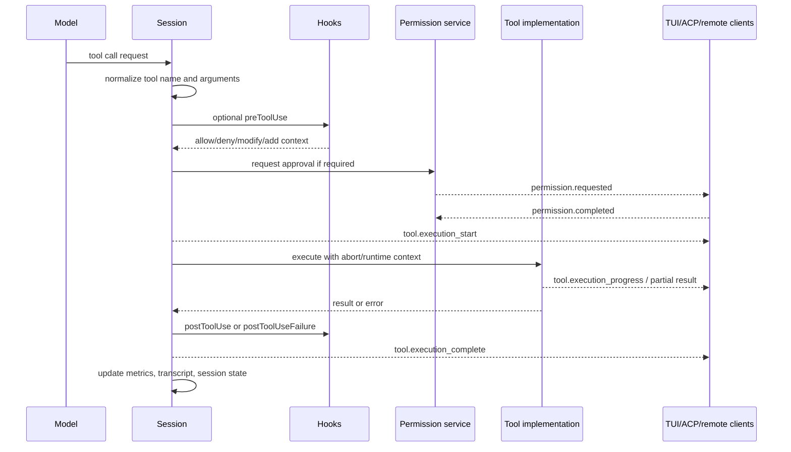
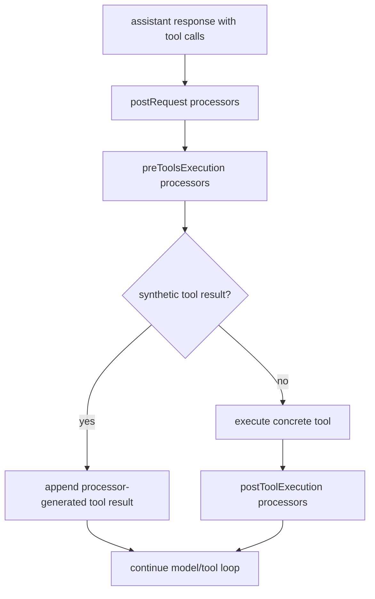

# Built-in tools, execution events, and results

## MVP placement

> **Why this page is here:** This page belongs to [Tools, integrations, and security](README.md). It documents an action boundary: how tools, MCP/plugins/SDK/IDE/web bridges, policies, approvals, redaction, hooks, or sandboxing become safe runtime behavior. Pair it with [Context and model loop](../02-context-model-loop/README.md) for what the model sees and [Sessions, persistence, and remote](../04-sessions-persistence-remote/README.md) for how events/results persist.

## Reader contract

Use this page to answer **what happens after the model emits a tool call?** It owns the execution boundary shared by built-in tools, MCP tools, SDK extension tools, custom tools, and task/subagent tools.

Read [Runtime tool assembly and filtering](runtime-tool-assembly-and-filtering.md) first if the question is why the tool was visible. Read [Tool, path, and URL permissions](tool-path-url-permissions.md) if the question is why the tool was approved or denied. Read [Sessions, persistence, and remote](../04-sessions-persistence-remote/README.md) when you need to know how these events replay or project to clients.

The key implementation point in `app.js` is that a tool call is not just a function invocation. It is modeled as an evented lifecycle with schema generation, permission requests, hook intervention, streaming/progress events, completion records, telemetry, and replay behavior.

| Execution phase | Runtime artifact | Why it matters |
|---|---|---|
| Normalize | Tool name, arguments, MCP provenance | Prevents source-specific tools from bypassing one common callback path. |
| Guard | Request processors, hooks, permissions | Lets policy deny, modify, or synthesize results before side effects happen. |
| Run | Built-in/MCP/external callback | Produces streaming output, progress, result, or error. |
| Persist/project | `tool.execution_*` events and metrics | Gives TUI, ACP, remote, telemetry, and session replay one shared event model. |

## Source anchors

| Semantic alias | Minified anchor | Evidence |
|---|---|---|
| User-requested tool event | `tool.user_requested` | Records direct/user-initiated invocations. |
| Start event | `tool.execution_start` | Contains tool call ID, tool name, arguments, optional MCP server metadata, and turn information. |
| Partial output | `tool.execution_partial_result` | Ephemeral streaming output chunks. |
| Progress output | `tool.execution_progress` | Ephemeral human-readable progress messages, including MCP progress. |
| Completion event | `tool.execution_complete` | Success/error/result event with model/interactions metadata. |
| Editing tools | `str_replace_editor`, `apply_patch`, `create`, `edit` | File modification tools and compatibility aliases. |
| Search/read tools | `read_file`, `grep_search`, `file_search`, `semantic_search` | Workspace inspection tool definitions. |
| Permission bridge | `permission.requested`, `permission.completed` | Tool execution can pause for approvals. |
| Hook bridge | `preToolUse`, `postToolUse`, `postToolUseFailure` | Hooks can approve, deny, modify, or add context around tools. |
| Model request processors | `preToolsExecution`, `postToolExecution` | Model-loop middleware can inspect or synthesize tool results before/after ordinary tool execution. |
| Public-code annotation gate | `SnippyProcessor` | Uses Copilot annotations to block tool execution and retry or synthesize denial results. |

Representative line anchors from the analyzed bundle:

- line `1143`: `str_replace_editor` built-in editing tool definition.
- line `1739`: `apply_patch` schema branch in file-edit tool argument parsing.
- line `4047`: `grep_search` and `read_file` built-in tool descriptions.
- line `4149`: compatibility mapping from higher-level tool groups to built-in tool names.
- line `4210`: permission request prompt lifecycle.
- line `4361`: session event schema for tool lifecycle events.
- line `4471`: session replay/metrics code processes tool start/complete events.
- line `4481`: MCP host progress callback emits `tool.execution_progress`.

## End-to-end lifecycle

The lifecycle is intentionally event-first. This lets the TUI, JSON-RPC server, ACP bridge, remote control exporter, session store, and telemetry consumers observe the same underlying execution without each tool needing bespoke UI code.

## Tool sources

The active toolset can include multiple sources.

| Source | Examples | Notes |
|---|---|---|
| Built-in tools | shell, file read/search, file edit, patch, memory, planning, task | Defined directly in the bundle. |
| MCP tools | GitHub MCP tools, configured local/remote MCP servers | Converted into normal session tool definitions. |
| SDK extension tools | Programmatic extension tools | Loaded when `EXTENSIONS` and config discovery allow it. |
| Custom tools | User/plugin-provided tool definitions | Still flow through permissions and session events. |
| Agent/task tools | `task`, subagent communication, MCP tasks | Often wrap another session or background task. |

The model sees a filtered subset. Filtering depends on mode, selected agent, feature gates, permissions, default-agent exclusions, model capabilities, and runtime settings.

## Tool schema construction

Tool definitions are converted into provider-specific schema. In the model API path, tools can become function-like definitions with:

- `name`
- `description`
- JSON schema / grammar schema
- cache-control hints
- deferred-loading hints
- optional MCP server provenance (`copilot_mcp_server_name`)

The scan found conversion logic around line `3439` that maps internal tool objects into provider wire definitions and preserves MCP server names when present.

## Built-in tool families

The bundle uses both concrete tool names and compatibility aliases.

For the detailed `bash`/`powershell` path after the generic tool callback is invoked, see [`shell-command-execution-events.md`](shell-command-execution-events.md). That page traces the shell manager, PTY and process backends, sync/async/detached execution, output buffering, and background task state.

| Family | Representative names | Purpose |
|---|---|---|
| Shell execution | `bash`, `powershell`, shell/execute aliases | Run commands with sandbox/permission handling. |
| Read/search | `read_file`, `grep_search`, `file_search`, `semantic_search`, `search-agent` | Inspect workspace content. |
| File editing | `str_replace_editor`, `apply_patch`, `create`, `edit` | Modify files and track edits. |
| Notebook | notebook read/edit aliases | Notebook-specific read/edit surfaces when available. |
| MCP | `server/tool` or GitHub MCP compatibility names | External protocol tools. |
| Agent/task | `task`, subagent tools, sidekick tools | Launch or communicate with agent sessions. |

Around line `4149`, a compatibility map links groups such as `edit`, `MultiEdit`, `Write`, `Grep`, and `Glob` to concrete CLI tool names. This is why higher-level prompts can talk about capabilities while the runtime executes concrete tools.

## Model request processors around tools

One gap that is easy to miss from the tool definitions alone: some tool behavior is mediated by the model request loop before the concrete tool callback runs.

The key observed example is the public-code annotation processor. When Copilot annotations indicate a soft block, it can prevent annotated tool calls from executing, emit `snippy_blocking` telemetry, and return model-visible tool results explaining that the tool call was blocked. If retries remain, it asks the model loop for another pass; after the retry budget is exhausted, it falls back to blocked tool-result messages instead of letting the annotated action proceed.

This processor layer is separate from both permissions and hooks:

| Layer | Trigger | Can block or change tool behavior? | Main purpose |
|---|---|---|---|
| Request processor | Model-loop phase before/after tool batches | Yes; can synthesize tool results or request retry. | Safety/recovery middleware tied to model responses. |
| Permission service | Concrete tool asks for approval | Yes; returns approved, denied, or user-unavailable. | User/policy authorization for a visible tool call. |
| Hook system | Configured lifecycle hooks | Yes; can approve, deny, modify args, or add context. | User/admin automation around tool use. |

## Start event

The event schema around line `4361` defines `tool.execution_start`. It includes:

| Field | Meaning |
|---|---|
| `toolCallId` | Unique ID for the tool invocation. |
| `toolName` | Runtime tool name. |
| `arguments` | Tool arguments after parsing/normalization. |
| `mcpServerName` | Optional MCP server hosting the tool. |
| turn metadata | Links the tool call back to an assistant turn. |

Start events are marked transient in session compaction/eviction logic. They are important for live UI and debugging, while durable completion events carry the final result.

## Permission integration

Tools do not directly prompt users. They construct permission request objects and ask the session permission service.

The permission path around line `4210` creates a request ID, stores a resolver, emits `permission.requested`, and waits for a response. Around line `4471`, permission hooks can resolve a request before it reaches the normal prompt path. Completion is recorded through `permission.completed`.

Tool permission kinds include, among others:

- shell/command execution;
- write/file edit;
- read/path access;
- MCP tool invocation;
- URL access;
- memory access;
- custom-tool access;
- extension management/access;
- hook-related authorization.

The built-in tool pipeline therefore delegates authorization decisions to the central permission system rather than embedding per-tool prompts.

## Hook integration

The tool pipeline integrates with three hook phases:

| Hook | Timing | Possible effect |
|---|---|---|
| `preToolUse` | Before execution and before/around permission handling | Deny, approve, modify arguments, suppress output, add context. |
| `postToolUse` | After successful execution | Add context, log, notify, or trigger automation. |
| `postToolUseFailure` | After failed execution | Add extra guidance to the failure result. |

The evidence scan found `postToolUseFailure` adding text such as “Additional guidance from postToolUseFailure hook” to tool failure context. That means hooks can materially change what the model sees after a tool fails.

## Streaming and progress

Two ephemeral events support live output:

| Event | Payload | Typical source |
|---|---|---|
| `tool.execution_partial_result` | `partialOutput` chunk | Long-running tools, sidekick/subagent bridges, streaming tool adapters. |
| `tool.execution_progress` | `progressMessage` | MCP progress callbacks and status updates. |

These events are treated as transient session events. They are valuable for UI responsiveness but are not necessarily retained like final messages/results.

## Completion event

`tool.execution_complete` is the durable end-of-lifecycle event. It includes:

- `toolCallId`
- `success`
- optional `model`
- interaction/task metadata
- result content or error details
- execution duration/telemetry fields

Session metrics code watches completion events to update request counts, tool counts, file-edit tracking, code-change metrics, and session usage summaries.

## File-edit tracking

File editing tools receive special accounting.

The metrics/replay code around line `4471` watches `tool.user_requested` and `tool.execution_complete`. If the tool name belongs to a known file-editing set, the tool call ID is tracked for later code-change metrics.

This explains why file edits show up in session usage as changed lines/files instead of being treated like ordinary text output.

## Tool results in session history

The session keeps enough event history to reconstruct recent tool activity. Around line `4471`, the code scans recent `tool.execution_start` and `tool.execution_complete` events, maps tool call IDs to names and arguments, and builds recent tool status summaries.

This is also important for resumability: a resumed session can distinguish pending/orphaned tool calls from completed ones and can decide whether a turn needs cleanup or wake-up handling.

## Cancellation and errors

Tool execution participates in the broader abort/cancellation system:

- running tools receive abort signals or runtime cancellation context;
- user aborts emit `abort` events;
- failed tools produce unsuccessful `tool.execution_complete` events;
- `postToolUseFailure` hooks can modify failure context;
- shell errors can be classified when feature gates enable that path;
- transient progress/start events can be evicted without losing final completion state.

## Relationship to MCP tools

MCP tools are not a separate execution universe. Once discovered, they are converted into session tools with MCP provenance, then run through the same event, permission, hook, telemetry, and result paths.

MCP-specific additions include:

- `mcpServerName` on events/tool definitions;
- MCP OAuth status events;
- MCP progress notifications mapped to `tool.execution_progress`;
- MCP resource/image results normalized into model-visible content;
- MCP tasks that produce session custom notifications.

## Relationship to other docs

- `tool-path-url-permissions.md` explains approval rules and persistence scopes.
- `coding-agent-validation-toolchain.md` explains completion-time validation tools such as `parallel_validation`, `code_review`, CodeQL, secret scanning, and advisory checks.
- `mcp-host-transport-and-tools.md` explains MCP tool discovery and invocation.
- `hooks-events-and-automation.md` explains hook schemas and lifecycle effects.
- `agent-task-orchestration.md` explains tools that launch or communicate with agents.
- This document focuses on the shared lifecycle that all those tool classes pass through.
