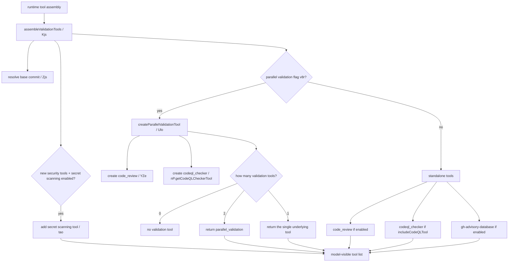
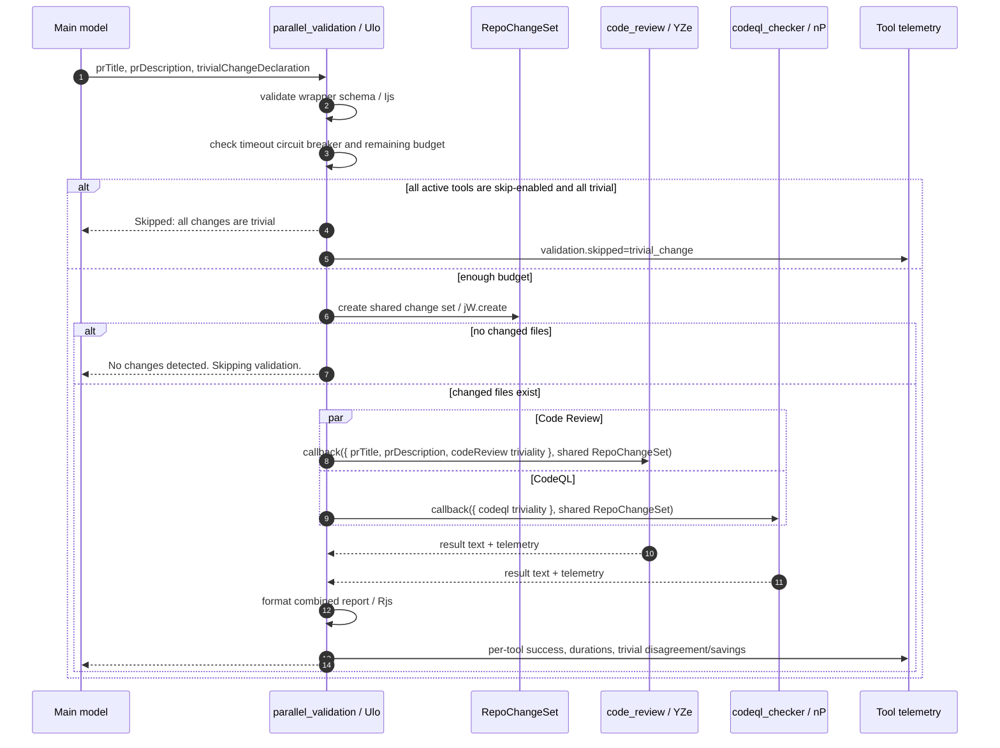
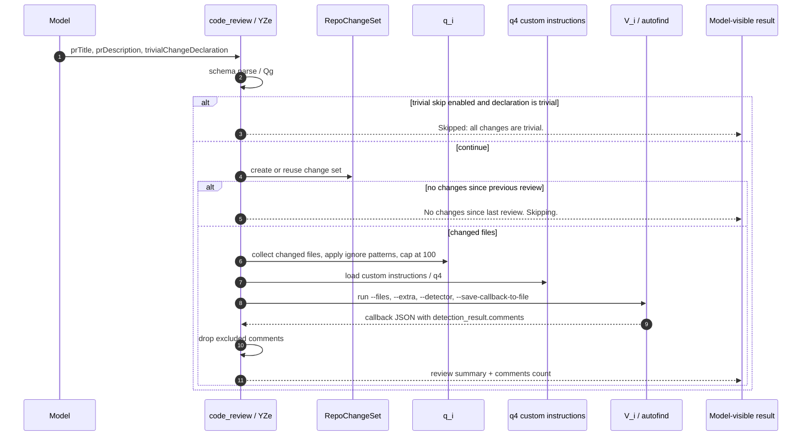
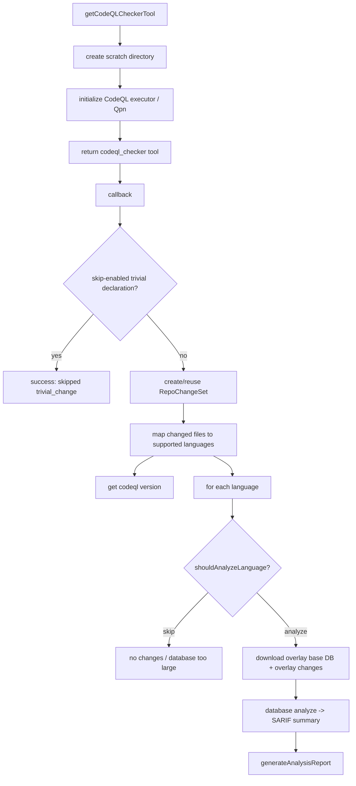

# Coding-agent validation and review toolchain

## Internals scope

> **Why this page is here:** This page belongs to [Tools, integrations, and security](README.md). It documents an action boundary: how tools, MCP/plugins/SDK/IDE/web bridges, policies, approvals, redaction, hooks, or sandboxing become safe runtime behavior. Pair it with [Context and model loop](../02-context-model-loop/README.md) for what the model sees and [Sessions, persistence, and remote](../04-sessions-persistence-remote/README.md) for how events/results persist.

## Reader contract

Use this page to answer **which validation tools can a coding-agent session expose before it declares work complete?** It owns the Code Review, CodeQL, secret-scanning, advisory, and `parallel_validation` toolchain, including feature gates, repo/base-commit inputs, budgets, trivial-change declarations, and telemetry.

Read [Built-in tools, execution events, and results](built-in-tools-execution-events.md) for the generic tool callback/event wrapper. Read [Hosted agent environment](../05-hosted-agent-ops/hosted-agent-environment.md) for hosted validation env toggles such as `COPILOT_AGENT_USE_CODEQL` and related switches.

This page documents the completion-time validation layer in the extracted Copilot CLI bundle. Coding-agent sessions can expose validation tools that are specifically meant to run before the agent declares work complete.

The important implementation detail is that these validators are not only ordinary tool callbacks. `app.js` assembles them from feature flags, repo/base-commit state, settings, and per-tool timeout budgets. Depending on flags, the model may see standalone `code_review` and `codeql_checker` tools, or a higher-level `parallel_validation` tool that runs both checks concurrently against a shared change set.

## Source anchors

`app.js` is bundled/minified, so semantic aliases are stable documentation names and generated symbols are version-specific lookup anchors for the analyzed bundle.

| Area | Semantic alias | Minified anchor | Approx. line | What it does |
|---|---|---:|---:|---|
| Validation flags/settings | `ValidationFeatureFlags`, `ValidationToolSettings` | `Fd`, `li`, `v8r`, `GD`, `Ure`, `vfe`, `CWe`, `I8r`, `x8r` | 239 | Defines flags for parallel validation, trivial-change declarations/skips, Code Review, CodeQL, secret scanning, advisory checks, and env-driven tool enablement. |
| Security prompt snippet | `buildValidationGuidance(...)` | `llr(...)` | 3289 | Adds model instructions such as validating security-sensitive changes, checking for secrets, and running validation before finalizing. |
| Trivial-change prompt helpers | `buildParallelTrivialPrompt(...)`, `buildSingleTrivialPrompt(...)` | `_Kr(...)`, `SKr(...)` | 617-618 | Tells the model how to populate `trivialChangeDeclaration` for one or many validation tools. |
| Trivial telemetry/schema helpers | `TrivialDeclarationSchema`, `trivialTelemetryProps(...)` | `$W`, `FZe`, `lAe`, `bBl`, `EBl`, `GW`, `QZe`, `HZe` | 618 | Defines trivial-change declaration schemas and telemetry/restricted-property extraction. |
| Code Review changed files | `collectChangedFilesForReview(...)` | `q_i(...)` | 619 | Builds the file list for review, applies ignore patterns, and caps reviewed files at `100`. |
| Code Review callback payload | `buildCodeReviewPayload(...)` | `z_i(...)` | 620 | Creates PR-style metadata and the callback payload consumed by the review adapter. |
| Autofind adapter | `runAutofindReview(...)`, `locateAutofindBinary(...)` | `V_i(...)`, `j_i(...)` | 620 | Writes temp inputs, locates the bundled `autofind` binary, passes CAPI credentials, parses callback JSON, and maps missing/config/rate-limit/timeout errors. |
| Code Review tool factory | `createCodeReviewTool(...)` | `YZe(...)` | 620-631 | Builds the `code_review` tool, validates inputs, handles trivial/no-change skips, reads custom instructions, invokes Autofind, filters comments, and emits telemetry. |
| CodeQL checker | `CodeQLChecker` | `nP` | 894-899 | Builds/runs CodeQL databases for changed supported languages, reports SARIF-derived alerts, tracks per-language status, and emits validation telemetry. |
| Advisory dependency check | `GitHubAdvisoryTool` | `Kzt`, `Yzt(...)` | 926 | Exposes a dependency vulnerability check when the advisory validation flag is enabled. |
| Secret scanning API | `callSecretScanningApi(...)` | `HJe(...)` | 519 | Uploads changed file content to the secret-scanning endpoint with Copilot token/repo metadata and returns scanned secrets/errors/timing. |
| Secret scanning hook/tool | `SecretScanningPreCommitHook`, `secretScanningTool(...)` | `$Je`, `tao(...)`, `xzs(...)` | 519, 5188 | Blocks commit when introduced secrets are detected, redacts after repeated attempts, or exposes an explicit file-path scanner tool. |
| Parallel validation tool | `createParallelValidationTool(...)` | `Ulo(...)`, `xjs(...)`, `kjs(...)`, `Rjs(...)` | 5699-5705 | Wraps Code Review and CodeQL into one model-visible tool, runs checks with `Promise.allSettled`, enforces budgets/circuit breakers, and formats combined results. |
| Validation tool assembly | `assembleValidationTools(...)` | `Kjs(...)`, `Jjs(...)`, `Zjs(...)` | 5734 | Resolves the base commit and chooses standalone vs parallel validation, advisory checks, CodeQL, and secret scanning. |

## Assembly decision flow

Validation tools are assembled late in the runtime tool-building path, after settings and repository state are available. The observed call path is:

Key gates:

| Gate | Effect |
|---|---|
| `copilot_swe_agent_parallel_validation` / disable flag | Switches from standalone `code_review` + `codeql_checker` to the wrapper path when both are available. |
| `tools.validation.codeReview.enabled === false` | Disables Code Review even if the feature flag is on. |
| `tools.validation.codeql.enabled === false` | Disables CodeQL even if the feature flag is on. |
| `includeCodeQLTool` runtime option | Required before CodeQL is even considered. |
| `copilot_swe_agent_trivial_change*` family | Controls whether trivial-change declarations are requested and whether all-trivial input can skip work. |
| `tools.validation.timeout` | Feeds the shared budgeter used by Code Review, CodeQL, and `parallel_validation`. |
| `COPILOT_AGENT_USE_CODEQL`, `COPILOT_AGENT_USE_CCR`, `COPILOT_AGENT_USE_SECRET_SCANNING`, `COPILOT_AGENT_USE_DEPENDENCY_VULN` | Env overrides that can set validation tool enabled/disabled settings when validation-tool-settings support is enabled. |

## `parallel_validation` call path

`parallel_validation` exists only when more than one underlying validation tool is active. It is not a generic scheduler; it is a focused wrapper around Code Review and CodeQL.

Implementation details from `Ulo(...)`:

- `T` counts consecutive wrapper timeouts; after `PCr = 2`, the circuit breaker returns a timeout result and explicitly tells the model not to call `parallel_validation` again.
- `Ajs = 30000` is the minimum remaining budget threshold. Below that, the wrapper skips validation as `budget_exhausted` rather than starting tools that are likely to time out.
- `jW.create(...)` is called once and passed to both underlying callbacks as `repoChangeSet`, avoiding inconsistent changed-file snapshots.
- `xjs(...)` runs each underlying tool task with `Promise.allSettled(...)`; `kjs(...)` converts each result into `{ success, durationMs, timedOut, alertCount, potentialSavingsMs }`.
- `Rjs(...)` emits a Markdown report with one section per tool. If any tool timed out, the footer warns not to rerun validation; if any failed, the footer asks the model to address the issues and rerun after changes.

## Code Review (`code_review`) call path

The Code Review tool is a PR-shaped adapter around a bundled `autofind` binary and a Copilot callback payload.

Observed behaviors:

| Step | Detail |
|---|---|
| Tool instructions | `YZe(...)` tells the model to run Code Review before finalizing, and when CodeQL is also enabled it says `code_review` must run before `codeql_checker`. |
| Input schema | Requires PR title and description; optional `trivialChangeDeclaration` appears when trivial-change support is enabled. |
| Changed-file scope | `q_i(...)` reads changed files from the repo change set, respects ignore patterns, warns on ignored files, and truncates to `jZe = 100`. |
| Custom instructions | `q4(...)` discovers instructions and writes them as JSON temp input for `autofind` when present. |
| Adapter execution | `V_i(...)` writes file-list, extra-info, and callback temp files, locates `autofind` via `j_i(...)`, requires CAPI token/HMAC and integration ID, then runs the adapter silently. |
| Error mapping | Missing binary/config returns warnings suitable for test environments; timeout returns a non-rerunnable timeout message; 429/rate-limit maps to a transient rate-limit message. |
| Result filtering | Returned alerts/comments with `meta.exclusionReason` are excluded from the model-visible comments count. |
| Telemetry | Emits result class, model (`OKr()` returns `capi-prod-claude-sonnet-4.5` in this bundle), file extensions, reviewed files, comment query IDs, duration, trivial disagreement, and potential-savings metrics. |

## CodeQL (`codeql_checker`) call path

`CodeQLChecker` is a class-like implementation around CodeQL database setup and analysis. It is guarded by `copilot_swe_agent_enable_security_tool` plus settings and `includeCodeQLTool`.

Important details:

- `DEFAULT_MAX_REPO_SIZE_BYTES = 10000000`; oversized language databases are skipped rather than analyzed.
- The default timeout constant is `180000` ms, and the active budget also comes from `tools.validation.timeout`.
- The checker tracks `lastRepoChangeSet`; repeated runs can skip languages with no changes since the previous run.
- Diff-informed analysis can create an extension pack (`codeql-action/pr-diff-range`) so the report can focus on changed ranges.
- Telemetry includes CodeQL version, language counts, skipped counts, total alerts, duration, database overlay status/timing, and trivial-change disagreement/potential-savings fields.

## Trivial-change declarations

The validation stack does not let the model silently avoid validation just by judging a change trivial. Instead, the runtime separates three concepts:

| Concept | Implementation | Effect |
|---|---|---|
| Ask the model for triviality | `_Kr(...)` for `parallel_validation`, `SKr(...)` for single tools | Adds prompt text and schema fields requesting an assessment and reason. |
| Record the assessment | `$W`, `FZe`, `QZe`, `HZe`, `GW`, `qW` | Adds telemetry properties/restricted properties for triviality and reason. |
| Allow skipping | `Ure(...)`, `CWe(...)`, `x8r(...)` | Only if the relevant skip flags/settings are enabled and declarations are trivial. |

The per-tool criteria are different. For example, `yKr` excludes `logging`, `errorMessages`, and `configCi` from CodeQL trivial examples, while `s_i` explicitly warns not to classify CI/config/logging/error-message changes as trivial for CodeQL merely because they appear low risk. This is why `parallel_validation` stores declarations under tool-specific keys (`codeReview`, `codeql`) instead of one global boolean.

## Secret scanning and advisory validation

Not all validation is inside `parallel_validation`:

| Tool/hook | Path | Behavior |
|---|---|---|
| Secret scanning API | `HJe(...)` | Posts selected changed file contents to the configured secret-scanning endpoint with Copilot credentials and optional repo ID; returns secrets, request ID, success/error, and duration. |
| Secret scanning pre-commit hook | `$Je.preCommit(...)` | Finds staged/untracked changed files, scans them, blocks commit if new secrets are detected, and after `MAX_SCAN_ATTEMPTS = 3` can redact detected tokens and proceed. |
| Explicit secret scanning tool | `tao(...)` / `xzs(...)` | Lets the model scan specific paths and returns either success, a soft failure if scanning itself failed, or a blocking result with secret locations/types. |
| Advisory dependency check | `Kzt` | Checks explicitly supplied dependency name/version/ecosystem tuples against the GitHub advisory database; intended before adding dependencies in supported ecosystems. |

Secret scanning overlaps with [content exclusion and redaction](content-exclusion-and-redaction.md), but its role here is different: it is a completion/commit-time safety check for newly introduced file contents rather than a general transcript redaction mechanism.

## Result and error taxonomy

| Result class | Representative source | Model-visible behavior |
|---|---|---|
| `invalid_input` | `Qg(...)` schema parse failures | Tool returns a validation error result and telemetry marks invalid input. |
| `skipped_trivial` / `validation.skipped=trivial_change` | `CWe(...)`, `Ure(...)`, `x8r(...)` | Succeeds without running expensive validators when skip-enabled trivial declarations are present. |
| `skipped_no_changes` / `validation.skipReason=no_changes` | `RepoChangeSet` checks | Succeeds with a no-changes message. |
| `budget_exhausted` | `Ulo(...)` remaining budget below `Ajs` | Returns timeout-style guidance telling the model not to rerun validation. |
| `timeout` | budgeter/abort signal, `d2(...)` checks | Returns a non-rerunnable timeout message. `parallel_validation` increments its circuit-breaker count. |
| `rate_limited` | `HKr(...)` on Autofind stderr/errors | Returns the Code Review transient rate-limit message. |
| `tool_unavailable` / configuration warnings | `Y_i(...)`, `W_i(...)`, missing binary/API key | Often returns empty results with a warning in test/unconfigured environments rather than crashing the whole session. |
| `failure` | adapter/CodeQL/report errors | Returns failure text and emits error telemetry/restricted properties. |

## Relationship to the shared tool pipeline

After construction, these validators still use the normal tool machinery described in [Built-in tools, execution events, and results](built-in-tools-execution-events.md): schemas are converted into model-visible tool definitions, calls emit `tool.execution_start`/`tool.execution_complete`, hooks and permissions can apply, and telemetry is recorded. The special behavior documented here is the validation-specific layer that decides **which** validators exist, **when** they may be skipped, and **how** multiple validators share repo state and timeout budgets.

## Key takeaways

- `parallel_validation` is a wrapper generated only when multiple validation tools are available; otherwise the runtime exposes the single underlying validator.
- Code Review is an `autofind` adapter with PR metadata, changed-file filtering, custom-instruction injection, and rich telemetry.
- CodeQL builds/analyzes language databases against changed files and tracks per-language skip/failure/success details.
- Trivial-change declarations are tool-specific and mostly telemetry/guidance unless skip flags explicitly allow validation to be skipped.
- Secret scanning and dependency advisory checks are related validation surfaces, but they are assembled beside the Code Review/CodeQL path rather than inside the `parallel_validation` wrapper.
