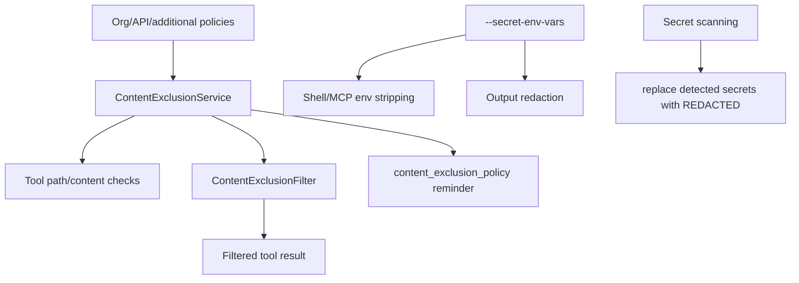
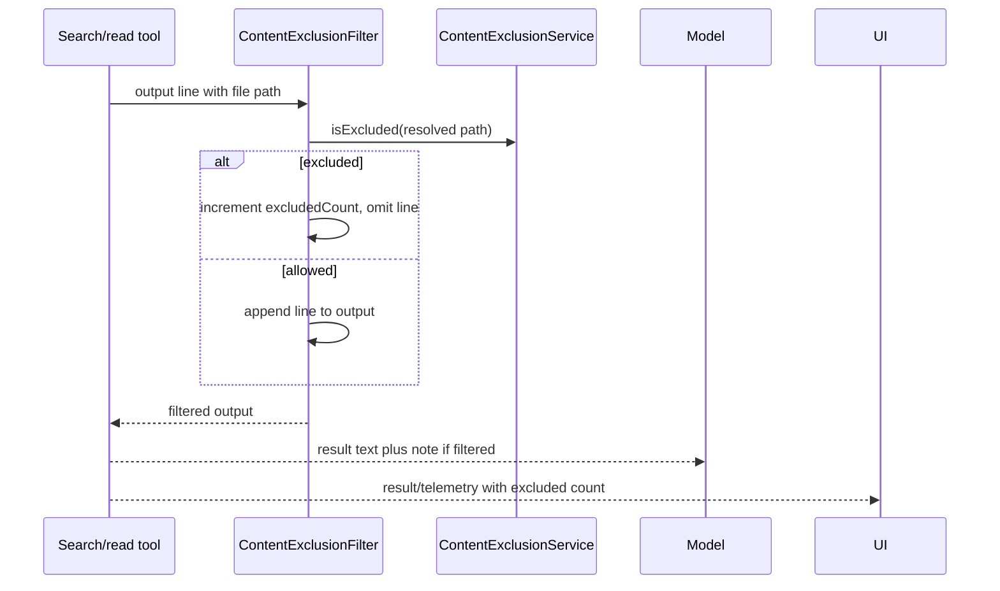

# Content exclusion and redaction

## What this page covers

Use this page to answer **which data is blocked, filtered, or redacted before it reaches the model, UI, telemetry, or support artifacts?** It owns content-exclusion checks, output filtering, model policy reminders, secret env-var stripping, and redaction-related controls.

Read [Tool, path, and URL permissions](tool-path-url-permissions.md) for approval decisions, [Built-in tools, execution events, and results](built-in-tools-execution-events.md) for where tool outputs are produced, and [Debug bundle and redaction boundaries](../05-hosted-agent-ops/debug-bundle-redaction-boundaries.md) for support-bundle packaging.

The relevant surfaces include the `CONTENT_EXCLUSION` feature gate, the `ContentExclusionService`, additional policy injection, search/output filtering, model-visible policy reminders, secret environment variable redaction, and secret-scanning remediation.

The important implementation point is that sensitive-content handling is layered:

- content exclusion decides whether certain files/paths/content may be read or shown;
- output filters remove excluded search/results lines before they reach the model or UI;
- prompt policy tells the model not to bypass exclusions;
- secret env var handling strips/redacts configured secrets;
- secret scanning can redact detected secrets in files after repeated remediation failures.

Because `app.js` is bundled/minified, symbol names are unstable. Line references below are searchable anchors in the extracted bundle and will shift across releases.

## Source anchors

| Semantic alias | Minified anchor | Approx. `app.js` line | Role |
|---|---|---:|---|
| Feature gate | `CONTENT_EXCLUSION:"staff"` | 239 | Content exclusion is gated in the analyzed static feature table. |
| Rule fetching | `/copilot_internal/content_exclusion`, `fetchContentExclusionRules`, `COPILOT_DEBUG_CONTENT_EXCLUSION_API_URL` | 239 | Rules are fetched from Copilot internal API, with a debug override URL. |
| Service creation | `ContentExclusionService`, `contentExclusionShouldEnable`, `copilotignore_enabled` | 4198 | Service is enabled based on debug mode, org/user capability, token, and additional policies. |
| Additional policies | `additionalContentExclusionPolicies`, `contentExclusionService=void 0` | 4471 | Runtime options can inject policy lists and invalidate cached service. |
| Output filtering | `ContentExclusionFilter`, `excludedCount`, `Filtered ... result(s) due to content exclusion policies` | 559, 561 | Tool output/search lines can be filtered before returning results. |
| User-facing note | `Some results were excluded due to content exclusion policies` | 579 | Successful tool output can include a note when results were filtered. |
| Model policy reminder | `<content_exclusion_policy>`, `Do NOT attempt to access the file through alternative tools or commands` | 3828 | System prompt explicitly tells the model not to bypass content exclusion. |
| Content match rules | `ifAnyMatch`, `ifNoneMatch`, `Content excluded by ifAnyMatch` | 4198 | Rules can depend on path and file content matches. |
| Secret env vars | `--secret-env-vars`, `stripped from shell and MCP server environments and redacted from output` | 8225 | CLI flag declares secret environment variables for stripping/redaction. |
| Secret redaction | `redactSecrets`, `[REDACTED]`, `Secret scanning` | 519, 525 | Secret-scanning remediation can rewrite detected tokens as `[REDACTED]`. |

## Layer map

## Feature gate and service creation

The static feature table includes `CONTENT_EXCLUSION:"staff"`. The session options setter resets the cached `contentExclusionService` when the `CONTENT_EXCLUSION` flag changes.

Service creation considers:

| Input | Meaning |
|---|---|
| GitHub auth/token | Needed to fetch organization/repository rules. |
| `copilotignore_enabled` | Account/org capability that can enable content exclusion. |
| `COPILOT_DEBUG_CONTENT_EXCLUSION_API_URL` | Debug override that forces/debugs rule fetching. |
| `additionalContentExclusionPolicies` | Runtime-injected policies from host/session options. |
| working directory | Used to resolve relative paths for checks. |

If there is no token, no debug URL, and no additional policies, the runtime skips creating the service.

## Rule fetching

The rule fetcher calls a Copilot internal endpoint:

| Request component | Meaning |
|---|---|
| Path | `/copilot_internal/content_exclusion` |
| Query `repos` | Comma-separated repository list. |
| Query `scope` | Rule scope. |
| Header `Authorization` | Bearer token. |
| Header `Accept` | JSON response. |

A 404 is treated as “content exclusion not enabled,” while other non-OK responses are logged as warnings. The response is parsed and rules can be scoped to all repos or to individual repos.

## Additional policies

The session has an `additionalContentExclusionPolicies` runtime option. When it changes, the session invalidates its cached content exclusion service so the next access rebuilds with the new policies.

This lets an embedding host, extension, or special mode inject policy beyond the organization-provided API response.

## Path and content checks

The content exclusion service can check both paths and file content. Evidence shows content-based rule fields:

| Rule field | Behavior |
|---|---|
| `ifAnyMatch` | Exclude when file content matches any configured pattern. |
| `ifNoneMatch` | Exclude when file content matches none of the required patterns. |

If a file read fails for a reason other than `ENOENT`, the service logs the failure and blocks access. That is a fail-closed design for content-rule checks.

Directories and special paths are treated differently from readable files, and path resolution uses the working directory for relative paths.

## Output filtering

`ContentExclusionFilter` wraps large/search-style output buffers. It:

1. Receives output chunks.
2. Splits them into lines or line-like entries.
3. Extracts a file path from each line using a caller-provided extractor.
4. Resolves the path relative to the current working directory when needed.
5. Checks whether that path is excluded.
6. Appends allowed lines to the output buffer.
7. Counts filtered entries in `excludedCount`.

When filtering occurs, logs can say:

> Filtered N result(s) due to content exclusion policies

User-visible successful output can append:

> Some results were excluded due to content exclusion policies.

This means users may see incomplete search results by design.

## Model-visible policy reminder

Prompt assembly can include a `<content_exclusion_policy>` section. The text instructs the model:

- do not attempt to access excluded files through alternative tools or commands;
- do not use shell commands such as `cat`, `head`, `tail`, or `grep` to bypass a denied tool call;
- do not infer or reconstruct excluded file contents from other sources;
- tell the user the file is restricted by content exclusion policy.

This is important because content exclusion is not only a tool-level check. The model is explicitly instructed not to route around the check.

## Interaction with tool results

When a tool result is produced after filtering, telemetry can include:

| Metric/property | Meaning |
|---|---|
| `excludedCount` | Number of filtered entries. |
| `content_exclusion_filtered_count` | Telemetry metric for filtered content. |
| result text note | User-visible hint that some results were excluded. |

This lets the runtime keep successful tool calls successful while still preserving a record that content was filtered.

## Secret environment variables

The root CLI exposes:

| Flag | Meaning |
|---|---|
| `--secret-env-vars [vars...]` | Environment variable names whose values are stripped from shell and MCP server environments and redacted from output. |

The help text gives examples like `MY_KEY,OTHER_KEY`. This is a runtime/user-declared secret list, separate from organization content exclusion policies.

Secret env var handling matters for:

- shell tool environments;
- MCP server environments;
- command/output redaction.

## Command argument redaction

The bundle contains command filtering logic that replaces selected command arguments with `REDACTED` when building error/log command strings. This prevents known-sensitive argument positions from being echoed into logs or errors.

This is a small but important distinction: redacting displayed command text does not necessarily change the command that was executed; it changes what is logged or surfaced afterward.

## Secret-scanning remediation

The bundle includes secret-scanning pre-commit style logic. When detected secrets remain after repeated remediation attempts, it can call `redactSecrets`, which:

1. Groups detected secret tokens by file path.
2. Reads each file.
3. Replaces each detected token with `[REDACTED]`.
4. Writes the redacted file back.

The PR description helper can also add a warning that GitHub Secret Scanning detected potential secrets and the agent attempted remediation/redaction.

This is different from content exclusion:

| Mechanism | Primary purpose |
|---|---|
| Content exclusion | Prevent reading/showing restricted content. |
| Secret env vars | Prevent configured environment secrets from entering tools/logs/output. |
| Secret scanning redaction | Remove detected secrets from generated/modified files. |

## Failure posture

The implementation generally prefers safe failure:

- failed content-rule reads can block access;
- existing content exclusion service is invalidated when relevant flags/policies change;
- output filters count and omit excluded entries rather than returning raw results;
- policy reminders tell the model not to bypass blocked access;
- secret-scanning remediation redacts tokens after repeated failures.

## End-to-end filtered search flow

## Relationship to other docs

- `tool-path-url-permissions.md` explains path/URL permission decisions that can combine with content policies.
- `built-in-tools-execution-events.md` explains where tool outputs and telemetry are produced.
- `web-search-url-fetching.md` explains URL allow/deny permissions, a separate network policy layer.
- `debug-bundle-redaction-boundaries.md` explains how these redaction layers relate to support/debug archives and secret gist uploads.
- `diagnostics-feedback-debug-bundles.md` explains debug bundle collection where sensitive logs may be packaged.
- `settings-config-persistence.md` explains where runtime flags/settings and policy-related options are persisted.
