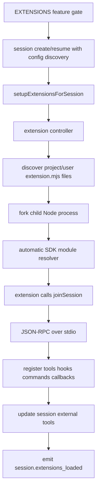

# Copilot SDK extension support

This page is a standalone map for Copilot CLI's programmatic extension support. It complements [Plugin and extension architecture](plugin-extension-architecture.md): plugins are mostly manifest/package contributions, while SDK extensions are Node.js child processes that join the active session through `@github/copilot-sdk` and register programmatic tools, hooks, commands, and callbacks.

The short version: when the `EXTENSIONS` feature gate is active and extension loading is enabled for a session, the runtime discovers `extension.mjs` files, launches them as child processes, lets them call `joinSession()`, wires their registered capabilities into the session, and reports status through `session.extensions_loaded`.

## Source anchors

| Semantic alias | Minified anchor / file | Evidence |
|---|---|---|
| Extension settings | `app.js` line `239`: `extensions: { disabledExtensions, mode }` | User settings track disabled extension IDs and a mode enum of `disabled`, `load_only`, or `load_and_augment`. |
| Feature gate | `app.js` line `239`: `EXTENSIONS` | Feature flag text says extensions enable programmatic tools and hooks via `@github/copilot-sdk`. |
| SDK path resolver | `app.js` line `6067`: `Uee()` | Runtime resolves the packaged `copilot-sdk` directory next to the CLI distribution. |
| Agent-facing extension tools | `app.js` lines `6067`, `6096`: `extensions_reload`, `extensions_manage` | Runtime exposes tools for scaffold/list/inspect/guide/reload flows, with extension-management permission prompts. |
| Authoring guide bridge | `app.js` line `6092`: `extensions.md`, `agent-author.md`, `examples.md`, `index.d.ts` | The built-in guide points agents to the extracted SDK docs and declarations. |
| Extension loader/controller | `app.js` line `6096`: `loadExtensions`, `reloadExtensions`, `registerToolsOnSession` | The controller discovers extensions, launches/stops them, and routes management tool calls through `external_tool.requested`. |
| Session setup | `app.js` line `6100`: `setupExtensionsForSession(...)` | Session creation/resume registers extension tools, loads extensions, updates external tools, exposes list/enable/disable/reload, and emits `session.extensions_loaded`. |
| Session create/resume gate | `app.js` line `6100`: `enableConfigDiscovery && EXTENSIONS` | Server-side create/resume calls extension setup only when config discovery and the feature flag are enabled. |
| Session API surface | `app.js` lines `4361`, `4471`: `XYn`, `extensions=XYn(this)` | `session.extensions.list/enable/disable/reload` handlers delegate to the active extension controller. |
| Extension lifecycle event | `app.js` lines `4361`, `4475`; `schemas/session-events.schema.json` lines `2846`-`2962` | `session.extensions_loaded` is an ephemeral event carrying source-qualified extension ID, name, source, and status. |
| RPC schema | `schemas/api.schema.json` lines `1128`-`1220`, `2572`-`2656` | JSON-RPC schema defines `session.extensions.list`, `enable`, `disable`, and `reload`, plus extension status records. |
| Permission prompt kinds | `schemas/session-events.schema.json` lines `4656`-`4716`, `5164`-`5224`, `9658`-`9695` | Extension management and permission-access requests have distinct permission kinds. |
| SDK join entry | `copilot-sdk/extension.d.ts` | `joinSession(config?: JoinSessionConfig): Promise<CopilotSession>` joins the foreground session. |
| SDK session API | `copilot-sdk/session.d.ts`, `copilot-sdk/types.d.ts` | `CopilotSession` supports registration of tools, commands, hooks, permission/user-input handlers, and event/RPC access. |
| Extracted SDK docs | `copilot-sdk/docs/extensions.md`, `examples.md`, `agent-author.md` | The package includes first-party authoring guidance for discovery, skeletons, tools, hooks, examples, and gotchas. |

## Runtime model

SDK extensions are not loaded into the main process with `import`. They run as separate Node.js child processes and communicate with the CLI over JSON-RPC on stdio. The extension process imports `@github/copilot-sdk/extension`, calls `joinSession()`, and receives a `CopilotSession` object tied to the current foreground session.



The important boundary is the stdio JSON-RPC connection. Extension stdout is protocol traffic, so extension authoring docs explicitly warn not to use `console.log()`; user-visible output should go through `session.log()`.

## Discovery and lifecycle

The extracted SDK docs describe the on-disk convention:

```text
.github/extensions/
  my-extension/
    extension.mjs
```

Discovery rules from the SDK docs and runtime wiring:

| Rule | Behavior |
|---|---|
| Project location | The CLI scans `.github/extensions/` for project-scoped extensions. |
| User location | It also scans the user's Copilot extensions directory; API/schema text describes this source as `~/.copilot/extensions/`. |
| Entry file | Each extension directory must contain `extension.mjs`. |
| Module format | Only ES module `.mjs` entrypoints are documented as supported. |
| Directory depth | Immediate subdirectories are checked; nested recursive extension discovery is not described. |
| Name collision | Project extensions shadow user extensions with the same name. |
| Reload | Extension reload stops running extension processes, re-discovers from disk, re-launches, updates external tools, and emits fresh state. |
| Shutdown | Extracted SDK docs describe process cleanup on CLI exit with graceful termination followed by forced kill. |

Session create/resume calls `setupExtensionsForSession(...)` only when config discovery and the `EXTENSIONS` gate allow it. Prompt mode has an additional extension-mode path: `disabled` avoids loading, `load_only` loads extensions without augmenting the agent with management tools, and `load_and_augment` adds extension-management tools to the session toolset.

## Loading modes

The settings schema contains an `extensions.mode` value with three observed states:

| Mode | Practical effect |
|---|---|
| `disabled` | Extension loading is disabled for the active mode. Some UI/controller paths may still discover state for display. |
| `load_only` | Extensions can be loaded for session-side behavior, but agent-facing extension management/augmentation tools are not exposed to the model. |
| `load_and_augment` | Extensions load and the runtime adds extension management/augmentation tools to the model-visible external tool set. |

In the server create/resume path, extension setup is guarded by the request's config-discovery setting and the `EXTENSIONS` feature flag. In interactive/prompt-mode paths, the same controller is reused with a mode check so `load_and_augment` decides whether management tool definitions are made available to the agent.

## Authoring entry point

An extension starts with `joinSession()` from `@github/copilot-sdk/extension`:

```js
import { joinSession } from "@github/copilot-sdk/extension";

const session = await joinSession({
    tools: [],
    hooks: {},
});
```

The declaration in `copilot-sdk/extension.d.ts` defines:

| Type | Role |
|---|---|
| `JoinSessionConfig` | A resume/join-style config surface that can add capabilities to the active session. |
| `joinSession(config?)` | Attaches the extension process to the current foreground session and resolves to `CopilotSession`. |

The SDK docs are clear that the `@github/copilot-sdk` import is resolved automatically by the CLI extension launcher, so extension authors do not install a separate copy inside each extension directory.

## Capabilities an SDK extension can register

`joinSession()` accepts the same family of session options exposed in `copilot-sdk/types.d.ts`, and `CopilotSession` exposes corresponding registration methods in `copilot-sdk/session.d.ts`.

| Capability | SDK surface | Runtime effect |
|---|---|---|
| Custom tools | `tools?: Tool[]`, `registerTools(tools?)` | Adds model-callable tool handlers. Tool names must be globally unique across loaded extensions. |
| Slash commands | `commands?: CommandDefinition[]`, `registerCommands(commands?)` | Registers session commands that appear as `/name` in TUI-capable surfaces and are dispatched back to the owning client. |
| Hooks | `hooks?: SessionHooks`, `registerHooks(hooks?)` | Adds lifecycle/tool/prompt hooks such as pre-tool and post-tool callbacks. |
| Permission handler | `onPermissionRequest`, `registerPermissionHandler(handler?)` | Lets a client/extension participate in permission decisions when permitted by the host. |
| User input handler | `onUserInputRequest`, `registerUserInputHandler(handler?)` | Lets a client respond to ask-user style requests. |
| Elicitation handler | `onElicitationRequest`, `registerElicitationHandler(handler?)` | Enables structured/form-based request callbacks. |
| Exit plan and auto mode | `onExitPlanMode`, `onAutoModeSwitch` | Allows client-side handling of special planning/mode transitions. |
| System-message transforms | `registerTransformCallbacks(callbacks?)` | Lets registered callbacks transform named system-message sections. |
| Events | `session.on(eventType, handler)` | Subscribes to session events such as tool execution, assistant messages, permission requests, and shutdown. |
| Timeline logging | `session.log(message, options?)` | Emits user-visible timeline log messages without writing to stdout. |
| Low-level RPC | `session.rpc` | Exposes typed access to session APIs for advanced integrations. |

Two gotchas from `copilot-sdk/docs/agent-author.md` are especially important when reverse-engineering behavior:

- stdout is reserved for JSON-RPC, so extensions should use `session.log()` instead of `console.log()`;
- duplicate tool names cause the later extension to fail initialization.

## Management APIs and events

The runtime exposes extension state in two layers:

1. **Session RPC API** — `session.extensions.list`, `session.extensions.enable`, `session.extensions.disable`, and `session.extensions.reload` are defined in `schemas/api.schema.json` and implemented by the session API object in `app.js`.
2. **Session event stream** — `session.extensions_loaded` is emitted after initial load and after enable/disable/reload operations, carrying the discovered extension set and statuses.

The status record shape is consistent across the runtime and schemas:

| Field | Meaning |
|---|---|
| `id` | Source-qualified ID such as `project:my-ext` or `user:auth-helper`. |
| `name` | Extension directory name. |
| `source` | Discovery source: `project` or `user`. |
| `status` | One of `running`, `disabled`, `failed`, or `starting`. |
| `pid` | Present in the RPC list result when the extension process is running. |

Enable/disable operations mutate the in-memory disabled-ID set used by the active loader, reload extensions, refresh the session external tools, and emit a fresh `session.extensions_loaded` event. The schema-level API results are `null` for enable/disable/reload and an `ExtensionList` for list.

## Agent authoring tools

The bundle also includes model-facing extension-management tools when extension augmentation is enabled:

| Tool | Role |
|---|---|
| `extensions_manage` | Provides operations such as list, inspect, scaffold, and guide. The guide points to `extensions.md`, `agent-author.md`, `examples.md`, and SDK `.d.ts` files. |
| `extensions_reload` | Stops running extensions, rediscover/relaunches from disk, and makes newly registered tools available immediately. |

The management flow requests `extension-management` permission for operations such as scaffold and reload. The permission schema has separate prompt/request/approval kinds for:

| Permission kind | Purpose |
|---|---|
| `extension-management` | Creating, scaffolding, reloading, or otherwise managing extension files/processes. |
| `extension-permission-access` | Granting an extension access to permission-related capabilities. |

This split matters because an extension can add powerful behavior, but it still routes through the same session permission/event infrastructure as other tools and hooks.

## Relationship to plugins and MCP

| Aspect | SDK extension | Plugin | MCP server |
|---|---|---|---|
| Primary unit | `extension.mjs` child process using `@github/copilot-sdk` | Installed package/local directory with manifest contributions | Server process or remote endpoint speaking Model Context Protocol |
| Main path into session | `joinSession()` over JSON-RPC/stdio | Settings/plugin loader merges contributed skills, hooks, MCP, LSP, agents | MCP host starts/connects server and converts MCP tools |
| Typical capabilities | Programmatic tools, hooks, commands, event handlers, callbacks | Skills, custom agents, hooks, MCP servers, LSP servers, metadata | Tools, resources/prompts/tasks depending on server support |
| Lifecycle | Discovered/reloaded per session; child processes stopped/restarted | Installed/cached/enabled/disabled through plugin settings | Started/stopped by MCP host and server config |
| Trust boundary | Extension process plus registered SDK capabilities | Manifest plus contributed code/config/hooks | External server plus MCP permissions/OAuth |

Plugins can contribute MCP servers and hooks declaratively. SDK extensions can register programmatic tools and hooks at runtime. MCP servers expose tool/resource surfaces through the MCP host. These mechanisms can all affect the final model-visible toolset, but their loaders, persistence, and permission kinds are separate.

## Reading map for the extracted SDK package

The runtime's built-in extension guide points to these package files, which are useful when validating claims against the extracted artifact:

| File | Why read it |
|---|---|
| `copilot-cli-pkg/copilot-sdk/docs/extensions.md` | Architecture overview: child process, JSON-RPC/stdio, discovery, lifecycle, and minimal `joinSession()` use. |
| `copilot-cli-pkg/copilot-sdk/docs/agent-author.md` | Step-by-step scaffold/edit/reload/verify workflow, full tool/hook examples, and gotchas. |
| `copilot-cli-pkg/copilot-sdk/docs/examples.md` | Practical examples for logging, tools, hook transformations, event handling, and complete extensions. |
| `copilot-cli-pkg/copilot-sdk/extension.d.ts` | Public extension entry point and `JoinSessionConfig`. |
| `copilot-cli-pkg/copilot-sdk/session.d.ts` | `CopilotSession` methods for registration, events, sending messages, logging, and internal callbacks. |
| `copilot-cli-pkg/copilot-sdk/types.d.ts` | `SessionConfig`, `SessionHooks`, `Tool`, command definitions, permission/user-input handler types, and related shared types. |
| `copilot-cli-pkg/schemas/api.schema.json` | JSON-RPC schema for session extension management APIs. |
| `copilot-cli-pkg/schemas/session-events.schema.json` | Event schema for `session.extensions_loaded` and extension permission prompt/request/approval kinds. |

## Related docs

- [Plugin and extension architecture](plugin-extension-architecture.md) explains plugins and contains the shorter SDK lifecycle overview.
- [Runtime tool assembly and filtering](runtime-tool-assembly-and-filtering.md) explains where extension tools enter the final model-visible toolset.
- [Built-in tool execution pipeline](built-in-tool-execution-pipeline.md) explains the generic tool execution lifecycle that extension tools join.
- [Hooks and lifecycle automation](hooks-lifecycle-automation.md) explains runtime hook semantics and permission-sensitive hook behavior.
- [API and session event schema contracts](../04-sessions-persistence-remote/api-and-session-event-schemas.md) explains generated API/session-event schemas used by SDK clients.

## Reverse-engineering takeaways

- SDK extension support is first-class in the extracted bundle but gated as experimental through `EXTENSIONS`.
- The CLI ships its own SDK package and resolver path, so extension code imports `@github/copilot-sdk` without vendoring it.
- `joinSession()` is the key boundary: it turns a forked child process into a session-attached SDK client.
- Extension loading affects the same external-tool/toolset update path used elsewhere, so it should be read together with [Runtime tool assembly and filtering](runtime-tool-assembly-and-filtering.md).
- `session.extensions_loaded` is the main status invalidation signal for UIs and protocol clients that cache extension state.
- Extension management is permissioned and distinct from plugin management, even though both features are grouped together in user-facing environment views such as `/env`.
