# IDE, LSP, and editor integration

IDE and LSP support are two separate optional integrations rather than a startup requirement. The IDE bridge can pull selection and diagnostic context, open editor diffs, and synchronize the session title. Independently, the CLI can start explicitly configured language-server processes and expose a built-in `lsp` code-intelligence tool to the model. Neither path requires the other, and the CLI continues to work when both are absent.

Read [Runtime tool assembly and filtering](runtime-tool-assembly-and-filtering.md) for how IDE/LSP tools become part of the model-visible toolset, and [Plugins, extensions, and capabilities](plugins-extensions-and-capabilities.md) for plugin-contributed LSP servers.

Inside `app.js`, the IDE path is built around a session-connected client, a small set of IDE tools, and TUI settings for auto-connect and diff display. The standalone LSP path has its own config registry, native-backed client factory, server-process lifecycle, model tool, permission checks, service logs, and shutdown path.

Because `app.js` is bundled/minified, symbol names are unstable. Line references below are searchable anchors in the extracted bundle and will shift across releases.

## Source anchors

| Semantic alias | Minified anchor | Approx. `app.js` line | Role |
|---|---|---:|---|
| IDE tool names | `get_diagnostics`, `get_selection`, `open_diff`, `$S="ide"` | 632 | Built-in IDE method names and selection/diagnostic schemas. |
| IDE config | `ide:{autoConnect,openDiffOnEdit}` | 239 | User/runtime settings for IDE auto-connect and diff display. |
| IDE client bridge | `callIdeTool(...)`, `isConnectedToIde()`, `updateSessionName(...)` | 3079 | Runtime bridge that calls tools on the connected IDE client. |
| Auto-connect UI | `Auto-connect to matching IDE workspace`, `Open file edit diffs in IDE` | 4148 | TUI settings dialog for IDE behavior. |
| Open diff on edit | `callIdeTool("open_diff", ...)`, `close_diff` | 3642 | TUI/session edit callbacks can open and close IDE diff tabs. |
| Title sync | `session.title_changed`, `update_session_name` | 3079, 3642 | Session names are pushed to the IDE when connected. |
| LSP config registry | `cA(...)`, `IOe(...)`, `_M(...)`, `BOe(...)`, `QT="__global_lsp__"` | 141 | Serializes config initialization and exposes session-scoped config lookup by server or file. |
| LSP factory and client | `gA`, `l2e`, `lspManagerPlansForRelevantServers`, `lspClientRequest` | 213-216 | Plans, caches, starts, requests, evicts, and shuts down native-backed LSP clients. |
| Model-visible LSP tool | `L8n(...)`, `vSt(...)`, `G2e`, `E8n` | 222-252 | Defines the nine operations, validates inputs, routes requests, and formats results. |
| Plugin LSP loading | `lspServers`, `sourcePlugin` | 624, 141 | Enabled plugins can contribute validated server definitions to the same registry. |
| LSP command | `Manage language server configuration`, `/lsp test`, `/lsp reload`, `/lsp logs` | 2068-2071 | Interactive configuration, startup test, reload, status, and log surface. |
| LSP service prompt | `<lsp_servers>`, `LSP_SERVICES_PROMPT`, `read_agent` | 2747-2759 | Optionally tells the model which servers are initializing, ready, or failed and where to read logs. |
| LSP warmup | `warmupProjectServers(...)` | 4381 | Proactively starts relevant configured servers; first tool use remains a lazy-start path. |
| LSP shutdown | `LSPClientFactory.shutdownAll` | 5781 | Closes cached clients and native manager state during CLI shutdown. |
| Extension state | `setupExtensionsForSession`, `session.extensions_loaded` | 2742, 2799 | SDK extension tools are registered on sessions and reported to clients. |

## Runtime map

```mermaid
flowchart TD
  subgraph IDEPath[Optional IDE bridge]
    Settings[ide.autoConnect / ide.openDiffOnEdit] --> TUI[TUI runtime]
    TUI --> Auto{Auto-connect enabled?}
    Auto -->|yes| Discover[Discover matching IDE workspace]
    Discover --> Bridge[IDE client bridge]
    Bridge --> IDETools[get_selection / get_diagnostics / open_diff]
    IDETools --> Diff[Selection, diagnostics, diff, and title UI]
  end

  subgraph LSPPath[Standalone LSP subsystem]
    Config[User / project / plugin lspServers] --> Registry[Session LSP config registry]
    Registry --> Available{Usable config exists?}
    Available -->|yes| LSPTool[Model-visible lsp tool]
    LSPTool --> Plan[Select server plan by file, project, or language]
    Plan --> Factory[LSPClientFactory cache]
    Factory --> Server[Configured language-server process]
    Server --> Request[LSP request and structured result]
  end

  Extensions[SDK extensions] --> SessionTools[Session external tools]
```



## IDE connection model

The IDE bridge uses the name `ide` internally. It maintains:

| Runtime state | Role |
|---|---|
| IDE client | Object used to call IDE-provided tools. |
| IDE transport | Connection transport registered in the host/registry. |
| connected IDE info | IDE name and workspace folder metadata. |
| latest IDE selection | Cached editor selection context. |
| disconnected callback | Cleanup/reaction path when IDE disconnects. |

The `isConnectedToIde()` method returns true only when both the IDE client and connected IDE metadata exist. If no IDE is connected, `callIdeTool(...)` logs that the IDE tool call was skipped and returns `null` rather than failing the whole session.

## IDE tools

The bundle defines three core IDE method names:

| Tool/method | Purpose |
|---|---|
| `get_selection` | Retrieve current editor selection(s), including file path/URL and range metadata. |
| `get_diagnostics` | Retrieve editor/LSP diagnostics. |
| `open_diff` | Ask the IDE to open a diff for generated file edits. |

The schema around line `1340` includes selection range objects with `line`, `character`, `start`, `end`, `isEmpty`, and file metadata. This shows that editor selection is structured context, not just pasted text.

## Calling IDE tools

The bridge method `callIdeTool(name, arguments)` performs these steps:

1. If no IDE client is connected, log and return `null`.
2. Build a debug label for the call.
3. Use a very large timeout for `open_diff`, because opening a diff is user-facing and may take longer than normal tool calls.
4. Call the IDE client tool with `{ name, arguments }`.
5. Log completion or catch/log failure and return `null`.

`updateSessionName(name)` is a thin wrapper over `callIdeTool("update_session_name", { name })`.

## Auto-connect and TUI settings

The config schema includes:

| Setting | Default behavior implied by UI code |
|---|---|
| `ide.autoConnect` | Auto-connect unless explicitly set to `false`. |
| `ide.openDiffOnEdit` | Open IDE diffs for file edits unless explicitly set to `false`. |

The TUI settings dialog exposes:

- “Auto-connect to matching IDE workspace”;
- “Open file edit diffs in IDE”.

During TUI startup, if there is an IDE bridge object, no existing IDE connection, `ide.autoConnect !== false`, and the session is not already in use, the CLI tries to connect to a matching IDE workspace based on the current working directory.

## File edit diff workflow

When connected and `openDiffOnEdit` is enabled, file edit callbacks call:

```text
open_diff({
  original_file_path,
  new_file_contents,
  tab_name
})
```

The return value is normalized by a diff-result parser. A companion `close_diff` call can close the corresponding tab. This lets the CLI show file edits in the user's IDE while still running the model/tool loop in the terminal.

The diff workflow is conditional. If no IDE is connected or `openDiffOnEdit` is false, the CLI falls back to terminal/TUI rendering.

## Session title synchronization

The TUI subscribes to `session.title_changed`. When the IDE is connected, it calls `updateSessionName(...)`, which forwards the new title through the IDE bridge as `update_session_name`.

This keeps the IDE-side session UI aligned with `/rename`, model-derived title updates, or resumed session metadata.

## IDE connection and MCP host registration

The IDE bridge can register itself on the session MCP/tool host when one exists. The TUI/session flow around lines `3642` and `4426-4434` shows:

1. connect to a matching IDE workspace;
2. emit `session.info` or `session.error` depending on result;
3. add approved rules for the IDE server name;
4. register IDE on the MCP host;
5. update the IDE session name from the workspace name.

This is why the IDE integration appears near MCP startup and extension loading code. The bridge uses the same host/transport patterns as other tool integrations while exposing IDE-specific methods.

## Standalone LSP model tool

The built-in `lsp` tool does not depend on an IDE connection. It is added to the executable tool candidates only when `IOe(...)` reports at least one available LSP config; otherwise `vSt(...)` returns an empty list. The packaged Explore Agent explicitly requests this tool, but normal tool filtering and config availability still determine whether it is executable in a session.

The standalone tool does not currently expose a diagnostics operation. `get_diagnostics` belongs to the IDE bridge. The LSP tool instead exposes these nine operations:

| Operation | Required input | Behavior |
|---|---|---|
| `goToDefinition` | file, line, character | Resolve one or more definition locations. |
| `findReferences` | file, line, character | Find references, optionally including the declaration; the default is to include it. |
| `rename` | file, line, character, new name | Ask the server for a semantic workspace edit, then apply approved edits. |
| `hover` | file, line, character | Return type information and documentation. |
| `documentSymbol` | file | List symbols in one document. |
| `workspaceSymbol` | query; optional language | Search all relevant servers or one selected server. |
| `goToImplementation` | file, line, character | Resolve implementation locations. |
| `incomingCalls` | file, line, character | Prepare call hierarchy and find callers. |
| `outgoingCalls` | file, line, character | Prepare call hierarchy and find callees. |

Tool-facing line and character positions are one-based. The wrapper validates required fields and converts them to the internal LSP position before dispatch.

## LSP configuration and discovery

Language servers must be configured explicitly. The visible runtime does not install or download server executables; the configured command must be available in the environment in which the CLI starts it.

The registry combines three sources:

| Source | Location or mechanism |
|---|---|
| User config | Resolved beneath the Copilot configuration home and printed by `/lsp help`. |
| Project config | `.github/lsp.json` under the active project/Git root. |
| Plugin config | `lspServers` contributed by enabled installed plugins. |

Each server name must be non-empty and contain only alphanumeric characters, underscores, and hyphens. Normalized configs include file-extension/language mappings, a launch command or platform-specific shell script, root URI behavior, LSP initialization options, spawn/request/initialization timeouts, environment/cwd launch data, and disabled markers.

`cA(...)` serializes initialization per working directory and avoids repeating an unchanged initialization. It passes the working directory, Git root, installed-plugin metadata, settings context, and environment constraints into the native config registry. Lookup helpers then return all configs, a config by ID, a config for a file, or the supported-language description used in errors.

The interactive command surface around lines `2068-2071` supports:

| Command | Purpose |
|---|---|
| `/lsp` or `/lsp show` | Display configured language servers and status. |
| `/lsp test <name>` | Start the selected server, report PID/spawn time, and terminate the successful test process. |
| `/lsp reload` | Reload configuration from disk; changes apply to newly opened files. |
| `/lsp logs` | Open the live language-server services panel. |
| `/lsp help` | Display usage and config paths. |

Invalid configs produce warnings or command errors without making LSP a startup requirement for the rest of the CLI.

## Plugin-provided LSP servers

Plugins can include `lspServers` in their manifest. The plugin LSP loader:

1. loads global/user LSP config;
2. scans enabled installed plugins;
3. resolves plugin cache paths;
4. reads plugin LSP config from plugin metadata or companion files;
5. validates and normalizes server definitions;
6. tags entries with `sourcePlugin` metadata;
7. adds them to the runtime LSP registry.

This makes plugin-provided LSPs first-class LSP servers while preserving their source for display/debugging.

## Client planning, startup, and reuse

`gA` is the JavaScript-side `LSPClientFactory`; `l2e` is the client wrapper around the native LSP implementation. The native manager produces launch plans from the configured server set, active project root, requested file or server ID, and sandbox context.

For each plan, the factory:

1. Reuses a compatible cached client when possible.
2. Deduplicates concurrent starts through an `inflightClients` map.
3. Evicts a cached client when its plan generation or effective sandbox policy is no longer compatible.
4. Resolves the configured command, arguments, cwd, and environment.
5. Starts the process through `lspClientCreateOwned(...)` or `lspClientCreateOwnedSandboxed(...)`.
6. Applies the configured spawn timeout, defaulting to 30 seconds.
7. Performs LSP initialization and waits for project loading before marking the service ready.

Servers normally start on first relevant tool use. `warmupProjectServers(...)` can proactively ask the native manager for relevant plans and start them in parallel. The UI therefore distinguishes “no servers have started yet” from initializing, ready, and failed states.

The client wrapper delegates protocol state to the packaged native runtime. Methods such as `openDocument`, `closeDocument`, `getDefinition`, `findReferences`, `hover`, `workspaceSymbols`, `prepareRename`, and `outgoingCalls` become structured requests through `lspClientRequest(...)`; native modules own JSON-RPC framing, document state, child-process I/O, and exit information.

## File-scoped request path

For operations other than `workspaceSymbol`, the tool follows this path:

1. Validate the operation-specific arguments and reject UNC/network file paths.
2. Resolve the working directory and Git root, then initialize the session LSP config registry.
3. Ask the factory for a client matching the file and project root.
4. Return a structured `noClient` result with supported-language information if no config matches.
5. Enforce sandbox read access and the central read-permission request for the target file.
6. Read the file and call `openDocument(uri, content)` on the selected client.
7. Dispatch the requested LSP operation and normalize its result for the model.
8. Call `closeDocument(uri)` in a `finally` block, including error paths.

Definitions, references, implementations, symbols, hover results, and call-hierarchy results remain read-only. The tool catches protocol/startup errors and returns an `operationError` result rather than crashing the session.

## Workspace-symbol fan-out

`workspaceSymbol` is the one operation that does not require a target file. Without a `language` selector, `getOrCreateAllClients(...)` asks the native manager for every relevant configured server; with a selector, it requests the matching server ID only.

The tool queries those clients concurrently. When a client exposes a representative source file, the runtime may open it first, if sandbox read policy allows, to activate project loading before requesting workspace symbols. Results are aggregated with the IDs of the queried language servers. A failure from one server is logged and does not discard successful results from the others.

## Rename and permission enforcement

`rename` is not implemented as textual replacement. The selected server must first accept `prepareRename`, then return a workspace edit from `rename`. Before applying it, the CLI:

- rejects changed files on UNC/network paths;
- checks sandbox write access for every affected file;
- requests central write permission for each edit diff;
- applies the edits and reports files changed, edits applied, and changed paths;
- marks the result as potentially incomplete when sandbox policy prevents the server from seeing the full project.

If preparation is unavailable, the server returns no edit, or permission is denied, the tool returns a structured result and leaves unauthorized files unchanged. See [Sandbox implementation](sandboxing.md) for the shared `sandboxLspServers` policy.

## Warmup, service state, and logs

LSP clients register service reporters with session task state. A server can be shown as starting, initializing with a phase/percentage, ready, failed, or exited. When `LSP_SERVICES_PROMPT` is enabled, the system prompt includes an `<lsp_servers>` reminder that tells the model:

- which configured servers are still initializing, ready, or failed;
- that incomplete or slow tool results may be caused by startup state;
- which `read_agent` ID exposes each server's startup and protocol log.

The same logs are available interactively through `/lsp logs`. On CLI shutdown, `LSPClientFactory.shutdownAll()` waits for in-flight clients, shuts down selected or cached clients, clears the native manager, and releases the cache.

## Boundary with repository indexing

The CLI is an LSP client and process manager, not a universal semantic repository indexer. Project parsing, type analysis, symbol graphs, and any internal indexes belong to the configured language server. This is separate from the CLI's trigram-based `tgrep` repository search and from session-store SQLite/FTS indexing.

## SDK extensions and editor state

The `session.extensions_loaded` event is not IDE-specific, but it is part of the same editor/tool integration story. When `EXTENSIONS` is enabled, `setupExtensionsForSession(...)` registers SDK extension tools on the session and emits extension status.

An extension can therefore add tools or hooks that interact with project/user state, while IDE tools add editor selection, diagnostics, and diff display. Both become session external tools and both are represented through session events.

## Failure modes

| Failure | Runtime behavior |
|---|---|
| No IDE connected | `callIdeTool` logs a skipped call and returns `null`. |
| IDE connection fails | Session emits `session.error` with `errorType: "ide"`. |
| IDE disconnects | Transport/client entries are removed and disconnect callbacks run. |
| `open_diff` fails | Error is logged; terminal/TUI remains the fallback display. |
| LSP config invalid | `/lsp` commands return error timeline entries or warnings. |
| Plugin LSP missing/invalid | Loader skips or warns without disabling all plugins. |
| No usable LSP config | The standalone `lsp` tool is not added to the executable tool list. |
| No server matches a file | The tool returns `noClient` plus supported-language information. |
| Server still initializing | Operations may be incomplete or time out; service state and logs identify the condition. |
| One workspace-symbol server fails | Other servers continue and successful results are retained. |
| Server exits after startup | The service reporter records the exit and the client is disposed. |
| Rename read/write policy fails | Unauthorized edits are not applied; the tool returns a permission-aware result. |

## What this integration enables

With an IDE connected, the IDE bridge lets the CLI:

- understand the current selection as structured context;
- retrieve editor diagnostics;
- open rich file-edit diffs in the IDE;
- synchronize session names with the IDE UI;
- register IDE-related tools through the session host;

With LSP servers configured, the independent LSP subsystem lets the model:

- navigate definitions, references, implementations, and call hierarchies;
- inspect hover information and document/workspace symbols;
- perform permission-checked semantic renames across files;
- reuse and monitor language-server processes without an IDE connection;
- load language servers from user, project, and plugin config;

SDK extensions remain a third integration path. They can contribute session tools and hooks and expose extension state to TUI/ACP clients without becoming IDE methods or LSP servers.

When no IDE is connected and no LSP server is configured, the CLI still works as a terminal-first agent. Both integrations are enhancements rather than hard dependencies.

## Relationship to other documents

- [TUI and slash commands](../01-runtime-lifecycle/tui-and-slash-commands.md) explains the interactive host that owns IDE dialogs/settings.
- [Plugins, extensions, and capabilities](plugins-extensions-and-capabilities.md) explains plugin/extension sources for LSP and tools.
- [Built-in tools, execution events, and results](built-in-tools-execution-events.md) explains how external tools become session tool events.
- [Tool, path, and URL permissions](tool-path-url-permissions.md) covers extension/IDE-adjacent permission boundaries.
- [Sandbox implementation](sandboxing.md) covers the effective sandbox applied to LSP server processes and rename edits.
- [Native runtime binary architecture](../01-runtime-lifecycle/native-runtime-binary.md) covers the native `lsp*` exports that own JSON-RPC, document state, and client lifecycle.
- [Indexed repository search with tgrep and ripgrep](indexed-search-tgrep-and-ripgrep.md) covers the separate repository text-indexing path.
- [Tree-sitter WASM usage](../01-runtime-lifecycle/tree-sitter-wasm-usage.md) covers terminal-side diff highlighting when IDE diff display is not the active path.
