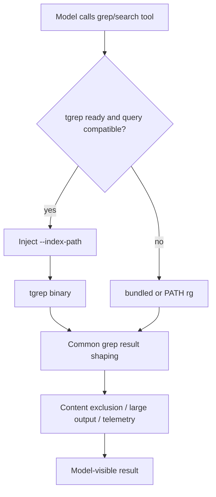
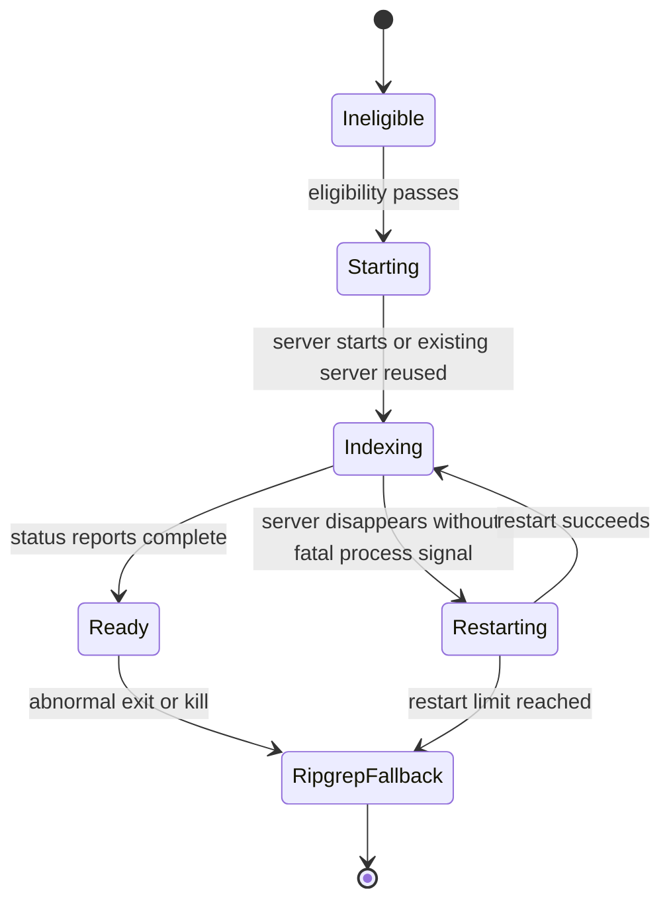

# Indexed repository search with tgrep and ripgrep

Copilot CLI `1.0.71` can place an indexed `tgrep` backend beneath its existing grep/search tools for sufficiently large repositories. The packaged `tgrep` binary identifies itself as a trigram-indexed grep engine; this path is not an embedding, vector, AST, or symbol index. The model does not receive a separate `tgrep` tool. Tool schemas and result handling stay stable while the runtime starts an index server, waits for readiness, selects the executable, injects the index path, and falls back to ripgrep whenever the indexed path is ineligible or unhealthy.

This page documents that backend lifecycle. It is separate from session-store SQLite/FTS indexing, which indexes conversation history rather than repository source files.

## Source anchors

| Area | Semantic alias | Exact/minified anchor | Current location | Role |
|---|---|---|---|---|
| Feature assignment | tgrep experiment | `TGREP = "copilot_cli_tgrep"` | `sdk/index.d.ts` ~6283; `app.js` ~124 | Enables indexed search unless an environment override decides otherwise. |
| Startup orchestration | Working-directory index coordinator | `xe(...)`, `getFlag("TGREP")`, `Dr(...)`, `Lpt(...)` | `app.js` ~5781 | Re-evaluates the backend for the active working directory, resolves the Git root, and serializes startup attempts. |
| Environment controls | Backend overrides | `USE_TGREP`, `USE_TGREP_WARM_START`, `USE_BUILTIN_RIPGREP` | `app.js` ~122, ~5307, ~5781 | Forces/disables indexed startup, controls warm start, or selects PATH ripgrep. |
| Index path | Repository-keyed index | `TMe(...)`, `tgrep-index`, SHA-256 prefix | `app.js` ~122 | Stores each repository index beneath the Copilot cache root. |
| Eligibility | Startup decision | `tgrep skipped: ...`, `count-files`, `kJ` | `app.js` ~122 | Applies gate, git-root, virtual-filesystem, file-count, and force rules. |
| Server process | Index server manager | `Bpt(...)`, `tgrep serve` | `app.js` ~122-124 | Starts or reuses the persistent server and parses incremental-index trace output. |
| Readiness polling | Status probe | `EMe(...)`, `status --index-path` | `app.js` ~124 | Classifies server-not-running, indexing, ready, or unknown with a four-second probe timeout. |
| Search backend choice | Executable selector | `cde()` | `app.js` ~124 | Uses tgrep only when the index is ready and the active search is inside the indexed root. |
| Search argument bridge | Index argument adapter | `ade(...)`, `n4n(...)`, `$R(...)`, `--index-path` | `app.js` ~122; `sdk/index.js` ~96 | Validates positional roots and globs, then adds the index path only for compatible grep invocations. |
| Search execution | Shared grep runner | `R4n(...)`, `(a.length ? cde : x5)()` | `app.js` ~133 | Chooses the indexed or ripgrep executable while preserving the common sandbox and result pipeline. |
| Telemetry | Startup/index/server events | `tgrep_startup`, `tgrep_incremental_indexing`, `tgrep_server_error` | `app.js` ~5040 | Records eligibility, latency, file counts, index changes, and server failures. |
| Packaged binary | Indexed grep engine | `tgrep` `0.1.21` | `tgrep/bin/linux-x64/tgrep` | Exposes `index`, `serve`, `search`, `status`, and `count-files` commands. |

## Indexing model and implementation boundary

The packaged binary reports `tgrep 0.1.21` and describes itself as "Trigram-indexed grep - fast regex search for large codebases." Its command surface exposes `index`, `serve`, `search`, `status`, and `count-files`. This confirms the index family and lifecycle boundary, but the detailed postings layout, query planner, and on-disk compatibility rules live inside the native binary rather than the JavaScript bundle.

The visible runtime path does not build repository embeddings, an AST database, or a symbol graph. The packaged Tree-sitter grammars are used for rich diff highlighting, while native embedding surfaces elsewhere in the package serve MCP, skill, and instruction retrieval. Session-store SQLite/FTS indexing is also separate: it indexes conversation history and session metadata, not repository source text.

## Why tgrep is not another model tool

The model-facing grep/search tool continues to accept familiar pattern, path, glob, output-mode, and context arguments. Runtime helpers choose a backend and adapt compatible ripgrep-style arguments.



This keeps permission, content-exclusion, timeout, large-output, and event behavior in the existing grep tool pipeline. Backend selection is an implementation detail unless operators inspect logs or telemetry.

## End-to-end runtime call path

| Step | Runtime path | Confirmed behavior |
|---:|---|---|
| 1 | `xe(...)` at `app.js` ~5781 | Reacts to the active working directory, checks environment overrides, resolves `TGREP`, and finds the Git root. A monotonically increasing attempt token prevents an older asynchronous startup from replacing a newer one. |
| 2 | `Lpt(...)` / startup controller at `app.js` ~122 | Applies eligibility checks, runs `count-files`, records the outcome, and installs the selected root as the candidate indexed root. |
| 3 | `Bpt(...)` at `app.js` ~122-124 | Starts `tgrep serve`, observes stderr/stdout, recognizes an already-owned index, and emits server and incremental-index callbacks. |
| 4 | `EMe(...)` at `app.js` ~124 | Polls `tgrep status` until the server is ready, unavailable, failed, or disposed. |
| 5 | `R4n(...)` at `app.js` ~133 | Calls `ade(...)` to adapt the request. If adaptation succeeds, `cde()` selects tgrep; otherwise `x5()` selects bundled or PATH ripgrep. |
| 6 | Native ripgrep assembler and common tool pipeline | Streams and shapes either backend's output, applies timeout/sandbox/content-exclusion/large-output behavior, and returns the normal grep result. |

## Eligibility and startup decisions

The startup manager evaluates the repository before launching an index server.

| Check | Behavior when not forced |
|---|---|
| `USE_BUILTIN_RIPGREP=false` | Do not create the tgrep manager; select `rg` from `PATH`. |
| `USE_TGREP=false` | Skip with disabled reason `use_tgrep_false`. |
| TGREP feature assignment false | Skip with disabled reason `feature_flag_false`. |
| No Git root | Skip with `skipped_no_gitroot`. |
| Virtual/network filesystem | Skip to avoid unsuitable watcher/index behavior. |
| `count-files` failure | Record startup failure and use ripgrep. |
| Below file threshold | Skip: fewer than `50,000` files on non-Windows or `10,000` on Windows. |

`USE_TGREP=true` is a force override. It bypasses the feature assignment, git-root requirement, virtual-filesystem exclusion, and normal size threshold after the runtime can resolve/count the working tree.

Virtual filesystem detection includes `.gvfs`, WSL UNC paths on Windows, and filesystem type IDs mapped to 9p, hostfs, VirtualBox shared folders, VMware shared folders, SMB, and CIFS.

## Repository-keyed index storage

`TMe(...)` canonicalizes the repository path, hashes it with SHA-256, truncates the digest to 16 hexadecimal characters, and places the result under:

```text
<Copilot cache home>/tgrep-index/<repo-hash>/
```

The index is therefore shared by CLI sessions for the same canonical root and survives a normal session restart. The packaged binary advertises index files such as metadata, file lists/stamps, trigram data, lookup data, a server lock, and staging directories.

This cache is unrelated to `session-store.db`; deleting one does not delete the other.

## Server startup and reuse

For an eligible root, the runtime starts:

```text
tgrep serve . --index-path <cache>/tgrep-index/<repo-hash> --exclude .git
```

The process is attached to the CLI manager rather than detached. stdout/stderr lines are logged and inspected for two important signals:

- another server already owns the index directory, in which case the new process exits and the runtime reuses the existing server;
- `[trace] stale check` records, which are converted into incremental-index telemetry.

A prior manager instance is disposed before a new root/startup attempt takes ownership. The server process also maintains a filesystem watcher unless the binary is run with its own `--no-watch` option; the CLI invocation shown above does not set that option.

## Readiness and warm start

`EMe(...)` runs a status probe with a four-second timeout:

```text
tgrep status --index-path <index> .
```

Output becomes one of:

| State | Detection |
|---|---|
| `server-not-running` | Status says the server is not running. |
| `in-progress` | Status reports indexed and total file counts. |
| `ready` | Status says indexing is complete. |
| `unknown` | Output is unrecognized, command errors, or the probe times out. |

The manager polls every five seconds with an unreferenced timer. Without warm start it can return while indexing continues; tgrep becomes selectable only after status reaches `ready`.

With `USE_TGREP_WARM_START=true`, startup waits until the index is ready, the server fails, or the manager is stopped. This trades startup latency for having indexed search available on the first eligible query.

## Search selection

The shared grep runner performs backend adaptation at execution time, not when the model-facing tool is assembled. Its minified path is equivalent to:

```text
indexArgs = ade(config.location, args)
binary = (indexArgs.length ? cde : x5)()
fullArgs = [...indexArgs, ...args]
```

`ade(...)` and `n4n(...)` accept an invocation only when its search scope can be represented against the active repository index:

- the argument list contains the expected `--` separator;
- every positional search path resolves to an existing path inside the indexed repository;
- resolved relative paths contain no wildcard syntax;
- a repository-root search needs no additional scope glob;
- a subdirectory search adds both `<relative-path>` and `<relative-path>/**` as `--glob` filters;
- an existing positive `--glob` causes the adapter to decline the indexed backend, while exclusion globs remain compatible;
- `--files` requests always stay on ripgrep.

If any check fails, `ade(...)` returns no index arguments and the runner calls `x5()` directly. Successful adaptation prepends `--index-path <repository-index>` and any derived scope globs before the original ripgrep-compatible arguments.

`cde()` selects the tgrep executable only when all of these remain true:

- `USE_BUILTIN_RIPGREP` is not `false`;
- `USE_TGREP` is not `false`;
- the server has not suffered a fatal/abnormal failure;
- the index is ready;
- the current search root is inside the indexed repository root.

The minified module state behind these checks is small: `rL` is the active indexed root, `NT` records readiness, and `T5` records a fatal backend failure. `cde()` requires an active root, `NT === true`, and `T5 === false` before returning the packaged tgrep executable.

The argument adapter also rejects incompatible grep modes, including file-list requests and cases where the index cannot represent the requested root/glob combination. Those calls continue through ripgrep.

Setting `USE_BUILTIN_RIPGREP=false` selects `rg` from `PATH` and intentionally prevents tgrep selection. Otherwise fallback uses the packaged ripgrep binary.

## Failure, restart, and fallback



Observed behavior:

- spawn errors produce `failed` startup and tgrep remains unavailable;
- an abnormal exit code or signal marks the backend failed and immediately disables indexed selection for the process, with logs explicitly mentioning likely OOM kills;
- disappearance of a previously running/reused server can trigger restart attempts;
- restart attempts are capped at three;
- after fatal failure or restart exhaustion, searches use ripgrep instead of repeatedly restarting the indexer;
- disposal stops the process owned by the current manager and clears polling/startup state.

The `1.0.69` changelog describes the same operational goal: bound indexer memory on large monorepos and fall back to ripgrep when the process is killed.

## Resource behavior inside the binary

The packaged `tgrep` binary advertises a bounded initial build:

- `--max-memory`: defaults to 50% of physical RAM, clamped between 512 MB and 16 GB;
- `--max-cpu`: defaults to 50% of logical cores;
- incremental flushes can move index state to disk when memory pressure grows.

The current CLI `serve` invocation relies on those binary defaults rather than passing explicit memory/CPU values.

## Telemetry

| Event | Important fields |
|---|---|
| `tgrep_startup` | outcome, forced-by-env, warm-start, disabled reason, eligibility, file count, startup duration, restricted error text. |
| `tgrep_incremental_indexing` | phase, changed/added/deleted counts, walk/update/total durations. |
| `tgrep_server_error` | error type, exit code, restricted error message. |

These events make backend behavior observable without changing the tool result returned to the model.

## Operational controls and caveats

- `USE_TGREP=false` is the direct troubleshooting escape hatch.
- `USE_TGREP=true` can force startup, but it cannot make a missing/broken binary or failed file count succeed.
- `USE_TGREP_WARM_START=true` may noticeably extend startup while indexing completes.
- The checked-in extraction contains the Linux x64 binary because it came from that platform package. Runtime path construction expects matching platform/architecture payloads in other platform packages.
- Search output still passes through existing content-exclusion and large-output handling; indexing does not bypass those controls.
- The binary is packaged code, while most index internals are only observable through its CLI strings and process behavior. Avoid inferring index format compatibility beyond the current package.

## Related docs

- [Built-in tools, execution events, and results](built-in-tools-execution-events.md) explains the common grep tool lifecycle around either backend.
- [Runtime tool assembly and filtering](runtime-tool-assembly-and-filtering.md) explains why backend selection does not create an additional model-visible tool.
- [Content exclusion and redaction](content-exclusion-and-redaction.md) explains filtering after search execution.
- [Feature gates](../05-hosted-agent-ops/feature-gates.md) explains experiment and environment override resolution.
- [Session-store SQLite indexing](../04-sessions-persistence-remote/session-store-sqlite-indexing.md) covers conversation indexing, which is separate from tgrep repository indexing.
