# Integration config entrypoints

## Internals scope

> **Why this page is here:** This page belongs to [Tools, integrations, and security](README.md). It documents an action boundary: how tools, MCP/plugins/SDK/IDE/web bridges, policies, approvals, redaction, hooks, or sandboxing become safe runtime behavior. Pair it with [Context and model loop](../02-context-model-loop/README.md) for what the model sees and [Sessions, persistence, and remote](../04-sessions-persistence-remote/README.md) for how events/results persist.

## Reader contract

Use this page as a cross-reference for **which startup/config/auth entry point feeds which focused implementation page**. It is intentionally an entrypoint map: it keeps root-level flow diagrams and source anchors here, while detailed MCP, plugin, permission, settings, auth/provider, and update behavior lives in narrower pages.

If you need depth, jump from this page to [MCP host, transports, and tools](mcp-host-transport-and-tools.md), [Plugins, extensions, and capabilities](plugins-extensions-and-capabilities.md), [Tool, path, and URL permissions](tool-path-url-permissions.md), [Settings and configuration persistence](settings-config-persistence.md), [Models, providers, and authentication workflows](../02-context-model-loop/models-providers-auth.md), or [Telemetry, update, and shutdown](../05-hosted-agent-ops/telemetry-update-and-shutdown.md).

This file focuses on the major cross-cutting systems wired into `app.js`: MCP, plugins/extensions, permission rules, authentication/provider selection, login, and update behavior.

## Source anchors

`app.js` is bundled/minified, so semantic aliases below are stable documentation names. Minified anchors are lookup aids for the analyzed artifact.

| Semantic alias | Minified anchor | Approx. location | Role |
|---|---|---:|---|
| Runtime settings merge | settings schema, `writeKey`, `load`, `COPILOT_HOME` | `app.js` 236-239 | Combines persisted settings, config roots, CLI flags, and environment inputs. |
| Auth manager | `tryHMACLogin`, `tryApiKeyLogin`, `tryCopilotApiTokenLogin`, `tryGhCliTokenLogin` | `app.js` 5742 | Selects GitHub, GH CLI, token, API-key, and custom-provider authentication sources. |
| Login subcommand | `m9o()`, OAuth device/browser flow strings | `app.js` 4942, 5742 | Implements `copilot login` and token storage behavior. |
| MCP config merge | `.mcp.json`, `mcp.config.*`, `mcpServers`, `D0(...)` | `app.js` 4288-5742 | Merges user/workspace/plugin/builtin MCP server definitions and management commands. |
| Plugin manager | `ET`, `installedPlugins`, `enabledPlugins`, `--plugin-dir` | `app.js` 525-528, 7445, 8221 | Installs/discovers plugin contributions and local plugin directories. |
| Permission service | `permission.requested`, `permission.completed`, `--allow-all`, `--deny-url` | `app.js` 4210, 8221 | Assembles rule sets and mediates tool/path/URL approvals. |
| Update/restart path | restart code `75`, update cache selection | `index.js`, tail `app.js` | Handles auto-update handoff and process restart behavior. |

## Configuration inputs

`app.js` merges information from command-line flags, environment variables, user config, workspace config, plugin metadata, and runtime state.

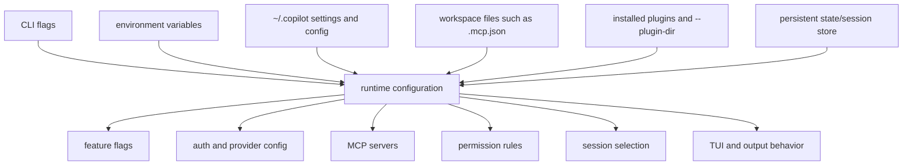

## Authentication and provider selection

The CLI can use GitHub Copilot authentication, environment-provided tokens, GitHub CLI credentials, or a custom provider/BYOK configuration. Offline mode requires a local/custom provider and disables network-dependent GitHub features.

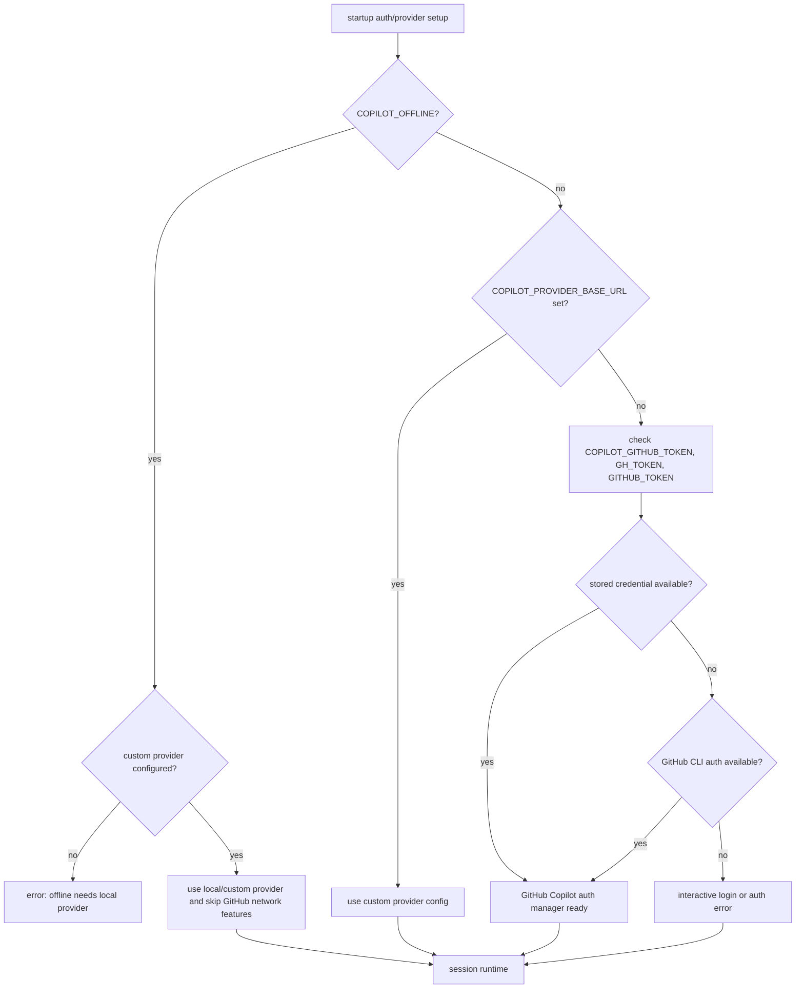

## `copilot login` workflow

The `login` subcommand uses OAuth device/browser flow and stores the resulting token in the system credential store when possible. If the keychain is unavailable, it can ask whether to store the token in a plaintext config file.

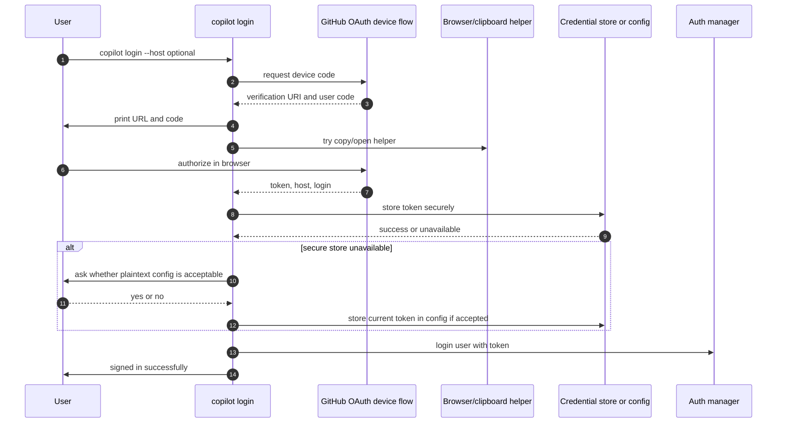

## MCP configuration and commands

MCP servers extend Copilot with tools/capabilities. The CLI loads them from multiple sources and exposes `copilot mcp` management commands.

Sources described by the bundled help and code:

- User: `~/.copilot/mcp-config.json`
- Workspace: `.mcp.json`
- Plugin: installed plugins with MCP servers
- Builtin: bundled/default servers, including GitHub MCP behavior controlled by flags
- CLI additions: extra session config and enable/disable flags

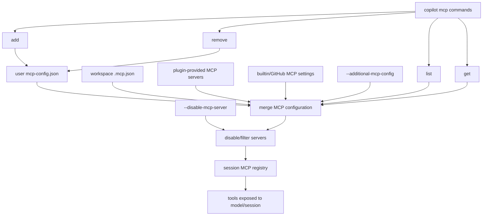

### `copilot mcp add` decision flow

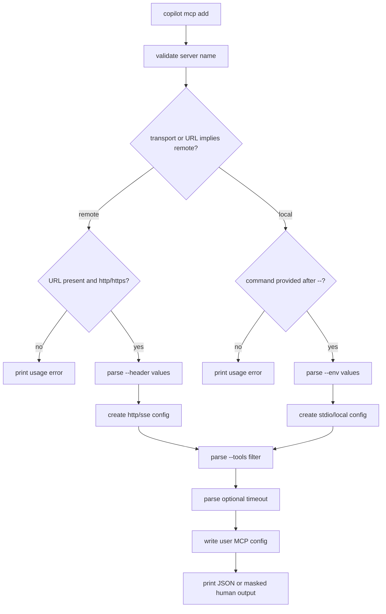

## Plugin and extension flow

Plugins can contribute skills, agents, hooks, MCP servers, and LSP servers. `app.js` wires plugin metadata into startup and registers plugin commands through the plugin command builder.

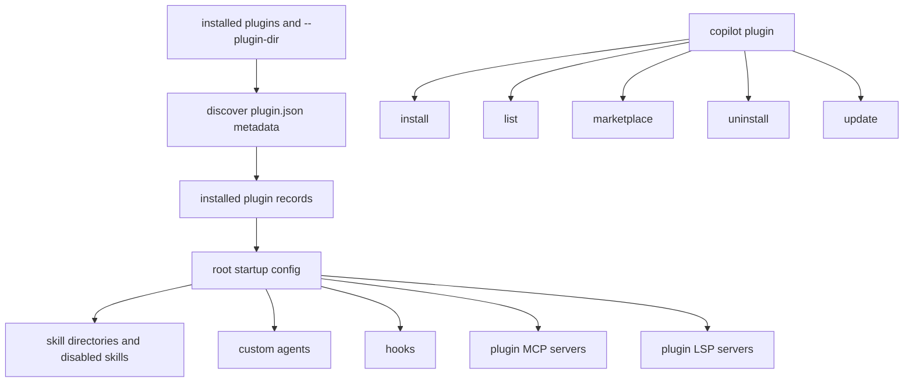

Prompt mode can also load extensions when feature flags/config permit it. Interactive mode starts an embedded server and registers extension tools on the foreground session.

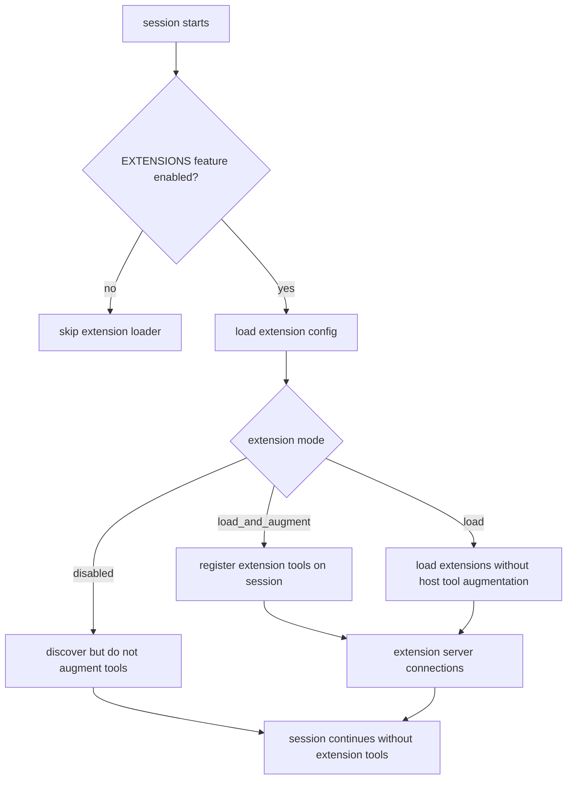

## Permission assembly

Permissions are assembled from config and CLI flags before tools are initialized. Rules cover tools, paths, and URLs. Deny rules generally take precedence over allow rules, and non-interactive mode cannot freely ask the user.

For the detailed subsystem design, including rule precedence, path/URL managers, hooks, session/location approval persistence, remote/RPC prompts, and allow-all behavior, see [`tool-path-url-permissions.md`](tool-path-url-permissions.md).

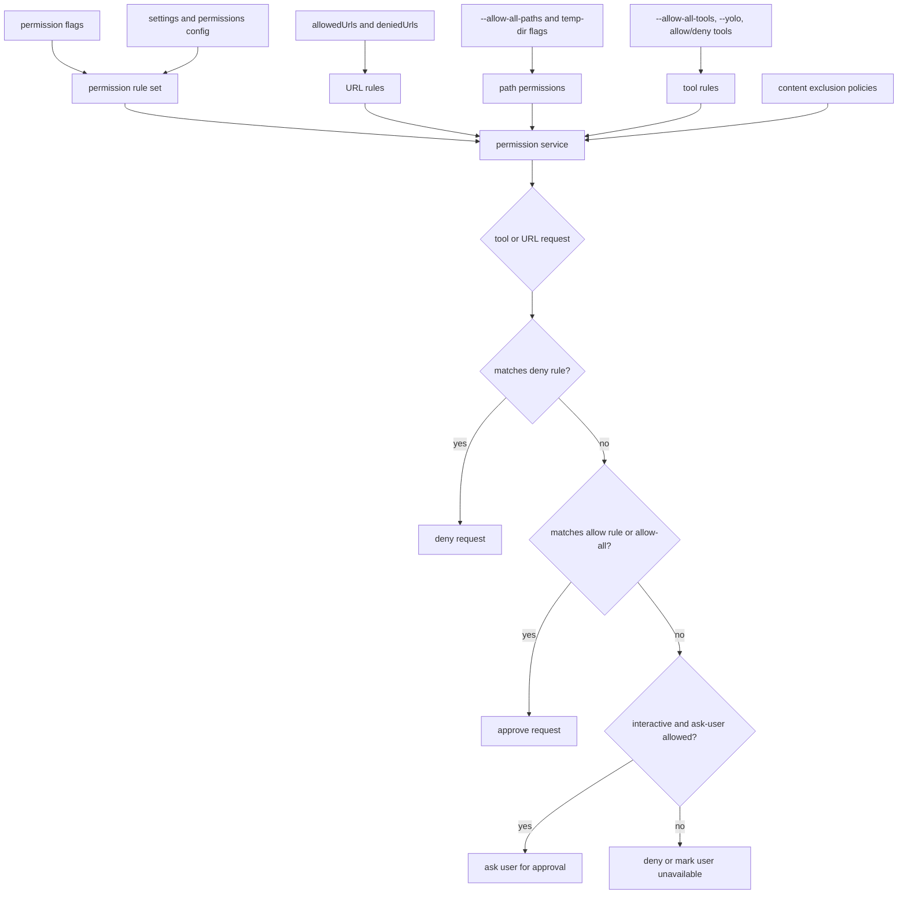

## Non-interactive permission behavior

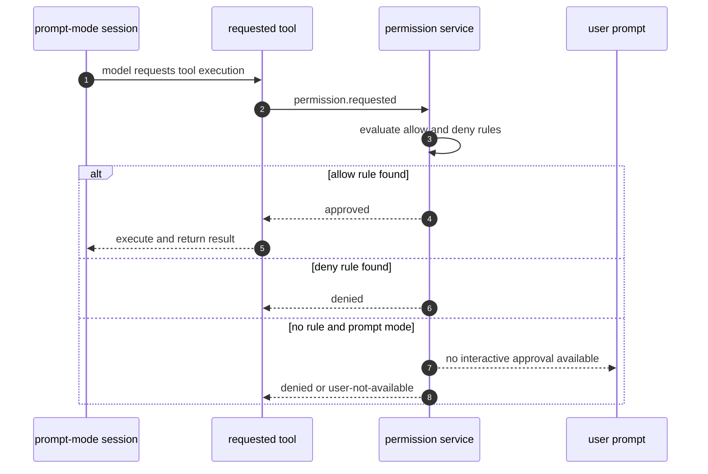

## Update behavior

There are two related update flows:

1. automatic update checks prepared by the root runtime/loader wrapper;
2. explicit `copilot update [channel]` command.

The explicit update command checks whether the CLI is running in the supported SEA/native context, loads config, chooses a requested channel, performs update work, and reports the result.

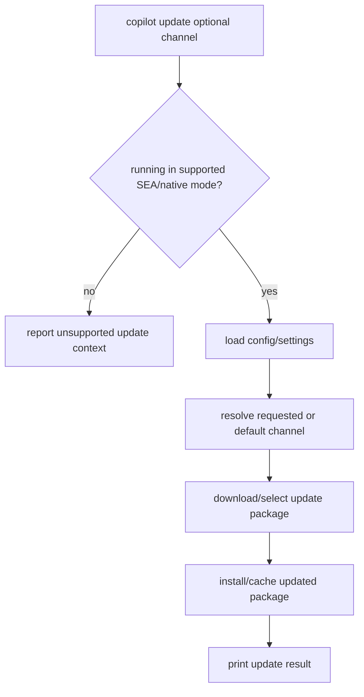

## Content exclusion and telemetry

The runtime also wires content exclusion policies and telemetry/logging before creating sessions.

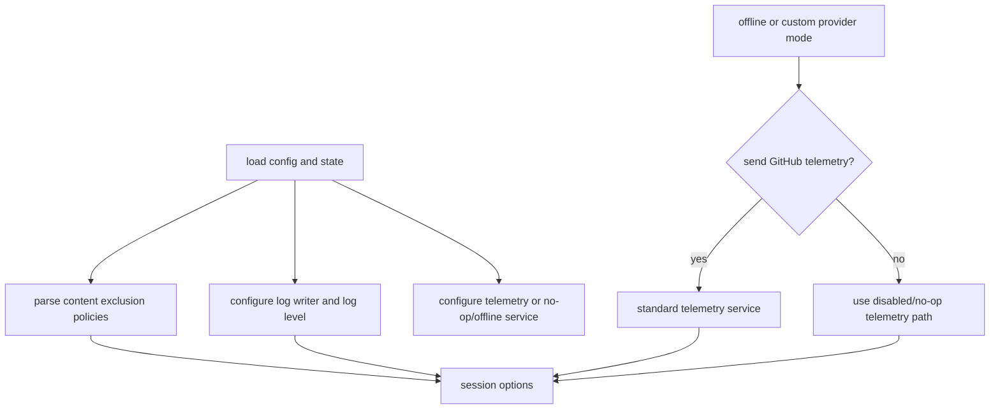

## Integration summary

`app.js` acts as an orchestration layer. The agentic behavior depends on the session engine and bundled services, but this root file decides which integrations are available, which permissions apply, how the user authenticates, which model/provider is selected, and which runtime mode receives control.
