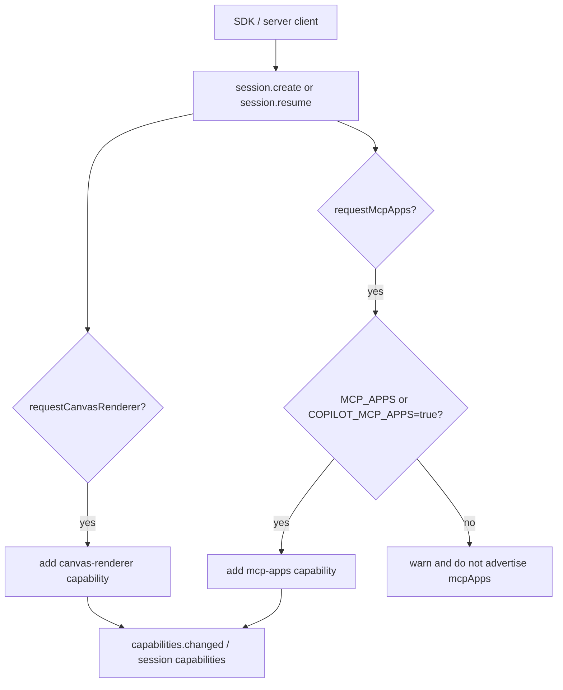
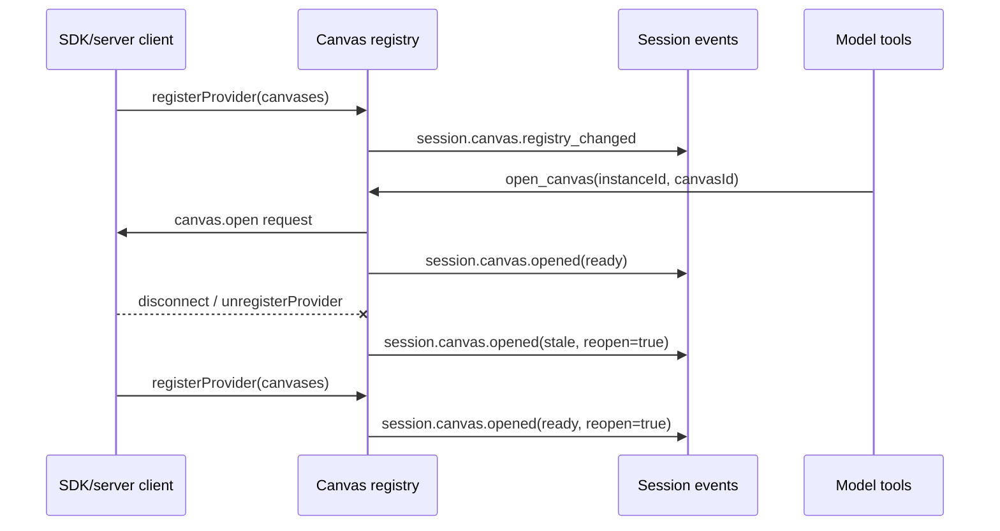
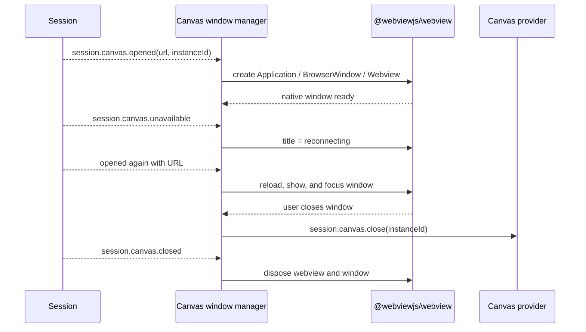

# MCP Apps and canvas bridge

This page documents the UI-capability bridge in the extracted `@github/copilot` `1.0.71` package. It covers two related but distinct surfaces:

- **Canvas renderer support** lets SDK/server clients register renderable canvases, expose model tools for opening and acting on those canvases, and receive canvas lifecycle events.
- **MCP Apps support** lets MCP servers expose UI metadata/resources behind an opt-in `mcp-apps` session capability, with app-originated MCP tool calls reported back through session events.

Read this with [Embedded server, ACP, and JSON-RPC protocol](../01-runtime-lifecycle/embedded-server-acp-protocol.md) for session create/resume APIs, [MCP host, transports, and tools](mcp-host-transport-and-tools.md) for MCP server lifecycle, and [Copilot SDK extension bridge](copilot-sdk-extension-bridge.md) for SDK extension process boundaries.

## Source anchors

`app.js` is bundled/minified, so semantic aliases below are explanatory. Approximate line numbers refer to the extracted `1.0.71` package.

| Area | Semantic alias | Minified anchor / string | Approx. line | What it proves |
|---|---|---|---:|---|
| Feature gate | MCP Apps gate | `MCP_APPS`, `COPILOT_MCP_APPS`, `bqe(...)` | 240, 4593 | MCP Apps is experimental by default and can be enabled through the environment override. |
| Canvas model tools | Canvas tool provider | `list_canvas_capabilities`, `open_canvas`, `invoke_canvas_action` | 372 | The model-visible tool layer can inspect, open, and act on canvases. |
| Canvas system prompt | Canvas instructions | `<canvases>`, `open_canvas`, `list_canvas_capabilities` | 4260 | The prompt tells the model when and how to use canvases. |
| Canvas manager | Canvas registry/instances | `A0t`, `registerProvider`, `openInstances`, `availability` | 4821 | Providers register canvas declarations; open instances become ready/stale and emit events. |
| Canvas events | Session canvas events | `session.canvas.opened`, `session.canvas.registry_changed` | 4821 | Canvas lifecycle updates are ephemeral session events. |
| Durable canvas state | Canvas replay events | `session.canvas.recorded`, `session.canvas.removed`, `session.canvas.listOpen` | 167, 2651, 2742 | Open instance identity survives replay/restart separately from transient availability and URL state. |
| Node SDK canvas API | Per-canvas factory | `createCanvas(...)`, `CanvasOptions`, `CanvasAction` | `copilot-sdk/canvas.d.ts` | Extensions bind open, close, and action handlers while sending only declaration metadata over the wire. |
| Native canvas renderer | Local webview/window manager | `Ffi()`, `Ofi()`, `Dfi()`, `pendingOpens`, `windows` | 4402 | Loads `@webviewjs/webview`, owns native windows per session/instance, and falls back to a logged URL when unavailable. |
| SDK/server capability ingress | Session capability options | `requestCanvasRenderer`, `requestMcpApps`, `buildSdkSessionCapabilities` | 2797-2799 | SDK/server create/resume can opt sessions into canvas and MCP Apps capabilities. |
| SDK connection registration | Canvas provider registration | `registerCanvasesForConnection(...)` | 2797-2799 | Connected SDK/server clients can register canvas providers by connection. |
| MCP Apps diagnostics | MCP Apps API surface | `mcp.apps.diagnose`, `_meta.ui`, `McpAppsDiagnoseResult` | 4856 | Runtime exposes a diagnostic API for capability and `_meta.ui` visibility. |
| MCP Apps tool calls | App-originated MCP call event | `mcp_app.tool_call_complete`, `supportsMcpApps()` | 4940 | App-originated MCP calls emit success/error/duration/result metadata. |

## Capability model

Canvas and MCP Apps are both session capabilities, but they enter through different gates.

The server returns UI capability flags such as `ui.canvases` and `ui.mcpApps` from session create/resume/get-foreground paths. Capability provider changes are also projected through `capabilities.changed`.

## Canvas lifecycle

Canvas providers are registered by connected SDK/server clients rather than discovered from the filesystem. A provider contributes one or more canvas declarations with:

| Field | Role |
|---|---|
| `id` | Provider-local canvas identifier. |
| `displayName` | Human-readable name. |
| `description` | Short description shown to the agent in canvas catalogs. |
| `inputSchema` | Optional JSON schema for opening the canvas. |
| `actions` | Optional action names, descriptions, and input schemas for open instances. |

The runtime validates declarations before accepting them:

- canvas IDs must be present and unique for a provider;
- action names cannot use the reserved `canvas.` prefix;
- open/action input schemas are compiled and invalid schemas reject registration;
- a provider cannot overwrite another live provider's `extensionId/canvasId` pair.

When registration succeeds, the runtime emits `session.canvas.registry_changed` with the currently available canvases.

### Opening and using a canvas

The model sees canvas-specific tools when the canvas renderer capability is present:

| Tool | Purpose |
|---|---|
| `list_canvas_capabilities` | Inspect a specific canvas declaration and action schemas. |
| `open_canvas` | Open or focus a canvas using a caller-chosen stable `instanceId`. |
| `invoke_canvas_action` | Invoke a named action on an open canvas instance. |

`open_canvas` is idempotent for an existing `instanceId`; re-opening focuses or no-ops the existing surface. Open results are normalized, and URL results are limited to `http:` or `https:` schemes. When a canvas opens, focuses, is rehydrated, or changes availability, the runtime emits `session.canvas.opened`.

### Provider disconnect and reconnect

Open canvas instances survive provider disconnects as stale records:

If the model tries to act on a stale instance, routing fails with a provider-unavailable error and the model should re-issue `open_canvas` after a provider reconnects.

### Durable restart recovery

The current runtime separates durable instance identity from ephemeral renderer state:

1. Opening a canvas emits `session.canvas.recorded` with `instanceId`, provider/canvas IDs, title, and input, but not the transient URL.
2. Replay rebuilds `durableOpenCanvases` from `session.canvas.recorded` and `session.canvas.removed`.
3. `session.canvas.listOpen` returns the reconstructed open-instance set to SDK clients.
4. When a matching provider reconnects, the runtime can reopen the renderer and emit current availability through ephemeral canvas events.

This is why open canvases can resume across CLI restarts without persisting a stale local URL or claiming that a disconnected provider is ready.

### SDK handler boundary

The Node SDK exports experimental `createCanvas(options)`. `CanvasOptions` combines declaration metadata with in-process closures:

| Handler | Direction |
|---|---|
| `open(ctx)` | Required provider callback for `canvas.open`. |
| `onClose(ctx)` | Optional fire-and-forget callback for `canvas.close`. |
| `actions[].handler(ctx)` | Required callback for each declared `canvas.action.invoke`. |

Only IDs, descriptions, schemas, and action metadata cross the session create/resume wire. Handler closures remain in the SDK process and are dispatched by canvas ID.

### Native webview renderer

Interactive CLI sessions can project a canvas URL into a local native window through the packaged `@webviewjs/webview` binding. `webview/index.js` is an empty package-local resolver anchor; `Ffi()` uses it to resolve the adjacent native package without relaxing the application's module-containment check.

The renderer is a presentation layer for the canvas lifecycle above, not another canvas provider or model tool.

#### Platform and fallback behavior

`Ofi()` allows native rendering on non-Linux platforms. On Linux it requires either `DISPLAY` or `WAYLAND_DISPLAY`; a headless Linux session logs a warning with the canvas URL instead of attempting a native window.

Application or window initialization failures are also fail-soft. The manager logs `Could not open <canvas> in a native window`, keeps the URL available in the canvas timeline entry, and does not fail the underlying agent/session turn.

#### Window identity and races

Window keys combine `sessionId` and `instanceId`, so equal instance IDs in different sessions do not collide. The manager tracks:

| State | Purpose |
|---|---|
| `activeSessions` | Rejects late opens after a session was detached. |
| `pendingOpens` | Uses a unique token to discard superseded asynchronous application/icon/window setup. |
| `windows` | Stores the native window, webview, current URL/icon/title, and close state. |

Opening an existing key updates the title/icon, loads the new URL, restores a minimized window, shows it, and focuses both window and webview. `session.canvas.unavailable` leaves the window present but marks its title as reconnecting. A later open event refreshes the same surface.

#### Web context and temporary data

The first window creates a shared native `WebContext` backed by a fresh temporary data directory. `COPILOT_CANVAS_WEBVIEW_DATA_ROOT` can override the parent directory; otherwise the system temp directory is used with a `copilot-webview-` prefix.

The context is shared among live canvas windows in the manager, then disposed when no windows or pending opens remain. Directory removal is recursive/forced with up to three retries and a 100 ms retry delay. A process-exit handler performs synchronous cleanup for any remaining temporary directories.

The webview is created with developer tools enabled in this build. URL scheme validation still happens in the upstream canvas open-result normalization before the local renderer receives the URL.

#### Close and shutdown

Closing a native window disposes its webview/window and calls `session.canvas.close({ instanceId })` unless the manager initiated disposal. Session detach removes pending opens and windows for that session. Global manager disposal clears sessions, closes every native surface, exits the webview application, disposes the shared context, and removes temporary data.

## MCP Apps lifecycle

MCP Apps is separate from canvas providers. It starts from MCP server tool/resource metadata and is gated by `MCP_APPS` or `COPILOT_MCP_APPS=true`.

Runtime behavior visible in the bundle:

1. Session create/resume requests `requestMcpApps`.
2. The server only adds `mcp-apps` if the feature gate or env override is enabled.
3. MCP clients advertise UI capability to capable servers.
4. The MCP tool list path tolerates `_meta.ui` through a lenient schema path.
5. Runtime diagnostics can report whether the session has `mcp-apps`, whether the gate is enabled, and how many tools expose `_meta.ui`.
6. App-originated MCP calls emit `mcp_app.tool_call_complete`.

The `mcp_app.tool_call_complete` event includes:

| Field | Meaning |
|---|---|
| `serverName` / `toolName` | MCP server and tool invoked by the app view. |
| `arguments` | Optional arguments passed to the underlying `tools/call`. |
| `success` | False if the call threw or returned an MCP `isError` result. |
| `durationMs` | Wall-clock duration for the underlying call. |
| `result` / `error` | Normal MCP result or thrown error message. |
| `toolMeta.ui` | Relevant UI metadata copied from the MCP tool. |

MCP Apps does **not** bypass normal MCP setup. Servers still come from the MCP config merge, pass through policy filters, authenticate via the existing OAuth path when needed, and expose tools through the same host/client registry.

## Relationship between canvas and MCP Apps

Canvas and MCP Apps both create richer UI paths, but they are not the same mechanism.

| Concern | Canvas renderer | MCP Apps |
|---|---|---|
| Primary provider | SDK/server client connection. | MCP server tool/resource metadata. |
| Capability flag | `canvas-renderer`, returned as `ui.canvases`. | `mcp-apps`, returned as `ui.mcpApps`. |
| Model tools | `list_canvas_capabilities`, `open_canvas`, `invoke_canvas_action`. | Normal MCP tools plus app-originated tool/resource operations. |
| Main events | `session.canvas.registry_changed`, `session.canvas.opened`. | `mcp_app.tool_call_complete`. |
| Gate | Session request/capability support. | Session request plus `MCP_APPS` or `COPILOT_MCP_APPS=true`. |

The shared operational point is that both surfaces make a connected host UI more capable while keeping the session event stream and MCP/SDK boundaries explicit.

## Failure modes and caveats

| Case | Runtime behavior |
|---|---|
| `requestMcpApps` without gate/env | Server logs a warning and does not advertise `ui.mcpApps`. |
| Canvas provider missing | `open_canvas` fails with a canvas-not-found error. |
| Canvas ID ambiguous across providers | Runtime asks the model/client to provide `extensionId`. |
| Canvas provider disconnects | Open instances become `stale`; re-open or provider reconnect is needed. |
| Canvas provider returns unsupported URL scheme | Runtime rejects the open result. |
| App calls an MCP tool without `mcp-apps` capability | Session rejects the app-originated call/resource path. |
| MCP tool has no callable UI metadata | App-originated call path rejects it as not callable from MCP Apps. |

## Package evolution

The `1.0.54` baseline exposed the first canvas/MCP Apps bridge. Releases through `1.0.71` added session-scoped extension canvases, durable open-instance recovery, the `session.canvas.listOpen` API, and the public experimental Node SDK factory described above.

| Delta | Documentation action |
|---|---|
| `security-review` built-in agent and `/security-review` | Covered in [Built-in agents](../06-agents-automation/built-in-agents.md), [Agent and task orchestration](../06-agents-automation/agent-task-orchestration.md), and [Prompt sources](../02-context-model-loop/prompt-sources.md). |
| `deferred-tool-loading` custom-agent frontmatter | Covered in [Custom agents and skills packaging](../06-agents-automation/custom-agents-and-skills-packaging.md). |
| `preMcpToolCall` hook | Covered in [Hooks, events, and automation](hooks-events-and-automation.md). |
| New env/gate strings such as `COPILOT_PLUGIN_DIR_ONLY`, `COPILOT_ENABLE_SECRET_FILTERING`, and `TARGETED_VALIDATION_PROMPT` | Narrow knobs or gated support surfaces; keep with existing plugin/redaction/feature-gate docs unless a future question needs a deeper runtime pass. |

## Related docs

- [Embedded server, ACP, and JSON-RPC protocol](../01-runtime-lifecycle/embedded-server-acp-protocol.md)
- [MCP host, transports, and tools](mcp-host-transport-and-tools.md)
- [Copilot SDK extension bridge](copilot-sdk-extension-bridge.md)
- [Plugins, extensions, and capabilities](plugins-extensions-and-capabilities.md)
- [Hooks, events, and automation](hooks-events-and-automation.md)
