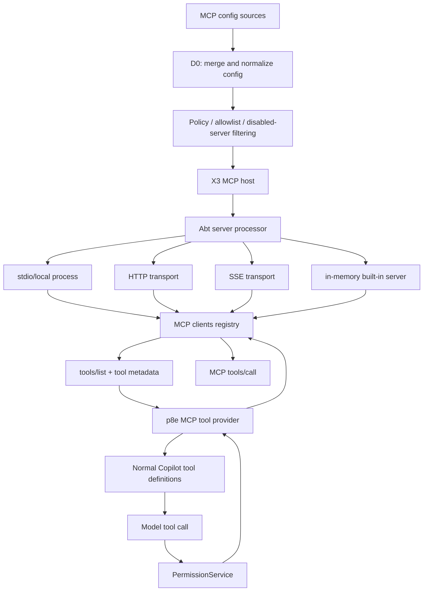
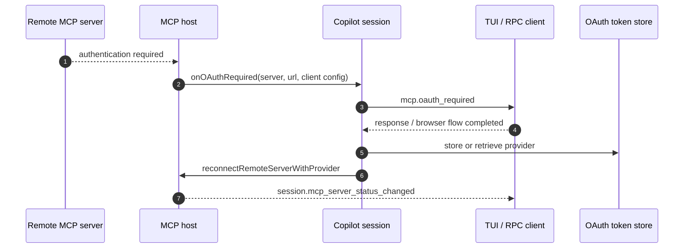

# MCP host, transports, and tools

## What this page covers

Use this page to answer **how does an MCP server become safe, model-callable runtime capability?** It owns the MCP protocol boundary from config discovery through transport startup, tool discovery, OAuth, instruction loading, progress/task handling, and permission integration.

Read [Runtime tool assembly and filtering](runtime-tool-assembly-and-filtering.md) when comparing MCP tools to built-in or external tools. Read [Tool, path, and URL permissions](tool-path-url-permissions.md) when the question is approval. Read [Hosted agent environment](../05-hosted-agent-ops/hosted-agent-environment.md) for hosted GitHub MCP/OIDC defaults.

In the analyzed `app.js`, MCP is implemented as a runtime extension layer: configuration files and CLI/session options define MCP servers, an MCP host starts those servers over local or remote transports, discovered MCP tools are converted into normal Copilot tool definitions, and tool calls flow through the same permission, telemetry, task, and session-event systems as built-in tools.

| MCP concern | Runtime owner | Downstream effect |
|---|---|---|
| Config merge | User/workspace/plugin/session/default sources | Determines which servers exist and which tools are allowed. |
| Transport startup | Local stdio, HTTP, SSE, in-memory server processor | Produces connected/failed/needs-auth server status. |
| Tool discovery | MCP tool provider | Converts server tools into Copilot tool metadata/callbacks. |
| Runtime bridge | Session MCP bridge | Injects tools/instructions, maps progress/tasks, and emits session events. |

## Source anchors

`app.js` is bundled and minified, so the symbols below are search anchors for the analyzed artifact, not stable public APIs.

| Area | Semantic alias | Minified anchor / string | Role |
|---|---|---|---|
| Config schema | `McpConfigSchema` | `U8e`, `F8e`, `omu`, `lE` | Defines local/stdio and remote HTTP/SSE server config shapes plus user config storage. |
| Config discovery | `loadMcpConfig(...)` | `D0(...)`, `mLo`, `JSa`, `fLo`, `Eee` | Loads and merges user, workspace, plugin, registry/default, and additional MCP configs. |
| Extra config parser | `parseAdditionalMcpConfig(...)` | `PRr`, `hLo`, `--additional-mcp-config` | Accepts inline JSON or `@file` MCP config additions. |
| CLI command group | `copilot mcp` builder | `b9o()` | Implements `mcp list`, `mcp get`, `mcp add`, and `mcp remove`. |
| Slash commands | `/mcp` handlers | `Hps`, `tto`, `"/mcp auth"` | Exposes list/show/add/edit/delete/disable/enable/reload/auth/search in interactive mode. |
| Host lifecycle | `McpHost` | `X3` | Owns server config, disabled state, server startup, reload, status, and tool loading. |
| Server processor | `McpServerProcessor` | `Abt` | Starts local, HTTP, SSE, and in-memory servers; builds environment; records failures/auth needs. |
| Client registry | `McpClientRegistry` | `zyt` | Stores transports, clients, failures, pending connections, instructions, and status callbacks. |
| Tool provider | `McpToolProvider` | `p8e` | Loads MCP tools, invokes tools, handles output filtering, progress, and task support. |
| Transports | Transport selectors | `x3`, `Rl`, `f5e`, `m5e`, `$dt` | Classifies local/stdio, HTTP, SSE, and memory transports. |
| Tool names | `flattenMcpToolName(...)` | `TMe`, `kW`, `iZe=64` | Converts `server/tool` names into model-safe tool names. |
| Session integration | `SessionMcpBridge` | `ensureMcpLoaded`, `initializeMcpHost`, `buildSettingsAndTools` | Starts the host and injects MCP tools/instructions into each model turn. |
| OAuth | `McpOAuthApi` | `_Kn`, `buildMcpOAuthHandler`, `mcp.oauth_required` | Authenticates remote MCP servers and reconnects them. |
| Built-in GitHub MCP | `GitHubMcpConfigBuilder` | `$bt`, `hWn`, `mWn`, `uR="github-mcp-server"` | Adds the authenticated GitHub MCP server and handles user-configured GitHub endpoints. |
| Permissions | `McpPermissionPath` | `onMCP`, `Wge`, `B9`, `mcp-sampling` | Maps MCP tools and sampling requests into the permission service. |
| Events | MCP session events | `session.mcp_servers_loaded`, `session.mcp_server_status_changed` | Emits MCP status snapshots and per-server status changes. |

## High-level architecture



The key design point is that MCP tools become ordinary Copilot tools after discovery. Once exposed to the model, they are filtered, prompted, permitted, invoked, logged, and retried through the same tool pipeline used for built-in tools.

## Configuration sources and merge order

The central loader is `D0(...)`. It combines multiple sources into one root object shaped like `{ mcpServers: { ... } }`.

| Source | Path / entry point | Notes |
|---|---|---|
| User config | `~/.copilot/mcp-config.json` via `lE` | Managed by `copilot mcp add/get/list/remove`; writes use `lE.write(...)`. |
| Workspace config | `.mcp.json` via `mLo(...)` / `JSa(...)` | Loaded from trusted workspace locations. Folder trust is checked unless `COPILOT_ALLOW_ALL=true`. |
| Plugin config | plugin manifests and plugin config files via `fLo(...)` / `WSa(...)` | Plugin-provided MCP servers are tagged with plugin source metadata and command `cwd` when needed. |
| Registry/default config | `gLo()` / `ALo()` path | Supports registry or product-provided server definitions when enabled. |
| Session/CLI additions | `--additional-mcp-config <json>` or `@file` via `PRr` / `hLo` | Merged into the runtime config for the current session/startup. |
| Built-in servers | GitHub MCP and other in-memory defaults | Added later by startup/session code when feature flags, auth, and policy allow. |

The loader also accepts Claude-style MCP config shape and normalizes server configs so omitted `tools` defaults to `['*']`.

Workspace loading is trust-sensitive. The TUI startup path computes whether the folder is trusted and only includes workspace MCP sources when trusted, unless the all-permissions environment override is active.

## Server schema and transport types

The root schema is roughly:

```text
{
  mcpServers: {
    "server-name": localServerConfig | remoteServerConfig
  }
}
```

Server names are validated by `hEt` / `mR`; names cannot be empty, whitespace-only, contain control characters, or use malformed slash sequences.

### Common fields

| Field | Meaning |
|---|---|
| `tools` | Allow-list of MCP tool names; defaults to `['*']`. |
| `isDefaultServer` | Marks built-in/product-provided servers. |
| `filterMapping` | Controls output filtering mode globally or per tool (`none`, `markdown`, `hidden_characters`). |
| `timeout` | Tool-call timeout in milliseconds. |
| `source` | Runtime-added source tag such as `user`, `workspace`, `plugin`, or `builtin`. |

### Local / stdio servers

Local servers use `type: "local"` or `type: "stdio"` and require:

| Field | Meaning |
|---|---|
| `command` | Executable to launch. |
| `args` | Argument array. |
| `cwd` | Optional working directory. |
| `env` | Optional environment mapping. |

The server processor builds an environment from session variables, configured env values, referenced variables in command/args/cwd, and optional OIDC/secret tokens. It supports an indirect env mode where env values can name existing environment variables instead of directly embedding values.

### Remote HTTP/SSE servers

Remote servers use `type: "http"` or `type: "sse"` and require:

| Field | Meaning |
|---|---|
| `url` | Remote MCP endpoint URL. |
| `headers` | Optional headers; values are resolved through the settings/secret machinery. |
| `oauthClientId` | Optional static OAuth client id. |
| `oauthPublicClient` | Optional OAuth public-client marker. |
| `oauthGrantType` | Optional `authorization_code` or `client_credentials`. |

Only HTTP/SSE configs are eligible for MCP OAuth login.

## Management surfaces

MCP can be managed from several user-visible paths.

| Surface | Entry point | Behavior |
|---|---|---|
| Root CLI | `copilot mcp list|get|add|remove` | Lists merged config by source, prints config with secrets masked by default, adds local or remote user servers, and removes user servers. |
| Root flags | `--additional-mcp-config`, `--disable-mcp-server`, `--disable-builtin-mcps` | Adds runtime config, disables named servers, or disables built-in MCP servers. |
| GitHub MCP flags | `--enable-all-github-mcp-tools`, `--add-github-mcp-toolset`, `--add-github-mcp-tool` | Changes which GitHub MCP toolsets/tools are requested from the built-in GitHub MCP endpoint. |
| Runtime slash command | `/mcp list`, `/mcp show`, `/mcp enable`, `/mcp disable`, `/mcp reload` | Lightweight command handler for MCP status and session-level server toggles. |
| TUI command/dialog | `/mcp`, `/mcp add`, `/mcp edit`, `/mcp delete`, `/mcp auth`, `/mcp search` | Opens richer configuration/status/auth/registry UI. Disable/enable persists settings where possible. |
| JSON-RPC session API | `mcp.list`, `mcp.enable`, `mcp.disable`, `mcp.reload` | Exposes server status and runtime management to SDK/server clients. |
| OAuth API | `mcp.oauth.login` | Starts browserless OAuth for remote servers and reconnects after authentication. |

The CLI help captured in `help/mcp.txt` describes MCP servers as local stdio or remote HTTP/SSE endpoints and lists the command group as `add`, `get`, `list`, and `remove`.

## Host lifecycle

The session runtime lazily initializes MCP. Two related methods appear in the session class:

- `ensureMcpLoaded()` creates `new X3(...)` when session-level MCP servers exist and starts them.
- `initializeMcpHost()` does the same work but also reconciles MCP servers declared by the currently selected custom agent.

The host constructor receives:

| Option | Purpose |
|---|---|
| `logger` | Runtime logging. |
| `mcpConfig` | `{ mcpServers }` config. |
| `disabledMcpServers` | Initial disabled set. |
| `envValueMode` | Direct/indirect env resolution behavior. |
| `sessionId` | Used for env, telemetry, OAuth, and task association. |
| `settings` | Runtime settings/secrets/feature gates. |
| `onOAuthRequired` | Callback for remote OAuth. |
| `elicitationHandler` | Optional MCP elicitation bridge. |
| `samplingHandler` | Optional MCP sampling bridge. |
| `mcp3pEnabled` | Policy switch for third-party MCP servers. |
| `configFilter` | Enterprise/allowlist filter. |
| `secretStore` | Secret persistence for installed MCP servers. |

Startup flow:

1. `X3.startServers()` calls `processServersWithExtensions(...)` once per load.
2. Built-in/default servers may be injected.
3. Third-party servers are removed if policy disables them.
4. The config filter can remove servers and record filtered-server reasons.
5. Disabled servers are skipped.
6. `Abt.processServers(...)` starts each remaining server.
7. Each server status is reported as `starting`, then `connected`, `failed`, or `needs-auth`.
8. The host registers built-in notification handlers such as `user.abort` where supported.

Shutdown uses `stopServers()`, which closes transports, terminates sessions for transports that support it, clears the startup promise, and drops the cached tool provider.

## Server startup and status

The server processor chooses the transport by config type:

| Classifier | Transport |
|---|---|
| `x3(config)` | Local/stdio process. |
| `f5e(config)` | HTTP transport. |
| `m5e(config)` | SSE transport. |
| `$dt(config)` | In-memory server instance. |

If a remote server requires OAuth, startup records it as `needs-auth` rather than `failed`. Other errors are recorded in the failed-server map, and stderr details may be attached to user-facing warnings.

The TUI startup path adds reporters around server status:

- slow connection warning after roughly `10s`;
- warning for failed servers with a `/mcp show ...` hint;
- warning for `needs-auth` with `/mcp auth <server>`;
- progress reporting for number of connected servers;
- setup/failure telemetry.

The session emits:

| Event | Payload |
|---|---|
| `session.mcp_servers_loaded` | Full list of `{ name, status, source, error? }`. |
| `session.mcp_server_status_changed` | `{ serverName, status }` for one server. |
| `mcp.oauth_required` | Remote OAuth request with server name, URL, and optional static client config. |
| `mcp.oauth_completed` | OAuth request completion. |

## Tool discovery and model exposure

MCP tools are loaded during `buildSettingsAndTools(...)` before each model turn. The session asks the host for tools:

```text
mcpHost.getTools(settings, logger, permissions)
```

Inside `X3.getTools(...)`:

1. The host ensures servers are started.
2. It creates or reuses a `p8e` MCP tool provider.
3. It sorts connected servers with default servers first, then by name.
4. It skips servers whose connection is still pending.
5. It asks the provider to load tools from up to five servers concurrently.
6. It passes per-server `tools`, `displayName`, `filterMapping`, `timeout`, `isDefaultServer`, and task-capability hints.

The older registry path shows the same shaping logic explicitly in `getServerTools(...)`:

| MCP metadata | Copilot tool field |
|---|---|
| MCP `name` | flattened tool `name`. |
| `server/tool` | `namespacedName`. |
| server display name | `mcpServerName`. |
| original MCP tool name | `mcpToolName`. |
| MCP `title` or annotation title | `title`. |
| MCP `description` | `description`. |
| MCP `inputSchema` | `input_schema`. |
| MCP annotations | `readOnly` and other hints. |
| MCP execution metadata | `taskSupport`. |

Tool names must be model-safe. `TMe(...)` creates a flattened name, usually like `server-tool`, while keeping `namespacedName` as `server/tool`. It punycode-normalizes and sanitizes invalid characters, avoids duplicates, and respects a `64` character limit. `kW(...)` reverses namespaced MCP names back into `{ mcpServerName, mcpToolName }`.

Tool filtering happens in multiple places:

- server config `tools` can allow `*` or specific MCP tool names;
- `filterTool` / selected-agent filters can hide tools from the model;
- disabled or excluded tool lists still apply after MCP tools are merged with built-ins;
- custom agents can declare their own MCP servers and tools;
- a compatibility shim can expose `github-mcp-server-web_search` as `web_search` when the model/runtime does not use the newer web-search capability path.

## Server instructions and dynamic context

MCP servers can return instructions during initialization. The registry separates them into:

| Bucket | Method | Use |
|---|---|---|
| prompt-included instructions | `getServerInstructions()` | Passed into system prompt construction as `mcpServerInstructions`. |
| deferred instructions | `getDeferredServerInstructions()` | Indexed or dynamically retrieved when dynamic instruction retrieval is enabled. |

Only selected/allowlisted server instructions are injected directly. Deferred server instructions can be embedded into a retrieval index together with skill descriptions. The retrieval path records entries with metadata source `mcp-server` and can include summaries of each deferred server's tools.

This means MCP affects the prompt in two ways:

1. by adding MCP tool definitions; and
2. by contributing server-provided instructions, either directly in the system prompt or through dynamic retrieval.

## Tool invocation, output filtering, and progress

When the model calls an MCP tool, the tool provider calls the MCP client's `tools/call` endpoint and converts the response into a Copilot tool result.

Important behavior:

- text content is concatenated for the LLM;
- image and resource content can be returned as binary/resource attachments;
- `structuredContent` is preferred when present and serializable;
- output is filtered using the configured `filterMapping` mode;
- tool errors become failure results with an error string;
- secret-masking metadata can be attached when masking was skipped or disabled;
- progress notifications are surfaced as `tool.execution_progress` events;
- partial tool results can be emitted as `tool.execution_partial_result`.

The provider also participates in request processors used around model calls. One visible processor watches for the GitHub MCP `get_file_contents` tool so repository image/file attachment flows can use MCP results when available.

## Permission model

MCP tools are routed through the central permission service. Permission requests of kind `mcp` include at least:

| Field | Meaning |
|---|---|
| `serverName` | MCP server name. |
| `toolName` | MCP tool name. |
| `toolTitle` | Display title when available. |
| `args` | Tool arguments. |
| `readOnly` | Derived from MCP annotations such as `readOnlyHint`. |

The rule mapping stores MCP rules as `{ kind: serverName, argument: toolName | null }`, so users or policies can approve a whole server or one tool. The prompt text is equivalent to `Use MCP tool: server/tool`.

The permission decision path checks, in order:

1. explicit deny rules;
2. read-only/tool-safe paths where applicable;
3. approve-all/session/location rules;
4. explicit server/tool approvals;
5. a user prompt through the active UI/RPC surface.

MCP sampling has a separate permission kind, `mcp-sampling`, because it lets an MCP server ask Copilot to perform a model sampling request on the server's behalf.

## OAuth, elicitation, and sampling

Remote MCP authentication is handled through the same session pending-request mechanism as other interactive prompts.



The JSON-RPC OAuth method (`_Kn(...).login`) validates that the named server exists and is remote. It can force reauth, use static client config, return an authorization URL for the caller to open, and reconnect the server in the background. If cached tokens are still valid, it can return without an authorization URL.

When event listeners are present, `buildMcpOAuthHandler()` emits `mcp.oauth_required`; otherwise it performs browserless authentication directly through the OAuth helper.

MCP elicitation and sampling are similarly bridged:

- elicitation requests go through `elicitation.requested` / `elicitation.completed` when the session managers elicitation;
- sampling requests go through `sampling.requested` / `sampling.completed`, protected by `mcp-sampling` permission checks.

## Built-in GitHub MCP server

The built-in GitHub MCP server is special-cased because it depends on GitHub/Copilot authentication and product policy.

| Anchor | Behavior |
|---|---|
| `uR` / `YP` | Server name is `github-mcp-server`. |
| `$bt(...)` | Builds an HTTP MCP server config with `Authorization: Bearer <token>` and `X-MCP-Host: copilot-cli`. |
| `hWn(...)` | Detects user-configured GitHub MCP endpoints and stashes those lacking an Authorization header until auth is available. |
| `mWn(...)` | Checks whether the current auth type is eligible for GitHub MCP. |
| `KTe(...)` | `GH_CLI_OVER_MCP` gate; checks whether `gh` is installed when that path is enabled. |

`$bt(...)` chooses `/mcp/readonly` by default and `/mcp` when all GitHub tools are enabled. It derives the host from the Copilot API URL when possible, falling back to `https://api.githubcopilot.com`. It can add:

| Header | Purpose |
|---|---|
| `Authorization` | Bearer token for GitHub/Copilot auth. |
| `X-MCP-Host` | Identifies the client as `copilot-cli`. |
| `X-MCP-Insiders` | Opts into insiders behavior when enabled. |
| `X-MCP-Toolsets` | Requests additional toolsets or all tools. |
| `X-MCP-Tools` | Requests selected readonly/default/additional tools. |

The returned config is marked `isDefaultServer: true` and `source: "builtin"`, with markdown filtering for issue and pull-request read tools.

The startup and auth-change flow is:

1. Load normal MCP config.
2. Detect whether the user already configured `github-mcp-server` or another GitHub MCP endpoint.
3. If a GitHub endpoint lacks auth headers, stash it in `pendingGitHubMcpServers` until a token is available.
4. After login/auth change, `configureGitHubMcp(...)` starts pending GitHub MCP servers with an Authorization header.
5. If the user explicitly named `github-mcp-server`, skip the built-in server.
6. Otherwise build/restart the built-in GitHub MCP server.
7. On logout/auth loss, `removeGitHubMcp()` stops the built-in server unless the user explicitly configured it.

The TUI also auto-disables the GitHub MCP server in some non-GitHub repository situations, such as Azure DevOps remote detection, while allowing the user to re-enable it with `/mcp enable github-mcp-server`.

## Built-in and in-memory servers

The host supports `type: "memory"` servers through `$dt(...)`. One observed built-in in-memory path creates a `computer-use` server when the `COMPUTER_USE` feature is enabled. That server is marked as builtin/default, receives assistant turn notifications, and can send a `user.abort` notification back to the session.

Built-in servers can opt into Copilot notifications by declaring events such as:

- `assistant.turn_start`;
- `assistant.turn_end`.

The host sends those notifications only to connected builtin servers whose config lists the event. If a builtin server lists the `user.abort` notification, the host registers a handler that aborts the current local session when the server sends it.

## Custom agents and per-agent MCP servers

MCP is also integrated with custom agents.

- `initializeMcpHost()` compares the selected custom agent's `mcpServers` with the last initialized set.
- Removed or changed agent-specific servers are stopped.
- New agent-specific servers are started and tracked in `selectedAgentMcpServerNames`.
- Custom-agent sub-sessions can use a host cache (`bbt`) to start separate MCP hosts for agent-local server configs.
- The custom-agent tool assembly path removes duplicate tools from the parent set when the agent starts its own MCP server with the same server name.

This allows a custom agent definition to bring its own MCP servers without permanently adding them to the global user config.

## MCP tasks and streaming tools

The bundle includes MCP task support behind the `MCP_TASKS` feature gate.

Observed protocol support includes:

| Method / notification | Purpose |
|---|---|
| `tasks/stream` | Streams long-running task events. |
| `notifications/tasks/event` | Emits task event notifications. |
| `tasks/get` | Reads task state. |
| `tasks/result` | Reads final task result. |
| `tasks/list` | Lists tasks. |
| `tasks/cancel` | Cancels a task. |

Tool metadata can declare `execution.taskSupport` as `required`, `optional`, or `forbidden`. The client caches known/required task tools. Direct `callTool(...)` rejects tools that require task support and instructs the caller to use the experimental task streaming path. The host passes `serverSupportsTaskTools` only when `MCP_TASKS` is enabled and the server advertises task-capable `tools/call` requests.

The session wires MCP task events into the generic background task registry and emits custom notifications for task progress. This is the bridge documented in [`agent-task-orchestration.md`](../06-agents-automation/agent-task-orchestration.md): required MCP tasks can become background `mcp-task` records instead of blocking the whole turn.

## Policy and allowlist behavior

MCP startup is constrained by product and enterprise policy.

| Mechanism | Effect |
|---|---|
| `mcp3pEnabled` | If false, non-default third-party MCP servers are removed or refused. |
| `MCP_ENTERPRISE_ALLOWLIST` | Enables enterprise allowlist filtering for configured servers. |
| `configFilter` | Removes disallowed servers and records filtered-server reasons. |
| `disabledMcpServers` | Skips named servers for the current session/startup. |
| `enabledMcpServers` | Persists re-enabled builtin/default servers. |
| `MCP_REGISTRY_INSTALL` | Enables `/mcp search` registry install UI. |
| `MCP_TASKS` | Enables MCP task-aware tool loading and invocation. |
| `GH_CLI_OVER_MCP` | Gates GitHub CLI-over-MCP behavior and checks `gh` availability. |

When third-party MCP is disabled by organization policy, the TUI emits a policy warning and keeps only built-in servers.

## What MCP support is not

Based on the inspected `app.js`, MCP support is not:

- an inbound server that lets remote clients control the local CLI directly;
- a replacement for built-in shell/file/edit tools;
- a bypass around the central permission service;
- automatically trusted just because a server is configured;
- limited to one UI surface; the same host is reused by CLI, TUI, prompt mode, SDK/RPC, and custom-agent paths;
- purely local; remote HTTP/SSE MCP servers and OAuth are first-class paths.

## Takeaways

- MCP config is merged from user, workspace, plugin, registry/default, and runtime additional sources.
- `X3` is the central MCP host; it starts servers, tracks status, filters policy-disabled servers, and exposes tools.
- `Abt` starts local/stdio, HTTP, SSE, and memory servers and records `connected`, `failed`, or `needs-auth` status.
- MCP tools are converted to normal Copilot tool definitions with sanitized names, namespaced metadata, schemas, read-only hints, filtering, telemetry safety, and optional task support.
- Tool calls still pass through the Copilot permission service; MCP also has a separate `mcp-sampling` permission kind.
- Remote MCP OAuth, elicitation, sampling, server status, and task progress are bridged through session events and pending requests.
- The built-in GitHub MCP server is auth-aware, policy-aware, and intentionally skipped when the user explicitly configures `github-mcp-server` themselves.
